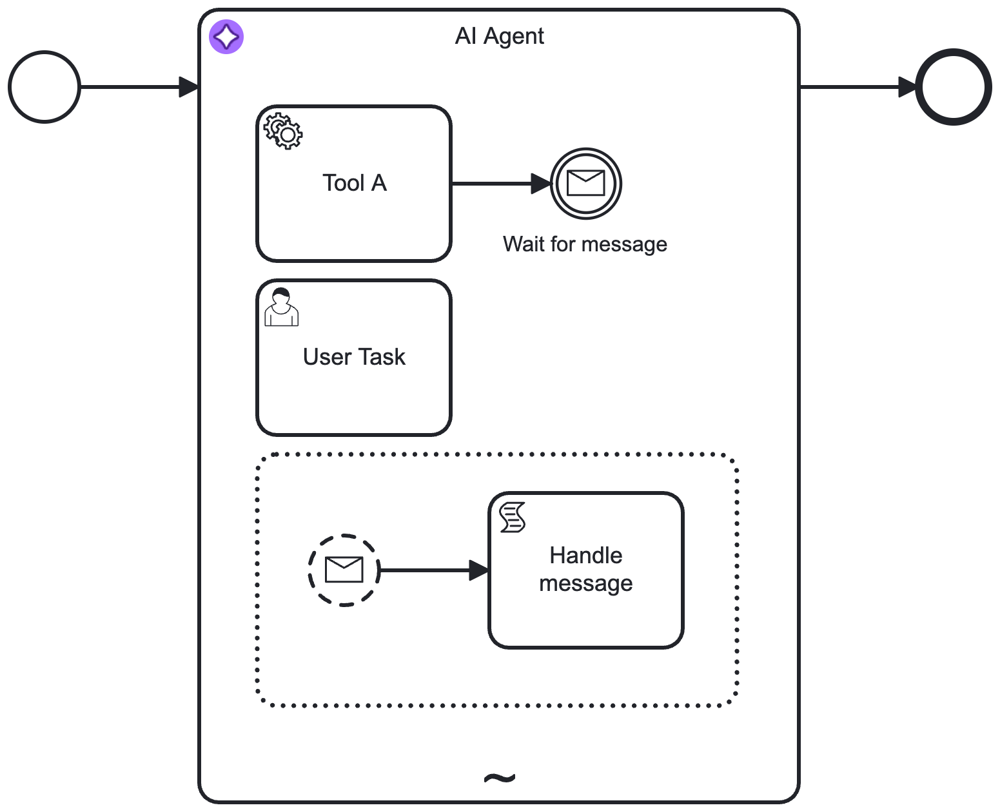

import AiAgentImplementationTabs from '../react-components/\_ai-agent-implementation-tabs';
import TabItem from "@theme/TabItem";

This worked example shows how you can integrate an AI Agent connector into a feedback loop model.

## About this worked example

This worked example demonstrates how you can use the [AI Agent Process connector](/components/connectors/out-of-the-box-connectors/agentic-ai-aiagent-process.md) applied to an [ad-hoc sub-process](/components/modeler/bpmn/ad-hoc-subprocesses/ad-hoc-subprocesses.md) to model AI Agent [tools and response interaction feedback loops](/components/connectors/out-of-the-box-connectors/agentic-ai-aiagent.md#feedback-loop-use-cases).

## Create an AI Agent element

As the **AI Agent Process** implementation creates implicitely creates a tools feedback loop, it is sufficient to add an ad-hoc sub-process with an applied AI Agent connector template to the process.

Consult the [tool definitions](./agentic-ai-aiagent-tool-definitions.md) documentation on how to model the tools available to the AI agent.



After adding the element, open the properties panel to configure the connection to your model provider and adapt the system and user prompts as needed.

## Example response interaction feedback loop {#response-loop}

Similar to the tools feedback loop, another feedback loop acting on the agent response can be added by re-entering the AI Agent connector with new information. You must model your user prompt so that it adds the follow-up data instead of the initial request.

For example, your **User Prompt** field could contain the following FEEL expression to make sure it acts upon follow-up input:

```feel
=if (is defined(followUpInput)) then followUpInput else initialUserInput
```

With the **AI Agent Process** implementation, the user feedback needs to be modeled to loop back to the AI Agent ad-hoc sub-process:


:::note
How you model this type of feedback loop greatly depends on your specific use case.

- The example feedback loop expects a simple feedback action based on a user task, but this could also interact with other process flows or another agent process.
- Instead of the user task, you could also use another LLM connector to verify the response of the AI Agent. For an example of this pattern, see the [fraud detection example](https://github.com/camunda/connectors/tree/main/connectors/agentic-ai/examples/ai-agent/ad-hoc-sub-process/fraud-detection).
  :::
