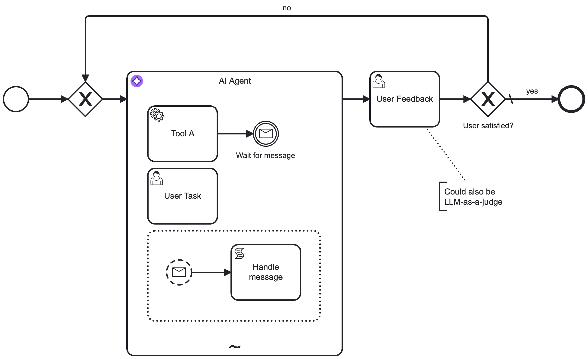

import AgentProcessImg from '../img/ai-agent-subprocess.png';

This worked example demonstrates how to use the [AI Agent Sub-process connector](/components/connectors/out-of-the-box-connectors/agentic-ai-aiagent-subprocess.md) applied to an [ad-hoc sub-process](/components/modeler/bpmn/ad-hoc-subprocesses/ad-hoc-subprocesses.md) to model an AI Agent [agent loop for tools and response interaction](/components/connectors/out-of-the-box-connectors/agentic-ai-aiagent.md#agent-loop-use-cases).

## Create an AI Agent element

As the **AI Agent Sub-process** implementation implicitly creates an [agent loop](/reference/glossary.md#agent-loop) for tools, you only need to add an ad-hoc sub-process with an applied AI Agent connector template to the process.

:::info
For more information on how to model the tools available to the AI agent, see [tool definitions](./agentic-ai-aiagent-tool-definitions.md).
:::


After adding the element, open the properties panel to configure the connection to your model provider, and modify the system and user prompts as required.

## Human-in-the-loop (HITL) follow-up {#response-loop}

Separately from the agent loop for tools, a [human-in-the-loop (HITL)](/reference/glossary.md#human-in-the-loop-hitl) follow-up acting on the agent response can be added by re-entering the AI Agent connector with new information. You must model your user prompt so that it adds the follow-up data instead of the initial request.

For example, your **User Prompt** field could contain the following FEEL expression to make sure it acts upon follow-up input:

```feel
=if (is defined(followUpInput)) then followUpInput else initialUserInput
```

With the **AI Agent Sub-process** implementation, the follow-up needs to be modeled to loop back to the AI Agent ad-hoc sub-process:



:::note
How you model this type of follow-up greatly depends on your specific use case.

- The example follow-up expects a simple feedback action based on a user task, but this could also interact with other process flows or another agent process.
- Instead of the user task, you could also use another LLM connector to verify the response of the AI Agent. For an example of this pattern, see the [fraud detection example](https://github.com/camunda/connectors/tree/main/connectors/agentic-ai/examples/ai-agent/ad-hoc-sub-process/fraud-detection).
  :::

## Additional resources

- The connectors repository contains a set of [ready-made examples](https://github.com/camunda/connectors/tree/main/connectors/agentic-ai/examples/ai-agent/ad-hoc-sub-process) using the AI Agent Sub-process connector.
