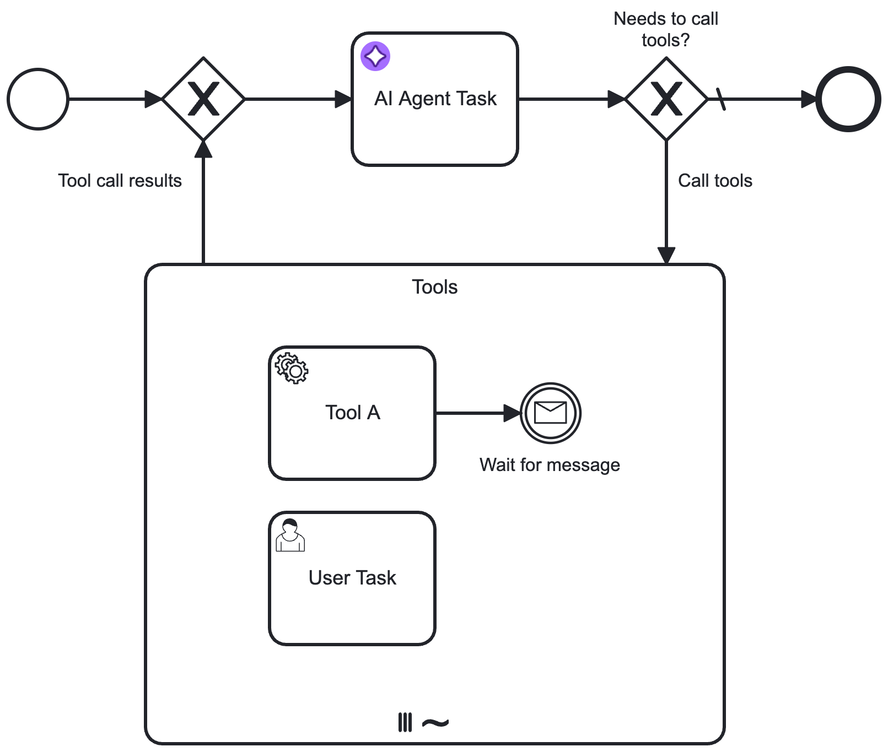
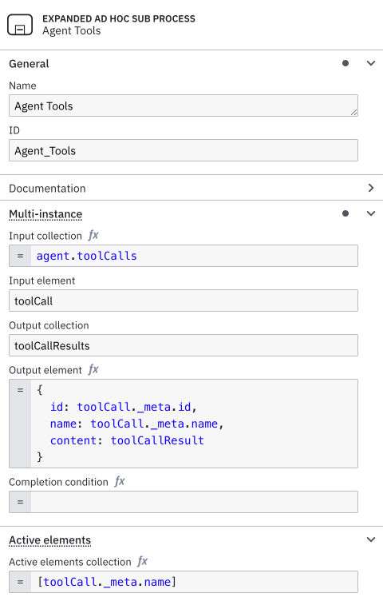
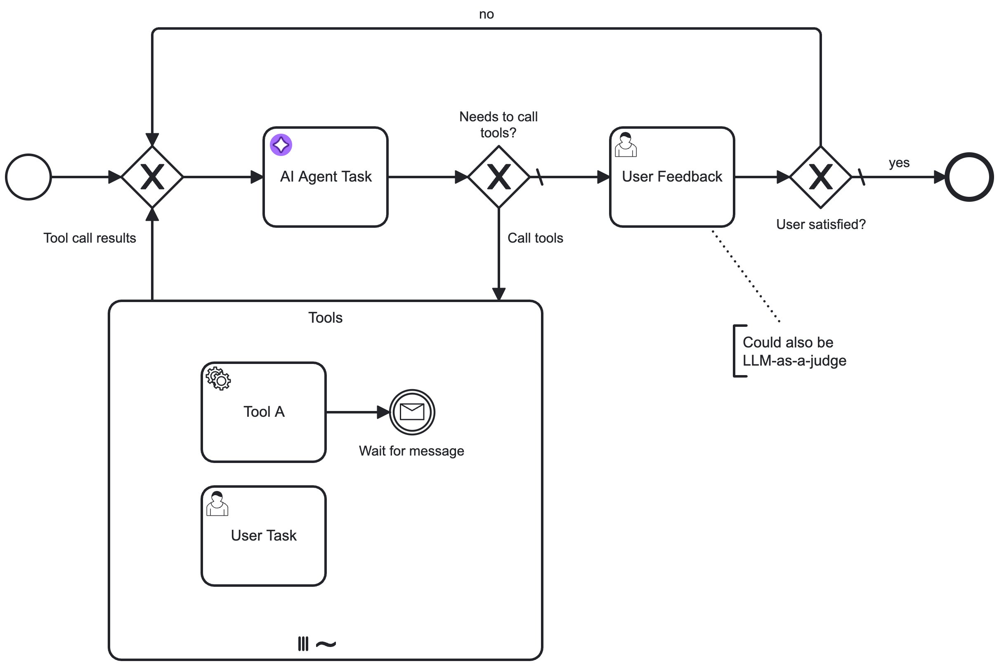

## About this worked example

This worked example demonstrates how you can use the [AI Agent Task connector](/components/connectors/out-of-the-box-connectors/agentic-ai-aiagent-task.md) and an [ad-hoc sub-process](/components/modeler/bpmn/ad-hoc-subprocesses/ad-hoc-subprocesses.md) to model AI Agent [tools and response interaction feedback loops](/components/connectors/out-of-the-box-connectors/agentic-ai-aiagent.md#feedback-loop-use-cases).

## Create an AI Agent element

First, an AI Agent connector is added and configured in the process diagram. Next, an ad-hoc sub-process is added in a feedback loop to connect the agent to the tools it needs.

Consult the [tool definitions](./agentic-ai-aiagent-tool-definitions.md) documentation on how to model the tools available to the AI agent.



After adding the element, open the properties panel to configure the connection to your model provider and adapt the system and user prompts as needed.

It is important to align the **Agent context** field and the result variable. The following defaults should be set to ensure re-entering the process will pick up the previous context value:

- **Agent context**: `agent.context`
- **Result variable**: `agent`

## Example tools feedback loop {#tools-loop}

### Configure ad-hoc sub-process and loop

1. The ad-hoc sub-process is marked as [parallel multi-instance](../../modeler/bpmn/multi-instance/multi-instance.md). This allows the process to execute the tools in parallel, and wait for all tool calls to complete before continuing with the process.

1. A descriptive ID is configured for the ad-hoc sub-process. This can then be configured in the **Ad-hoc sub-process ID** field in the AI Agent connector [tools](agentic-ai-aiagent.md#tools) section.

1. A loop is modeled into the sub-process and back to the AI Agent connector.
   - The `no` flow of the `Contains tool calls?` gateway is marked as the default flow.

   - The `yes` flow condition is configured to activate when the AI Agent response contains a list of tool calls. For example, if the suggested default values for the [result variable/expression](#result-variableexpression) are used, this condition could be configured as follows:

     ```feel
     not(agent.toolCalls = null) and count(agent.toolCalls) > 0
     ```

     The process execution routes through the ad-hoc sub-process if the LLM response requests one or more tools to be called.

### Configure multi-instance execution

The ad-hoc sub-process in this example is configured as a [parallel multi-instance](../../modeler/bpmn/multi-instance/multi-instance.md) sub-process (instead of sequential multi-instance).

This allows:

- Tools to be called **independently of each other**, each with its own set of input parameters. This also implies that the same tool can be called **multiple times with different parameters** within the same ad-hoc sub-process execution. For example, a _Lookup user_ tool could be called multiple times with different user IDs.

- The process to **wait until all requested tools have been executed** before passing the results back to the AI Agent/LLM. After all tools have been executed, results are passed back to the AI Agent connector.

#### Configure properties

The following properties for the ad-hoc sub-process must be configured. You can use the following suggested values as a starting point and change as required or if dealing with multiple agents within the same process.

- **Input collection**: Set this to the list of tool calls your AI Agent connector returns, for example `agent.toolCalls`.
- **Input element**: Contains the individual tool call, including LLM-generated input parameters based on the [tool definition](#tool-definitions). Suggested value: `toolCall`. This must be aligned with the `fromAi` function calls in the tool definition.
- **Output collection**: Collects the results of all the requested tool calls. Suggested value: `toolCallResults`. Make sure you pass this value as [Tool Call Results](agentic-ai-aiagent.md#tools) in the AI Agent configuration.
- **Output element**: Collects the individual tool call result as returned by an individual tool (see [Tool Call Responses](#tool-call-responses)). When changing this `toolCallResult` to a different value, make sure you also change your tools to write to the updated variable name.
  ```feel
  {
    id: toolCall._meta.id,
    name: toolCall._meta.name,
    content: toolCallResult
  }
  ```

As a final step, the element must be configured to activate the ad-hoc sub-process.

- When using a multi-instance configuration, this is always the single task ID of the tool being executed in the individual instance.
- Configure **Active elements collection** to contain the exact `[toolCall._meta.name]`.

For example, the completed ad-hoc sub-process configuration would look as follows:



#### Configure an input mapping for the tool call result variable

To prevent interference between tool calls, create an [input mapping](../../concepts/variables.md#input-mappings) for the `toolCallResult` variable. This ensures the variable is created as a local variable within the ad-hoc sub-process.

1. In the **Inputs** section of the ad-hoc sub-process properties panel, add a new entry.
2. In the **Local variable name** field, enter `toolCallResult` (or use your custom variable name if you changed it earlier).
3. Leave the **Variable assignment value** field blank.

## Example response interaction feedback loop {#response-loop}

Similar to the tools feedback loop, another feedback loop acting on the agent response can be added by re-entering the AI Agent connector with new information. You must model your user prompt so that it adds the follow-up data instead of the initial request.

For example, your **User Prompt** field could contain the following FEEL expression to make sure it acts upon follow-up input:

```feel
=if (is defined(followUpInput)) then followUpInput else initialUserInput
```

With the **AI Agent Task** implementation, the user feedback needs to be modeled to loop back to the AI Agent task:



:::note
How you model this type of feedback loop greatly depends on your specific use case.

- The example feedback loop expects a simple feedback action based on a user task, but this could also interact with other process flows or another agent process.
- Instead of the user task, you could also use another LLM connector to verify the response of the AI Agent. For an example of this pattern, see the [fraud detection example](https://github.com/camunda/connectors/tree/main/connectors/agentic-ai/examples/ai-agent/service-task/fraud-detection).
  :::

## Additional resources

- The connectors repository contains a set of [ready-made examples](https://github.com/camunda/connectors/tree/main/connectors/agentic-ai/examples/ai-agent/service-task) using the AI Agent Task connector.
