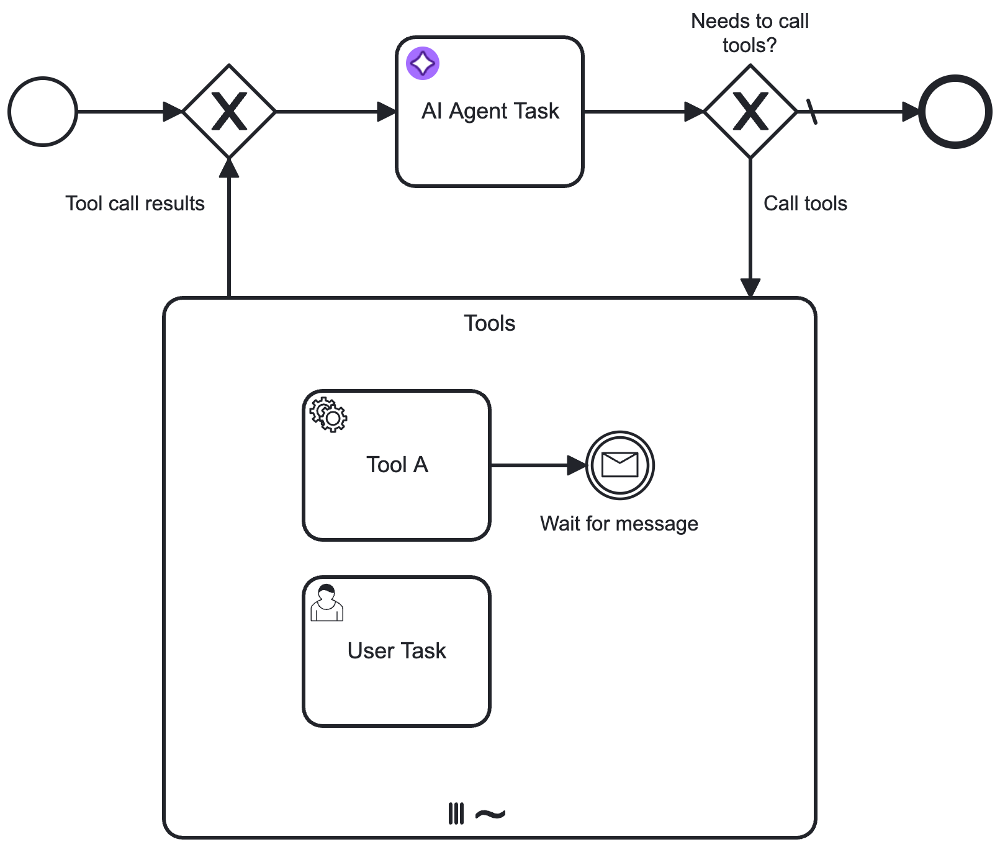

import ConfigurationModelProvider from './agentic-ai/aiagent/configuration/\_model-provider.md';
import ConfigurationModel from './agentic-ai/aiagent/configuration/\_model.md';
import ConfigurationSystemPrompt from './agentic-ai/aiagent/configuration/\_system-prompt.md';
import ConfigurationUserPrompt from './agentic-ai/aiagent/configuration/\_user-prompt.md';
import ConfigurationTools from './agentic-ai/aiagent/configuration/\_tools.md';
import ConfigurationMemoryTask from './agentic-ai/aiagent/configuration/\_memory-task.md';
import ConfigurationLimits from './agentic-ai/aiagent/configuration/\_limits.md';
import ConfigurationResponse from './agentic-ai/aiagent/configuration/\_response.md';
import ConfigurationOutputMappingTask from './agentic-ai/aiagent/configuration/\_output-mapping-task.md';
import ConfigurationErrorHandling from './agentic-ai/aiagent/configuration/\_error-handling.md';
import ConfigurationRetries from './agentic-ai/aiagent/configuration/\_retries.md';
import ConfigurationExecutionListeners from './agentic-ai/aiagent/configuration/\_execution-listeners.md';

## Configuration

<ConfigurationModelProvider />
<ConfigurationModel />
<ConfigurationSystemPrompt />
<ConfigurationUserPrompt />
<ConfigurationTools />
<ConfigurationMemoryTask />
<ConfigurationLimits />
<ConfigurationResponse />
<ConfigurationOutputMappingTask />
<ConfigurationErrorHandling />
<ConfigurationRetries />
<ConfigurationExecutionListeners />

## Limitations
