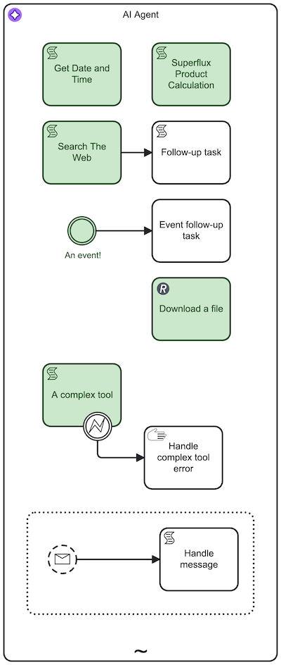
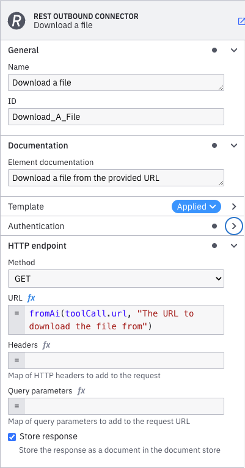

import Tabs from "@theme/Tabs";
import TabItem from "@theme/TabItem";

When resolving the available tools within an ad-hoc sub-process, the AI Agent will take all activities into account which **have no incoming flows** (root nodes within the ad-hoc sub-process) and **are not boundary events**.

For example, in the following image the activities marked in green are the ones that will be considered as tools:



You can use any BPMN elements and connectors as tools and to model sub-flows within the ad-hoc sub-process.

## Tool Resolution

To resolve available tools, the AI Agent connector either resolves the tools by reling on data provided by the Zeebe engine or reads the BPMN model directly. The approach depends on the chosen AI Agent implementation:

<Tabs
groupId="ai-agent-implementation"
defaultValue="process"
queryString
values={[
{ label: "AI Agent Process", value: "process" },
{ label: "AI Agent Task", value: "task" },
]}>

<TabItem value='process'>
When using the **AI Agent Process** implementation, the connector relies on data provided by the [ad-hoc sub-process](/components/modeler/bpmn/ad-hoc-subprocesses/ad-hoc-subprocesses.md#special-ad-hoc-sub-process-variables) implementation to resolve the tools.
</TabItem>

<TabItem value='task'>
When using the **AI Agent Task** implementation, the connector reads the BPMN model directly to resolve the tools:

1. It reads the BPMN model and looks up the ad-hoc sub-process using the configured ID. If not found, the connector throws an error.
2. Iterates over all activities within the ad-hoc sub-process and checks that they are root nodes (no incoming flows) and not boundary events.
3. For each activity found, analyzes the input mappings and looks for the [`fromAi`](../../modeler/feel/builtin-functions/feel-built-in-functions-miscellaneous.md#fromaivalue) function calls that define the parameters that need to be provided by the LLM.
4. Creates a tool definition for each activity found, and passes these tool definitions to the LLM as part of the prompt.

</TabItem>
</Tabs>

:::note
Refer to the [Anthropic](https://docs.anthropic.com/en/docs/build-with-claude/tool-use/overview) and [OpenAI](https://platform.openai.com/docs/guides/function-calling) documentation for examples of how tool/function calling works in combination with an LLM.
:::

## Tool Definitions

:::important
The AI Agent connector only considers the **root node** of the sub-flow when resolving a tool definition.
:::

A tool definition consists of the following properties which will be passed to the LLM. The tool definition is closely modeled after the [list tools response](https://modelcontextprotocol.io/specification/2025-03-26/server/tools#listing-tools) as defined in the [Model Context Protocol (MCP)](https://modelcontextprotocol.io/).

| Property    | Description                                                                                                                                                                                                                                                                                                                                                                                                                                  |
| :---------- | :------------------------------------------------------------------------------------------------------------------------------------------------------------------------------------------------------------------------------------------------------------------------------------------------------------------------------------------------------------------------------------------------------------------------------------------- |
| name        | The name of the tool. This is the **ID of the activity** in the ad-hoc sub-process.                                                                                                                                                                                                                                                                                                                                                          |
| description | The description of the tool, used to inform the LLM of the tool purpose. If the **documentation** of the activity is set, this is used as the description, otherwise the **name** of the activity is used. Make sure you provide a meaningful description to help the LLM understand the purpose of the tool.                                                                                                                                |
| inputSchema | The input schema of the tool, describing the input parameters of the tool. The connector will analyze all input mappings of the activity and create a [JSON Schema](https://json-schema.org/) based on the [`fromAi`](../../modeler/feel/builtin-functions/feel-built-in-functions-miscellaneous.md#fromaivalue) function calls defined in these mappings. If no `fromAi` function calls are found, an empty JSON Schema object is returned. |

:::note
Provide as much context and guidance in tool definitions and input parameter definitions as you can to ensure the LLM
selects the right tool and generates proper input values.

Refer to the [Anthropic documentation](https://docs.anthropic.com/en/docs/build-with-claude/tool-use/implement-tool-use#example-of-a-good-tool-description) for tool definition best practices.
:::

### AI-generated parameters via `fromAi`

Within an activity, you can define parameters which should be AI-generated by tagging them with the
[`fromAi`](../../modeler/feel/builtin-functions/feel-built-in-functions-miscellaneous.md#fromaivalue) FEEL function in input mappings.

The function itself does not implement any logic (it simply returns the first argument it receives), but provides a way
to configure all the necessary metadata (for example, description, type) to generate an input schema definition. The tools
schema resolution will collect all `fromAi` definitions within an activity and combine them into an input schema for
the activity.

:::important
The first argument passed to the `fromAi` function must be a reference to a field within the `toolCall` context which will automatically be populated by the AI Agent connector. Example: `toolCall.myParameter`.
:::

By using the `fromAi` tool call as a wrapper function around the actual value, the connector can both **describe the parameter** for the LLM by generating a JSON Schema from the function calls and at the same time **utilize the LLM-generated value** as it can do with any other process variable.

You can use the `fromAi` function in:

- Input mappings (for example, service task, script task, user task).
- Custom input fields provided by an element template if an element template is applied to the activity as technically these are handled as input mappings.

For example, the following image shows an example of `fromAi` function usage on a [REST outbound connector](../protocol/rest.md):



#### `fromAi` examples

The [`fromAi`](../../modeler/feel/builtin-functions/feel-built-in-functions-miscellaneous.md#fromaivalue) FEEL function
can be called with a varying number of parameters to define simple or complex inputs. The simplest form is to just pass
a value.

```feel
fromAi(toolCall.url)
```

This makes the LLM aware that it needs to provide a value for the `url` parameter. As the first value to `fromAi`
needs to be a variable reference, the last segment of the reference is used as parameter name (`url` in this case).

To make an LLM understand the purpose of the input, you can add a description:

```feel
fromAi(toolCall.url, "Fetches the contents of a given URL. Only accepts valid RFC 3986/RFC 7230 HTTP(s) URLs.")
```

To define the type of the input, you can add a type (if no type is given, it will default to `string`):

```feel
fromAi(toolCall.firstNumber, "The first number.", "number")

fromAi(toolCall.shouldCalculate, "Defines if the calculation should be executed.", "boolean")
```

For more complex type definitions, the fourth parameter of the function allows you to specify a JSON Schema from a
FEEL context. Note that support for complex JSON Schema features may be limited by the selected provider/model. For a list of examples, refer to the [JSON Schema documentation](https://json-schema.org/learn/miscellaneous-examples).

```feel
fromAi(
  toolCall.myComplexObject,
  "A complex object",
  "string",
  { enum: ["first", "second"] }
)
```

You can combine multiple parameters within the same FEEL expression, for example:

```feel
fromAi(toolCall.firstNumber, "The first number.", "number") + fromAi(toolCall.secondNumber, "The second number.", "number")
```

## Tool Call Responses

To collect the output of the called tool and pass it back to the agent, the task within the ad-hoc sub-process needs to
set its output to a predefined variable name. For the **AI Agent Process** implementation, this variable is predefined as
`toolCallResult`. For the **AI Agent Task** implementation, the variable depends on the configuration of the [multi-instance execution](#tools-loop),
but is also typically named `toolCallResult`.

Depending on the used task, setting the variable content can be achieved in multiple ways:

- A [result variable](../use-connectors/index.md#result-variable) or
  a [result expression](../use-connectors/index.md#result-expression) containing a `toolCallResult` key
- An [output mapping](../../concepts/variables.md#output-mappings) creating the `toolCallResult` variable or adding
  to a part of the `toolCallResult` variable (for example, an output mapping could be set to `toolCallResult.statusCode`)
- A [script task](../../modeler/bpmn/script-tasks/script-tasks.md) that sets the `toolCallResult` variable

Tool call results can be either primitive values (for example, a string) or complex ones, such as
a [FEEL context](../../modeler/feel/language-guide/feel-context-expressions.md) that is serialized to a JSON
string before passing it to the LLM.

As most LLMs expect _some_ form of response to a tool call, the AI Agent will return a constant string indicating that the tool
was executed successfully without returning a result to the LLM if the `toolCallResult` variable is not set or empty after executing
the tool.

### Document support

Similar to the [user prompt](agentic-ai-aiagent.md#user-prompt) **Documents** field, tool call responses can contain
[Camunda Document references](/self-managed/concepts/document-handling/overview.md) within arbitrary structures
(supporting the same file types as for the user prompt).

When serializing the tool call response to JSON, document references are transformed into a content block containing the plain text or base64 encoded document content, before being passed to the LLM.
