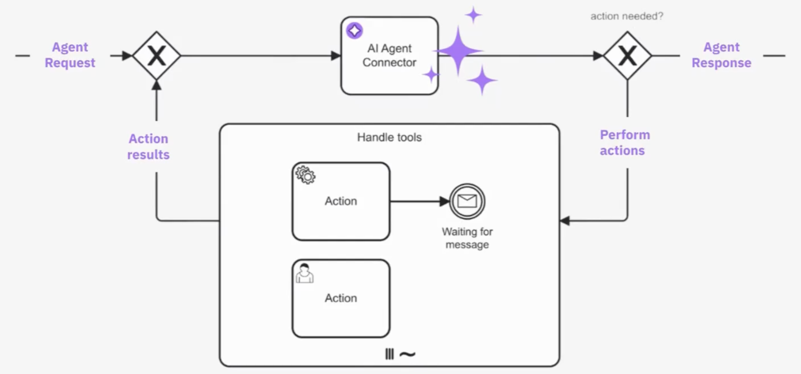
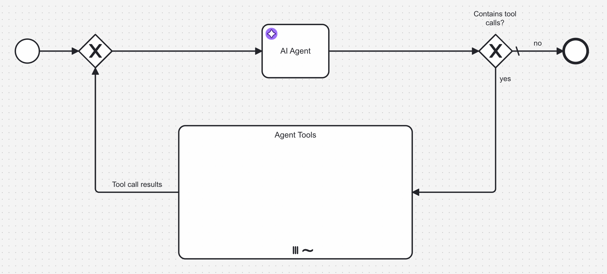
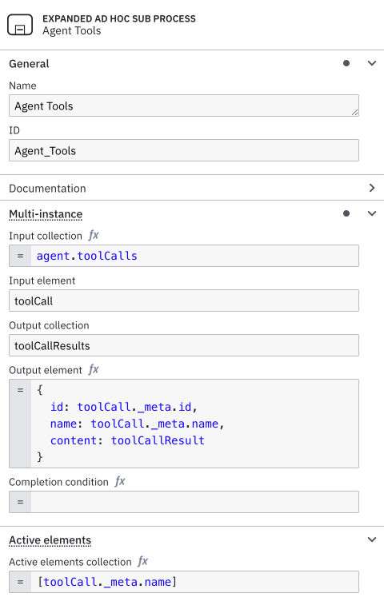
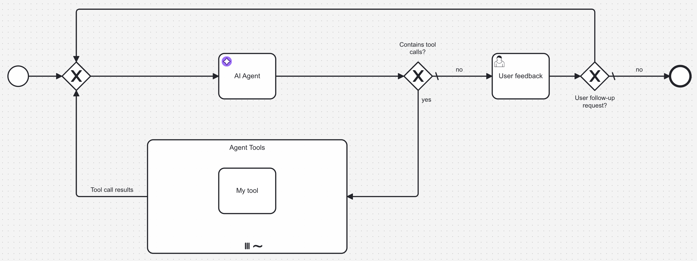
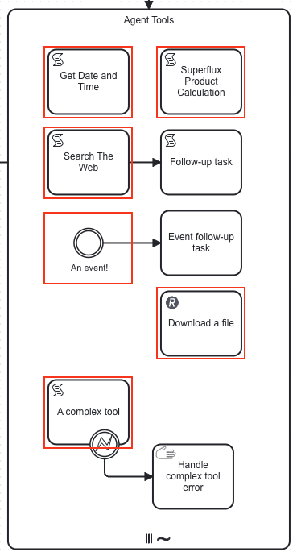

:::important
Make sure to check out the following resources for a more **hands-on guide** to the AI Agent integration:

- [Intelligent by Design: A Step-by-Step Guide to AI Task Agents in Camunda](https://camunda.com/blog/2025/05/building-your-first-ai-agent-with-camunda-s-new-agentic-ai/)
- [AI Email Support Agent Blueprint](https://marketplace.camunda.com/en-US/apps/522492/ai-email-support-agent) on the
  Camunda Marketplace
  :::

Camunda has taken a systemic, future-ready approach for agentic AI by building on the proven foundation of BPMN. At the
core of this approach is our use of the BPMN ad-hoc sub-process construct, which allows for tasks to be executed in any
order, skipped, or repeated—all determined dynamically at runtime based on the context of the process instance.

The **AI Agent connector** is an outbound connector that implements the Large Language Model (LLM) interaction paired
with a feedback loop for user interactions and tool calls. It is designed to be used in combination with an ad-hoc
sub-process defining the tools to be used, but can also be used independently.

The core features provided by the AI Agent connector are:

- Support for **different LLM providers**
- **Conversational/short-term memory** handling to enable feedback loops. For example, a user can ask follow-up
  questions to an agent response.
- **Tool calling** support to make the agent capable of interacting with tasks within the ad-hoc sub-process. This
  allows leveraging all Camunda features such as connectors and user tasks (human-in-the-loop). The AI Agent connector
  provides automatic **tool resolution** to identify the tools available in the ad-hoc sub-process.

## Concepts



The basic concept of the AI Agent connector is to be used as part of a **feedback loop**, re-entering the AI Agent
connector task multiple times. Depending on your use case, the connector can be part of different loops:

- **Response interaction loop:** after returning a response (and not calling any tools), the process can be modeled to
  act upon the response. For example, the response can be presented to a user who might ask follow-up questions which
  can be fed back to the AI Agent connector.
- **Tool calling loop:** In combination with an ad-hoc sub-process, the AI Agent connector will resolve available tools
  and their input parameters and pass these tool definitions to the LLM. The LLM will then generate a response, which
  might include tool calls (a request to call a tool paired with the input parameters). If tool calls are requested,
  the process can be modelled to pass these tool calls to the ad-hoc sub-process and to return the tool call results
  to the AI Agent task by modelling the feedback loop as shown in the figure above.

As the agent preserves the context of the conversation, follow-up questions/tasks and handling of tool call results can
relate to the previous interaction with the LLM, allowing the LLM to provide more relevant responses.

A crucial concept to make this work is the **Agent context** process variable which contains all the necessary
information to allow re-entering the AI Agent connector task with the same context as before. This variable is both
mapped as **input** and **output** variable of the connector and will be updated on each agent execution.

:::important
When modelling an AI Agent, make sure to align the agent context input variable and the response variable/expression so
that the context update is correctly passed to the next execution of the AI Agent connector task.
:::

### Example conversation

On a high level the conversation with the AI Agent connector, including both user and tool feedback loops, can look like
the following. The conversation awareness provided by the agent context allows use cases like the user just responding
with `Yes, please proceed` and the agent understanding what to do next.

```
# Initial input/user prompt
User: Is John Doe eligible for a credit card?

# Tool feedback loop
AI Agent: Call the `Check_Credit_Card_Eligibility` tool with the following parameters: {"name": "John Doe"}
<process routes through ad-hoc sub-process>
Tool Call Result: {"Check_Credit_Card_Eligibility": {"eligible": true}}

# User feedback loop
AI Agent: John Doe is eligible for a credit card. Would you like to proceed?
<process routes to a user task as no tool calls are requested>
User: Yes, please proceed.

AI Agent: Call the `Create_Credit_Card` tool with the following parameters: {"name": "John Doe"}
Tool Call Result: {"Create_Credit_Card": {"success": true}}

Agent: John Doe's credit card has been created successfully.
```

## Configuration

### Model

:::note
Use Camunda secrets to store credentials and avoid exposing sensitive information directly from the process. Refer
to [managing secrets](/components/console/manage-clusters/manage-secrets.md) to learn more.
:::

:::note
Depending on the used model, you might need to adapt your prompts and the way you are using the AI Agent connector. Make
sure to consult the provider-specific documentation and to test your use case with the provider you are using.
:::

The first step to configure on the AI Agent connector is the desired LLM provider and model. The connector currently
supports the following providers with more being added in the future:

- [Anthropic](http://anthropic.com/) (Claude models)
- [AWS Bedrock](https://docs.aws.amazon.com/bedrock/latest/userguide/what-is-bedrock.html)
- [OpenAI](http://openai.com/)

Depending on the selected provider, you can define a set of optional model parameters,
see [Model Parameters](#model-parameters).

#### Anthropic

Provides support for [Anthropic's Messages API](https://docs.anthropic.com/en/api/messages). To
get started, configure the desired model (see
[documentation](https://docs.anthropic.com/en/docs/about-claude/models/all-models)) and an API key.

#### Bedrock

:::note
Model availablilty depends on the region and the model you are using. You might need to first request the model to be
available for your account.
:::

Provides support for models provided through
the [AWS Bedrock](https://docs.aws.amazon.com/bedrock/latest/userguide/what-is-bedrock.html) service through the
[`Converse`](https://docs.aws.amazon.com/bedrock/latest/APIReference/API_runtime_Converse.html) API.

For detailed documentation on the authentication configuration, see
the [authentication section of the dedicated AWS Bedrock connector](./amazon-bedrock.md#authentication).

For a list of **models**, please consult
the [documentation](https://docs.aws.amazon.com/bedrock/latest/userguide/models-supported.html).

#### OpenAI

Provides support for [OpenAI's Chat Completion API](https://platform.openai.com/docs/api-reference/chat). To get
started, configure the desired **model** (see [documentation](https://platform.openai.com/docs/models)) and an
**API key**.

Optionally, you can configure an **organization ID** and/or **project ID** if needed for your account.

### System Prompt

:::important
Currently, the system prompt is only added to the agent context once when the AI Agent connector is called for the first
time. This means you can't alter the system prompt in follow-up interactions, even if you include different data in the
input field. This might change in upcoming versions.
:::

The **System Prompt** is a crucial part of the AI Agent connector configuration. It defines the behavior and the goal of
the agent and instructs the LLM on how to act. The connector provides a minimal system prompt example which can be used
as a starting point, but you should consider customizing the system prompt to your needs.

Within the system prompt field, you can use FEEL expressions, or you can inject parameters into the text by using
`{{parameter}}` syntax to inject parameters defined in the **System Prompt Parameters** field (FEEL context).

The AI Agent connector provides a set of default parameters `current_date`, `current_time`, `current_date_time` which
you don't need to explicitly define.

### User Prompt

The **User Prompt** contains the actual request to the LLM. This could either contain the initial request or a follow-up
request when being part of a user interaction feedback loop. The value provided as part of this field will be added to
the conversation memory and passed to the LLM call. In the example above, this would be the messages prefixed with
`User:`.

As the system prompt, the user prompt field supports a list of **User Prompt Parameters** with the same set of provided
default parameters.

#### Documents

:::note
You can find examples how LLM provides accept document content blocks on
the [Anthropic](https://docs.anthropic.com/en/docs/build-with-claude/vision#base64-encoded-image-example)
and [OpenAI](https://platform.openai.com/docs/guides/images-vision#giving-a-model-images-as-input)
docs.
:::

:::important
File type support is depending on the LLM provider and model. Make sure to properly test your use case with the provider
you are using.
:::

As part of the user prompt, it is possible to add a list
of [Camunda Document references](../../concepts/document-handling.md) which will be
internally resolved and passed to the LLM if the document type is supported. This greatly enhances the ability of the
agent as it can directly interact with documents and images.

This is possible as LLM APIs provide a way to spefify the user prompt as list of content blocks. If document references
are passed, they will be resolved to a corresponding content block and passed as part of the user message.

##### Supported document types

:::important
As these documents are stored as part of the conversational memory, their contents will be stored as process variable.
Make sure to be aware of [variable size limitations](../../concepts/variables.md#variable-size-limitation) when dealing
with large files.

In the future, the AI Agent connector will support different ways of storing the conversation memory to allow more
data-intensive use cases.
:::

Text files (MIME types matching `text/*`, `application/xml`, `application/json`, or `application/yaml`) will be passed
as plain text content blocks.

All other supported file types will be passed as base64 encoded content blocks:

- PDF files (`application/pdf`)
- Images (`image/jpg`, `image/png`, `image/gif`, `image/webp`)

Audio and video files might be supported in the future, but will currently lead to an error if passed. The same goes for
all other unsupported file types.

### Tools

:::note
This section can be kept empty if the AI Agent connector should be used without an accompanying ad-hoc sub-process.
:::

The **Ad-hoc sub-process ID** needs to be configured to the element ID of the ad-hoc sub-process which should be used
for tool resolution (see [Tool Resolution](#tool-resolution)). When entering the AI Agent connector, the connector will
resolve the tools available in the ad-hoc sub-process and pass these to the LLM as part of the prompt.

The **Tool Call Results** field needs to be configured to the result collection of the ad-hoc sub-process mult-instance
execution (see (Modeling the tools feedback loop)[#modeling-the-tools-feedback-loop]), for example `=toolCallResults`.

### Memory

As described above, the **Agent Context** is a crucial variable to make the feedback loop work. This needs to be aligned
with the result variable/expression (see below). Example value `=agent.context`.

The **Maximum messages** configuration allows specifying how many messages should be kept in the context and passed to
the LLM on every call. Configuring this is a trade-off between cost/tokens and the context window supported by the used
model.

When the conversation exceeds the maximum number of messages, the connector will first evict tool call
requests/responses from past feedback loops and then continue removing the oldest messages first. The system prompt will
always be kept in the context.

### Limits

:::important
Despite these limits, make sure to closely monitor the LLM API usage and costs and to set appropriate limits on the
provider side.
:::

Allows setting limits for the agent interaction, such as the maximum number of model calls to prevent unexpected
behavior or unexpected cost due to infinite loops.

As a safeguard, the **Maximum model calls** limit will fall back to a default value of `10` if it is not configured as
part of the connector configuration.

### Model Parameters

:::important
Model parameters setting maximum values (such as maximum tokens) are directly passed to the provider API and are
considered **per LLM request**, not for the whole conversation. Depending on the provider, the exact meaning of these
parameters may vary. Please consider the linked provider documentation for more details.
:::

This section allows you to configure a set of _optional_ model-specific parameters such as the temperature of the
responses. Depending
on the selected provider, this will contain different fields.

### Result Variable/Expression

The result of the AI Agent connector is a context containing the following fields:

- **context**: the updated **Agent Context**. Make sure to map this to a process variable to to re-inject this variable
  in the **Agent Context** input field when your agent is part of a feedback loop.
- **chatResponse**: the last response provided by the LLM
- **toolCalls**: tool call requests provided by the LLM which need to be routed to the ad-hoc sub-process.

:::note
An easy approach to get started with modelling is to use the result variable (e.g. `agent`) and to configure the
**Agent Context** to `agent.context`.
:::

## Modeling the tools feedback loop

After configuring the AI Agent connector, you can add an ad-hoc sub-process and the tools feedback loop to connect your
agent to the tools it needs to fulfill its purpose.

### Add the ad-hoc sub-process

Start off by adding an ad-hoc sub-process and mark it as
a [**parallel multi-instance**](../../modeler/bpmn/multi-instance/multi-instance.md). This will allow the process to
execute the tools in parallel and to wait for all tool calls to finish before continuing with the process. Configure a
descriptive ID for your ad-hoc sub-process and **configure it** under the [tools](#tools) section of the AI Agent
connector.

After adding the ad-hoc sub-process, model a loop into the sub-process and back to the AI Agent connector. You can mark
the `no` flow of the `Contains tool calls?` gateway as the default flow.



Next, configure the `yes` flow condition to be activated when the AI Agent response contains a list of tool calls.
Assuming you used the suggested default values for the [result variable/expression](#result-variableexpression) you can
configure the condition to:

```feel
not(agent.toolCalls = null) and count(agent.toolCalls) > 0
```

This will lead the process to route the execution through the ad-hoc sub-process when the LLM response requests to call
one or more tools.

### Configure multi-instance execution

:::note
Use the suggested values as a starting point and change them to your needs if needed or when dealing with multiple
agents within the same process.
:::

As stated above, the ad-hoc sub-process needs to be configured as a **parallel multi-instance** sub-process. This
ensures that:

- Tools can be called **independently of each other**, each with its own set of input parameters. This also implies that
  the same tool can be called **multiple times with different parameters** within the same ad-hoc sub-process execution.
  For example, a _Lookup user_ tool could be called multiple times with different user IDs.
- The process can **wait until all requested tools have been executed** before passing the results back to the AI
  Agent/LLM. After all tools have been executed, results will be passed back to the AI Agent connector.

The multi-instance configuration is the same for each agent configuration, and it will be possible to reuse a template
to make this configuration easier. For the moment, you need to configure the following properties.

- **Input collection**: set this to the list of tool calls your AI Agent connector returns, for example
  `agent.toolCalls`.
- **Input element**: this will contain the individual tool call including LLM-generated input parameters based on
  the [tool definition](#tool-definitions). Suggested value: `toolCall`. This needs to be aligned with
  the `fromAi` function calls in the tool definition.
- **Output collection**: this will collect the results of all the requested tool calls. Suggested value:
  `toolCallResults`. Make sure to pass this value as [Tool Call Results](#tools) in the AI Agent configuration.
- **Output element**: this will collect the individual tool call result as returned by an individual tool
  (see [Tool Call Responses](#tool-call-responses)). When changing ths `toolCallResult` to something else, make sure
  to also change your tools to write to the updated variable name.
  ```feel
  {
    id: toolCall._meta.id,
    name: toolCall._meta.name,
    content: toolCallResult
  }
  ```

As a last step, you need to configure the element to activate to the ad-hoc sub-process. As we're using a multi-instance
configuration, this is always a single task ID of the tool being executed in the individual instance. Configure
**Active elements collection** to contain exactly `[toolCall._meta.name]`.

After configuring all of the above, your ad-hoc sub-process configuration should look like the following:



## Modeling a user feedback loop

:::note
How exactly this needs to be modeled highly depends on your use case. The example below is expecting a simple feedback
action based on a user task, but this could also be interacting with other process flows or interacting with another
agent.

For example, instead of the user task, you could also use another LLM connector to verify the response of the AI Agent.
An example of such a pattern can be found in
the [Fraud Detection Example](https://github.com/camunda/connectors/tree/main/connectors/agentic-ai/examples/fraud-detection)).
:::

Similar to the tools feedback loop, another feedback loop acting on user feedback or other process interactions can
easily
be added by re-entering the AI Agent connector with new information. You need to make sure to model your user prompt in
a way that it adds the follow-up data instead of the initial request.

For example, your **User Prompt** field could contain the following FEEL expression to make sure it acts some follow-up
input if given:

```feel
=if (is defined(followUpInput)) then followUpInput else initialUserInput
```



## Tool Resolution

When resolving the available tools within an ad-hoc sub-process, the AI Agent will take all activities into account
which **have no incoming flows** (root nodes within the ad-hoc sub-process) and **are not boundary events**. In the
following screenshot, the activities marked in red are the ones that will be considered as tools:



As you can see, you are free to use any BPMN elements and connectors as tools and to model sub-flows within the ad-hoc
sub-process.

To resolve available tools the AI Agent connector will:

- Read the BPMN model and look up the ad-hoc sub-process by the configured ID. If it cannot be found, the connector will
  throw an error.
- Iterate over all activities within the ad-hoc sub-process and check if they are root nodes (no incoming flows) and not
  boundary events.
- For each activity found, it will analyze the input/output mappings and look for the
  [`fromAi`](../../modeler/feel/builtin-functions/feel-built-in-functions-miscellaneous.md#fromaivalue) function calls
  which define parameters which need to be provided by the LLM.
- The connector will then create a tool definition for each activity found and pass these tool definitions to the LLM
  as part of the prompt.

:::note
The [Anthropic](https://docs.anthropic.com/en/docs/build-with-claude/tool-use/overview) and
[OpenAI](https://platform.openai.com/docs/guides/function-calling) docs contain good examples how tool/function calling
works in combination with an LLM.
:::

### Tool Definitions

:::important
When resolving a tool definition, the AI Agent connector will only consider the **root node** of the sub-flow.
:::

A tool definition consists of the following properties which will be passed to the LLM. The tool definition is closely
modeled after the
[list tools response](https://modelcontextprotocol.io/specification/2025-03-26/server/tools#listing-tools) as defined in
the [Model Context Protocol (MCP)](https://modelcontextprotocol.io/).

- **name**: The name of the tool. This is the **ID of the activity** in the ad-hoc sub-process.
- **description**: The description of the tool, telling an LLM the purpose of the tool. If the
  **documentation** of the activity is set, it will be used as the description, otherwise the **name** of the activity
  will be used. Make sure to provide a meaningful description to help the LLM understand the purpose of the tool.
- **inputSchema**: The input schema of the tool, describing the input parameters of the tool. The connector will analyze
  all input/output mappings of the activity and will create a [JSON Schema](https://json-schema.org/) based on the
  [`fromAi`](../../modeler/feel/builtin-functions/feel-built-in-functions-miscellaneous.md#fromaivalue) function calls
  defined in these mappings. If no `fromAi` function calls are found, an empty JSON Schema object will be returned.

:::note
Provide as much context and guidance in tool definitions and input parameter definitions as you can to ensure the LLM
selects the right tool and generates proper input values.

You can find best practices for tool definitions on
the [Anthropic docs](https://docs.anthropic.com/en/docs/build-with-claude/tool-use/implement-tool-use#example-of-a-good-tool-description).
:::

### AI-generated parameters via `fromAi`

Within an activity, you can define parameters which should be AI-generated by tagging them with the
[`fromAi`](../../modeler/feel/builtin-functions/feel-built-in-functions-miscellaneous.md#fromaivalue) FEEL function in
input/output mappings.

The function itself does not implement any logic (it simply returns the first argument it receives), but provides a way
to configure all the necessary metadata (e.g. description, type) to generate an input schema definition. The tools
schema connector will collect all `fromAi` definitions within an activity and combine them into an input schema for
the activity.

:::important
The first argument passed to the `fromAi` function must be a reference type (e.g. not a static string), referencing a
value within the variable defined as **Input element** in the multi-instance configuration. In our examples, we
typically use `toolCall` as ths input element. Example value: `toolCall.myParameter`.
:::

By utilizing the `fromAi` tool call as wrapper function around the actual value the connector can both
**describe the parameter** for the LLM by generating a JSON Schema from the function calls and at the same time
**utilize the LLM-generated value** as it can do with any other process variable.

You can use the `fromAi` function in:

- Input & Output mappings (e.g Service Task, Script Task, User Task)
- Custom input fields provided by an element template if an element template is applied to the activity as technically
  these are handled as input mappings.

An example of `fromAi` function usage on a [REST outbound connector](../protocol/rest.md):


#### `fromAi` examples

The [`fromAi`](../../modeler/feel/builtin-functions/feel-built-in-functions-miscellaneous.md#fromaivalue) FEEL function
can be called with a varying number of parameters to define simple or complex inputs. The simplest form is to just pass
a value:

```feel
fromAi(toolCall.url)
```

To make a LLM understand the purpose of the input, you can add a description:

```feel
fromAi(toolCall.url, "The URL to download the file from. Should be an RFC 3986 compliant HTTP/HTTPS URL.")
```

To define the type of the input, you can add a type (if no type is given, it will default to `string`):

```feel
fromAi(toolCall.firstNumber, "The first number.", "number")

fromAi(toolCall.shouldCalculate, "Defines if the calculation should be executed", "boolean")
```

For more complex type definitions, the fourth parameter of the function allows you to specify a JSON Schema from a
FEEL context. Note that support for the JSON Schema features is depending on the AI integration. You can find an
extensive list of examples on the [JSON Schema documentation](https://json-schema.org/learn/miscellaneous-examples).

```feel
fromAi(
  toolCall.myComplexObject,
  "A complex object",
  "string",
  { enum: ["first", "second"] }
)
```

### Tool Call Responses

To collect the output of the called tool and pass it back to the agent, the task within the ad-hoc sub-process needs to
set its output to the variable configured as `content` when setting up
the [multi-instance execution](#modeling-the-tools-feedback-loop). Typically, this variable is called `toolCallResult`
and can be used from every tool call within the ad-hoc sub-process as the multi-instance execution takes care of
isolating individual tool calls.

This can be achieved in multiple ways, depending on the used task:

- as a [result variable](../use-connectors/index.md#result-variable) or
  a [result expression](../use-connectors/index.md#result-expression) containing a `toolCallResult` key
- as an [output mapping](../../concepts/variables.md#output-mappings) creating the `toolCallResult` variable or adding
  to a part of the `toolCallResult` variable (e.g. an output mapping could be set to `toolCallResult.statusCode`)
- as a [script task](../../modeler/bpmn/script-tasks/script-tasks.md) which sets the `toolCallResult` variable

Tool call results can be either primitive values (e.g. a string) or complex ones, such as
a [FEEL context](../../modeler/feel/language-guide/feel-context-expressions.md) which will be serialized to a JSON
string before passing it to the LLM.

#### Document support

Similar to the [user prompt](#documents), tool call responses can contain
[Camunda Document references](../../concepts/document-handling.md) within arbitrary structures (supporting the same file
types as for the user prompt). When serializing the tool call response to JSON, document references will be transformed
to a content block containing the plain text or base64 encoded document content before passing them to the LLM.

## Additional Resources

- [Intelligent by Design: A Step-by-Step Guide to AI Task Agents in Camunda](https://camunda.com/blog/2025/05/building-your-first-ai-agent-with-camunda-s-new-agentic-ai/)
- [AI Email Support Agent Blueprint](https://marketplace.camunda.com/en-US/apps/522492/ai-email-support-agent) on the
  Camunda Marketplace
- the [examples directory](https://github.com/camunda/connectors/tree/main/connectors/agentic-ai/examples) of the
  agentic AI integration contains a list of working examples you can use to get started
