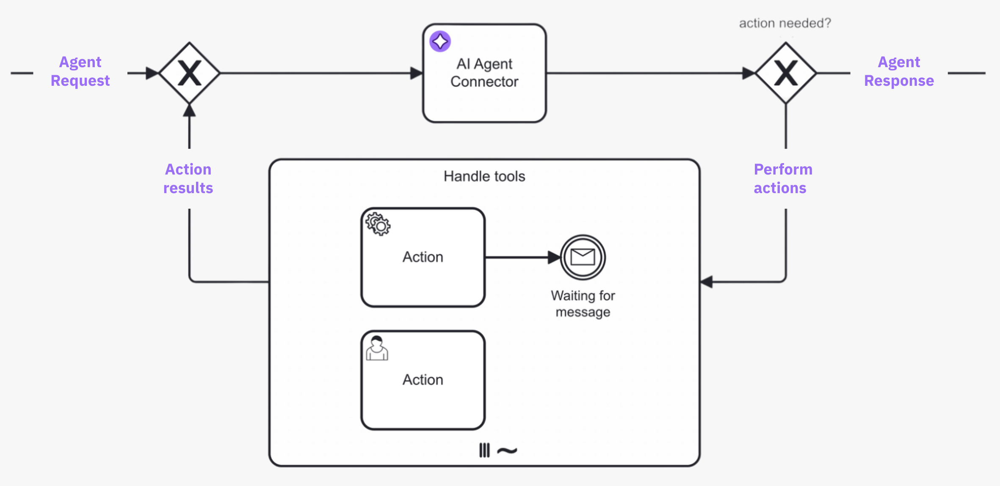

Use the **AI Agent** outbound connector to integrate Large Language Models (LLMs) with AI agents.

## About this connector

The AI Agent connector enables AI agents to integrate with an LLM to provide interaction/reasoning capabilities. This connector is designed for use with an ad-hoc sub-process in a feedback loop, providing automated user interaction and tool selection.

For example, use this connector to enable an AI agent to autonomously select and execute tasks within ad-hoc sub-processes by evaluating the current process context and determining the relevant tasks and tools to use in response. You can also use the AI Agent connector independently, although it is designed to be used with an ad-hoc sub-process to define the tools an AI agent can use.

Core features include:

| Feature              | Description                                                                                                                                                                                                                                                                         |
| :------------------- | :---------------------------------------------------------------------------------------------------------------------------------------------------------------------------------------------------------------------------------------------------------------------------------- |
| LLM provider support | Supports a range of LLM providers, such as OpenAI and Anthropic.                                                                                                                                                                                                                    |
| Memory               | Provides conversational/short-term memory handling to enable feedback loops. For example, this allows a user to ask follow-up questions to an AI agent response.                                                                                                                    |
| Tool calling         | Support for an AI agent to interact with tasks within an ad-hoc sub-process, allowing use of all Camunda features such as connectors and user tasks (human-in-the-loop). Automatic **tool resolution** allows an AI agent to identify the tools available in an ad-hoc sub-process. |

:::tip

New to agentic orchestration?

- See the [example AI Agent connector integration](agentic-ai-aiagent-example.md) for a worked example of a simple Agent AI feedback loop model.
- See [additional resources](#additional-resources) for examples of how you can use the AI Agent connector.

:::

## How to use this connector

This connector is typically used in a [feedback loop](agentic-ai-aiagent-example.md), with the connector task repeatedly looped back to during an AI agent process.

For example, the following diagram shows a tool calling loop:



1. A request is made to the AI agent connector task, where the LLM determines what action to take.
1. If the AI agent decides that further action is needed, the process enters the ad-hoc sub-process and calls any tools deemed necessary to satisfactorily resolve the request.
1. The process loops back and re-enters the AI agent connector task, where the LLM decides (with contextual memory) if more action is needed before the process can continue. The process loops repeatedly in this manner until the AI agent decides it is complete, and passes the AI agent response to the next step in the process.

### Feedback loop use cases

Typical feedback loop use cases for this connector include the following:

| Use case                                                            | Description                                                                                                                                                                                                                                                                                                                                                                                                                                                                                                                                     |
| :------------------------------------------------------------------ | :---------------------------------------------------------------------------------------------------------------------------------------------------------------------------------------------------------------------------------------------------------------------------------------------------------------------------------------------------------------------------------------------------------------------------------------------------------------------------------------------------------------------------------------------- |
| [Tool calling](agentic-ai-aiagent-example.md#tools-loop)            | <p>In combination with an ad-hoc sub-process, the AI Agent connector will resolve available tools and their input parameters, and pass these tool definitions to the LLM.</p><p><ul><li><p>The LLM generates a response, that might include tool calls (a request to call a tool paired with the input parameters).</p></li><li><p>If tool calls are requested, model the process to pass these tool calls to the ad-hoc sub-process and to return the tool call results to the AI Agent task by modelling the feedback loop.</p></li></ul></p> |
| [Response interaction](agentic-ai-aiagent-example.md#response-loop) | After returning a response (and without calling any tools), model the process to act upon the response. For example, present the response to a user who can then ask follow-up questions back to the AI Agent connector.                                                                                                                                                                                                                                                                                                                        |

As the agent preserves the context of the conversation, follow-up questions/tasks and handling of tool call results can
relate to the previous interaction with the LLM, allowing the LLM to provide more relevant responses.

An important concept to understand is the use of the **Agent context** process variable to store information required for allowing re-entry to the AI Agent connector task with the same context as before. This variable is mapped as both an **input** and **output** variable of the connector and updates with each agent execution.

:::important
When modelling an AI Agent, you must align the agent context input variable and the response variable/expression so that the context update is correctly passed to the next execution of the AI Agent connector task.
:::

### Example conversation

The following is a high-level example conversation with the AI Agent connector, including both user and tool feedback loops. The conversational awareness provided by the agent context allows use cases such as the user only responding with `Yes, please proceed`, with the agent understanding what to do next.

```
# Initial input/user prompt
User: Is John Doe eligible for a credit card?

# Tool feedback loop
AI Agent: Call the `Check_Credit_Card_Eligibility` tool with the following parameters: {"name": "John Doe"}
<process routes through ad-hoc sub-process>
Tool Call Result: {"Check_Credit_Card_Eligibility": {"eligible": true}}

# User feedback loop
AI Agent: John Doe is eligible for a credit card. Would you like to proceed?
<process routes to a user task as no tool calls are requested>
User: Yes, please proceed.

AI Agent: Call the `Create_Credit_Card` tool with the following parameters: {"name": "John Doe"}
Tool Call Result: {"Create_Credit_Card": {"success": true}}

AI Agent: John Doe's credit card has been created successfully.
```

## Prerequisites

The following prerequisites are required to use this connector:

| Prerequisite                                      | Description                                                                                                                                                                                                                                                                                                                                                                                                                                                                                                                              |
| :------------------------------------------------ | :--------------------------------------------------------------------------------------------------------------------------------------------------------------------------------------------------------------------------------------------------------------------------------------------------------------------------------------------------------------------------------------------------------------------------------------------------------------------------------------------------------------------------------------- |
| Set up your LLM model provider and authentication | <p>Prior to using this connector, you must have previously set up an account with access and authentication details for the supported LLM model provider you want to use.</p><p>For example:<ul><li><p>To use an LLM model provided by Amazon Bedrock, you must have an AWS account with an access key and secret key to execute `Converse` actions.</p></li><li><p>For OpenAI, you must configure the [OpenAI model](https://platform.openai.com/docs/models) and obtain an OpenAI API key to use for authentication.</p></li></ul></p> |

## Configuration

### Model Provider

Select and configure authentication for the LLM model **Provider** you want to use, from the following supported providers:

- [Anthropic](http://anthropic.com/) (Claude models)
- [Amazon Bedrock](https://docs.aws.amazon.com/bedrock/latest/userguide/what-is-bedrock.html)
- [OpenAI](http://openai.com/)

:::note

- Different setup/authentication fields are shown depending on the provider you select.
- Use [connector secrets](/components/console/manage-clusters/manage-secrets.md) to store credentials and avoid exposing sensitive information directly from the process.

:::

#### Anthropic

Select this option to use an Anthropic Claude LLM model (uses the [Anthropic Messages API](https://docs.anthropic.com/en/api/messages)).

| Field             | Required | Description                                                                                                                   |
| :---------------- | :------- | :---------------------------------------------------------------------------------------------------------------------------- |
| Anthropic API Key | Yes      | Your Anthropic account API Key for authorization to the [Anthropic Messages API](https://docs.anthropic.com/en/api/messages). |

:::info
For more information about Anthropic Claude LLM models, refer to the [Claude models overview](https://docs.anthropic.com/en/docs/about-claude/models/all-models).
:::

#### Bedrock

Select this option to use a model provided by the [Amazon Bedrock](https://docs.aws.amazon.com/bedrock/latest/userguide/what-is-bedrock.html) service, using the
[Converse](https://docs.aws.amazon.com/bedrock/latest/APIReference/API_runtime_Converse.html) API.

| Field          | Required | Description                                                                                                                                                                                                                   |
| :------------- | :------- | :---------------------------------------------------------------------------------------------------------------------------------------------------------------------------------------------------------------------------- |
| Region         | Yes      | The AWS region. Example: `us-east-1`                                                                                                                                                                                          |
| Authentication | Yes      | Select the authentication type you want to use to authenticate the connector with AWS. To learn more about configuring AWS authentication, see [Amazon Bedrock connector authentication](./amazon-bedrock.md#authentication). |

Model availability depends on the region and model you use. You might need to request a model is made available for your account. To learn more about configuring access to foundation models, refer to [access to Amazon Bedrock foundation models](https://docs.aws.amazon.com/bedrock/latest/userguide/model-access-modify.html).

:::info
For a list of Amazon Bedrock LLM models, refer to [supported foundation models in Amazon Bedrock](https://docs.aws.amazon.com/bedrock/latest/userguide/models-supported.html).
:::

#### OpenAI

Select this option to use the [OpenAI Chat Completion API](https://platform.openai.com/docs/api-reference/chat).

| Field               | Required | Description                                                                                                                                              |
| :------------------ | :------- | :------------------------------------------------------------------------------------------------------------------------------------------------------- |
| OpenAI API Key      | Yes      | Your OpenAI account API Key for authorization.                                                                                                           |
| Organization ID     | No       | For members of multiple organizations. If you belong to multiple organizations, specify the organization ID to use for API requests with this connector. |
| Project ID          | No       | If you access projects through a legacy user API key, specify the project ID to use for API requests with this connector.                                |
| Custom API endpoint | No       | Optional custom API endpoint.                                                                                                                            |
| Custom headers      | No       | Map of custom headers to add to the request.                                                                                                             |

:::info
To learn more about authentication to the OpenAPI API, refer to [OpenAPI platform API reference](https://platform.openai.com/docs/api-reference/introduction).
:::

### Model

Select the model you want to use for the selected provider, and specify any additional model parameters.

| Field                     | Required | Description                                                                                                                                           |
| :------------------------ | :------- | :---------------------------------------------------------------------------------------------------------------------------------------------------- |
| Model                     | Yes      | <p>Specify the model ID for the model you want to use.</p><p>Example: `anthropic.claude-3-5-sonnet-20240620-v1:0`</p>                                 |
| Maximum tokens            | No       | The maximum number of tokens per request to allow in the generated response.                                                                          |
| Maximum Completion Tokens | No       | The maximum number of tokens per request to generate before stopping.                                                                                 |
| Temperature               | No       | Floating point number, typically between 0 and 1 (0 and 2 for OpenAI). The higher the number, the more randomness will be injected into the response. |
| top P                     | No       | Floating point number, typically between 0 and 1. Recommended for advanced use cases only (usually you only need to use temperature).                 |
| top K                     | No       | Integer greater than 0. Recommended for advanced use cases only (you usually only need to use temperature).                                           |

:::note

- Different model parameter fields are shown depending on the provider/model you select. Additionally, some parameters may be different or have different value ranges (for example, OpenAI Temperature uses a number range between 0 to 2, whereas other models use a range between 0 to 1).
- For more information on each model parameter, refer to the provider documentation links in the element template.
- Parameters that set maximum values (such as maximum tokens) are considered **per LLM request**, not for the whole conversation. Depending on the provider, the exact meaning of these parameters may vary.

:::

### System Prompt

The **System Prompt** is a crucial part of the AI Agent connector configuration, as it defines the behavior and goal of the agent, and instructs the LLM on how to act.

| Field                    | Required | Description                                                                                                                                                                                                                                                                                                                                                                                                                                             |
| :----------------------- | :------- | :------------------------------------------------------------------------------------------------------------------------------------------------------------------------------------------------------------------------------------------------------------------------------------------------------------------------------------------------------------------------------------------------------------------------------------------------------ |
| System Prompt            | Yes      | <p>Specify a system prompt to define how the LLM should act.</p><p><ul><li><p>A minimal example system prompt is provided as a starting point for you to customize.</p></li><li><p>You can use FEEL expressions or inject parameters into the text in this field, using the `{{parameter}}` syntax to inject any parameters defined in the **System Prompt Parameters** field (FEEL context).</p><p>Example: `{{current_date_time}}`.</p></li></ul></p> |
| System Prompt Parameters | No       | <p>Define a map of parameters you can use in `{{parameter}}` format in the **System Prompt** field.</p><p>The default parameters (`current_date`, `current_time`, `current_date_time`) do not need to be explicitly defined in this field.</p>                                                                                                                                                                                                          |

### User Prompt

The **User Prompt** contains the actual request to the LLM model.

| Field                  | Required | Description                                                                                                                                                                                                                                                                                                                                                                                                                                                                                                                                                                                                                                                                                                                                                                                                                                |
| :--------------------- | :------- | :----------------------------------------------------------------------------------------------------------------------------------------------------------------------------------------------------------------------------------------------------------------------------------------------------------------------------------------------------------------------------------------------------------------------------------------------------------------------------------------------------------------------------------------------------------------------------------------------------------------------------------------------------------------------------------------------------------------------------------------------------------------------------------------------------------------------------------------- |
| User Prompt            | Yes      | <p>This could either contain the initial request or a follow-up request as part of a response interaction feedback loop.</p><p><ul><li><p>The value provided as part of this field is added to the conversation memory and passed to the LLM call.</p></li><li><p>For example, in the [example conversation](#example-conversation), this would be the messages prefixed with `User:`.</p></li><li><p>You can use FEEL expressions or inject parameters into the text in this field, using the `{{parameter}}` syntax to inject any parameters defined in the **User Prompt Parameters** field (FEEL context).</p><p>Example: `{{current_date_time}}`.</p></li></ul></p>                                                                                                                                                                   |
| User Prompt Parameters | No       | <p>Define a map of parameters you can use in `{{parameter}}` format in the **User Prompt** field.</p><p>The default parameters (`current_date`, `current_time`, `current_date_time`) do not need to be explicitly defined in this field.</p>                                                                                                                                                                                                                                                                                                                                                                                                                                                                                                                                                                                               |
| Documents              | No       | <p>Add a [document references](/self-managed/concepts/document-handling/overview.md) list to allow an AI agent to interact with documents and images.</p><p><ul><li><p>This list is internally resolved and passed to the LLM model if the document type is supported.</p></li><li><p>LLM APIs provide a way to specify the user prompt as a list of content blocks. If document references are passed, they are resolved to a corresponding content block and passed as part of the user message.</p></li><li><p>For examples of how LLM providers accept document content blocks, refer to the [Anthropic](https://docs.anthropic.com/en/docs/build-with-claude/vision#base64-encoded-image-example) and [OpenAI](https://platform.openai.com/docs/guides/images-vision#giving-a-model-images-as-input) documentation.</p></li></ul></p> |

#### Supported document types

As file type support varies by LLM provider/model, you must test your document use case with the provider you are using.

| File type         | Supported | Description                                                                                                                                                                        |
| :---------------- | :-------- | :--------------------------------------------------------------------------------------------------------------------------------------------------------------------------------- |
| Text              | Yes       | Text files (MIME types matching `text/*`, `application/xml`, `application/json`, or `application/yaml`) are passed as plain text content blocks.                                   |
| PDF               | Yes       | PDF files (MIME types matching `application/pdf`) are passed as base64 encoded content blocks.                                                                                     |
| Image             | Yes       | Image files (MIME types matching `image/jpg`, `image/png`, `image/gif`, or `image/webp`) are passed as base64 encoded content blocks.                                              |
| Audio/video/other | No        | Audio and video files are not currently supported, and will result in an error if passed. All other unsupported file types not listed here will also result in an error if passed. |

:::info
To learn more about storing, tracking, and managing documents in Camunda 8, see [document handling](/components/document-handling/getting-started.md).
:::

### Tools

Specify the tool resolution for an accompanying ad-hoc sub-process.

| Field                 | Required | Description                                                                                                                                                                                                                                                                                                                     |
| :-------------------- | :------- | :------------------------------------------------------------------------------------------------------------------------------------------------------------------------------------------------------------------------------------------------------------------------------------------------------------------------------ |
| Ad-hoc sub-process ID | No       | <p>Specify the element ID of the ad-hoc sub-process to use for tool resolution (see [Tool Resolution](agentic-ai-aiagent-example.md#tool-resolution)).</p><p>When entering the AI Agent connector, the connector resolves the tools available in the ad-hoc sub-process, and passes these to the LLM as part of the prompt.</p> |
| Tool Call Results     | No       | <p>Specify the results collection of the ad-hoc sub-process multi-instance execution.</p><p>Example: `=toolCallResults`</p>                                                                                                                                                                                                     |

:::note

- Leave this section empty if using this connector independently, without an accompanying ad-hoc sub-process.
- To actually use the tools, you must model your process to include a tools feedback loop, routing into the ad-hoc sub-process and back to the AI agent connector. See [example tools feedback loop](agentic-ai-aiagent-example.md#tools-loop).

:::

### Memory

Configure the Agent's short-term/conversational memory.

| Field            | Required | Description                                                                                                                                                                                                                                                                                                                                                                                                                                                                                                        |
| :--------------- | :------- | :----------------------------------------------------------------------------------------------------------------------------------------------------------------------------------------------------------------------------------------------------------------------------------------------------------------------------------------------------------------------------------------------------------------------------------------------------------------------------------------------------------------- |
| Agent Context    | Yes      | <p>Specify an agent context variable to store all relevant data for the agent to support a feedback loop between user requests, tool calls, and LLM responses. Make sure this variable points to the `context` variable that is returned from the agent response.</p><p>This is an important variable required to make a feedback loop work correctly. This variable must be aligned with the Output mapping **Result variable** and **Result expression** for this connector.</p><p>Example: `=agent.context`</p> |
| Maximum messages | No       | <p>Specify the maximum number of messages to keep in context and pass to the LLM on every call.</p><p><ul><li><p>Configuring this is a trade-off between cost/tokens and the context window supported by the used model.</p></li><li><p>When the conversation exceeds the maximum number of messages, oldest messages from past feedback loops will be removed first. The system prompt is always kept in the context.</p></li></ul></p>                                                                           |

### Limits

Set limits for the agent interaction to prevent unexpected behavior or unexpected cost due to infinite loops.

| Field               | Required | Description                                                                                                                           |
| :------------------ | :------- | :------------------------------------------------------------------------------------------------------------------------------------ |
| Maximum model calls | No       | Specify the maximum number of model calls. As a safeguard, this limit defaults to a value of `10` if you do not configure this value. |

:::caution
Despite these limits, you must closely monitor your LLM API usage and cost, and set appropriate limits on the provider side.
:::

### Response

Configure which format to instruct the model to return and how to handle the response returned from the AI Agent
connector.

The outcome of a LLM call is stored as an **assistant message** which is designed to contain multiple content blocks.
With the current set of supported providers/models, this message will always contain a single text content block. The
connector will return the **first content block** when handling the response, either as text string or as parsed JSON
object.

| Field                     | Required | Description                                                                                                                                                                                                    |
| :------------------------ | :------- | :------------------------------------------------------------------------------------------------------------------------------------------------------------------------------------------------------------- |
| Response Format           | Yes      | <p>Instructs the model which response format to return. This can be either text or JSON.</p><p><ul><li>Note that JSON format support varies by provider and model.</li></ul></p>                               |
| Include assistant message | No       | <p>Returns the entire message returned by the LLM as `responseMessage`, including any additional content blocks and metadata.</p><p>Select this option if you need more than just the first response text.</p> |

#### Text response format

If not configured otherwise, this format will be used by default and will return a `responseText` string as part of the
connector response.

| Field              | Required | Description                                                                                                                                                                                                                                                                                                                                                                                                                                                                                                                                                        |
| :----------------- | :------- | :----------------------------------------------------------------------------------------------------------------------------------------------------------------------------------------------------------------------------------------------------------------------------------------------------------------------------------------------------------------------------------------------------------------------------------------------------------------------------------------------------------------------------------------------------------------- |
| Parse text as JSON | No       | <p>If this option is selected, the connector will attempt to parse the response text as JSON and return the parsed object as `responseJson` in the connector response.</p><p><ul><li>Use this option for models which do not support setting JSON as response format (such as Anthropic models) in combination with a prompt instructing the model to return a JSON response.</li><li>In case parsing fails, the connector will not throw an error but will return the original response text as `responseText` and return no `responseJson` object.</li></ul></p> |

An example prompt that instructs the model to return a JSON response
(see [Anthropic docs](https://docs.anthropic.com/en/docs/test-and-evaluate/strengthen-guardrails/increase-consistency#example-enhancing-it-support-consistency)):

```
Output in JSON format with keys: "sentiment" (positive/negative/neutral), "key_issues" (list), and "action_items" (list of dicts with "team" and "task").
```

#### JSON response format

:::note

The JSON response format is currently only supported for OpenAI models. Use the text response format in combination with
the **Parse text as JSON** option for other providers.

:::

If the model supports it, selecting JSON as response format instructs the model to always return a JSON response. In
case the model does not return a valid JSON response, the connector will throw an error.

To ensure the model generates data according to a specific JSON structure, you can optionally provide a
[JSON Schema](https://json-schema.org/). Alternatively, you can instruct the model to return JSON following a specific
structure as shown in the text example above.

Please note that support for JSON responses varies by provider and model.

In OpenAI terms, selecting the JSON response format is equivalent to using
the [JSON mode](https://platform.openai.com/docs/guides/structured-outputs?api-mode=chat#json-mode) while providing a
JSON Schema instructs the model to return
[structured outputs](https://platform.openai.com/docs/guides/structured-outputs?api-mode=chat#structured-outputs-vs-json-mode).

| Field                     | Required | Description                                                                                                                                                                                                                                                           |
| :------------------------ | :------- | :-------------------------------------------------------------------------------------------------------------------------------------------------------------------------------------------------------------------------------------------------------------------- |
| Response JSON Schema      | No       | <p>Describes the desired response format as [JSON Schema](https://json-schema.org/).</p><p><ul><li>See [OpenAI's structured outputs documentation](https://platform.openai.com/docs/guides/structured-outputs?api-mode=chat#introduction) for examples.</li></ul></p> |
| Response JSON Schema name | No       | <p>Depending on the provider, the schema needs to be configured with a name for the schema (such as `Person`).</p><p>Ideally this name describes the purpose of the schema to make the model aware of the expected data.</p>                                          |

An example JSON Schema describing the expected response format for a user profile:

```feel
={
  "type": "object",
  "properties": {
    "userId": {
      "type": "number"
    },
    "firstname": {
      "type": "string"
    },
    "lastname": {
      "type": "string"
    }
  },
  "required": [
    "userId",
    "firstname",
    "lastname"
  ]
}
```

#### Assistant message

If the **Include assistant message** option is selected, the response from the AI Agent connector contains a
`responseMessage` object that includes the assistant message, including all content blocks and metadata. For example:

```json
{
  "responseMessage": {
    "role": "assistant",
    "content": [
      {
        "type": "text",
        "text": "Based on the result from the GetDateAndTime function, the current date and time is:\n\nJune 2, 2025, 09:15:38 AM (Central European Summer Time)."
      }
    ],
    "metadata": {
      "framework": {
        "tokenUsage": {
          "inputTokenCount": 1563,
          "outputTokenCount": 95,
          "totalTokenCount": 1658
        },
        "finishReason": "STOP"
      }
    }
  }
}
```

To retrieve the response text from the `responseMessage` object, use the following FEEL expression (assuming the response variable is named `agent`):

```feel
agent.responseMessage.content[type = "text"][1].text
```

### Output mapping

Specify the process variables that you want to map and export the AI Agent connector response into.

| Field             | Required | Description                                                                                                                                                                                                                                                                                                                                                                                                                                                                                                                                                                                                                                                                                                                                                                                                                                                                                                                                                                                                                                |
| :---------------- | :------- | :----------------------------------------------------------------------------------------------------------------------------------------------------------------------------------------------------------------------------------------------------------------------------------------------------------------------------------------------------------------------------------------------------------------------------------------------------------------------------------------------------------------------------------------------------------------------------------------------------------------------------------------------------------------------------------------------------------------------------------------------------------------------------------------------------------------------------------------------------------------------------------------------------------------------------------------------------------------------------------------------------------------------------------------- |
| Result variable   | Yes      | <p>The result of the AI Agent connector is a context containing the following fields:</p><p><ul><li><p>`context`: The updated **Agent Context**. Make sure you map this to a process variable and re-inject this variable in the **Agent Context** input field if your AI agent is part of a feedback loop.</p></li><li><p>`toolCalls`: Tool call requests provided by the LLM that need to be routed to the ad-hoc sub-process.</p></li></ul></p><p>Response fields depending on the configuration in the [Response](#response) section: <ul><li><p>`responseText`: The last response text provided by the LLM if the **Response Format** selection is set to **Text**.</p></li><li><p>`responseJson`: The last response text provided by the LLM parsed as JSON object if the **Response Format** selection is set to **JSON** or if the **Parse text as JSON** option is enabled.</p></li><li><p>`responseMessage`: The assistant message provided by the LLM if the **Include assistant message** option is enabled.</p></li></ul></p> |
| Result expression | No       | In addition, you can choose to unpack the content of the response into multiple process variables using the **Result expression** field, as a [FEEL Context Expression](/components/concepts/expressions.md).                                                                                                                                                                                                                                                                                                                                                                                                                                                                                                                                                                                                                                                                                                                                                                                                                              |

:::tip
An easy approach to get started with modeling your first AI Agent is to use the result variable (for example, `agent`) and configure the **Agent Context** as `agent.context`.
:::

:::info
To learn more about output mapping, see [variable/response mapping](/components/connectors/use-connectors/index.md#variableresponse-mapping).
:::

### Error handling

If an error occurs, the AI Agent connector throws an error and includes the error response in the error variable in Operate.

| Field            | Required | Description                                                                                                                                                        |
| :--------------- | :------- | :----------------------------------------------------------------------------------------------------------------------------------------------------------------- |
| Error expression | No       | You can handle an AI Agent connector error using an Error Boundary Event and [error expressions](/components/connectors/use-connectors/index.md#error-expression). |

### Retries

Specify connector execution retry behavior if execution fails.

| Field         | Required | Description                                                                                                                                     |
| :------------ | :------- | :---------------------------------------------------------------------------------------------------------------------------------------------- |
| Retries       | No       | Specify the number of [retries](/components/connectors/use-connectors/outbound.md#retries) (times) the connector repeats execution if it fails. |
| Retry backoff | No       | Specify a custom Retry backoff interval between retries instead of the default behavior of retrying immediately.                                |

### Execution listeners

Add and manage [execution listeners](/components/concepts/execution-listeners.md) to allow users to react to events in the workflow execution lifecycle by executing custom logic.

## Additional resources

- [Intelligent by Design: A Step-by-Step Guide to AI Task Agents in Camunda](https://camunda.com/blog/2025/05/building-your-first-ai-agent-with-camunda-s-new-agentic-ai/).
- [AI Email Support Agent Blueprint](https://marketplace.camunda.com/en-US/apps/522492/ai-email-support-agent) on the
  Camunda Marketplace.
- AI integration GitHub repository [working examples](https://github.com/camunda/connectors/tree/main/connectors/agentic-ai/examples).
