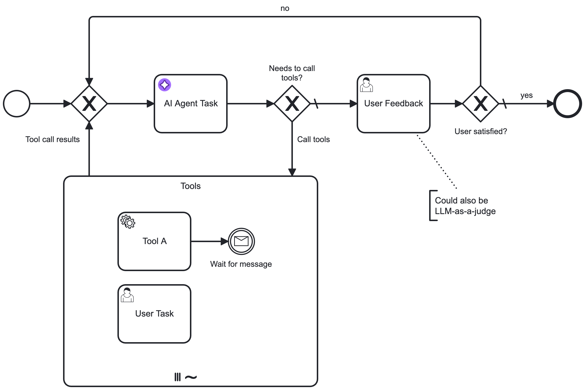

Use the **AI Agent** outbound connector to integrate Large Language Models (LLMs) with AI agents.

## About this connector

The AI Agent connector enables AI agents to integrate with an LLM to provide interaction/reasoning capabilities. This connector is designed for use with an ad-hoc sub-process in a feedback loop, providing automated user interaction and tool selection.

For example, use this connector to enable an AI agent to autonomously select and execute tasks within ad-hoc sub-processes by evaluating the current process context and determining the relevant tasks and tools to use in response. You can also use the AI Agent connector independently, although it is designed to be used with an ad-hoc sub-process to define the tools an AI agent can use.

Core features include:

| Feature              | Description                                                                                                                                                                                                                                                                         |
| :------------------- | :---------------------------------------------------------------------------------------------------------------------------------------------------------------------------------------------------------------------------------------------------------------------------------- |
| LLM provider support | Supports a range of LLM providers, such as Anthropic, Amazon Bedrock, Google Gemini, and OpenAI.                                                                                                                                                                                    |
| Memory               | Provides conversational/short-term memory handling to enable feedback loops. For example, this allows a user to ask follow-up questions to an AI agent response.                                                                                                                    |
| Tool calling         | Support for an AI agent to interact with tasks within an ad-hoc sub-process, allowing use of all Camunda features such as connectors and user tasks (human-in-the-loop). Automatic **tool resolution** allows an AI agent to identify the tools available in an ad-hoc sub-process. |

:::tip

New to agentic orchestration?

- The [Build your first AI Agent](../../../guides/getting-started-agentic-orchestration.md) guide provides a quick introduction to agentic orchestration and how to use the AI Agent Process connector using a blueprint.
- See the [example AI Agent connector integration](agentic-ai-aiagent-process-example.md) for a worked example of a simple Agent AI feedback loop model.
- See [additional resources](#additional-resources) for examples of how you can use the AI Agent connector.

:::

## Prerequisites

The following prerequisites are required to use this connector:

| Prerequisite                                      | Description                                                                                                                                                                                                                                                                                                                                                                                                                                                                                                                              |
| :------------------------------------------------ | :--------------------------------------------------------------------------------------------------------------------------------------------------------------------------------------------------------------------------------------------------------------------------------------------------------------------------------------------------------------------------------------------------------------------------------------------------------------------------------------------------------------------------------------- |
| Set up your LLM model provider and authentication | <p>Prior to using this connector, you must have previously set up an account with access and authentication details for the supported LLM model provider you want to use.</p><p>For example:<ul><li><p>To use an LLM model provided by Amazon Bedrock, you must have an AWS account with an access key and secret key to execute `Converse` actions.</p></li><li><p>For OpenAI, you must configure the [OpenAI model](https://platform.openai.com/docs/models) and obtain an OpenAI API key to use for authentication.</p></li></ul></p> |

## Implementations

The AI agent is provided as 2 different variants, each with different capabilities and suited for different use cases. You can choose the implementation type that best fits your use case, but the **recommended approach** for most use cases is to use the [**AI Agent Process**](#ai-agent-process) implementation due to the simplified configuration and support for event sub-processes.

Both variants are available with a dedicated element template which can be applied to the respective BPMN element.

### AI Agent Process

The [AI Agent Process](./agentic-ai-aiagent-process.md) implementation leverages the [job worker implementation type](../../../components/modeler/bpmn/ad-hoc-subprocesses/ad-hoc-subprocesses.md#job-worker-implementation) of an [ad-hoc sub-process](../../../components/modeler/bpmn/ad-hoc-subprocesses/ad-hoc-subprocesses.md) and provides an integrated solution
to handle the tool resolution and feedback loop. It is the recommended implementation type for most use cases offering:

- Simplified configuration as the tool feedback loop is handled internally
- Support for handling of event sub-processes within the ad-hoc sub-process

Restrictions when using the AI Agent Process:

- Given the BPMN semantics, the ad-hoc sub-process needs to contain at least one activity. Therefore, it is not possible to create an AI Agent process without any tools.
- As the tool calling feedback loop is implicitely handled within the AI Agent execution, you have less control over the tool calls.

A basic AI agent process can look like the following. By configuring the connector, the AI Agent implementation will resolve the available tools and activate them as needed to reach the agent's goal. Opposed to the AI Agent Task implementation, the process implementation supports handling of event sub-processes within the ad-hoc sub-process (see [Event Handling](#event-handling)).


This pattern can be combined with a user feedback loop for verification or follow-up interactions. Instead of the showcased user task, this could also be another LLM as a judge or any other task validating the agent's response.


### AI Agent Task

The [AI Agent Task](./agentic-ai-aiagent-task.md) implementation is the original variant relying on a BPMN [service task](../../../components/modeler/bpmn/service-tasks/service-tasks.md) in combination with a multi-instance ad-hoc sub-process.

Opposed to the AI Agent Proces implementation, this implementation type requires you to model the feedback loop explicitly in the BPMN diagram, leading to more complex configuration. It is suited for:

- Simple, one-shot tasks using the AI Agent connector as a generic LLM connector without any tool calling.
- Advanced use cases where you want to model the feedback loop explicitly, for example to pre-/post-process tool calls for approval or auditing.

A very simple example of using the AI Agent Task connector for a non-agentic task:


By adding a multi-instance ad-hoc sub-process and gateways to create a tool feedback loop, the connector can be made agentic. The connector will be able to call tools until it reaches its goal or a configured limit. The multi-instance ad-hoc sub-process acts as toolbox:


The process can be further enhanced to add a user feedback loop outside the tool calling loop. When the AI Agent completes its task and does not request any tool calls, its response
can be verified with a task (such as a user task or another LLM as a judge) and the process can be set up to loop back to the AI Agent if necessary.

This allows for example to create a user-in-the-loop process (such as a chat) where the user can ask follow-up questions:



When more control over the feedback loop is needed, it is possible to model pre-/post-processing of tool calls with additional tasks such as approval or auditing of tool calls.


## Concepts

### Feedback loop

This connector is typically used in a feedback loop, with the connector implementation repeatedly being executed based on tool call results or user feedback until it
is able to reach its goal.

For example, the following diagram shows a tool calling loop modeled with the [AI Agent Task](#ai-agent-task) implementation type. The process loops back to the AI Agent connector task from the ad-hoc sub-process until the agent decides no further tool calls are needed.
With the [AI Agent Process](#ai-agent-process) implementation type, the tool calling loop is handled internally and therefore not explicitly modeled in the BPMN diagram.


1. A request is made to the AI agent connector task, where the LLM determines what action to take.
1. If the AI agent decides that further action is needed, the process enters the ad-hoc sub-process and calls any tools deemed necessary to satisfactorily resolve the request.
1. The process loops back and re-enters the AI agent connector task, where the LLM decides (with contextual memory) if more action is needed before the process can continue. The process loops repeatedly in this manner until the AI agent decides it is complete, and passes the AI agent response to the next step in the process.

#### Feedback loop use cases

Typical feedback loop use cases for this connector include the following:

| Use case             | Description                                                                                                                                                                                                                                                                                                                                                                                                                                                                                                                                                                                                                                                                                                                                                                                                                                                              |
| :------------------- | :----------------------------------------------------------------------------------------------------------------------------------------------------------------------------------------------------------------------------------------------------------------------------------------------------------------------------------------------------------------------------------------------------------------------------------------------------------------------------------------------------------------------------------------------------------------------------------------------------------------------------------------------------------------------------------------------------------------------------------------------------------------------------------------------------------------------------------------------------------------------- |
| Tool calling         | <p>In combination with an ad-hoc sub-process, the AI Agent connector will resolve available tools and their input parameters, and pass these tool definitions to the LLM.</p><p><ul><li><p>The LLM generates a response, that might include tool calls (a request to call a tool paired with the input parameters).</p></li><li><p>If tool calls are requested, the tools can be executed by activating the respective activities within the ad-hoc sub-process.<ul><li>With the [AI Agent Process](#ai-agent-process) implementation, activating the activities will be implicitely handled by the agent implementation.</li><li>With the [AI Agent Task](#ai-agent-task) implementation, it is necessary to model the process to pass these tool calls to the ad-hoc sub-process and to return the tool call results to the AI Agent task.</li></ul></p></li></ul></p> |
| Response interaction | After returning a response (and without calling any tools), model the process to act upon the response. For example, present the response to a user who can then ask follow-up questions back to the AI Agent connector.                                                                                                                                                                                                                                                                                                                                                                                                                                                                                                                                                                                                                                                 |

As the agent preserves the context of the conversation, follow-up questions/tasks and handling of tool call results can
relate to the previous interaction with the LLM, allowing the LLM to provide more relevant responses.

### Agent context

An important concept to understand is the use of the **Agent context** process variable to store information required for allowing re-entry to the AI Agent connector task with the same context as before.

Depending on the used implementation type, the Agent context needs to be configured differently in the model:

- With the [**AI Agent Process**](#ai-agent-process) implementation type, the agent context is kept within the subprocess scope. Therefore, you only need to configure the agent context when the agent should pick up an existing conversation, for example to model a user feedback loop as used in the [quickstart example](../../../guides/getting-started-agentic-orchestration.md). In this case, you must align the configured agent context variable with the used result variable/expression so that the context update is
  correctly passed to the next execution of the AI Agent connector task.
- With the [**AI Agent Task**](#ai-agent-task) implementation type, you must align the agent context input variable and the response variable/expression so that the context update is correctly passed to the next execution of the AI Agent connector task.

### Example conversation

The following is a high-level example conversation with the AI Agent connector, including both user and tool feedback loops. The conversational awareness provided by the agent context allows use cases such as the user only responding with `Yes, please proceed`, with the agent understanding what to do next.

```
# Initial input/user prompt
User: Is John Doe eligible for a credit card?

# Tool feedback loop
AI Agent: Call the `Check_Credit_Card_Eligibility` tool with the following parameters: {"name": "John Doe"}
<process routes through ad-hoc sub-process>
Tool Call Result: {"Check_Credit_Card_Eligibility": {"eligible": true}}

# User feedback loop
AI Agent: John Doe is eligible for a credit card. Would you like to proceed?
<process routes to a user task as no tool calls are requested>
User: Yes, please proceed.

AI Agent: Call the `Create_Credit_Card` tool with the following parameters: {"name": "John Doe"}
Tool Call Result: {"Create_Credit_Card": {"success": true}}

AI Agent: John Doe's credit card has been created successfully.
```

## Additional resources

- [Intelligent by design: A step-by-step guide to AI task agents in Camunda](https://camunda.com/blog/2025/05/building-your-first-ai-agent-with-camunda-s-new-agentic-ai/)
- [AI Agent Chat Quick Start blueprint](https://marketplace.camunda.com/en-US/apps/587865/ai-agent-chat-quick-start) on the Camunda Marketplace
- Agentic AI examples GitHub repository [working examples](https://github.com/camunda/connectors/tree/main/connectors/agentic-ai/examples)
- The [MCP Client connector](/components/early-access/alpha/mcp-client/mcp-client.md) can be used in combination with the AI agent connector to connect to tools exposed by Model Context Protocol (MCP) servers
