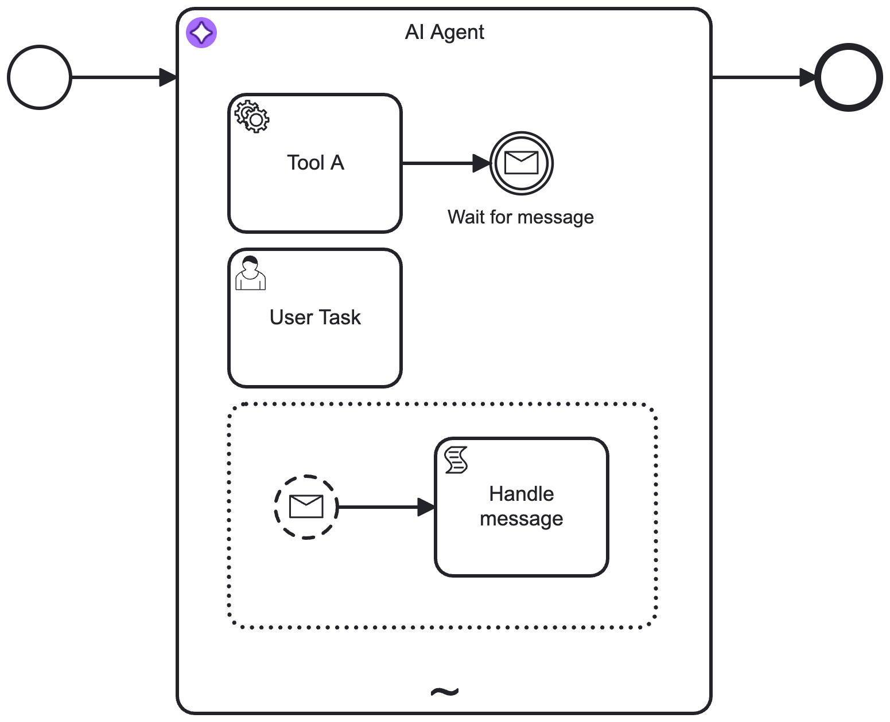

import AiAgentImplementationTabs from '../react-components/\_ai-agent-implementation-tabs';
import TabItem from "@theme/TabItem";

Use the **AI Agent** outbound connector to integrate Large Language Models (LLMs) with AI agents.

## About this connector

The AI Agent connector enables AI agents to integrate with an LLM to provide interaction/reasoning capabilities. This connector is designed for use with an ad-hoc sub-process in a feedback loop, providing automated user interaction and tool selection.

For example, use this connector to enable an AI agent to autonomously select and execute tasks within ad-hoc sub-processes by evaluating the current process context and determining the relevant tasks and tools to use in response. You can also use the AI Agent connector independently, although it is designed to be used with an ad-hoc sub-process to define the tools an AI agent can use.

Core features include:

| Feature              | Description                                                                                                                                                                                                                                                                         |
| :------------------- | :---------------------------------------------------------------------------------------------------------------------------------------------------------------------------------------------------------------------------------------------------------------------------------- |
| LLM provider support | Supports a range of LLM providers, such as Anthropic, Amazon Bedrock, Google Gemini, and OpenAI.                                                                                                                                                                                    |
| Memory               | Provides conversational/short-term memory handling to enable feedback loops. For example, this allows a user to ask follow-up questions to an AI agent response.                                                                                                                    |
| Tool calling         | Support for an AI agent to interact with tasks within an ad-hoc sub-process, allowing use of all Camunda features such as connectors and user tasks (human-in-the-loop). Automatic **tool resolution** allows an AI agent to identify the tools available in an ad-hoc sub-process. |

:::tip

New to agentic orchestration?

- See the [example AI Agent connector integration](agentic-ai-aiagent-process-example.md) for a worked example of a simple Agent AI feedback loop model.
- See [additional resources](#additional-resources) for examples of how you can use the AI Agent connector.

:::

## Prerequisites

The following prerequisites are required to use this connector:

| Prerequisite                                      | Description                                                                                                                                                                                                                                                                                                                                                                                                                                                                                                                              |
| :------------------------------------------------ | :--------------------------------------------------------------------------------------------------------------------------------------------------------------------------------------------------------------------------------------------------------------------------------------------------------------------------------------------------------------------------------------------------------------------------------------------------------------------------------------------------------------------------------------- |
| Set up your LLM model provider and authentication | <p>Prior to using this connector, you must have previously set up an account with access and authentication details for the supported LLM model provider you want to use.</p><p>For example:<ul><li><p>To use an LLM model provided by Amazon Bedrock, you must have an AWS account with an access key and secret key to execute `Converse` actions.</p></li><li><p>For OpenAI, you must configure the [OpenAI model](https://platform.openai.com/docs/models) and obtain an OpenAI API key to use for authentication.</p></li></ul></p> |

## Implementations

The AI agent is provided as 2 different variants, each with different capabilities and suited for different use cases. You can choose the implementation type that best fits your use case, but the **recommended approach** for most use cases is to use the [**AI Agent Process**](#ai-agent-process) implementation due to the simplified configuration and support for event sub-processes.

Both variants are available with a dedicated element template which can be applied to the respective BPMN element.

### AI Agent Process

The [AI Agent Process](./agentic-ai-aiagent-process.md) implementation leverages the [job worker implementation type](../../../components/modeler/bpmn/ad-hoc-subprocesses/ad-hoc-subprocesses.md#job-worker-implementation) of an [ad-hoc sub-process](../../../components/modeler/bpmn/ad-hoc-subprocesses/ad-hoc-subprocesses.md) and provides an integrated solution
to handle the tool resolution and feedback loop. It is the recommended implementation type for most use cases offering:

- Simplified configuration as the tool feedback loop is handled internally
- Support for handling of event sub-processes within the ad-hoc sub-process

Restrictions when using the AI Agent Process:

- Given the BPMN semantics, the ad-hoc sub-process needs to contain at least one activity. Therefore, it is not possible to create an AI Agent process without any tools.
- As the tool calling feedback loop is implicitely handled within the AI Agent execution, you have less control over the tool calls.

A basic AI agent process can look like the following. By configuring the connector, the AI Agent implementation will resolve the available tools and activate them as needed to reach the agent's goal. Opposed to the AI Agent Task implementation, the process implementation supports handling of event sub-processes within the ad-hoc sub-process (see [Event Handling](#event-handling)).



This pattern can be combined with a user feedback loop for verification or follow-up interactions. Instead of the showcased user task, this could also be another LLM as a judge or any other task validating the agent's response.


### AI Agent Task

The [AI Agent Task](./agentic-ai-aiagent-task.md) implementation is the original variant relying on a BPMN [service task](../../../components/modeler/bpmn/service-tasks/service-tasks.md) in combination with a multi-instance ad-hoc sub-process.

Opposed to the AI Agent Proces implementation, this implementation type requires you to model the feedback loop explicitly in the BPMN diagram, leading to more complex configuration. It is suited for:

- Simple, one-shot tasks using the AI Agent connector as a generic LLM connector without any tool calling.
- Advanced use cases where you want to model the feedback loop explicitly, for example to pre-/post-process tool calls for approval or auditing.

A very simple example of using the AI Agent Task connector for a non-agentic task:


By adding a multi-instance ad-hoc sub-process and gateways to create a tool feedback loop, the connector can be made agentic. The connector will be able to call tools until it reaches its goal or a configured limit. The multi-instance ad-hoc sub-process acts as toolbox:


The process can be further enhanced to add a user feedback loop outside the tool calling loop. When the AI Agent completes its task and does not request any tool calls, its response
can be verified with a task (such as a user task or another LLM as a judge) and the process can be set up to loop back to the AI Agent if necessary.

This allows for example to create a user-in-the-loop process (such as a chat) where the user can ask follow-up questions:


When more control over the feedback loop is needed, it is possible to model pre-/post-processing of tool calls with additional tasks such as approval or auditing of tool calls.


## Concepts

### Feedback loop

This connector is typically used in a feedback loop, with the connector implementation repeatedly being executed based on tool call results or user feedback until it
is able to reach its goal.

For example, the following diagram shows a tool calling loop modeled with the [AI Agent Task](#ai-agent-task) implementation type. The process loops back to the AI Agent connector task from the ad-hoc sub-process until the agent decides no further tool calls are needed.
With the [AI Agent Process](#ai-agent-process) implementation type, the tool calling loop is handled internally and therefore not explicitly modeled in the BPMN diagram.


1. A request is made to the AI agent connector task, where the LLM determines what action to take.
1. If the AI agent decides that further action is needed, the process enters the ad-hoc sub-process and calls any tools deemed necessary to satisfactorily resolve the request.
1. The process loops back and re-enters the AI agent connector task, where the LLM decides (with contextual memory) if more action is needed before the process can continue. The process loops repeatedly in this manner until the AI agent decides it is complete, and passes the AI agent response to the next step in the process.

#### Feedback loop use cases

Typical feedback loop use cases for this connector include the following:

| Use case             | Description                                                                                                                                                                                                                                                                                                                                                                                                                                                                                                                                     |
| :------------------- | :---------------------------------------------------------------------------------------------------------------------------------------------------------------------------------------------------------------------------------------------------------------------------------------------------------------------------------------------------------------------------------------------------------------------------------------------------------------------------------------------------------------------------------------------- |
| Tool calling         | <p>In combination with an ad-hoc sub-process, the AI Agent connector will resolve available tools and their input parameters, and pass these tool definitions to the LLM.</p><p><ul><li><p>The LLM generates a response, that might include tool calls (a request to call a tool paired with the input parameters).</p></li><li><p>If tool calls are requested, model the process to pass these tool calls to the ad-hoc sub-process and to return the tool call results to the AI Agent task by modelling the feedback loop.</p></li></ul></p> |
| Response interaction | After returning a response (and without calling any tools), model the process to act upon the response. For example, present the response to a user who can then ask follow-up questions back to the AI Agent connector.                                                                                                                                                                                                                                                                                                                        |

As the agent preserves the context of the conversation, follow-up questions/tasks and handling of tool call results can
relate to the previous interaction with the LLM, allowing the LLM to provide more relevant responses.

### Agent context

An important concept to understand is the use of the **Agent context** process variable to store information required for allowing re-entry to the AI Agent connector task with the same context as before.

Depending on the used implementation type, the Agent context needs to be configured differently in the model:

- With the [**AI Agent Process**](#ai-agent-process) implementation type, the agent context is kept within the subprocess scope. Therefore, you only need to configure the agent context when the agent should pick up an existing conversation, for example to model a user feedback loop as used in the [quickstart example](../../../guides/getting-started-agentic-orchestration.md). In this case, you must align the configured agent context variable with the used result variable/expression so that the context update is
  correctly passed to the next execution of the AI Agent connector task.
- With the [**AI Agent Task**](#ai-agent-task) implementation type, you must align the agent context input variable and the response variable/expression so that the context update is correctly passed to the next execution of the AI Agent connector task.

### Example conversation

The following is a high-level example conversation with the AI Agent connector, including both user and tool feedback loops. The conversational awareness provided by the agent context allows use cases such as the user only responding with `Yes, please proceed`, with the agent understanding what to do next.

```
# Initial input/user prompt
User: Is John Doe eligible for a credit card?

# Tool feedback loop
AI Agent: Call the `Check_Credit_Card_Eligibility` tool with the following parameters: {"name": "John Doe"}
<process routes through ad-hoc sub-process>
Tool Call Result: {"Check_Credit_Card_Eligibility": {"eligible": true}}

# User feedback loop
AI Agent: John Doe is eligible for a credit card. Would you like to proceed?
<process routes to a user task as no tool calls are requested>
User: Yes, please proceed.

AI Agent: Call the `Create_Credit_Card` tool with the following parameters: {"name": "John Doe"}
Tool Call Result: {"Create_Credit_Card": {"success": true}}

AI Agent: John Doe's credit card has been created successfully.
```

## Configuration

:::note
Some options are different or only applicable to one of the [implementations](#implementations). These options are marked accordingly.
:::

### Model Provider

Select and configure authentication for the LLM model **Provider** you want to use, from the following supported providers:

- [Anthropic](http://anthropic.com/) (Claude models)
- [Amazon Bedrock](https://docs.aws.amazon.com/bedrock/latest/userguide/what-is-bedrock.html)
- [Azure OpenAI](https://learn.microsoft.com/en-us/azure/ai-foundry/openai/overview)
- [Google Vertex AI](https://cloud.google.com/vertex-ai)
- [OpenAI](http://openai.com/)
- OpenAI-compatible

:::note

- Different setup/authentication fields are shown depending on the provider you select.
- Use [connector secrets](/components/console/manage-clusters/manage-secrets.md) to store credentials and avoid exposing sensitive information directly from the process.

:::

#### Anthropic

Select this option to use an Anthropic Claude LLM model (uses the [Anthropic Messages API](https://docs.anthropic.com/en/api/messages)).

| Field             | Required | Description                                                                                                                   |
| :---------------- | :------- | :---------------------------------------------------------------------------------------------------------------------------- |
| Anthropic API key | Yes      | Your Anthropic account API key for authorization to the [Anthropic Messages API](https://docs.anthropic.com/en/api/messages). |

:::info
For more information about Anthropic Claude LLM models, refer to the [Claude models overview](https://docs.anthropic.com/en/docs/about-claude/models/all-models).
:::

#### Bedrock

Select this option to use a model provided by the [Amazon Bedrock](https://docs.aws.amazon.com/bedrock/latest/userguide/what-is-bedrock.html) service, using the
[Converse](https://docs.aws.amazon.com/bedrock/latest/APIReference/API_runtime_Converse.html) API.

| Field          | Required | Description                                                                                                                                                                                                                   |
| :------------- | :------- | :---------------------------------------------------------------------------------------------------------------------------------------------------------------------------------------------------------------------------- |
| Region         | Yes      | The AWS region. Example: `us-east-1`                                                                                                                                                                                          |
| Authentication | Yes      | Select the authentication type you want to use to authenticate the connector with AWS. To learn more about configuring AWS authentication, see [Amazon Bedrock connector authentication](./amazon-bedrock.md#authentication). |

Model availability depends on the region and model you use. You might need to request a model is made available for your account. To learn more about configuring access to foundation models, refer to [access to Amazon Bedrock foundation models](https://docs.aws.amazon.com/bedrock/latest/userguide/model-access-modify.html).

:::info
For a list of Amazon Bedrock LLM models, refer to [supported foundation models in Amazon Bedrock](https://docs.aws.amazon.com/bedrock/latest/userguide/models-supported.html).
:::

#### Azure OpenAI

Select this option to use [Azure OpenAI models](https://learn.microsoft.com/en-us/azure/ai-foundry/openai/overview).

| Field              | Required | Description                                                                                     |
| ------------------ | -------- | ----------------------------------------------------------------------------------------------- |
| **Endpoint**       | Yes      | The Azure OpenAI endpoint URL. Example: `https://<your-resource-name>.openai.azure.com/`        |
| **Authentication** | Yes      | Select the authentication type you want to use to authenticate the connector with Azure OpenAI. |

Two authentication methods are currently supported:

- **API key**: Authenticate using an Azure OpenAI API key, available in the [Azure AI Foundry portal](https://ai.azure.com/).

- **Client credentials**: Authenticate using a client ID and secret. This method requires registering an application in [Microsoft Entra ID](https://go.microsoft.com/fwlink/?linkid=2083908). Provide the following fields:
  - **Client ID** – The Microsoft Entra application ID.
  - **Client secret** – The application’s client secret.
  - **Tenant ID** – The Microsoft Entra tenant ID.
  - **Authority host** – (Optional) The authority host URL. Defaults to `https://login.microsoftonline.com/`. This can also be an OAuth 2.0 token endpoint.

:::note
To use an Azure OpenAI model, you must first deploy it in the Azure AI Foundry portal. For details, see [Deploy a model in Azure OpenAI](https://learn.microsoft.com/en-us/azure/ai-foundry/openai/how-to/create-resource#deploy-a-model). The deployment ID must then be provided in the **Model** field.
:::

#### Google Vertex AI

Select this option to use [Google Vertex AI](https://cloud.google.com/vertex-ai) models.

| Field              | Required | Description                                                                                                                        |
| ------------------ | -------- | ---------------------------------------------------------------------------------------------------------------------------------- |
| **Project ID**     | Yes      | The Google Cloud project ID.                                                                                                       |
| **Region**         | Yes      | The [region](https://cloud.google.com/vertex-ai/docs/general/locations#feature-availability) where AI inference should take place. |
| **Authentication** | Yes      | Select the authentication type to use for connecting to Google Cloud.                                                              |

Two authentication methods are currently supported:

- **Service Account Credentials**: Authenticate using a [service account](https://cloud.google.com/iam/docs/service-account-overview) key in JSON format.
- **Application Default Credentials (ADC)**: Authenticate using the default credentials available in your environment.  
  This method is only supported in Self-Managed or hybrid environments.  
  To set up ADC in a local development environment, follow the instructions [here](https://cloud.google.com/docs/authentication/set-up-adc-local-dev-environment).

:::info
For more information about Google Vertex AI models, see the [Vertex AI documentation](https://cloud.google.com/vertex-ai/generative-ai/docs/models).
:::

#### OpenAI

Select this option to use the [OpenAI Chat Completion API](https://platform.openai.com/docs/api-reference/chat).

| Field           | Required | Description                                                                                                                                              |
| :-------------- | :------- | :------------------------------------------------------------------------------------------------------------------------------------------------------- |
| OpenAI API key  | Yes      | Your OpenAI account API key for authorization.                                                                                                           |
| Organization ID | No       | For members of multiple organizations. If you belong to multiple organizations, specify the organization ID to use for API requests with this connector. |
| Project ID      | No       | If you access projects through a legacy user API key, specify the project ID to use for API requests with this connector.                                |

:::info
To learn more about authentication to the OpenAPI API, refer to [OpenAPI platform API reference](https://platform.openai.com/docs/api-reference/introduction).
:::

#### OpenAI-compatible

Select this option to use an LLM provider that provides OpenAI-compatible endpoints.

| Field        | Required | Description                                                                                                                                                                       |
| :----------- | :------- | :-------------------------------------------------------------------------------------------------------------------------------------------------------------------------------- |
| API endpoint | Yes      | The base URL of the OpenAI-compatible endpoint. Example value: `https://api.your-llm-provider.com/v1`                                                                             |
| API key      | No       | The API key for authentication. Leave blank if using HTTP headers for authentication. If an <b>Authorization</b> header is specified in the headers, then the API key is ignored. |
| Headers      | No       | Optional HTTP headers to include in the request to the OpenAI-compatible endpoint.                                                                                                |

:::note
A **Custom parameters** field is available in the model parameters to provide any additional parameters supported by your OpenAI-compatible provider.
:::

### Model

Select the model you want to use for the selected provider, and specify any additional model parameters.

| Field                     | Required | Description                                                                                                                                           |
| :------------------------ | :------- | :---------------------------------------------------------------------------------------------------------------------------------------------------- |
| Model                     | Yes      | <p>Specify the model ID for the model you want to use.</p><p>Example: `anthropic.claude-3-5-sonnet-20240620-v1:0`</p>                                 |
| Maximum tokens            | No       | The maximum number of tokens per request to allow in the generated response.                                                                          |
| Maximum completion tokens | No       | The maximum number of tokens per request to generate before stopping.                                                                                 |
| Temperature               | No       | Floating point number, typically between 0 and 1 (0 and 2 for OpenAI). The higher the number, the more randomness will be injected into the response. |
| top P                     | No       | Floating point number, typically between 0 and 1. Recommended for advanced use cases only (usually you only need to use temperature).                 |
| top K                     | No       | Integer greater than 0. Recommended for advanced use cases only (you usually only need to use temperature).                                           |

:::note

- Different model parameter fields are shown depending on the provider/model you select. Additionally, some parameters may be different or have different value ranges (for example, OpenAI Temperature uses a number range between 0 to 2, whereas other models use a range between 0 to 1).
- For more information on each model parameter, refer to the provider documentation links in the element template.
- Parameters that set maximum values (such as maximum tokens) are considered **per LLM request**, not for the whole conversation. Depending on the provider, the exact meaning of these parameters may vary.

:::

### System Prompt

The **System Prompt** is a crucial part of the AI Agent connector configuration, as it defines the behavior and goal of the agent and instructs the LLM on how to act.

| Field         | Required | Description                                                                                                                                                                                                                                                            |
| :------------ | :------- | :--------------------------------------------------------------------------------------------------------------------------------------------------------------------------------------------------------------------------------------------------------------------- |
| System prompt | Yes      | <p>Specify a system prompt to define how the LLM should act.</p><p><ul><li><p>A minimal example system prompt is provided as a starting point for you to customize.</p></li><li><p>You can use FEEL expressions to add dynamic values into the text.</p></li></ul></p> |

### User Prompt

The **User Prompt** contains the actual request to the LLM model.

| Field       | Required | Description                                                                                                                                                                                                                                                                                                                                                                                                                                                                                                                                                                                                                                                                                                                                                                                                                                |
| :---------- | :------- | :----------------------------------------------------------------------------------------------------------------------------------------------------------------------------------------------------------------------------------------------------------------------------------------------------------------------------------------------------------------------------------------------------------------------------------------------------------------------------------------------------------------------------------------------------------------------------------------------------------------------------------------------------------------------------------------------------------------------------------------------------------------------------------------------------------------------------------------- |
| User prompt | Yes      | <p>This could either contain the initial request or a follow-up request as part of a response interaction feedback loop.</p><p><ul><li><p>The value provided as part of this field is added to the conversation memory and passed to the LLM call.</p></li><li><p>For example, in the [example conversation](#example-conversation), this would be the messages prefixed with `User:`.</p></li><li><p>You can use FEEL expressions to add dynamic values into the text.</p></li></ul></p>                                                                                                                                                                                                                                                                                                                                                  |
| Documents   | No       | <p>Add a [document references](/self-managed/concepts/document-handling/overview.md) list to allow an AI agent to interact with documents and images.</p><p><ul><li><p>This list is internally resolved and passed to the LLM model if the document type is supported.</p></li><li><p>LLM APIs provide a way to specify the user prompt as a list of content blocks. If document references are passed, they are resolved to a corresponding content block and passed as part of the user message.</p></li><li><p>For examples of how LLM providers accept document content blocks, refer to the [Anthropic](https://docs.anthropic.com/en/docs/build-with-claude/vision#base64-encoded-image-example) and [OpenAI](https://platform.openai.com/docs/guides/images-vision#giving-a-model-images-as-input) documentation.</p></li></ul></p> |

#### Supported document types

As file type support varies by LLM provider/model, you must test your document use case with the provider you are using.

| File type         | Supported | Description                                                                                                                                                                        |
| :---------------- | :-------- | :--------------------------------------------------------------------------------------------------------------------------------------------------------------------------------- |
| Text              | Yes       | Text files (MIME types matching `text/*`, `application/xml`, `application/json`, or `application/yaml`) are passed as plain text content blocks.                                   |
| PDF               | Yes       | PDF files (MIME types matching `application/pdf`) are passed as base64 encoded content blocks.                                                                                     |
| Image             | Yes       | Image files (MIME types matching `image/jpg`, `image/png`, `image/gif`, or `image/webp`) are passed as base64 encoded content blocks.                                              |
| Audio/video/other | No        | Audio and video files are not currently supported, and will result in an error if passed. All other unsupported file types not listed here will also result in an error if passed. |

:::info
To learn more about storing, tracking, and managing documents in Camunda 8, see [document handling](/components/document-handling/getting-started.md).
:::

### Tools

<AiAgentImplementationTabs>

<TabItem value='process'>
This section is only applicable to the **AI Agent Task** implementation.
</TabItem>

<TabItem value='task'>
Specify the tool resolution for an accompanying ad-hoc sub-process.

| Field                 | Required | Description                                                                                                                                                                                                                                                                                                               |
| :-------------------- | :------- | :------------------------------------------------------------------------------------------------------------------------------------------------------------------------------------------------------------------------------------------------------------------------------------------------------------------------ |
| Ad-hoc sub-process ID | No       | <p>Specify the element ID of the ad-hoc sub-process to use for tool resolution (see [Tool Definitions](agentic-ai-aiagent-tool-definitions.md)).</p><p>When entering the AI Agent connector, the connector resolves the tools available in the ad-hoc sub-process, and passes these to the LLM as part of the prompt.</p> |
| Tool call results     | No       | <p>Specify the results collection of the ad-hoc sub-process multi-instance execution.</p><p>Example: `=toolCallResults`</p>                                                                                                                                                                                               |

:::note

- Leave this section empty if using this connector independently, without an accompanying ad-hoc sub-process.
- To actually use the tools, you must model your process to include a tools feedback loop, routing into the ad-hoc sub-process and back to the AI agent connector. See [example tools feedback loop](agentic-ai-aiagent-task-example.md#tools-loop).

:::

</TabItem>

</AiAgentImplementationTabs>

### Memory

Configure the agent's short-term/conversational memory.

The configuration of the **Agent context** field depends on the used AI agent implementation:

<AiAgentImplementationTabs>
<TabItem value='process'>

| Field         | Required | Description                                                                                                                                                                                                                                                                                                                                                                                                                                                                                                                                                               |
| :------------ | :------- | :------------------------------------------------------------------------------------------------------------------------------------------------------------------------------------------------------------------------------------------------------------------------------------------------------------------------------------------------------------------------------------------------------------------------------------------------------------------------------------------------------------------------------------------------------------------------ |
| Agent context | No       | <p>As the process implementation keeps the agent context within the subprocess scope, it is only necessary to configure the agent context when the agent should pick up an existing conversation, for example to model a user feedback loop as used in the [quickstart example](../../../guides/getting-started-agentic-orchestration.md).</p><p>Should be used in combination with the **Include agent context** setting in the [response](#response) section and be aligned with the used result variable.</p><p>Example: `=agent.context`, `=anotherAgent.context`</p> |

</TabItem>

<TabItem value='task'>

| Field         | Required | Description                                                                                                                                                                                                                                                                                                                                                                                                                                                                                                                                                                                                                                                                                                                                                              |
| :------------ | :------- | :----------------------------------------------------------------------------------------------------------------------------------------------------------------------------------------------------------------------------------------------------------------------------------------------------------------------------------------------------------------------------------------------------------------------------------------------------------------------------------------------------------------------------------------------------------------------------------------------------------------------------------------------------------------------------------------------------------------------------------------------------------------------- |
| Agent context | Yes      | <p>Specify an agent context variable to store all relevant data for the agent to support a feedback loop between user requests, tool calls, and LLM responses. Make sure this variable points to the `context` variable that is returned from the agent response.</p><p>This is an important variable required to make a feedback loop work correctly. This variable must be aligned with the Output mapping **Result variable** and **Result expression** for this connector.</p><p>**Avoid** reusing the agent context variable across different agent tasks. Define a dedicated [result variable](#output-mapping) name for each agent instead and align it in the context and the result configuration.</p><p>Example: `=agent.context`, `=anotherAgent.context`</p> |

</TabItem>
</AiAgentImplementationTabs>

Depending on your use case, you can store the conversation memory in different storage backends.

| Field               | Required | Description                                                                                                                                                                                                                                                                                                                                                                                                                                                                                                                                                       |
| :------------------ | :------- | :---------------------------------------------------------------------------------------------------------------------------------------------------------------------------------------------------------------------------------------------------------------------------------------------------------------------------------------------------------------------------------------------------------------------------------------------------------------------------------------------------------------------------------------------------------------- |
| Memory storage type | Yes      | <p>Specify how the conversation memory should be stored.</p><ul><li>In Process (part of agent context): conversation messages will be stored as process variable and be subject to [variable size limitations](../../concepts/variables.md). This is the default value.</li><li>Camunda Document Storage: messages will be stored as a JSON document in [document storage](../../document-handling/getting-started.md).</li><li>Custom Implementation (Hybrid/Self-Managed only): a custom storage implementation using a customized connector runtime.</li></ul> |
| Context window size | No       | <p>Specify the maximum number of messages to pass to the LLM on every call. Defaults to `20` if not configured.</p><ul><li>Configuring this is a trade-off between cost/tokens and the context window supported by the used model.</li><li>When the conversation exceeds the configured context window size, the oldest messages from past feedback loops are omitted from the model API call first.</li><li>The system prompt is always kept in the list of messages passed to the LLM.</li></ul>                                                                |

#### In-process storage

Messages passed between the AI agent and the model are stored within the agent context variable and directly visible in Operate.

This is suitable for many use cases, but you must be aware of the [variable size limitations](../../concepts/variables.md) that limit the amount of data that can be stored in the process variable.

#### Camunda document storage

Messages passed between the AI agent and the model are not directly available as process variable but reference a JSON document stored in [document storage](../../document-handling/getting-started.md).

As documents are subject to expiration, to avoid losing the conversation history you must be able to predict the expected lifetime of your process, so you can correctly configure the document time-to-live (TTL).

| Field                      | Required | Description                                                                                                                                                                                                                                                                        |
| :------------------------- | :------- | :--------------------------------------------------------------------------------------------------------------------------------------------------------------------------------------------------------------------------------------------------------------------------------- |
| Document TTL               | No       | <p>Time-to-live (TTL) for documents containing the conversation history. Use this field to set a custom TTL matching your expected process lifetime.</p><p>The [default cluster TTL](../../document-handling/getting-started.md#saas) is used if this value is not configured.</p> |
| Custom document properties | No       | <p>Optional map of properties to store with the document.</p><p>Use this option to reference custom metadata you might want to use when further processing conversation documents.</p>                                                                                             |

#### Custom implementation

:::info
This option is only supported if you are using a customized AI Agent connector in a Self-Managed or hybrid setup.
See [customization](./agentic-ai-aiagent-customization.md) for more details.
:::

| Field               | Required | Description                                                                                                                                                                  |
| :------------------ | :------- | :--------------------------------------------------------------------------------------------------------------------------------------------------------------------------- |
| Implementation type | Yes      | <p>The **type** identifier of your custom storage implementation. See [customization](./agentic-ai-aiagent-customization.md#custom-conversation-storage) for an example.</p> |
| Parameters          | No       | <p>Optional map of parameters to be passed to the storage implementation.</p>                                                                                                |

### Limits

Set limits for the agent interaction to prevent unexpected behavior or unexpected cost due to infinite loops.

| Field               | Required | Description                                                                                                                           |
| :------------------ | :------- | :------------------------------------------------------------------------------------------------------------------------------------ |
| Maximum model calls | No       | Specify the maximum number of model calls. As a safeguard, this limit defaults to a value of `10` if you do not configure this value. |

:::caution
Despite these limits, you must closely monitor your LLM API usage and cost, and set appropriate limits on the provider side.
:::

### Event handling

<AiAgentImplementationTabs>

<TabItem value='process'>

Configures how the AI Agent process should behave when handling results from an [event subprocess](../../../components/modeler/bpmn/event-subprocesses/event-subprocesses.md).

The **Event handling behavior** field can be set to one of options:

- [Wait for tool call results](#wait-for-tool-call-results) (default)
- [Interrupt tool calls](#interrupt-tool-calls)

Assuming the agent requested to execute tools `A` and `B` and tool `B` already being completed, the following describes how each option behaves when an event is received.

#### Wait for tool call results

The process waits for all tool calls to complete before handling the event. For the example above, the following sequence of messages would be sent to the LLM after both tools complete:

- Tool A: `Tool A result`
- Tool B: `Tool B result`
- Event message: `Content from event message`

#### Interrupt tool calls

When an event is received while other tool calls are still in progress, the process will cancel the tool execution and directly return a list of messages to the LLM:

- Tool A: `Tool A execution was cancelled`
- Tool B: `Tool B result`
- Event message: `Content from event message`

</TabItem>

<TabItem value='task'>
This section is only applicable to the **AI Agent Process** implementation.
</TabItem>

</AiAgentImplementationTabs>

### Response

Configure the response format by specifying how the model should return its output (text or JSON) and how the connector should process and handle the returned response.

The outcome of an LLM call is stored as an **assistant message** designed to contain multiple content blocks.

- This message always contains a single text content block for the currently supported providers/models.
- The connector returns the **first content block** when handling the response, either as a text string or as a parsed JSON object.

| Field                     | Required | Description                                                                                                                                                                                                                                                                                                       |
| :------------------------ | :------- | :---------------------------------------------------------------------------------------------------------------------------------------------------------------------------------------------------------------------------------------------------------------------------------------------------------------- |
| Response format           | Yes      | <p>Instructs the model which response format to return.</p><p><ul><li>This can be either text or JSON.</li><li>JSON format support varies by provider and model.</li></ul></p>                                                                                                                                    |
| Include assistant message | No       | <p>Returns the entire message returned by the LLM as `responseMessage`, including any additional content blocks and metadata.</p><p>Select this option if you need more than just the first response text.</p>                                                                                                    |
| Include agent context     | No       | <p>Returns the agent context variable as part of the response object.</p><p>Necessary when modeling a user feedback loop in combination with an AI agent process as otherwise the context will only be kept in the process' internal state.</p><p>Only applicable to the **AI Agent Process** implementation.</p> |

#### Text response format

If not configured otherwise, this format is used by default and returns a `responseText` string as part of the
connector response.

| Field              | Required | Description                                                                                                                                                                                                                                                                                                                                                                                                                                                                                                                                               |
| :----------------- | :------- | :-------------------------------------------------------------------------------------------------------------------------------------------------------------------------------------------------------------------------------------------------------------------------------------------------------------------------------------------------------------------------------------------------------------------------------------------------------------------------------------------------------------------------------------------------------- |
| Parse text as JSON | No       | <p>If this option is selected, the connector will attempt to parse the response text as JSON and return the parsed object as `responseJson` in the connector response.</p><p><ul><li><p>Use this option for models that do not support setting JSON as response format (such as Anthropic models) in combination with a prompt instructing the model to return a JSON response.</p></li><li><p>If parsing fails, the connector does not return an `responseJson` object, but only returns the original response text as `responseText`.</p></li></ul></p> |

For an example prompt that instructs the model to return a JSON response,
(see [Anthropic documenation](https://docs.anthropic.com/en/docs/test-and-evaluate/strengthen-guardrails/increase-consistency#example-enhancing-it-support-consistency)):

```
Output in JSON format with keys: "sentiment" (positive/negative/neutral), "key_issues" (list), and "action_items" (list of dicts with "team" and "task").
```

#### JSON response format

:::note

The JSON response format is currently only supported for OpenAI and Google Vertex AI models. Use the text response format in combination with
the **Parse text as JSON** option for other providers.

:::

If the model supports it, selecting JSON as response format instructs the model to always return a JSON response. If the model does not return a valid JSON response, the connector throws an error.

To ensure the model generates data according to a specific JSON structure, you can optionally provide a
[JSON Schema](https://json-schema.org/). Alternatively, you can instruct the model to return JSON following a specific
structure as shown in the text example above.

Support for JSON responses varies by provider and model.

For OpenAI, selecting the JSON response format is equivalent to using
the [JSON mode](https://platform.openai.com/docs/guides/structured-outputs?api-mode=chat#json-mode). Providing a
JSON Schema instructs the model to return
[structured outputs](https://platform.openai.com/docs/guides/structured-outputs?api-mode=chat#structured-outputs-vs-json-mode).

| Field                     | Required | Description                                                                                                                                                                                                                                                           |
| :------------------------ | :------- | :-------------------------------------------------------------------------------------------------------------------------------------------------------------------------------------------------------------------------------------------------------------------- |
| Response JSON schema      | No       | <p>Describes the desired response format as [JSON Schema](https://json-schema.org/).</p><p><ul><li>See [OpenAI's structured outputs documentation](https://platform.openai.com/docs/guides/structured-outputs?api-mode=chat#introduction) for examples.</li></ul></p> |
| Response JSON schema name | No       | <p>Depending on the provider, the schema must be configured with a name for the schema (such as `Person`).</p><p>Ideally this name describes the purpose of the schema to make the model aware of the expected data.</p>                                              |

For example, the following shows an example JSON Schema describing the expected response format for a user profile:

```feel
={
  "type": "object",
  "properties": {
    "userId": {
      "type": "number"
    },
    "firstname": {
      "type": "string"
    },
    "lastname": {
      "type": "string"
    }
  },
  "required": [
    "userId",
    "firstname",
    "lastname"
  ]
}
```

#### Assistant message

If the **Include assistant message** option is selected, the response from the AI Agent connector contains a
`responseMessage` object that includes the assistant message, including all content blocks and metadata. For example:

```json
{
  "responseMessage": {
    "role": "assistant",
    "content": [
      {
        "type": "text",
        "text": "Based on the result from the GetDateAndTime function, the current date and time is:\n\nJune 2, 2025, 09:15:38 AM (Central European Summer Time)."
      }
    ],
    "metadata": {
      "framework": {
        "tokenUsage": {
          "inputTokenCount": 1563,
          "outputTokenCount": 95,
          "totalTokenCount": 1658
        },
        "finishReason": "STOP"
      }
    }
  }
}
```

To retrieve the response text from the `responseMessage` object, use the following FEEL expression (assuming the response variable is named `agent`):

```feel
agent.responseMessage.content[type = "text"][1].text
```

### Output mapping

Specify the process variables that you want to map and export the AI Agent connector response into. The available fields depend on the implementation:

<AiAgentImplementationTabs>
<TabItem value='process'>

| Field           | Required | Description                                                                                                                                                                                                                                                                                                                                                                                                                                                                                                                                                                                                                                                                                                                                                                                                                                    |
| :-------------- | :------- | :--------------------------------------------------------------------------------------------------------------------------------------------------------------------------------------------------------------------------------------------------------------------------------------------------------------------------------------------------------------------------------------------------------------------------------------------------------------------------------------------------------------------------------------------------------------------------------------------------------------------------------------------------------------------------------------------------------------------------------------------------------------------------------------------------------------------------------------------- |
| Result variable | Yes      | <p>The result of the AI Agent connector is a context containing the following fields, depending on how the [Response](#response) is configured. Set this to a unique value for every agent in your process to avoid interference between agents.</p><p><ul><li><p>`context`: The updated **agent context** if the **Include agent context** option is enabled.</p></li><li><p>`responseText`: The last response text provided by the LLM if the **Response Format** is set to `Text`.</p></li><li><p>`responseJson`: The last response text provided by the LLM, parsed as a JSON object if the **Response Format** is set to `JSON` or if the **Parse text as JSON** option is enabled.</p></li><li><p>`responseMessage`: The assistant message provided by the LLM if the **Include assistant message** option is enabled.</p></li></ul></p> |

</TabItem>

<TabItem value='task'>

| Field             | Required | Description                                                                                                                                                                                                                                                                                                                                                                                                                                                                                                                                                                                                                                                                                                                                                                                                                                                                                                                                                                                                                                                                                                   |
| :---------------- | :------- | :------------------------------------------------------------------------------------------------------------------------------------------------------------------------------------------------------------------------------------------------------------------------------------------------------------------------------------------------------------------------------------------------------------------------------------------------------------------------------------------------------------------------------------------------------------------------------------------------------------------------------------------------------------------------------------------------------------------------------------------------------------------------------------------------------------------------------------------------------------------------------------------------------------------------------------------------------------------------------------------------------------------------------------------------------------------------------------------------------------ |
| Result variable   | Yes      | <p>The result of the AI Agent connector is a context containing the following fields. Set this to a unique value for every agent task in your process to avoid interference between agents.</p><p><ul><li><p>`context`: The updated **Agent Context**. Make sure you map this to a process variable and re-inject this variable in the **Agent Context** input field if your AI agent is part of a feedback loop.</p></li><li><p>`toolCalls`: Tool call requests provided by the LLM that need to be routed to the ad-hoc sub-process.</p></li></ul></p><p>Response fields depend on how the [Response](#response) is configured: <ul><li><p>`responseText`: The last response text provided by the LLM if the **Response Format** is set to `Text`.</p></li><li><p>`responseJson`: The last response text provided by the LLM, parsed as a JSON object if the **Response Format** is set to `JSON` or if the **Parse text as JSON** option is enabled.</p></li><li><p>`responseMessage`: The assistant message provided by the LLM if the **Include assistant message** option is enabled.</p></li></ul></p> |
| Result expression | No       | In addition, you can choose to unpack the content of the response into multiple process variables using the **Result expression** field, as a [FEEL Context Expression](/components/concepts/expressions.md).                                                                                                                                                                                                                                                                                                                                                                                                                                                                                                                                                                                                                                                                                                                                                                                                                                                                                                 |

:::tip
To model your first AI Agent, you can use the default result variable (`agent`) and
configure the **Agent Context** as `agent.context`.

When adding a second AI Agent connector, use a
different variable name (such as `mySecondAgent`) and align the context variable accordingly (for example, `mySecondAgent.context`) to avoid interference and
unexpected results between different agents.
:::

:::info
To learn more about output mapping, see [variable/response mapping](/components/connectors/use-connectors/index.md#variableresponse-mapping).
:::

</TabItem>
</AiAgentImplementationTabs>

### Error handling

If an error occurs, the AI Agent connector throws an error and includes the error response in the error variable in Operate.

| Field            | Required | Description                                                                                                                                                        |
| :--------------- | :------- | :----------------------------------------------------------------------------------------------------------------------------------------------------------------- |
| Error expression | No       | You can handle an AI Agent connector error using an Error Boundary Event and [error expressions](/components/connectors/use-connectors/index.md#error-expression). |

### Retries

Specify connector execution retry behavior if execution fails.

| Field         | Required | Description                                                                                                                                     |
| :------------ | :------- | :---------------------------------------------------------------------------------------------------------------------------------------------- |
| Retries       | No       | Specify the number of [retries](/components/connectors/use-connectors/outbound.md#retries) (times) the connector repeats execution if it fails. |
| Retry backoff | No       | Specify a custom Retry backoff interval between retries instead of the default behavior of retrying immediately.                                |

### Execution listeners

Add and manage [execution listeners](/components/concepts/execution-listeners.md) to allow users to react to events in the workflow execution lifecycle by executing custom logic.

## Event handling

With an **AI Agent Process**, an event handled as part of an [event subprocess](../../../components/modeler/bpmn/event-subprocesses/event-subprocesses.md) will directly trigger an execution of the underlying job worker which can either interrupt ongoing tool calls or wait for all tool calls to complete before handling the event. See [event handling](#event-handling) for more details.

To provide additional data to the LLM from a handled event, create a `toolCallResult` variable from the event handling flow. The content of this variable will be added to the LLM API call as a user message following any tool call results.

## Additional resources

- [Intelligent by design: A step-by-step guide to AI task agents in Camunda](https://camunda.com/blog/2025/05/building-your-first-ai-agent-with-camunda-s-new-agentic-ai/)
- [AI email support agent blueprint](https://marketplace.camunda.com/en-US/apps/522492/ai-email-support-agent) on the Camunda Marketplace
- Agentic AI integration GitHub repository [working examples](https://github.com/camunda/connectors/tree/main/connectors/agentic-ai/examples)
- The [MCP Client connector](/components/early-access/alpha/mcp-client/mcp-client.md) can be used in combination with the AI agent connector to connect to tools exposed by Model Context Protocol (MCP) servers
