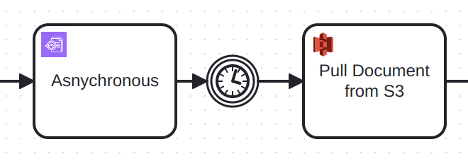

import OutboundConnectorBasics from '../../../components/react-components/connector-outbound-basics.md'
import ErrorHandling from '../../../components/react-components/connector-error-handling.md'

The Amazon Textract connector enables you to integrate your BPMN service with [Amazon Textract](https://aws.amazon.com/textract/) to automatically extract text and data from documents.

## Prerequisites

You need an **AWS IAM Access Key** and **Secret Key** with the following permissions:

- `AmazonTextractFullAccess` — required
- `AmazonS3ReadOnlyAccess` — required if using S3 as the document source
- `AmazonS3FullAccess` — optional if using S3 as the output location for asynchronous execution

For setup instructions, refer to the [AWS Textract Developer Guide](https://docs.aws.amazon.com/textract/latest/dg/getting-started.html).

<OutboundConnectorBasics />

## Configuration

### Authentication

Select an authentication type from the **Authentication** dropdown:

1. **Credentials**:

| Property   | Type   | Required | Description                  | Example                          |
| ---------- | ------ | -------- | ---------------------------- | -------------------------------- |
| Access Key | String | Yes      | AWS access key for Textract. | `AKIAIOSFODNN37`                 |
| Secret Key | String | Yes      | AWS secret key for Textract. | `wJalrXUtnFEgfMIK7MDENGbPxRfiCY` |

2. **Default Credentials Chain** _(hybrid/Self-Managed only)_:  
   Use if your system relies on implicit authentication (e.g., IAM roles, environment variables, or credentials files).  
   This option uses the [Default Credential Provider Chain](https://docs.aws.amazon.com/sdk-for-java/v1/developer-guide/credentials.html) to resolve credentials.

### Configure AWS region

| Property | Type   | Required | Description                                                                           | Example     |
| -------- | ------ | -------- | ------------------------------------------------------------------------------------- | ----------- |
| Region   | String | Yes      | Enter the AWS region where the Textract <br/> service and your S3 buckets are hosted. | `us-east-1` |

## Operations

### Analyze Document

#### Input parameters

| Property          | Type     | Required               | Description                                                                                                                                                                                                                                                                                                                                                                                                                                                     | Example           |
| ----------------- | -------- | ---------------------- | --------------------------------------------------------------------------------------------------------------------------------------------------------------------------------------------------------------------------------------------------------------------------------------------------------------------------------------------------------------------------------------------------------------------------------------------------------------- | ----------------- |
| Document location | Dropdown | Yes                    | Where the document that should be analyzed is stored. S3 is best for most use-cases                                                                                                                                                                                                                                                                                                                                                                             | S3                |
| Document bucket   | String   | Yes for S3 soruce      | Name of the S3 bucket containing the document. Ensure proper permissions for Textract access.                                                                                                                                                                                                                                                                                                                                                                   | automation-test   |
| Document name     | String   | Yes for S3 soruce      | Full path from the bucket root to the document.                                                                                                                                                                                                                                                                                                                                                                                                                 | my-document.pdf   |
| Document version  | String   | No                     | Specify if you need to process a specific document version. If not set, the latest version is used.                                                                                                                                                                                                                                                                                                                                                             | 5                 |
| Camunda document  | String   | Yes for Camunda source | Select the document from the Camunda document store. Only PNG and JPEG formats are supported. Real-time execution only.                                                                                                                                                                                                                                                                                                                                         | document          |
| Execution type    | Dropdown | Yes                    | <div><ul>**Real-time**: For small files requiring immediate text extraction. Only single-page PDFs are supported when using S3. For multi-page PDFs, use **Polling** or **Asynchronous**. </ul><ul>**Polling**: Starts analysis and polls every five seconds until the result is available. Best for larger documents where blocking execution is acceptable. </ul><ul>**Asynchronous**: For large or complex documents processed in the background.</ul></div> | document          |
| Output S3 Bucket  | String   | Yes for Asychronous    | Output S3 Bucket                                                                                                                                                                                                                                                                                                                                                                                                                                                | automation-output |

At least one feature type must be selected. Combining multiple options can produce richer extraction results.
| Property | Type | Required | Description | Example |
|--------------------|----------|---------------------------------|-----------------------------------------------------------------------------------------------------------------------------------------------------------------------------------------------------------------------------------------------------------------------------------------------------------------------------------------------------------------------------------------------------------------------------------------------------------------|----------------------------------|
| Analyze form | Boolean | No | Select this to return information detected form data. | |
| Analyze signatures | Boolean | No | Select this to return the locations of detected signatures. | |
| Analyze layout | Boolean | No | Select this to return information about the layout of the document. | |
| Analyze queries | Boolean | No | Select this to return an answer to a query. | |
| Query | String | Yes, if analyze queries is true | The query to be applied to the document. | What is the IBAN in the invoice? |

Additional optional parameters for advanced configuration:
| Property | Type | Required | Description | Example |
|--------------------|----------|---------------------------------|-----------------------------------------------------------------------------------------------------------------------------------------------------------------------------------------------------------------------------------------------------------------------------------------------------------------------------------------------------------------------------------------------------------------------------------------------------------------|----------------------------------|
| Client Request Token | String | No | The idempotent token that you use to identify the start request. | |
| Job Tag | String | No | An identifier that you specify that's included in the completion notification published to the Amazon SNS topic. | |
| KMS Key ID | String | No | The KMS key used to encrypt the inference results. | |
| Notification Channel Role ARN | String | No | The Amazon SNS topic role ARN that you want Amazon Textract to publish the completion status of the operation to. | |
| Notification Channel SNS Topic ARN | String | No | The Amazon SNS topic ARN that you want Amazon Textract to publish the completion status of the operation to. | |

#### Output

The connector response mirrors the [AWS Textract API](https://docs.aws.amazon.com/textract/latest/dg/API_Reference.html), depending on the execution type:

- [Real-time Execution Response](https://docs.aws.amazon.com/textract/latest/dg/API_AnalyzeDocument.html#API_AnalyzeDocument_ResponseSyntax)
- [Polling Execution Response](https://docs.aws.amazon.com/textract/latest/dg/API_GetDocumentAnalysis.html#API_GetDocumentAnalysis_ResponseSyntax)
- [Asynchronous Execution Response](https://docs.aws.amazon.com/textract/latest/dg/API_StartDocumentAnalysis.html#API_StartDocumentAnalysis_ResponseSyntax)

To get the answer of the query when using the Analyze Queries feature:

```feel
= {"answer": response.blocks[item.blockType = "QUERY_RESULT"][1].text}
```

To get the response, when using Asynchronous execution, use e.g. a timer event and then pull the result with the S3 connector.



## Troubleshooting

<ErrorHandling />

## Related Resources

- [Amazon Textract Documentation](https://docs.aws.amazon.com/textract/latest/dg/what-is.html)
