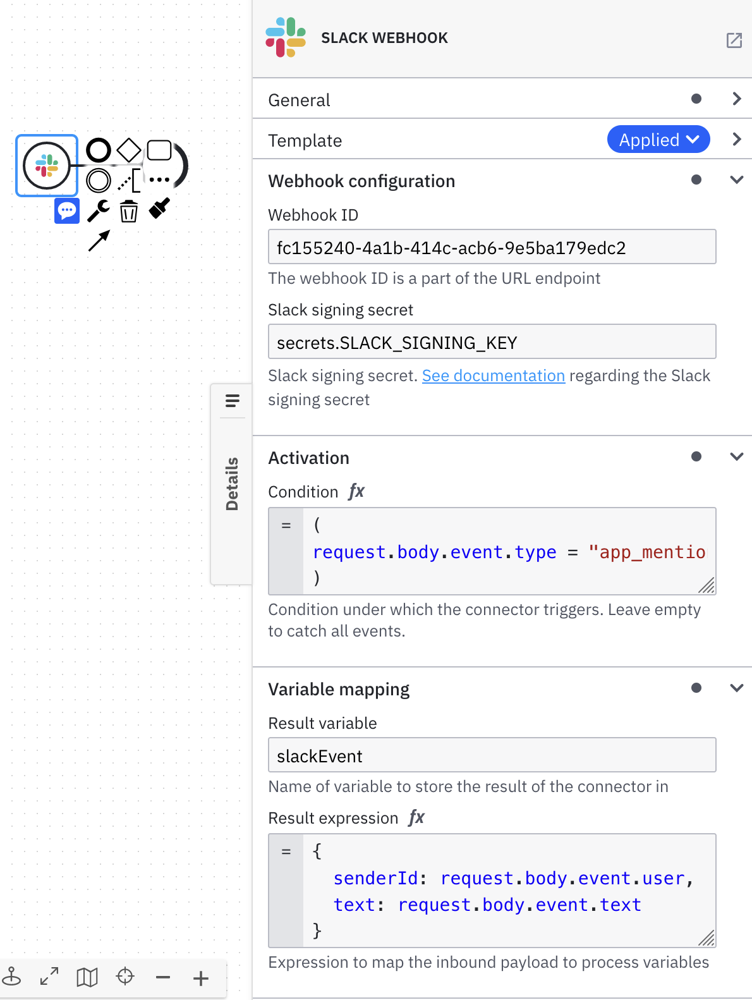
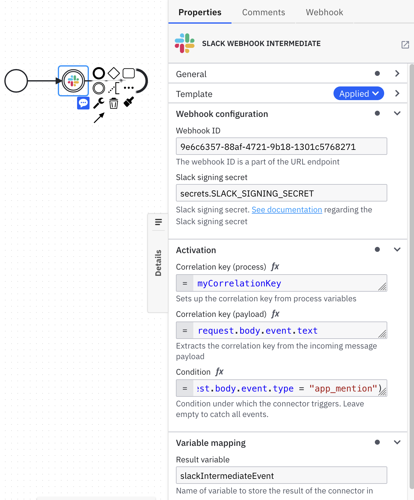

The **Slack Inbound Connector** is a Connector that allows you to start or continue
a BPMN process triggered by a [Slack](https://slack.com/) message.

## Create a Slack Inbound Connector task

1. Start building your BPMN diagram. You can use the **Slack Inbound Connector** with either a **Start Event** or **Intermediate Catch Event**.
2. Select the applicable element and change its template to an **Slack Inbound Connector**.
3. Fill in all required properties.
4. Complete your BPMN diagram.
5. Deploy the diagram to activate the webhook.
6. Navigate to the **Webhooks** tab in the properties panel to see the webhook URL.

## Make your Slack Inbound Connector for receiving notifications executable





1. In the **Webhook Configuration** section, configure the **Webhook ID**. By default, **Webhook ID** is pre-filled with a random value. This value will be a part of the Slack event subscription or slash command URL.
2. In the **Webhook Configuration** section, configure the **Slack signing secret**. This value is unique to your Slack application and used to validate a Slack payload integrity. Read more about signing secret at the [official Slack documentation page](https://api.slack.com/authentication/verifying-requests-from-slack).
3. In the section **Activation**, configure **Condition** when the Slack event or command can trigger a new BPMN process. The following example will trigger a new BPMN process for every `app_mention` Slack event type: `=(request.body.event.type = "app_mention")`.
4. In the section **Variable mapping** fill the field **Result variable** to store the response in a process variable. For example, `myResultVariable`.
5. In the section **Variable expression** fill the field to map specific fields from the response into process variables using [FEEL](/components/modeler/feel/what-is-feel.md).
   The following example will extract both Slack message sender ID and text from Slack `app_mention` event: `={senderId: request.body.event.user, text: request.body.event.text}`.

When using the **Slack Inbound Connector** with an **Intermediate Catch Event**, fill in the **Correlation key (process)** and **Correlation key (payload)**.

- **Correlation key (process)** is a FEEL expression that defines the correlation key for the subscription. This corresponds to the **Correlation key** property of a regular **Message Intermediate Catch Event**.
- **Correlation key (payload)** is a FEEL expression used to extract the correlation key from the incoming message. This expression is evaluated in the Connector Runtime and the result is used to correlate the message.

For example, given that your correlation key is defined with `myCorrelationKey` process variable, and the request body contains `"event": {"text": "12345"}`, your correlation key settings will look like this:

- **Correlation key (process)**: `=myCorrelationKey`
- **Correlation key (payload)**: `=request.body.event.text`

Learn more about correlation keys in the [messages guide](../../../concepts/messages).

## Activate the Slack Inbound Connector by deploying your diagram

Once you click the **Deploy** button, your **Slack Inbound Connector** will be activated and publicly available.

URLs of the exposed **Slack Inbound Connector** adhere to the following pattern:

`https://<base URL>/inbound/<webhook ID>`

- `<base URL>` is the URL of Connectors component deployment. When using the Camunda Platform 8 SaaS offering, this will typically contain your cluster region and cluster ID.
- `<webhook ID>` is the ID (path) you configured in the properties of your **Slack Inbound Connector**.

If you make changes to your **Slack Inbound Connector** configuration, you need to redeploy the BPMN diagram for the changes to take effect.

When you click on the event with **Slack Inbound Connector** applied to it, a new **Webhooks** tab will appear in the properties panel.
This tab displays the URL of the **Slack Inbound Connector** for every cluster where you have deployed your BPMN diagram.

:::note
The **Webhooks** tab is only supported in Web Modeler as part of the Camunda Platform 8 SaaS offering.
You can still use Slack Inbound Connector in Desktop Modeler, or with your Camunda Platform 8 Self-Managed.
In that case, Slack Inbound Connector deployments and URLs will not be displayed in Modeler.
:::

## Wiring with Slack

### Events API

This is a simplified guide. For full guide, please refer to the [official Slack documentation](https://api.slack.com/apis/connections/events-api).

1. Make sure you have sufficient permissions to modify your Slack application.
2. Open [Slack API portal](https://api.slack.com) and select your Slack application.
3. Navigate to _Event Subscription_ page.
4. Click on _Enable Events_ button.
5. In the _Request URL_ field put the webhook URL. You can find it at the _Webhook_ tab in the properties panel of you BPMN diagram.
6. Make sure that the _Request URL_ indicates that endpoint is _Verified_. This process may take several seconds.
7. Click on _Subscribe to bot events_.
8. Select all events you wish to receive. **Note:** some messages may produce several events. For example, a message `@YourBot test` will generate both `app_mention` and `message` events.
9. Click _Save_ to apply new changes.
10. Install or re-install your app into your workspace.

### Slash commands

This is a simplified guide. For full guide, please refer to the [official Slack documentation](https://api.slack.com/interactivity/slash-commands).

1. Make sure you have sufficient permissions to modify your Slack application.
2. Open [Slack API portal](https://api.slack.com) and select your Slack application.
3. Navigate to _Slash Commands_.
4. Click on _Create New Command_.
5. Fill the fields _Command_, _Short Description_, and _Usage Hint_ as you prefer.
6. In the _Request URL_ field put the webhook URL. You can find it at the _Webhook_ tab in the properties panel of you BPMN diagram.
7. Click _Save_ to apply new changes.

## Security considerations

### Integrity

Each Slack message is signed with HMAC using Slack signing key. The **Slack Inbound Connector** verifies HMAC integrity
for every incoming request. Read more about signing secret at the
[official Slack documentation page](https://api.slack.com/authentication/verifying-requests-from-slack).

## Appendix

### Slack `app_mention` event example

```
POST https://<base URL>/inbound/<webhook ID>

connection: close
content-type: application/json
content-length: 429
x-slack-request-timestamp: 1687791117
x-slack-signature: v0=aaaaaaaabbbbbbbbcccccccddddddeeeeeeffffffff
accept: application/json,*/*
accept-encoding: gzip,deflate
user-agent: Slackbot 1.0 (+https://api.slack.com/robots)
host: <base URL>

{
   "token": "XXXXXXXX",
   "team_id": "XXXXXXXX",
   "api_app_id": "XXXXXXXX",
   "event": {
      "client_msg_id": "ffb7ded2-6f55-468d-926f-cad3195c8056",
      "type": "app_mention",
      "text": "<@XXXXXXXX> say hello",
      "user": "XXXXXXXX",
      "ts": "11111111.2222222",
      "blocks": [
         {
            "type": "rich_text",
            "block_id": "rarsi",
            "elements": [
               {
                  "type": "rich_text_section",
                  "elements": [
                     {
                        "type": "user",
                        "user_id": "XXXXXXXX"
                     },
                     {
                        "type": "text",
                        "text": " say hello"
                     }
                  ]
               }
            ]
         }
      ],
      "team": "XXXXXXXX",
      "thread_ts": "1687864866.335329",
      "parent_user_id": "XXXXXXXX",
      "channel": "XXXXXXXX",
      "event_ts": "1687866358.496959"
   },
   "type": "event_callback",
   "event_id": "XXXXXXXX",
   "event_time": 1687866358,
   "authorizations": [
      {
         "enterprise_id": null,
         "team_id": "XXXXXXXX",
         "user_id": "XXXXXXXX",
         "is_bot": true,
         "is_enterprise_install": false
      }
   ],
   "is_ext_shared_channel": false,
   "event_context": "XXXXXXXX"
}
```

### Slack slash command example

Given the following command is executed: `/test123 test`.

```
POST https://<base URL>/inbound/<webhook ID>

connection: close
content-type: application/x-www-form-urlencoded
content-length: 429
x-slack-request-timestamp: 1687792480
x-slack-signature: v0=aaaaaaaabbbbbbbbcccccccddddddeeeeeeffffffff
accept: application/json,*/*
accept-encoding: gzip,deflate
user-agent: Slackbot 1.0 (+https://api.slack.com/robots)
host: <base URL>

token=qQqQqQqQqQqQqQqQqQ
&team_id=T05ABCDEFG
&team_domain=yourdomain
&channel_id=C05QQQQQQ
&channel_name=channel1
&user_id=U05AAAAAAA
&user_name=your.user
&command=%2Ftest123
&text=test
&api_app_id=A05DDDDDDD
&is_enterprise_install=false
&response_url=https%3A%2F%2Fhooks.slack.com%2Fcommands%2FXXXXXXXXX%2FYYYYYYYYYYY%2FZZZZZZZZ
&trigger_id=111111111.222222222.33333333
```
