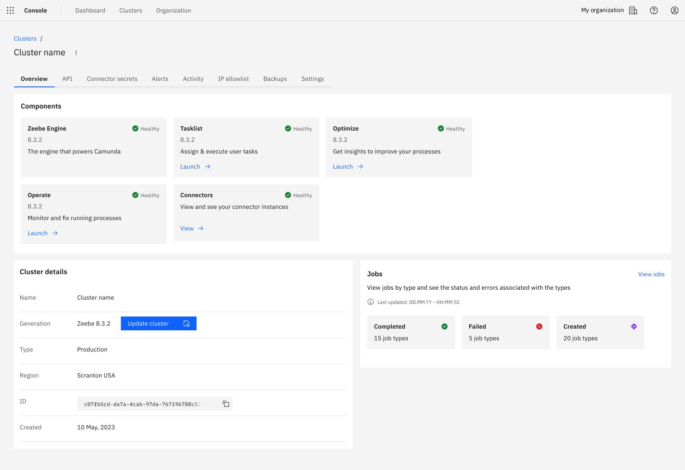
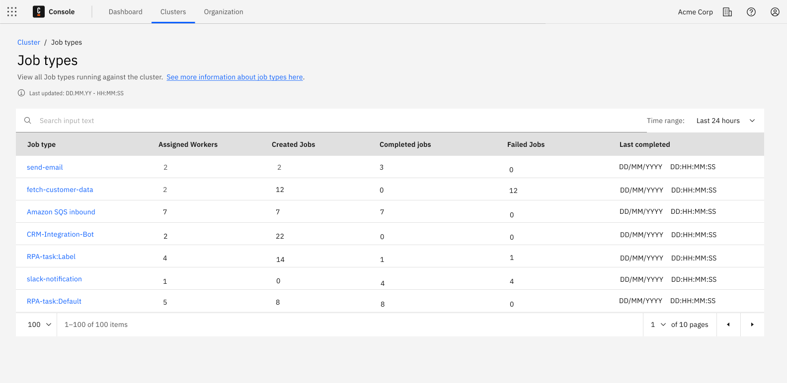
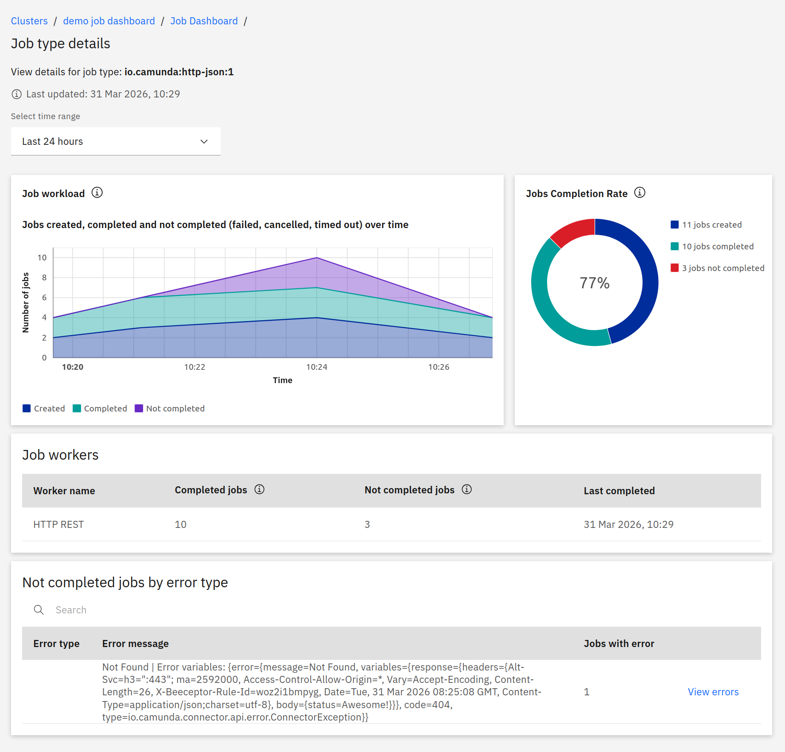

Use the job dashboard to see which job types are active, how many jobs are created, completed, and failed, and which job workers are involved.

## Availability and permissions

The job dashboard is available for clusters running Camunda 8.9+.

For Software as a Service (SaaS):

- Available for clusters running Camunda 8.9+.
- Camunda manages the underlying job metrics configuration for you.
- If the **Jobs** card is missing or shows **Access restricted**, check that your user has permission to view job metrics in Camunda Hub. If the issue persists, contact your organization owner or Camunda Support.

For Self-Managed:

- Requires Camunda 8.9+ (Zeebe and Camunda Hub).
- Configure job metrics in the engine configuration (`camunda.monitoring.metrics.job-metrics.*`). These options and their default values are available in the auto-generated `defaults.yaml` file and the Helm values.
- If the **Jobs** card is missing or shows **Access restricted**, verify that:
  - The cluster is running Camunda 8.9+.
  - Job metrics are enabled in the engine configuration.
  - Camunda Hub can connect to the cluster.
  - Your user has permission to view job metrics.

:::info
Camunda Hub is introduced in 8.10. If you're using 8.9, refer to [that version's documentation, which uses Camunda 8 Console](/versioned_docs/version-8.9/components/console/job-dashboard/job-dashboard.md).
:::

Access control:

- The global `READ_JOB_METRICS` permission is the only Camunda Hub permission required to use the job dashboard.
- Operate permissions are still required to view underlying instances when you click **View errors**.

## When to use the job dashboard

With the job dashboard, you can:

- Check whether jobs flow through the system (created, completed, failed) for each job type.
- See which job workers process a given job type and how many jobs they handle.
- Investigate error patterns for a job type before drilling into individual process instances in Operate.
- Avoid building and maintaining custom job-monitoring dashboards.

## Open the job dashboard

### 1. Open the Jobs overview

1. In Camunda Hub, go to **Clusters**.
2. Select a cluster.
3. On the **Overview** tab, locate the **Jobs** card.
4. Click **View jobs** to open the **Job types** page.

### 2. Job types overview

The **Job types** page shows all job types running against the selected cluster.

Key elements:

- **Last updated** timestamp (based on statistics responses).
- **Search** box to filter job types.
- **Time range** selector (for example, **Last 24 hours**) that controls all metrics on the page.
- Table columns:
  - **Job type**
  - **Assigned workers**
  - **Created jobs**
  - **Completed jobs**
  - **Not completed jobs**
  - **Last completed**

If the selected date range hits internal limits, Camunda Hub shows a warning that not all data is displayed. Narrow the time range to see a more complete view.

Job metrics are stored internally in the engine and exported in batches every five minutes. As a result, metrics in the UI can be delayed by up to five minutes.

Configuration limits protect the system and include:

- Maximum string lengths for job type, job worker, and tenant ID
- Maximum number of unique keys (jobType × tenantId × job worker combinations)

If a limit is exceeded, the batch is marked as incomplete, and the UI shows the **Data loading limit reached** warning.

In this case:

- Narrow the time range to reduce the amount of data
- Filter by job type to focus on a smaller subset
- In Self-Managed environments, adjust configuration limits if needed

Treat the counts as partial for the affected time range.

To drill down into a specific job type, click its **Job type** link (for example, `send-email`).

## Job type details

The **Job type details** page shows metrics and errors for a single job type.

### Job workload

The **Job workload** chart shows how many jobs were **created**, **completed**, and **failed** over time for the selected job type and time range. Failed counts include jobs that ended in an error state (error thrown, failed, or timed out). Canceled, migrated, or retry-update-only states are not counted.

### Job completion rate

The **Job completion rate** donut chart shows three groups for the selected time range:

- **Created**: All jobs created, regardless of whether they are still running, completed, or failed.
- **Completed**: Jobs that have finished executing successfully.
- **Failed**: Jobs that ended in an error state (error thrown, failed, or timed out). Multiple failed attempts for the same job are counted separately. Canceled or migrated jobs are not included.

Use this chart to see at a glance whether most jobs finish successfully or many end in a failed state.

### Job workers table

The **Job workers** table shows which job workers processed this job type and how many jobs they handled:

- **Worker name**
- **Created jobs**
- **Completed jobs**
- **Last completed**

Use this table to see which job workers are active and whether failures are concentrated on specific job workers.

### Failed jobs by error type

The **Failed jobs by error type** table groups failed jobs by error so you can quickly see the most common problems:

- Search by error type or message.
- Columns:
  - **Error type**
  - **Error message**
  - **Jobs with error**

Click **View errors** to open related instances in **Operate**, with the **Error Message** filter prefilled so you see only instances that failed with that error.

## Empty states and access restrictions

### No jobs in the queue

If there are no jobs for the cluster or selected time range, the Jobs page shows:

- Heading: **No jobs in the queue**
- Message: **No jobs found.**
- Link: **Learn more about Jobs and Job Workers**

This means there is no job activity to display.

### Jobs card access restricted

If the feature is disabled for the cluster or you don't have permission, the **Jobs** card on the cluster overview shows:

- Status: **Access restricted**
- Message explaining that the feature is restricted or disabled and you must contact an administrator.
- Link: **Learn more about roles and restrictions**

### Missing permissions when viewing errors

If you click **View errors** but lack permissions in Operate, you may see messages like:

- **Missing permissions to view the Definition**
- **Missing permissions to access Instance History**
- **Missing permissions to access Variables**

In this case, contact your organization owner or admin to request the necessary Operate permissions.

## SaaS vs Self-Managed

The Camunda Hub UI and flows are the same in SaaS and Self-Managed.

- **SaaS:** The job dashboard is available for Camunda 8.9+ clusters. Camunda manages the underlying job metrics configuration.
- **Self-Managed:** You enable and configure job metrics in the engine and Helm charts. For details on available options and defaults, see the job metrics [configuration reference](../../../self-managed/components/orchestration-cluster/core-settings/configuration/properties.md).
