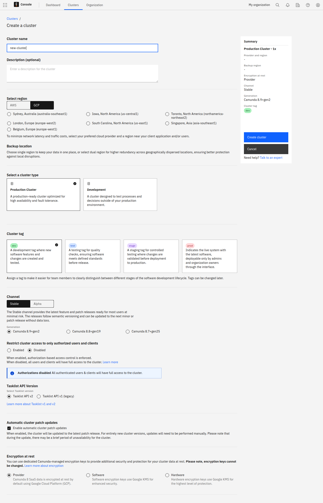
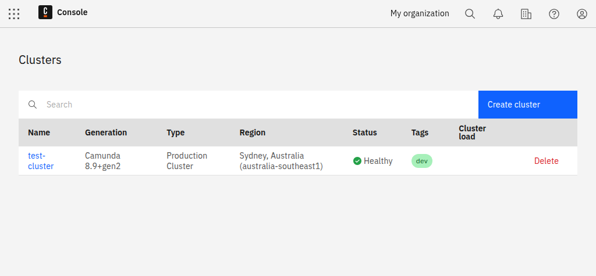

---
---

To deploy and run your process, you must create a [cluster](/components/concepts/clusters.md) in Camunda 8.

1. To create a cluster, navigate to **Console**, click the **Clusters** tab, and click **Create new cluster**.
1. Name your cluster.
1. Select a [cluster type](/components/concepts/clusters.md#cluster-type) and [cluster size](/components/concepts/clusters.md#cluster-size).
1. Assign a cluster tag to indicate what type of cluster it is.
1. Select your [region](/components/saas/regions.md).
1. Select your [encryption at rest protection level](/components/saas/encryption-at-rest.md) (enterprise only).
1. Select a channel and release. For the purpose of this guide, we recommend using the **Stable** channel and the latest generation.
1. If you are using a generation of version 8.8 or higher, select if you want to enable [authorization-based access control](/components/concepts/access-control/authorizations.md).
1. Click **Create cluster**.
1. Your cluster will take a few moments to create. Check the status on the **Clusters** page or by clicking into the cluster itself and looking at the **Applications** section.

:::note

- If you haven't created a cluster yet, the **Clusters** page will be empty.
- You can start modeling even if the cluster shows a **Creating** status.

:::

1. After creating the cluster, you can view the new entry in the **Clusters** tab:

   

2. The cluster is now being set up. During this phase, its state is **Creating**. After one or two minutes, the cluster is ready for use and changes its state to **Healthy**:

   

3. After the cluster is created, click on the cluster name to visit the cluster detail page.

## Tag your cluster

You can tag your cluster for `dev`, `test`, `stage`, or `prod`.

- Assigning a tag makes it easier for team members to clearly distinguish between different stages of the software development lifecycle.
- Tags have no impact on performance and can be changed later in the cluster details section of the cluster overview page.
- [Authorization-based access control](/components/concepts/access-control/authorizations.md) is disabled by default for `dev` and `test` clusters, and enabled for `stage` and `prod` clusters. You can change this setting during and after cluster creation.

See [Clusters](/components/concepts/clusters.md) for more details.
