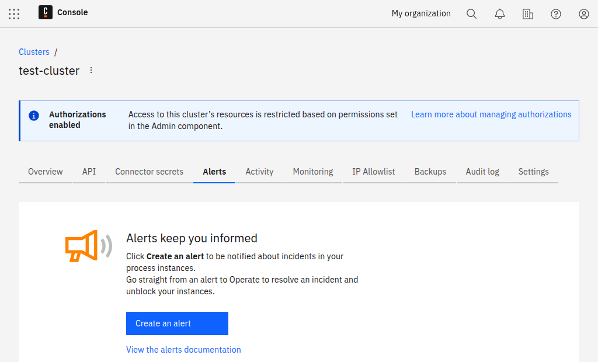
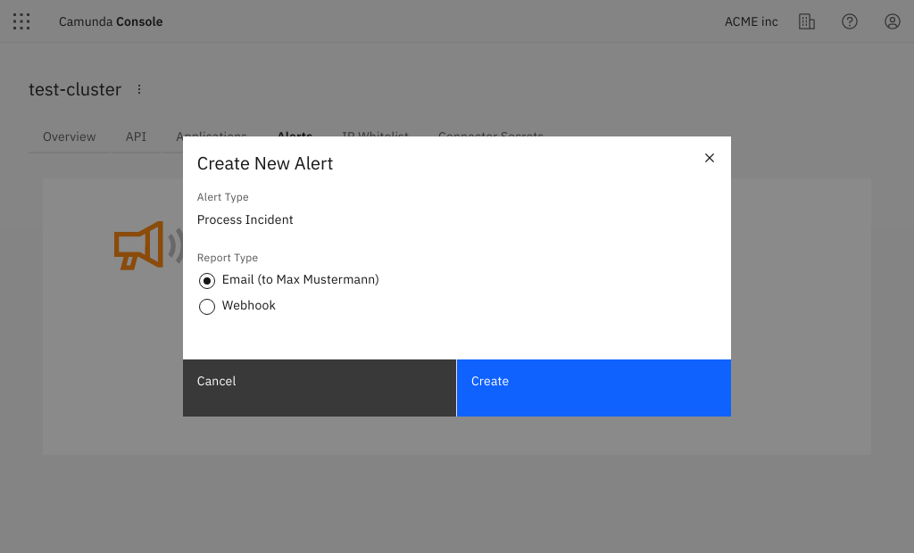

Camunda 8 can notify you when process instances stop with an error.

There are two forms of notification:

- By email to the email address of your user account
- By webhook

## Create an alert

To create a new alert, take the following steps:

1. Click on your cluster and select the **Alerts** tab.



2. Click **Create an alert**.



3. Choose between **Email** and **Webhook**.

4. If you select **Email**, click **Create**. No further information is needed. For **Webhook**, complete the additional steps below.

5. To create a webhook alert, provide a valid webhook URL that accepts `POST` requests.

If your webhook requires [HMAC authentication](https://www.okta.com/identity-101/hmac/), you can specify an HMAC secret. The SHA-256 hash of the request body will then be generated using your HMAC secret, and it is included it in the HTTP header `X-Camunda-Signature-256` each time we send out a webhook alert to your endpoint.

You will have one email alert per cluster, but you can create multiple webhook alerts if needed.

## Webhook alerts

Webhook alerts contain a JSON body with following structure:

```json
{
  "clusterName": "cluster-name",
  "clusterId": "88d32bfc-4f8e-4dd3-9ae2-adfee281e223",
  "operateBaseUrl": "https://console.camunda.io/org/2b3bc239-ad5b-4eef-80e0-6ef5139ed66a/cluster/88d32bfc-4f8e-4dd3-9ae2-adfee281e223/operate",
  "clusterUrl": "https://console.camunda.io/org/2b3bc239-ad5b-4eef-80e0-6ef5139ed66a/cluster/88d32bfc-4f8e-4dd3-9ae2-adfee281e223",
  "alerts": [
    {
      "operateUrl": "https://console.camunda.io/org/2b3bc239-ad5b-4eef-80e0-6ef5139ed66a/cluster/88d32bfc-4f8e-4dd3-9ae2-adfee281e223/operate/#/instances/2251799829404548",
      "processInstanceId": "1234567890123456",
      "errorMessage": "something went wrong",
      "errorType": "JOB_NO_RETRIES",
      "flowNodeId": "node-id",
      "jobKey": 1234567890123456,
      "creationTime": "2021-07-22T08:00:00.000+0000",
      "processName": "process-name",
      "processVersion": 1
    }
  ]
}
```
