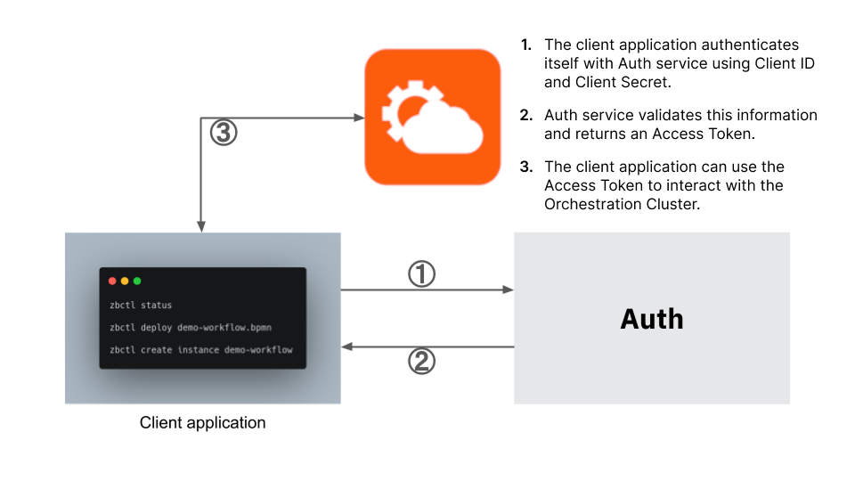
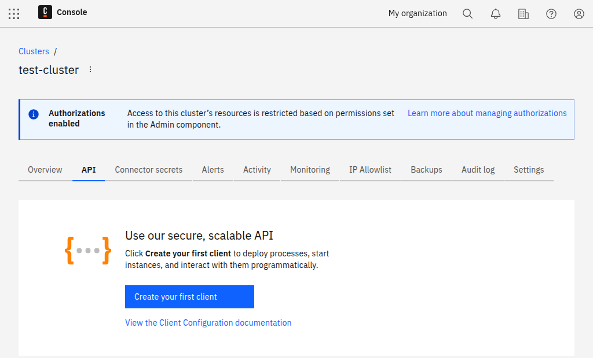
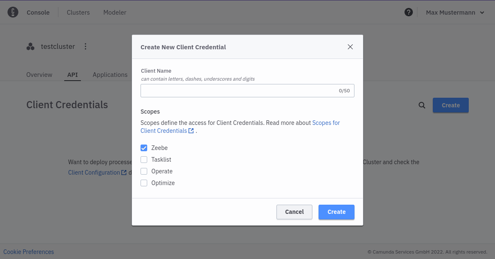
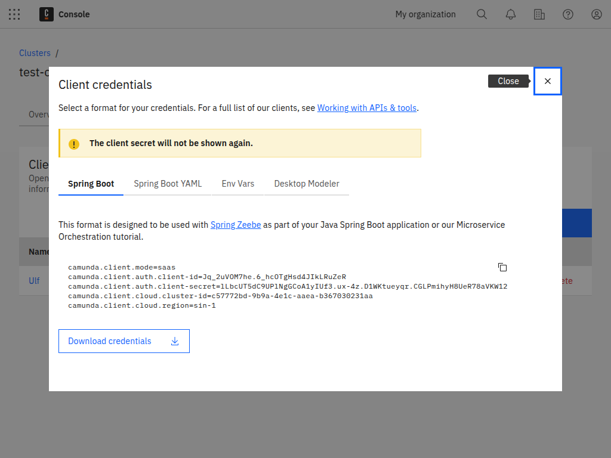

To interact with Zeebe in the cloud from the outside, every client application must authenticate itself. An **OAuth Flow** is therefore used for authentication:

The application authenticates itself with OAuth service using `Client Id` and `Client Secret`, OAuth service validates this information and returns an access token, and the application can then use this access token to interact with Zeebe in the cloud.

The client configuration is shown at the bottom of the cluster detail view. Create a new client and all necessary information is displayed.

For the `Client Id` and `Client Secret`, a client application can request an access token at the authentication URL (**Steps 1 and 2**). The access token is necessary to interact with Zeebe in the cloud (**Step 3**).

:::note
Access tokens have a validity period that can be found in the access token. After this time, a new access token must be requested.
:::

## Rate limiting

The OAuth service rate limits about one request per second for all clients with the same source IP address.

:::note
All token requests count toward the rate limit, whether they are successful or not. If any client is running with an expired or invalid API key, that client will continually make token requests. That client will therefore exceed the rate limit for that IP address, and may block valid token requests from completing.
:::

The officially offered [client libraries](/apis-tools/working-with-apis-tools.md) (as well as the Node.js and Spring clients) have already integrated with the auth routine, handle obtaining and refreshing an access token, and make use of a local cache.

If too many token requests are executed from the same source IP address in a short time, all token requests from that source IP address are blocked for a certain time. Since the access tokens have a 24-hour validity period, they must be cached on the client side, reused while still valid, and refreshed via a new token request once the validity period has expired.

When the rate limit is triggered, the client will receive an HTTP 429 response. Note the following workarounds:

- Cache the token as it is still valid for 24 hours. The official SDKs already do this by default.
- Keep the SDK up to date. We have noted issues in older versions of the Java SDK which did not correctly cache the token.
- Given the rate limit applies to clients with the same source IP address, be mindful of:
  - Unexpected clients running within your infrastructure.
  - Updating all clients to use a current API key if you delete an API key and create a new one.

## Create a client

:::caution
With **8.7** clusters, the client scopes are now managed through the [Identity](/components/identity/manage-api-clients.md) component. The only scope still managed in Console is the cluster **Secrets** scope. To learn more about managing clients in **8.7** clusters, refer to the [Identity](/components/identity/manage-api-clients.md) documentation.
:::

Currently, Camunda 8 SaaS supports the following scopes:

- Zeebe - Access to the [Zeebe gRPC](/apis-tools/zeebe-api/grpc.md) and [REST](/apis-tools/camunda-api-rest/camunda-api-rest-overview.md) APIs.
- Tasklist - Access to the [Tasklist GraphQL](/apis-tools/tasklist-api/tasklist-api-overview.md) API.
- Operate - Access to the [Operate REST API](/apis-tools/operate-api/overview.md).
- Optimize - Access to the [Optimize REST API]($optimize$/apis-tools/optimize-api/overview).
- Secrets - Access cluster secrets in a [hybrid setup](/guides/use-connectors-in-hybrid-mode.md).

To create a client, take the following steps:

1. Navigate into the **API** tab.

2. Click **Create new client** to create a new client and name your client accordingly.

:::note
Ensure you keep the generated client credentials in a safe place. The **client secret** will not be shown again. For your convenience, you can also download the client information to your computer.
:::

The downloaded file contains all necessary information to communicate with your Zeebe instance in the future:

- `ZEEBE_ADDRESS`: Address where your cluster can be reached.
- `ZEEBE_CLIENT_ID` and `ZEEBE_CLIENT_SECRET`: Credentials to request a new access token.
- `ZEEBE_AUTHORIZATION_SERVER_URL`: A new token can be requested at this address.
- `ZEEBE_TOKEN_AUDIENCE`: The audience for a Zeebe token request.
- `CAMUNDA_CLUSTER_ID`: The UUID of the cluster.
- `CAMUNDA_CLUSTER_REGION`: The region of the cluster.
- `CAMUNDA_CREDENTIALS_SCOPES`: A comma-separated list of the scopes this credential set is valid for.
- `CAMUNDA_OAUTH_URL`: A new token can be requested at this address using the credentials. Duplicates the earlier Zeebe-focused variable.

Depending on the scopes granted to these client credentials, the following variables may also be present:

- `CAMUNDA_TASKLIST_BASE_URL`: The base URL for the Tasklist API.
- `CAMUNDA_OPTIMIZE_BASE_URL`: The base URL for the Optimize API.
- `CAMUNDA_OPERATE_BASE_URL`: The base URL for the Operate API.
