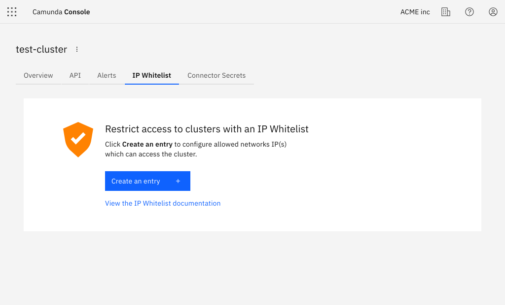
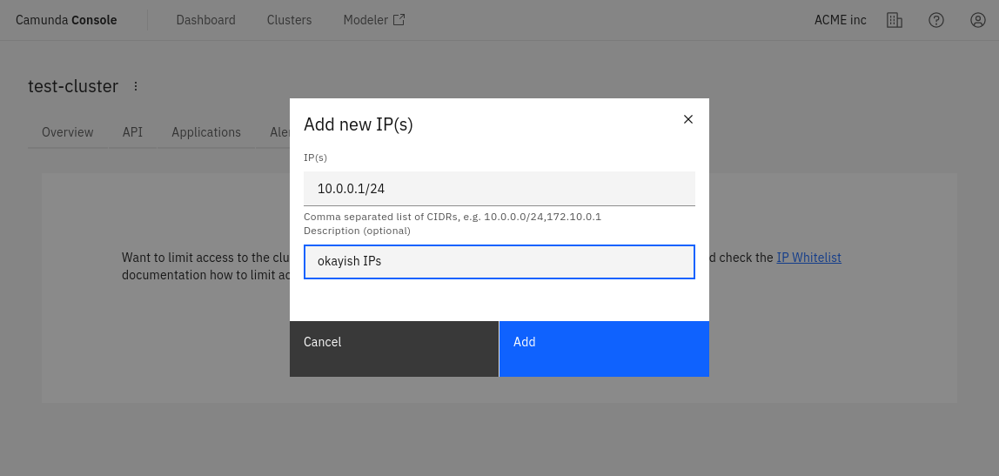

If your organization works within Camunda's [Enterprise](https://camunda.com/enterprise/) plan, you can restrict access to clusters with an IP whitelist.

## Create an IP whitelist

To create an IP whitelist, take the following steps:

1. Select the **IP Whitelist** tab.

2. Click **Create an entry** to create an IP Whitelist.

3. Enter a list of IPs or CIDR blocks separated by commas.

4. Enter an optional description for the Whitelist.
