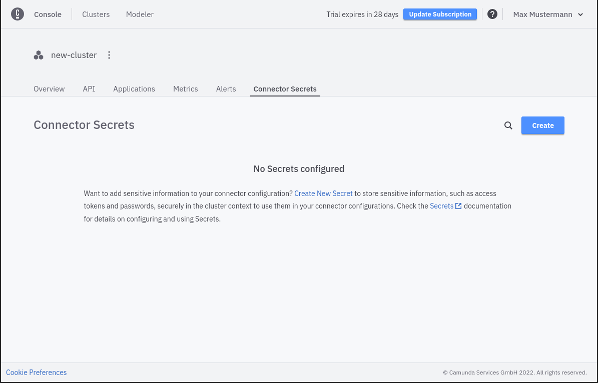
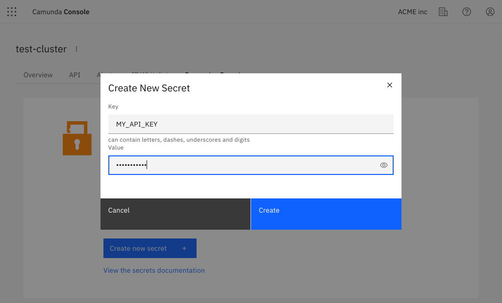
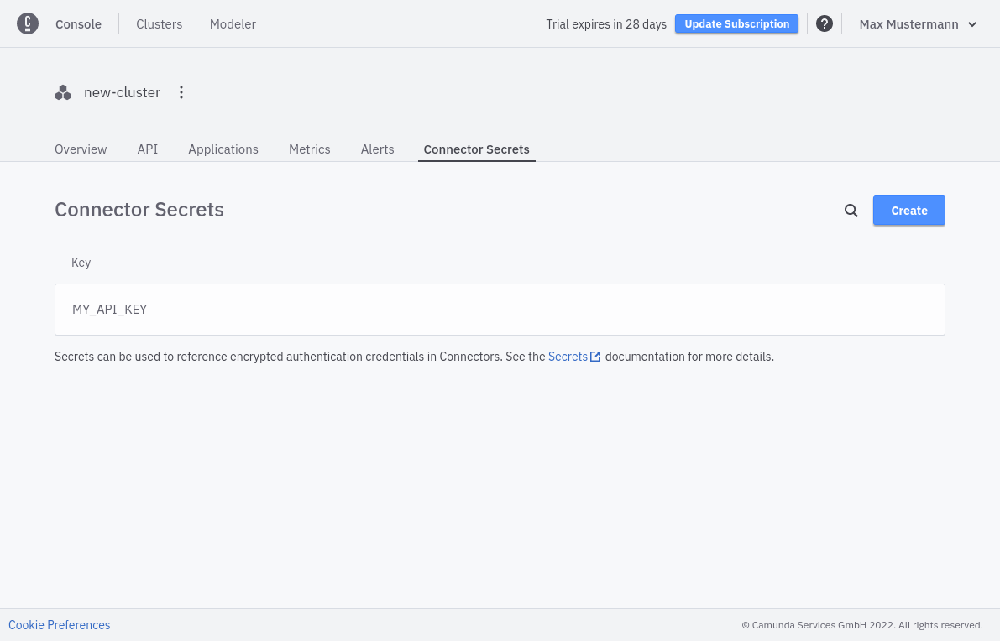

Create secrets and reference them in your Connectors without exposing sensitive information in your BPMN processes.

:::caution
**Connector Secrets** are managed at the cluster level, so ensure you deploy your processes to the cluster that contains the necessary secrets.
If you deploy and the secret is missing, Operate will show an incident.
:::

To create a new secret, go to your cluster and take the following steps:

1. Select the **Connector Secrets** tab.

1. Click **Create**.
2. Provide a **Key** for your secret that you will use to reference your secret from your Connector.
3. Provide the **Secret** that will be assigned to the **Key**.

4. Click **Create** and view your new secret in the list.

Now you can reference your secret in any Connector as described in the [Connectors guide](../../connectors/use-connectors.md#using-secrets).

:::note
Looking for information on managing [Connector secrets](/self-managed/connectors-deployment/connectors-configuration.md) in Self-Managed?
:::
