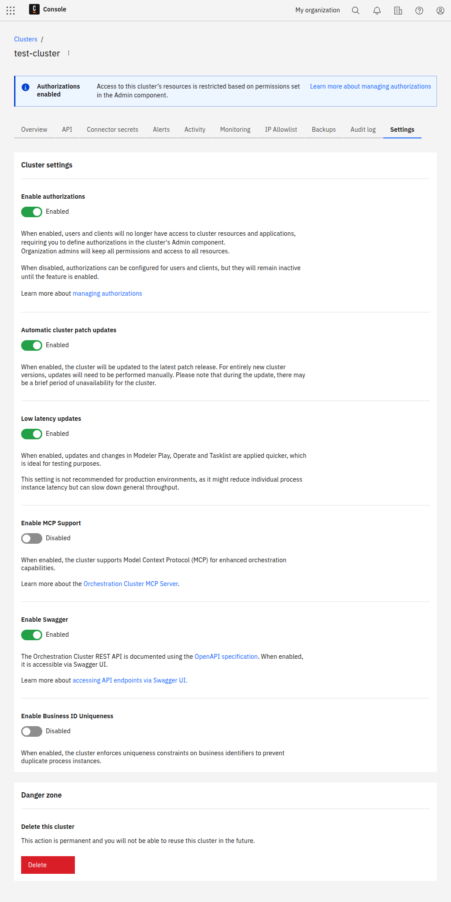

Manage your cluster settings using authorizations, automatic cluster updates, and user task restrictions, or permanently delete the cluster.

## Manage cluster settings

To manage your cluster settings:

1. Navigate to **Console**, and select the **Clusters** tab.
2. Select the cluster you want to manage, and select the **Settings** tab.
3. Enable/disable cluster settings as required, or delete the cluster.

## Authorizations

You can enable authorizations on a per-cluster basis to control the level of access users and clients have over Orchestration Cluster resources.

- Enable this setting to use [authorizations](/components/concepts/access-control/authorizations.md) in the cluster.
- Disable this setting if you do not want to use authorizations in the cluster. You can still configure authorizations in the Orchestration Cluster Identity, but they are only applied to cluster when you enable this setting.

:::tip
For more information, see [authorizations](/components/concepts/access-control/authorizations.md).
:::

## Automatic cluster updates

You can set the cluster to automatically update to newer versions of Camunda 8 when they are released.

- Enable this setting to automatically update the cluster when a new patch release is available. During an update, the cluster may be unavailable for a short time. You can still manually update the cluster.
- Disable this setting if you do not want the cluster to automatically update. You must manually update the cluster.

:::tip
For more information on updating clusters, see [update your cluster](/components/console/manage-clusters/manage-cluster.md#update-a-cluster).
:::

## Enforce user task restrictions

You can enable user task access restrictions in the cluster to restrict Tasklist task access to assigned/candidate users and groups.

:::info
User task access restrictions are only supported with the Tasklist v1 API. For more information, see the documentation on [Tasklist API versions](../../tasklist/api-versions.md#user-task-access-restrictions-and-the-tasklist-api).
:::

- Enable this setting to use user task access restrictions in the cluster. Tasks assigned to users or candidate groups are only visible to assigned users or respective group members.
- Disable this setting if you do not want to use user task access restrictions in the cluster. Any user can see any task, regardless of the assignment. Use this mode in development environments to test assignment rules.

Changes to this setting can take a few minutes to be applied, as it requires a Tasklist restart.

:::tip
For more information on user task access restrictions, see [user task access restrictions](/components/concepts/access-control/user-task-access-restrictions.md).
:::

## Delete this cluster

You can _permanently_ delete the selected cluster. See [delete your cluster](/components/console/manage-clusters/manage-cluster.md#delete-a-cluster).

:::caution
Deleting a cluster is permanent. You cannot reuse a cluster after it has been deleted.
:::
