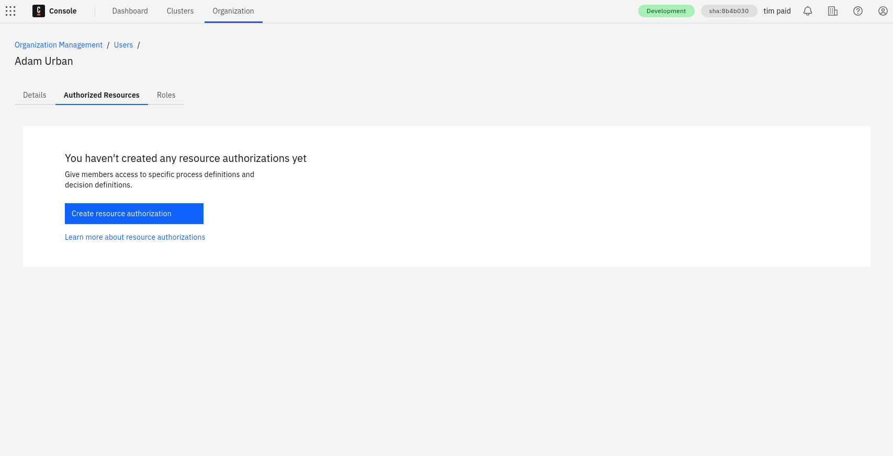
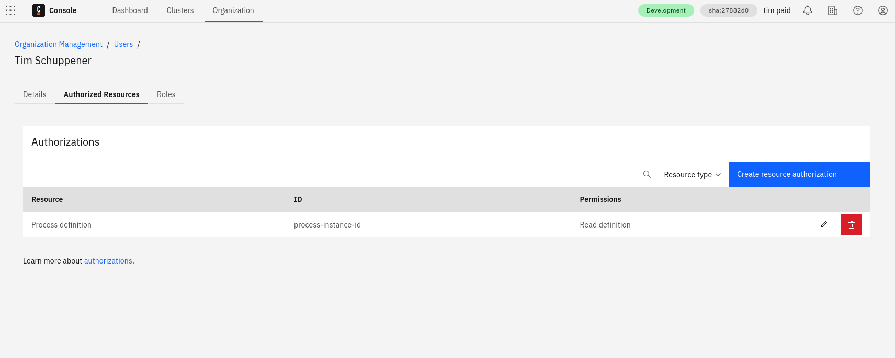

When a user signs up for Camunda 8 as the first user from their organization, company, or group, they become the owner of the Camunda organization. This organization owns Modeler files and Zeebe clusters. The owner and any admins they assign can control access to these resources through managing their organization.

## Users

An owner has all rights in an organization and can manage all settings accordingly. An organization cannot have more than one owner.

To change the owner of the organization, utilize the user administration. The current owner selects another member of the organization, and selects **Assign as owner** from the menu. In the dialog that appears, select which new roles are to be assigned to the current owner.

### Roles and permissions

In addition to the owner, the **Admin** role is available as a second role with comprehensive rights.

The admin role has full access to the platform, process resources, and clusters, but cannot manage other admins.

The following roles are additionally available, providing dedicated rights for specific elements in Camunda 8:

- **Modeler**: Access to Web Modeler for creating and collaborating on projects, except permissions to deploy and run processes. Read-only access to Console.
- **Analyst**: Includes Modeler permissions and has full access to Optimize to build process dashboards and reports.

Starting with version 8.8, user access to clusters is managed independently. To control what a user can access, define their authorizations in the cluster’s Identity. Learn more [here](/components/identity/authorization.md).

If cluster authorizations are disabled, the user will have full access to the cluster and its components.

Users can be assigned multiple roles. For example, a user can have both **Modeler** and **Analyst** roles, giving them access to Web Modeler and Optimize.

Users are invited to a Camunda 8 organization via their email address, which must be accepted by the user. The user remains in the `Pending` state until the invitation is accepted.

People who do not yet have a Camunda 8 account can also be invited to an organization. To access the organization, the invited individual must first create a Camunda 8 account by following the instructions in the invitation email.

## Resource-based authorizations

Resource authorizations control a user’s access to specific resources. To create, update, or delete a user’s resource authorizations, select the user’s row in the users table.

As of 8.8, authorizations for Orchestration Cluster applications (Zeebe, Operate, and Tasklist) are managed as part of the Orchestration Cluster and configured in [Identity](/self-managed/components/orchestration-cluster/identity/overview.md).

### Creation

To initiate the creation flow, click **Create resource authorization**.

### Updating and deleting

To update an existing authorization, click on the **pencil icon** of the relevant row. To delete an existing authorization, click the **trash can** icon.

## User task access restrictions

:::caution Tasklist V1 only
User task access restrictions are supported only by the Tasklist V1 API and are not supported
in Tasklist V2. From Camunda 8.8, Tasklist runs in V2 mode by default.

To continue using user task access restrictions, see
[switching between V1 and V2 modes](components/tasklist/api-versions.md#switching-between-v1-and-v2-modes)
to enable Tasklist V1 mode.

In Tasklist V2, task visibility is controlled by authorization-based access control rather than user task access restrictions. Starting with Camunda 8.9, Tasklist V2 supports:

- Process-level permissions such as `READ_USER_TASK` and `UPDATE_USER_TASK` on the `Process Definition` resource, which allow managers to see and act on all user tasks for a process.

- Task-level permissions on the `USER_TASK` resource type, including `READ`, `UPDATE`, `CLAIM`, and `COMPLETE`.

- Property-based access control using the `assignee`, `candidateUsers`, and `candidateGroups` task properties, so task workers can only see or work on tasks where they are involved.

For more information about the differences between V1 and V2 and how authorizations work, see
[Tasklist API versions](components/tasklist/api-versions.md) and
[authorization-based access control](../../concepts/access-control/authorizations.md).
:::

You can control user access to user tasks in Tasklist via [user task access restrictions](components/tasklist/user-task-access-restrictions.md).

For example, if a task has a candidate group named `Team A` and a candidate user named `example`, only the users that belong to `Team A` and the user `example` will have access to the task.

## Limitations

Depending on the plan to be used, the number of users that can be part of an organization varies. If an organization is on a Starter plan, the number of users can be updated via the **Billing** page. There, under **General users**, the number can be increased or decreased.

:::caution Starter plans
The Starter plan is no longer available.

- Existing customers using a Starter plan will need to either upgrade to the Enterprise plan, or move to the Free plan.
- To compare plan features and contact Camunda for advice and an Enterprise plan quote, refer to [Camunda 8 pricing](https://camunda.com/pricing/?utm_source=docs.camunda.io&utm_medium=referral).

:::

## Restrictions

In Enterprise plans, the hostname section of the email address for invites can be restricted to meet your internal security policies. Contact your Customer Success Manager to get this configured according to your needs.
