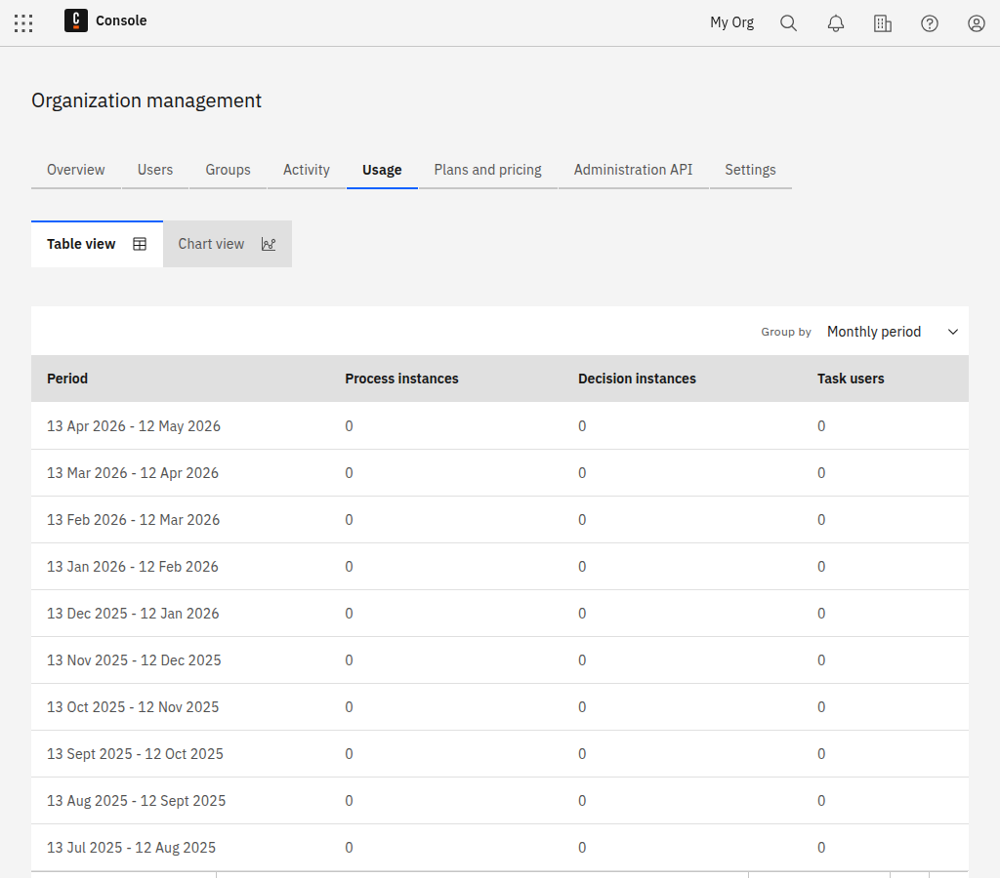

:::note
The usage history is visible only to owners and admins.
:::

Three key metrics play a role in paid plans: the number of started process instances, decision instances, and the number of task users. The **Organization Management** provides a usage view for these metrics across the organization.

**Trial Organizations**

Both metrics are aggregated on a monthly basis and displayed in the **Usage History**.

**Professional and Enterprise Organizations**

The information is available under the **Billing** tab in the section **Usage History**, aggregated on a monthly basis.
