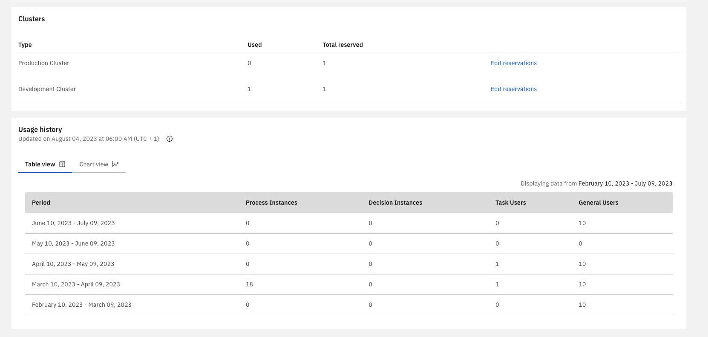

:::note
The usage history is visible only to owners and admins.
:::

Three key metrics play a role in paid plans: the number of started process instances, decision instances, and the number of task users. The **Organization Management** provides a usage view for these metrics across the organization.

## Professional and Enterprise Organizations

The information is available under the **Billing** tab at the bottom section of **Usage History**.

The section is split into two areas:

**Table view**, where the data is displayed aggregated on a monthly basis:

**Chart view**, where the data is displayed in charts and allows a closer look into usage patterns and spikes by customizing the date ranges.

## Trial Organizations

All metrics are aggregated on a monthly basis and displayed in the **Usage History**.

