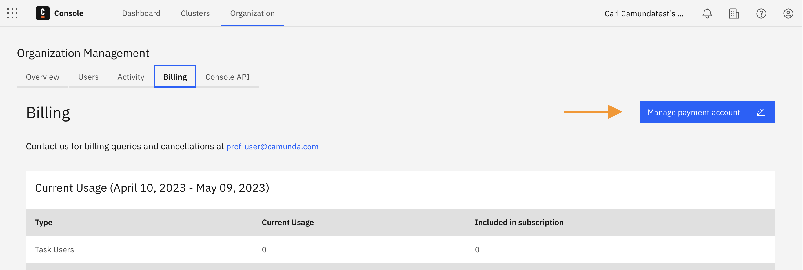

:::note
This setting is only visible in the **Starter plan** (formerly Professional plan) for owners and admins.
:::

To cancel your subscription using Camunda's Starter plan, take the following steps:

1. From the Console, click **Organization > Billing > Manage payment account**.

2. Click on your plan.

3. Click **Cancel subscription** at the bottom of the page.

4. Add a cancelation reason and some feedback and click **Confirm cancelation**. Note that the cancelation date will be the last day of the current billing period.

