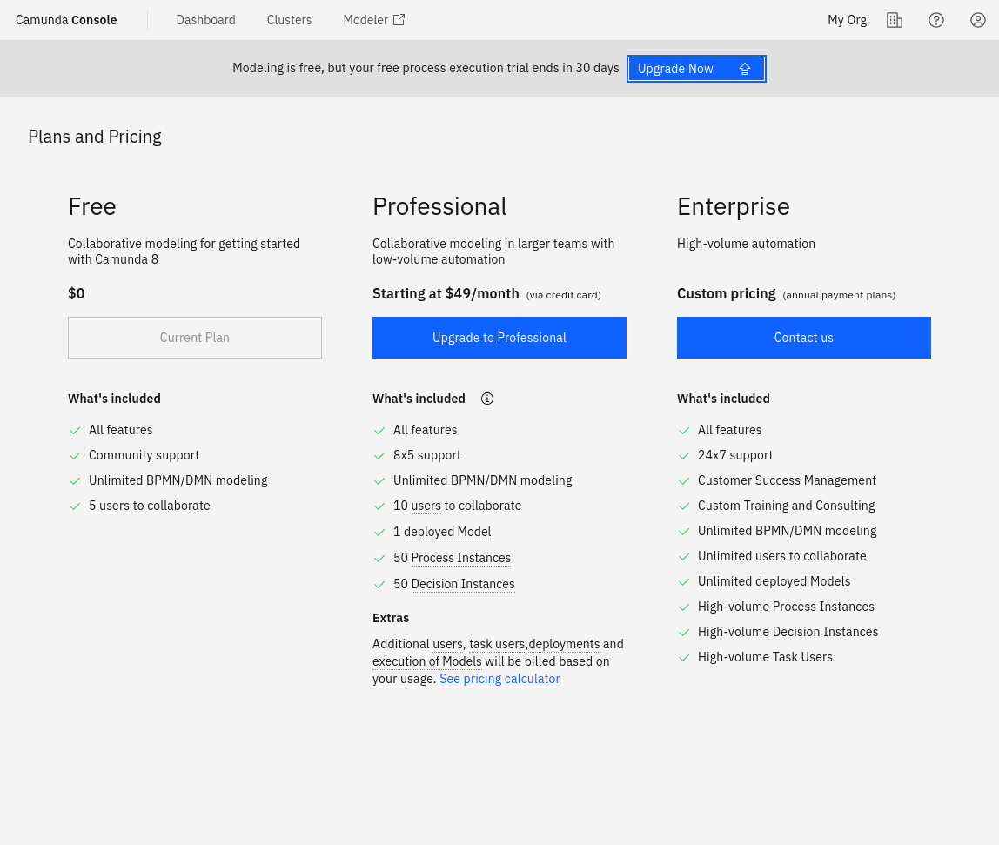

To upgrade to the Enterprise plan, select the Organization management **Plans and pricing** tab, and click **Request quote**.

:::caution Starter plans
The Starter plan is no longer available. 

- Existing customers using a Starter plan will need to either upgrade to the Enterprise plan, or move to the Free plan. 
- To compare plan features and contact Camunda for advice and an Enterprise plan quote, refer to [Camunda 8 pricing](https://camunda.com/pricing/?utm_source=docs.camunda.io&utm_medium=referral).

:::

