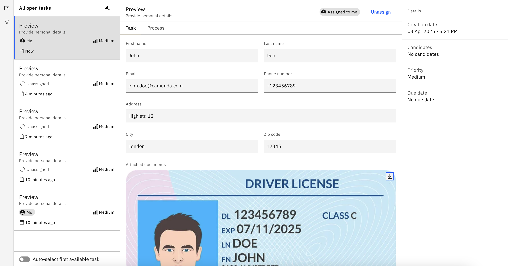

In this section, learn how to build a form for document preview and download, and display and download a document from a user task in Tasklist.

## Build a form for document preview and download

To display and allow downloading of a document you can use the [document preview component](/components/modeler/forms/form-element-library/forms-element-library-document-preview.md) in [forms](/components/modeler/forms/camunda-forms-reference.md). Although this example focuses on [Web Modeler](/components/modeler/web-modeler/launch-web-modeler.md), you can also build a form for document preview and download in [Desktop Modeler](/components/modeler/desktop-modeler/index.md).

:::note
The document preview component offers previews in forms of PDF documents and images as the most common file types. Other document types are supported, but listed without the preview and show the file name with the option to download the file.
:::

In the component's configuration, provide a document reference as an array of document metadata.


For example, an array may look as follows:

```
[
    {
        "documentId": "u123",
        "endpoint": "https://api.example.com/documents/u123",
        "metadata": {
            "fileName": "Document.pdf",
            "contentType": "application/pdf"
        }
    }
]
```

For an example of the document reference as an array on the page for the document preview form component, review our documentation on [document preview](/components/modeler/forms/form-element-library/forms-element-library-document-preview.md).

## Display and download a document from a user task in Tasklist

A document can be displayed in a user task form in [Tasklist](/components/tasklist/introduction-to-tasklist.md).

When a user opens the task, they can view and download the document directly from the form.



## Download a document using the Camunda 8 API

You can also download a document from your Camunda 8 cluster using the Camunda 8 API.

:::note
This is currently supported for document stores of type: [AWS, GCP, in-memory (non-production), local (non-production)](/self-managed/concepts/document-handling/configuration/overview.md).
:::

Learn more about this request in the [Camunda 8 API docs](/apis-tools/orchestration-cluster-api-rest/specifications/get-document.api.mdx).
