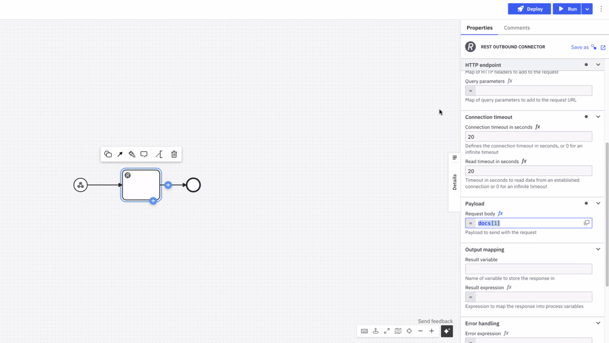

Outbound connectors that support [document handling](/components/document-handling/getting-started.md) share a consistent experience for both directions:

- When a connector **consumes** a document (upload or send), you choose a **document source** — a Camunda document, inline content, or an external URL.
- When a connector **produces** a document (download or retrieve), you choose a **return format** — a document reference, text, or JSON.

This maps onto the [two paths for document handling](/components/document-handling/overview.md#two-paths-for-document-handling): the document store path routes an opaque file, while the inline path lets the process build or read the content directly.

The [connector SDK](/components/connectors/custom-built-connectors/connector-sdk.md) provides document support in property/variable bindings.

:::note
The unified document source and return format described on this page are available from Camunda **8.10** onward and apply to newly created element templates. Processes built on earlier template versions continue to work unchanged.
:::

## Document sources

Every document handed to a connector is one of three **document reference types**, distinguished by the `camunda.document.type` field. Connectors that take a `Document` input expose a **document source** dropdown in the properties panel, with one option per type. Each option reveals only the relevant fields:

| Source                | Reference type | Fields revealed                                   | Use when                                                                                                      |
| --------------------- | -------------- | ------------------------------------------------- | ------------------------------------------------------------------------------------------------------------- |
| **Camunda document**  | `camunda`      | Document reference (FEEL)                         | You already have a document in the [Camunda document store](#camunda-documents) (Path 1).                     |
| **Inline content**    | `inline`       | Content, optional filename, optional content type | You want to build the file from process data (Path 2, write side). See [inline documents](#inline-documents). |
| **External document** | `external`     | URL, optional filename                            | The file lives at a reachable URL. See [external documents](#external-documents).                             |



The three subsections below define the JSON structure of each type. You can also select a type from the source dropdown without writing the JSON by hand.

### Camunda documents

A Camunda document is a reference to a file held in the [Camunda document store](/components/document-handling/getting-started.md). This is the document store path (Path 1): the file is routed as an opaque blob.

Such references are produced for you — by a [form Filepicker, inbound webhook, or the Orchestration Cluster REST API](/components/document-handling/upload-document-to-bpmn-process.md), or as the output of another connector — and stored in a process variable. A reference has the following structure:

```json
{
  "camunda.document.type": "camunda",
  "storeId": "gcp",
  "documentId": "example-document-id",
  "contentHash": "fwkhkj34843rfhfwho3297ufdsj0df09",
  "metadata": {
    "contentType": "application/pdf",
    "size": 70266,
    "fileName": "file.pdf"
  }
}
```

You normally reference the variable directly rather than constructing this object by hand.

### Inline documents

An inline document embeds content directly in a process variable, with no document store upload required. This is the inline path (Path 2, write side): useful when you want to generate a document on-the-fly from process data — for example, an error report — and pass it immediately to a connector.

To create an inline document, set a process variable to the following structure:

```json
{
  "camunda.document.type": "inline",
  "content": "Invoice #1234 — Amount due: $99.00",
  "name": "invoice.txt",
  "contentType": "text/plain"
}
```

You can also construct this with a FEEL expression to build the content dynamically from other process variables:

```feel
= {
  "camunda.document.type": "inline",
  "content": "Invoice #" + invoiceId + " — Amount due: $" + string(amount),
  "name": "invoice-" + invoiceId + ".txt"
}
```

The `content` field is polymorphic: a string is stored as its UTF-8 bytes, while a map, list, number, or boolean is serialized to JSON. This lets you build structured files directly from process variables:

```feel
= {
  "camunda.document.type": "inline",
  "content": {"orderId": orderId, "status": "failed", "errors": errorList},
  "name": "error.json",
  "contentType": "application/json"
}
```

| Field                   | Required | Description                                                                                                                                                                                        |
| ----------------------- | -------- | -------------------------------------------------------------------------------------------------------------------------------------------------------------------------------------------------- |
| `camunda.document.type` | Yes      | Must be `"inline"`.                                                                                                                                                                                |
| `content`               | Yes      | The document content. A string is stored as UTF-8 bytes; a map, list, number, or boolean is serialized to JSON.                                                                                    |
| `name`                  | No       | The filename. Drives content type inference when `contentType` is not set. If omitted, a UUID is generated automatically.                                                                          |
| `contentType`           | No       | The MIME type of the content. If omitted, the type is inferred from the file extension of `name`. If the extension is unrecognized or no name is provided, defaults to `application/octet-stream`. |

:::note
Inline documents are held in process variables, so their size is bounded by the [Zeebe variable size limit](/components/concepts/variables.md) (approximately 4 MB). For larger files, use the Camunda document store path instead.

There is no base64 field for binary content. To inline binary data, encode it with FEEL's built-in [`to base64` function](/components/modeler/feel/builtin-functions/feel-built-in-functions-string.md#to-base64value).
:::

### External documents

An external document points to a file available for download from an unprotected URL. Any connector can consume it directly, without first uploading it to the document store (Path 1: the file is routed, not inspected).

To use an external document, set a process variable to the following structure:

```json
{
  "camunda.document.type": "external",
  "url": "https://www.example.com/file.pdf",
  "name": "my-test-file.pdf"
}
```

| Field                   | Required | Description                                                                                                                                                   |
| ----------------------- | -------- | ------------------------------------------------------------------------------------------------------------------------------------------------------------- |
| `camunda.document.type` | Yes      | Must be `"external"`.                                                                                                                                         |
| `url`                   | Yes      | The URL the file is downloaded from.                                                                                                                          |
| `name`                  | No       | The filename. If omitted, the name is taken from the `content-type` and `content-disposition` HTTP response headers, with a random UUID used as the fallback. |

### List of documents

Connectors that accept a list of documents (for example, email, Slack, or SendGrid attachments) add a **Single/Multiple** toggle above the source dropdown:

- **Single** shows the same document source dropdown for one document.
- **Multiple** switches to a FEEL expression field where you construct an array of document references.

## Return formats

Connectors that download or retrieve a document let you choose how the content is returned, instead of guessing from the content type. A **return format** dropdown offers three options:

| Return format          | What you get                                                                                                                                    |
| ---------------------- | ----------------------------------------------------------------------------------------------------------------------------------------------- |
| **Document reference** | The content is uploaded to the [Camunda document store](/components/document-handling/getting-started.md) and a reference is returned (Path 1). |
| **As text**            | The bytes are decoded to a string and returned in the response (Path 2, read side). An optional **encoding** sub-field defaults to UTF-8.       |
| **As JSON**            | The bytes are parsed as JSON and returned as a structured value you can use directly in FEEL (Path 2, read side).                               |

:::note
**As text** and **As JSON** return the content directly in a process variable, so they are subject to a size guard (approximately 1.5 MiB). A larger object fails the job with a controlled incident rather than exhausting runtime memory. Use **Document reference** for large files.

The **As JSON** option fails the job when the content is not valid JSON. Use **As text** for non-JSON content.
:::

The exact response variable differs per connector (for example, S3 returns `element`, Google Cloud Storage returns `content`, and the REST connector returns `body`). See each connector's page for its response structure.

## Outbound connectors that support document handling

| Connector                                                                                        | Document source (send/upload) | Return format (download/retrieve) |
| ------------------------------------------------------------------------------------------------ | ----------------------------- | --------------------------------- |
| [Amazon Bedrock](/components/connectors/out-of-the-box-connectors/amazon-bedrock.md)             | Yes                           | —                                 |
| [Amazon S3](/components/connectors/out-of-the-box-connectors/amazon-s3.md)                       | Yes                           | Yes                               |
| [Azure Blob Storage](/components/connectors/out-of-the-box-connectors/azure-blob-storage.md)     | Yes                           | Yes                               |
| [Box](/components/connectors/out-of-the-box-connectors/box.md)                                   | Yes                           | Yes                               |
| [Email](/components/connectors/out-of-the-box-connectors/email-outbound.md)                      | Yes (attachments)             | —                                 |
| [Google Cloud Storage](/components/connectors/out-of-the-box-connectors/google-cloud-storage.md) | Yes                           | Yes                               |
| [Google Drive](/components/connectors/out-of-the-box-connectors/googledrive.md)                  | Yes                           | Yes                               |
| [GraphQL](/components/connectors/protocol/graphql.md)                                            | —                             | Yes                               |
| [Microsoft Teams](/components/connectors/out-of-the-box-connectors/microsoft-teams.md)           | Yes (attachments)             | —                                 |
| [REST](/components/connectors/protocol/rest.md)                                                  | Yes                           | Yes                               |
| [SendGrid](/components/connectors/out-of-the-box-connectors/sendgrid.md)                         | Yes (attachments)             | —                                 |
| [Slack](/components/connectors/out-of-the-box-connectors/slack.md)                               | Yes (attachments)             | —                                 |

## Additional resources

- [Camunda Academy: How To Handle Documents with Email Connector](https://academy.camunda.com/c8-h2-handle-documents-email-connector)
