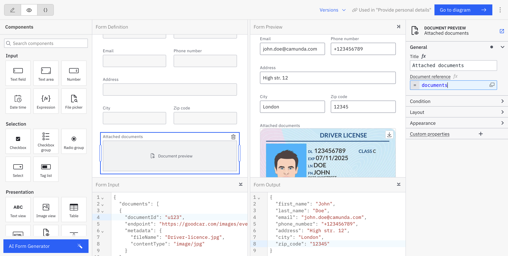

## Build a form for document preview and downloading

To display and allow downloading of a document you can use the [document preview component](/components/modeler/forms/form-element-library/forms-element-library-document-preview.md) in [forms](/components/modeler/forms/camunda-forms-reference.md).

:::note
The document preview component offers previews in forms of PDF documents and images as the most common file types. Other document types are supported, but listed without the preview and show the file name with the option to download the file.
:::

In the component's configuration, provide a document reference as an array of document metadata.

## Display and download a document from a user task in Tasklist

A document can be displayed in a user task form in [Tasklist](/components/tasklist/introduction-to-tasklist.md).

When a user opens the task, they can view and download the document directly from the form.

