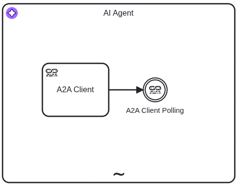
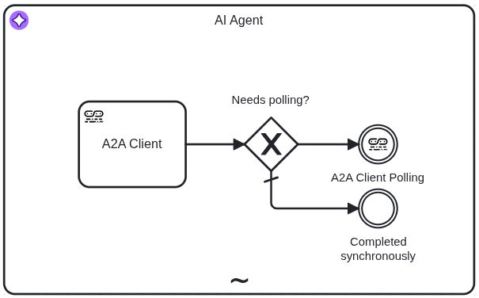

The A2A Client connectors often work in combination with to interact with remote A2A agents. This section outlines common usage patterns for the A2A Client connectors.

## Synchronous request-response pattern

The most straightforward usage pattern is when the **A2A Client connector** sends a request to a remote A2A agent and waits for the response. This is suitable for scenarios where immediate results are required.
This pattern only requires a **A2A Client connector** with **Blocking** response retrieval method.

The following diagram illustrates this pattern with an **A2A Client connector** being used as a tool for an AI agent.


The following minimum configuration is needed:

- **A2A server URL**: For example `https://a2a-agent.example.com`
- **Agent Card location**: if different from the default `.well-known/agent-card.json`
- **Response retrieval**: `Blocking`
- **Result expression**: `={toolCallResult: result}`

:::note
According to the [A2A specification](https://a2a-protocol.org/v0.3.0/specification/#712-messagesendconfiguration-object), the remote A2A server might reject the request if the task is long-running.
:::

## Asynchronous pattern with polling

For long-running tasks, the **A2A Client connector** can be configured to send a request to a remote A2A agent and then poll for the result at regular intervals. This pattern is suitable for scenarios where the task may take an extended period to complete.
This pattern requires an **A2A Client connector** with **Polling** response retrieval method. An **A2A Client Polling connector** is then used to poll for the result.

The following diagram illustrates this pattern with a combination of an **A2A Client connector** and an **A2A Client Polling connector** being used as a tool for an AI agent.



The following minimum configuration is needed for the **A2A Client connector**:

- **A2A server URL**: For example `https://a2a-agent.example.com`
- **Agent Card location**: if different from the default `.well-known/agent-card.json`
- **Response retrieval**: `Polling`
- **Result variable**: a variable name to store the result that will be used in the A2A Client Polling connector, e.g. `a2aAgentResponse`

The following minimum configuration is needed for the **A2A Client Polling connector**:

- **A2A server URL**: same as used in the **A2A Client connector**
- **Agent Card location**: same as used in the **A2A Client connector**
- **A2A Client response**: the variable name used in the A2A Client connector, e.g. `=a2aAgentResponse`
- **Task polling interval**: For example `PT5S`
- **Result expression**: `={toolCallResult: result}`

The **A2A Client Polling connector** correlates the message immediately when there is no need to poll the remote agent. This happens in the following cases:

1. When the operation is **Fetch Agent Card**
2. When the remote agent responds with a _message_
3. When the remote agent responds with a _task_ that is not in a `submitted` or `working` state

It is possible to activate the **A2A Client Polling connector** only when needed by using a gateway before the connector.
The following diagram illustrates this pattern with a gateway controlling the execution of the **A2A Client Polling connector**.



This expression can be used for the exclusive gateway condition to check if polling is needed:

```feel
a2aAgentResponse.result.kind = "task" and list contains(["submitted", "working"], a2aAgentResponse.result.status.state)
```

The following output should be configured on "Completed synchronously" throw event:

- **Process variable name**: `toolCallResult`
- **Variable assignment value**: `=a2aAgentResponse.result`

:::tip
It is possible to use a [Receive Task](/components/modeler/bpmn/receive-tasks/receive-tasks.md) instead of the intermediate catch event. This allows for assigning boundary events for timeouts or error handling.
Assign the **A2A Client Polling Receive Task Connector** template to the Receive Task and configure it as described above.
:::

## Asynchronous pattern with push notifications

When the remote A2A agent supports push notifications, the **A2A Client connector** can be configured to send a request to the remote A2A agent and then wait for notifications about the task updates. This pattern is suitable for scenarios where the task may take an extended period to complete, and push notifications are preferred over polling.
This pattern requires an **A2A Client connector** with **Notification** response retrieval method. An **A2A Client Webhook connector** is then used to wait for the notifications.

The following diagram illustrates this pattern with a combination of an **A2A Client connector** and an **A2A Client Webhook connector** being used as a tool for an AI agent.


The following minimum configuration is needed for the **A2A Client connector**:

- **A2A server URL**: For example `https://a2a-agent.example.com`
- **Agent Card location**: if different from the default `.well-known/agent-card.json`
- **Response retrieval**: `Notification`
- **Webhook URL**: For example `http://some-camunda-cluster.com/inbound/22083f06-72fa-4f09-b4c5-8e83a0d66cb1`
- **Result variable**: a variable name to store the result that will be used in the A2A Client Polling connector, e.g. `a2aAgentResponse`

The following minimum configuration is needed for the **A2A Client Webhook connector**:

- **Webhook ID**: For example `22083f06-72fa-4f09-b4c5-8e83a0d66cb1`
- **A2A agent response**: the variable name used in the A2A Client connector, e.g. `=a2aAgentResponse`
- **Result expression**: `={toolCallResult: request.body}`

This expression can be used for the exclusive gateway condition to check if the process should wait for push notifications:

```feel
a2aAgentResponse.result.kind = "task" and list contains(["submitted", "working"], a2aAgentResponse.result.status.state)
```

The following output should be configured on "Completed synchronously" throw event:

- **Process variable name**: `toolCallResult`
- **Variable assignment value**: `=a2aAgentResponse.result`

:::tip
It is possible to use a [Receive Task](/components/modeler/bpmn/receive-tasks/receive-tasks.md) instead of the intermediate catch event. This allows for assigning boundary events for timeouts or error handling.
Assign the **A2A Client Webhook Receive Task Connector** template to the Receive Task and configure it as described above.
:::
