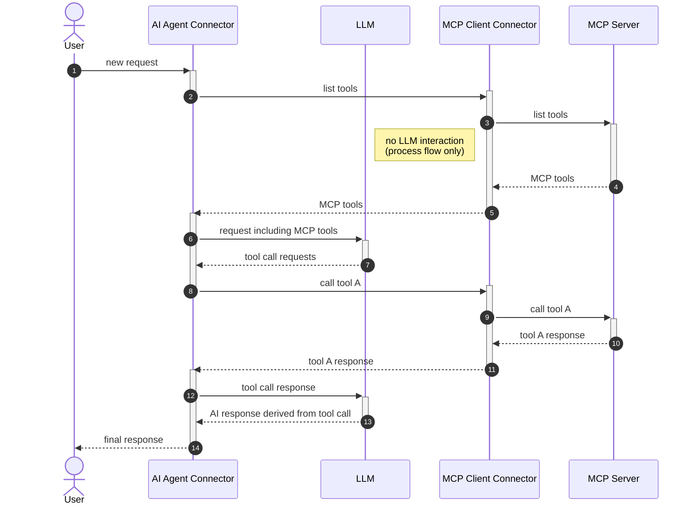

Integrate [MCP (Model Context Protocol)](https://modelcontextprotocol.io/) clients
with [agentic orchestration](../../../agentic-orchestration/agentic-orchestration.md).

Camunda's MCP client integration allows using
the [AI agent connector](../../../connectors/out-of-the-box-connectors/agentic-ai-aiagent.md) in combination with MCP
clients to use tools provided by MCP servers, both for locally
started [STDIO](https://modelcontextprotocol.io/specification/draft/basic/transports#stdio) and for remote MCP servers
using the [HTTP with SSE](https://modelcontextprotocol.io/specification/2024-11-05/basic/transports#http-with-sse)
transport.

:::note
The MCP client integration currently only supports tool-related functionality — other MCP features such as resources or
prompts are not supported.
:::

## MCP tool discovery & calling

AI agents are able to detect and use tools provided by MCP clients configured via activities within an
ad-hoc sub-process by detecting so-called _gateway tool definitions_ which provide access to a list of tools instead of
being a single tool definition.

Tool discovery and tool calling is done through the ad-hoc sub-process rather than directly in the AI agent, enabling:

- The AI agent and individual MCP clients running on different deployments. For example, a custom MCP client acting on
  a local filesystem could be connected to a Camunda 8 SaaS instance.
- More advanced modeling use cases involving other BPMN elements. For example, user tasks can be used to combine MCP
  clients with an approval flow for individual tool calls (see [human-in-the-loop](#human-in-the-loop)).

TBD GRAPHIC

The following sequence diagram illustrates the process of tool discovery and tool calling with MCP clients. Each actor
in the diagram can potentially run in a different deployment, making it truly distributed.



### Tool discovery

To mark an activity tool as gateway tool definition, the agent expects an
[extension property](../../../modeler/desktop-modeler/element-templates/defining-templates.md#zeebeproperty) of
`io.camunda.agenticai.gateway.type` being configured with a value of `mcpClient`. This is automatically done by the
provided [MCP connectors](#mcp-connectors), but allows you to create more advanced use cases such as tool calling
with [human in the loop](#human-in-the-loop) interaction when added to other activites such as an intermediate event.

When the AI agent connector
[resolves its available tools](../../../connectors/out-of-the-box-connectors/agentic-ai-aiagent-example.md#tool-resolution),
it additionally resolves gateway tool definitions and - if needed by the gateway tool definition type - initiates a tool
discovery feedback loop through the ad-hoc sub-process.

How this tool discovery is implemented varies by gateway tool definition type, but for MCP clients (gateway type
`mcpClient`), it executes the
[`tools/list`](https://modelcontextprotocol.io/specification/2025-06-18/server/tools#listing-tools) method on every MCP
client connector configured in the ad-hoc sub-process. It is the responsibility of the MCP client implementation
to fetch tool definitions from its connected MCP server and to return them to the AI agent as result of this tool
discovery call.

#### Tool definitions

As the AI agent needs to provide unique tool names to the LLM while still needing to be able to map tool calls to
individual activities within the ad-hoc sub-process, it applies a naming convention to uniquely identify MCP tool
names:

```
MCP_<activityId>___<toolName>>
```

For example, the `get_current_time` tool provided by
a [time MCP server](https://github.com/modelcontextprotocol/servers/tree/main/src/time) would resolve to the
following tool definition when accessed through an MCP client activity with the ID `Time`.

```json
{
  "name": "MCP_Time___get_current_time",
  "description": "Get current time in a specific timezones",
  "inputSchema": {
    "properties": {
      "timezone": {
        "type": "string",
        "description": "IANA timezone name (e.g., 'America/New_York', 'Europe/London'). Use 'UTC' as local timezone if no timezone provided by the user."
      }
    },
    "required": ["timezone"],
    "type": "object"
  }
}
```

When handling LLM tool call requests, the MCP client integration of the AI agent connector transparently maps the unique
tool names back to the matching activity. Tool name and arguments are further passed to the MCP client connector for the
actual tool call.

## MCP connectors

:::note
Remote MCP client connectors do not support any features implementing authentication. This will be added in
a future release.
:::

Camunda provides two different MCP connectors with a different focus. The MCP connectors are not mutually exclusive, but
can be used in combination as long as the cluster/environment is configured accordingly.

| Connector                                                       | STDIO | Remote/HTTP | Configuration                        | Availability                                                                                                  | Description                                                                                                                                                                               |
| :-------------------------------------------------------------- | :---- | ----------- | :----------------------------------- | ------------------------------------------------------------------------------------------------------------- | :---------------------------------------------------------------------------------------------------------------------------------------------------------------------------------------- |
| [MCP Remote Client connector](./mcp-remote-client-connector.md) | ❌    | ✅          | Properties panel                     | Available on SaaS                                                                                             | Suited for prototyping with remote MCP servers. HTTP connections are opened on demand when executing the activity instead of keeping a persistent connection as designed by the protocol. |
| [MCP Client connector](./mcp-client-connector.md)               | ✅    | ✅          | Connector runtime + properties panel | Not directly available on Saas, but a custom runtime executing the client connector can be connected to Saas. | Flexible MCP integration based on persistent connections managed by the connector runtime. Provides support for STDIO MCP servers.                                                        |

See the individual connector documentation for details on how to configure and use the connectors.

### Common configuration options

The provided connectors share a set of common options to configure tool access and availability.

#### Tools

Allows filtering the list of tools provided by the MCP server. If not configured, all tools provided by the MCP server
will be available to the AI agent.

| Field          | Required | Description                                             | Example                                |
| :------------- | :------- | :------------------------------------------------------ | :------------------------------------- |
| Included tools | No       | List of allowed tools provided by the MCP server.       | `["read_file", "read_multiple_files"]` |
| Excluded tools | No       | List of tools to exclude. Overrides any included tools. | `["write_file"]`                       |

For example, an MCP client connected to
a [filesystem MCP server](https://github.com/modelcontextprotocol/servers/tree/main/src/filesystem) could be configured
with `["read_file", "read_multiple_files"]` as included tools to only allow readonly operations to the filesystem.
Alternatively, it could be configured with `["write_file"]` as a list of excluded tools to prevent write operations.

#### Operation

Configures the operation to execute on the MCP server. It should only be necessary to change the default value when
the ad-hoc sub-process multi-instance is configured to use an input element different from `toolCall`.

| Field      | Required | Description                                                                                                                                       |
| :--------- | :------- | :------------------------------------------------------------------------------------------------------------------------------------------------ |
| Method     | Yes      | The [MCP method](https://modelcontextprotocol.io/specification/2025-06-18/server/tools#protocol-messages) to call. Defaults to `toolCall.method`. |
| Parameters | Yes      | The parameters to pass along with the MCP client execution. Defaults to `toolCall.params`.                                                        |

#### Output mapping

Specify the process variables that you want to map and export the tool calling response into.

| Field             | Required | Description                                                                                                                                                                                                                                                                                   |
| :---------------- | :------- | :-------------------------------------------------------------------------------------------------------------------------------------------------------------------------------------------------------------------------------------------------------------------------------------------- |
| Result variable   | Yes      | Defaults to `toolCallResult`. Only change if the output mapping of the ad-hoc sub-process multi-instance is configured to use a different variable for the [content mapping](../../../connectors/out-of-the-box-connectors/agentic-ai-aiagent-example.md#configure-multi-instance-execution). |
| Result expression | No       | In addition, you can choose to unpack the content of the response into multiple process variables using the **Result expression** field, as a [FEEL Context Expression](../../../concepts/expressions.md).                                                                                    |

## Human-in-the-loop

TBD

## Examples

A ready-to-go example using both connector types and a human-in-the-loop interaction is available in the
[connectors repository](https://github.com/camunda/connectors/tree/main/connectors/agentic-ai/examples/ai-agent-chat-mcp).
See
its [README](https://github.com/camunda/connectors/blob/main/connectors/agentic-ai/examples/ai-agent-chat-mcp/README.md)
for further details on the needed configuration.
