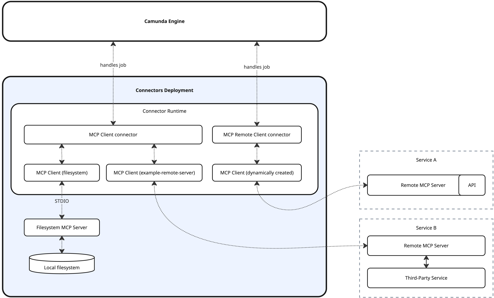
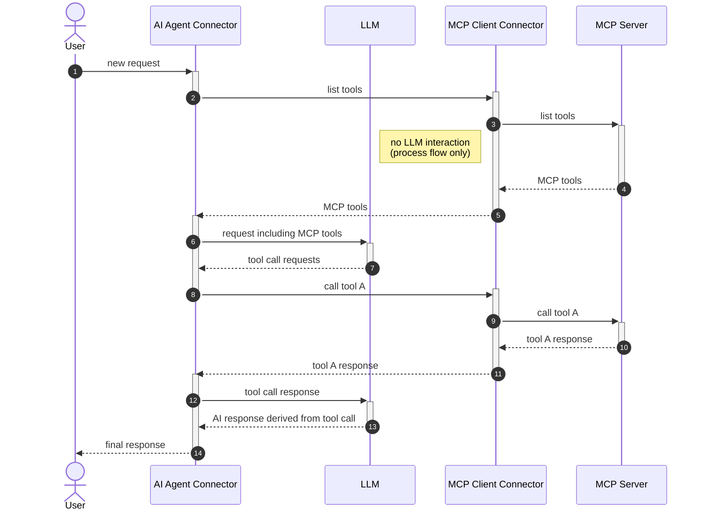
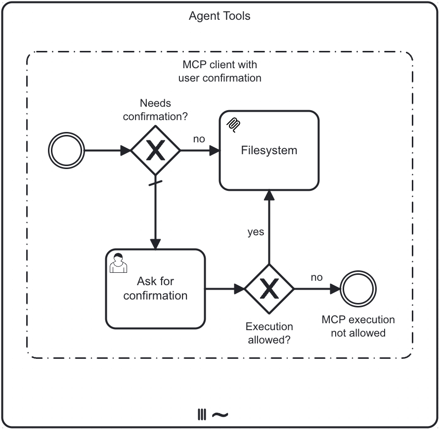

Integrate [MCP (Model Context Protocol)](https://modelcontextprotocol.io/) clients with [agentic orchestration](../../../agentic-orchestration/agentic-orchestration.md).

Camunda's MCP Client integration allows using the [AI agent connector](../../../connectors/out-of-the-box-connectors/agentic-ai-aiagent.md) in combination with MCP clients to access tools provided by MCP servers. This includes both locally started [STDIO](https://modelcontextprotocol.io/specification/draft/basic/transports#stdio) servers and remote MCP servers using the [HTTP with SSE](https://modelcontextprotocol.io/specification/2024-11-05/basic/transports#http-with-sse) transport.



- [STDIO](https://modelcontextprotocol.io/specification/draft/basic/transports#stdio) (standard input/output) servers are operating system processes directly started and managed by the connector runtime. Communication with these servers is done via standard input and output streams.
- Remote MCP servers are available via HTTP. Multiple standards exist ([HTTP with SSE](https://modelcontextprotocol.io/specification/2024-11-05/basic/transports#http-with-sse), [Streamable HTTP](https://modelcontextprotocol.io/specification/2025-06-18/basic/transports#streamable-http)).  
  Currently, only HTTP with SSE is supported by the MCP Client connectors.

:::note
The MCP Client integration currently only supports tool-related functionality. Other MCP features such as resources or prompts are not supported.
:::

## MCP tool discovery and calling

AI agents can detect and use tools provided by MCP clients via activities within an ad-hoc sub-process. This is made possible by so-called _gateway tool definitions_, which provide access to a list of tools instead of a single tool definition.

Tool discovery and tool calling are performed within the ad-hoc sub-process, rather than directly in the AI agent. This enables:

- Running the AI agent and individual MCP clients in different deployments.  
  For example, a custom MCP client interacting with a local filesystem could be connected to a Camunda 8 SaaS instance.
- More advanced modeling use cases involving other BPMN elements.  
  For example, user tasks can be used to combine MCP clients with an approval flow for individual tool calls (see [human-in-the-loop](#human-in-the-loop)).

The following sequence diagram illustrates the process of tool discovery and tool calling with MCP clients. Each actor in the diagram can potentially run in a different deployment, making the architecture truly distributed.



### Tool discovery

To mark an activity tool as a gateway tool definition, the agent expects an [extension property](../../../modeler/desktop-modeler/element-templates/defining-templates.md#zeebeproperty) named `io.camunda.agenticai.gateway.type` with the value `mcpClient`. This is automatically applied by the provided [MCP connectors](#mcp-connectors), but it also allows for more advanced use cases—such as tool calling with [human-in-the-loop](#human-in-the-loop) interaction—when added to other activities, like an intermediate event.

When the AI agent connector [resolves its available tools](../../../connectors/out-of-the-box-connectors/agentic-ai-aiagent-example.md#tool-resolution), it also resolves gateway tool definitions. If required by the gateway tool type, it initiates a tool discovery feedback loop through the ad-hoc sub-process.

The implementation of tool discovery depends on the gateway tool type. For MCP clients (gateway type `mcpClient`), it triggers the [`tools/list`](https://modelcontextprotocol.io/specification/2025-06-18/server/tools#listing-tools) method on each MCP Client connector configured within the ad-hoc sub-process. It is the responsibility of the MCP client implementation to fetch tool definitions from the connected MCP server and return them to the AI agent as part of this discovery call.

#### Tool definitions

Because the AI agent must present unique tool names to the LLM, while also being able to map tool calls to specific activities in the ad-hoc sub-process, it applies a naming convention to uniquely identify MCP tool names:

```
MCP_<activityId>___<toolName>>
```

For example, the `get_current_time` tool provided by
a [time MCP server](https://github.com/modelcontextprotocol/servers/tree/main/src/time) would resolve to the
following tool definition when accessed through an MCP Client activity with the ID `Time`:

```json
{
  "name": "MCP_Time___get_current_time",
  "description": "Get current time in a specific timezones",
  "inputSchema": {
    "properties": {
      "timezone": {
        "type": "string",
        "description": "IANA timezone name (e.g., 'America/New_York', 'Europe/London'). Use 'UTC' as local timezone if no timezone provided by the user."
      }
    },
    "required": ["timezone"],
    "type": "object"
  }
}
```

When handling LLM tool call requests, the MCP Client integration of the AI agent connector transparently maps the unique tool names back to the matching activity. The tool name and arguments are then passed to the MCP Client connector for the actual tool call.

## MCP connectors

:::note
Remote MCP Client connectors do not currently support authentication. This feature will be added in a future release.
:::

Camunda provides two MCP connectors with different focuses. These connectors are not mutually exclusive and can be used together as long as the cluster/environment is configured accordingly.

| Connector                                                       | STDIO | Remote/HTTP | Configuration                        | Availability                                                                                                | Description                                                                                                                                                                |
| :-------------------------------------------------------------- | :---- | :---------- | :----------------------------------- | :---------------------------------------------------------------------------------------------------------- | :------------------------------------------------------------------------------------------------------------------------------------------------------------------------- |
| [MCP Remote Client connector](./mcp-remote-client-connector.md) | ❌    | ✅          | Properties panel                     | Available on SaaS                                                                                           | Suited for prototyping with remote MCP servers. HTTP connections are opened on demand during execution instead of maintaining persistent connections, per protocol design. |
| [MCP Client connector](./mcp-client-connector.md)               | ✅    | ✅          | Connector runtime + properties panel | Not directly available on SaaS, but a custom runtime running the client connector can be connected to SaaS. | Flexible MCP integration based on persistent connections managed by the connector runtime. Supports STDIO MCP servers.                                                     |

See the individual connector documentation for details on configuring and using these connectors.

### Common configuration options

The provided connectors share a set of common options for configuring tool access and availability.

#### Tools

Allows filtering the list of tools provided by the MCP server. If not configured, all tools provided by the MCP server will be available to the AI agent.

| Field          | Required | Description                                             | Example                                |
| :------------- | :------- | :------------------------------------------------------ | :------------------------------------- |
| Included tools | No       | List of allowed tools provided by the MCP server.       | `["read_file", "read_multiple_files"]` |
| Excluded tools | No       | List of tools to exclude. Overrides any included tools. | `["write_file"]`                       |

For example, an MCP client connected to
a [file system MCP server](https://github.com/modelcontextprotocol/servers/tree/main/src/filesystem) could be configured
with `["read_file", "read_multiple_files"]` as included tools to only allow read-only operations to the file system.
Alternatively, it could be configured with `["write_file"]` as a list of excluded tools to prevent write operations.

#### Operation

Configures the operation to execute on the MCP server. You typically only need to change the default value if the ad-hoc sub-process multi-instance uses an input element other than `toolCall`.

| Field      | Required | Description                                                                                                                                       |
| :--------- | :------- | :------------------------------------------------------------------------------------------------------------------------------------------------ |
| Method     | Yes      | The [MCP method](https://modelcontextprotocol.io/specification/2025-06-18/server/tools#protocol-messages) to call. Defaults to `toolCall.method`. |
| Parameters | Yes      | The parameters to pass with the MCP client execution. Defaults to `toolCall.params`.                                                              |

#### Output mapping

Specify the process variables to map and export the tool calling response into.

| Field             | Required | Description                                                                                                                                                                                                                                                                                   |
| :---------------- | :------- | :-------------------------------------------------------------------------------------------------------------------------------------------------------------------------------------------------------------------------------------------------------------------------------------------- |
| Result variable   | Yes      | Defaults to `toolCallResult`. Change only if the output mapping of the ad-hoc sub-process multi-instance is configured to use a different variable for the [content mapping](../../../connectors/out-of-the-box-connectors/agentic-ai-aiagent-example.md#configure-multi-instance-execution). |
| Result expression | No       | Optionally unpack the response content into multiple process variables using the **Result expression** field as a [FEEL context expression](../../../concepts/expressions.md).                                                                                                                |

## Human-in-the-loop



With the tool discovery approach described above, you can combine the MCP Client connector with other BPMN elements such as user tasks or intermediate events to create a human-in-the-loop interaction.

Instead of directly exposing the MCP Client connector as a tool, an intermediate event marked as an MCP client gateway can serve as the root activity of a tool flow within the ad-hoc sub-process.

Here is an example setup with a filesystem MCP server (see [examples](#examples) for a working reference):

1. Add a service task to the ad-hoc sub-process and apply/configure one of the MCP Client connectors.
2. Add an intermediate throw event to the ad-hoc sub-process and add an extension property named `io.camunda.agenticai.gateway.type` with the value `mcpClient`.
3. Create an exclusive gateway after the event to decide whether the MCP client tool call should be executed directly or require confirmation.
4. Create a flow from the exclusive gateway to the MCP Client service task for direct execution.
   - In the condition expression, you can use a FEEL expression like the following to allow tool listing and selected operations directly. This differs from [filtering](#tools) because all tools remain available, but you can decide which tools need user confirmation:
     ```feel
     if toolCall.method = "tools/list" then
       true
     else
       toolCall.method = "tools/call" and list contains([
         "read_file",
         "read_multiple_files"
       ], toolCall.params.name)
     ```
5. Create a default flow to a user task for the confirmation. Set up a form for the user task to enable a decision on
   whether the tool call should be executed.

   - A checkbox could be added to the form to allow the user to confirm or deny the tool call.
   - A text view could present the tool call with a template such as the following:

   ```
   # MCP Tool Call Confirmation

   The model requested to call the following MCP tool:

   {{toolCall.params}}
   ```

6. Configure a second exclusive gateway after the user task to decide if the tool call should be executed depending on the value of the checkbox added to the user task.
   - If tool execution is allowed, connect the exclusive gateway to the MCP Client service task.
   - If tool execution is not allowed, end the tool flow in an intermediate throw event. Configure an output variable
     `toolCallResult` to return denied tool call to the model. Use the following FEEL expression as a
     variable assignment value:
     ```feel
     {"isError": true, "content": [{"type": "text", "text": "Tool call was not allowed by the user"}]}
     ```

## Examples

A ready-to-go example using both connector types and a human-in-the-loop interaction is available in the [connectors repository](https://github.com/camunda/connectors/tree/main/connectors/agentic-ai/examples/ai-agent-chat-mcp). See its [README](https://github.com/camunda/connectors/blob/main/connectors/agentic-ai/examples/ai-agent-chat-mcp/README.md) for further details on the necessary configuration.
