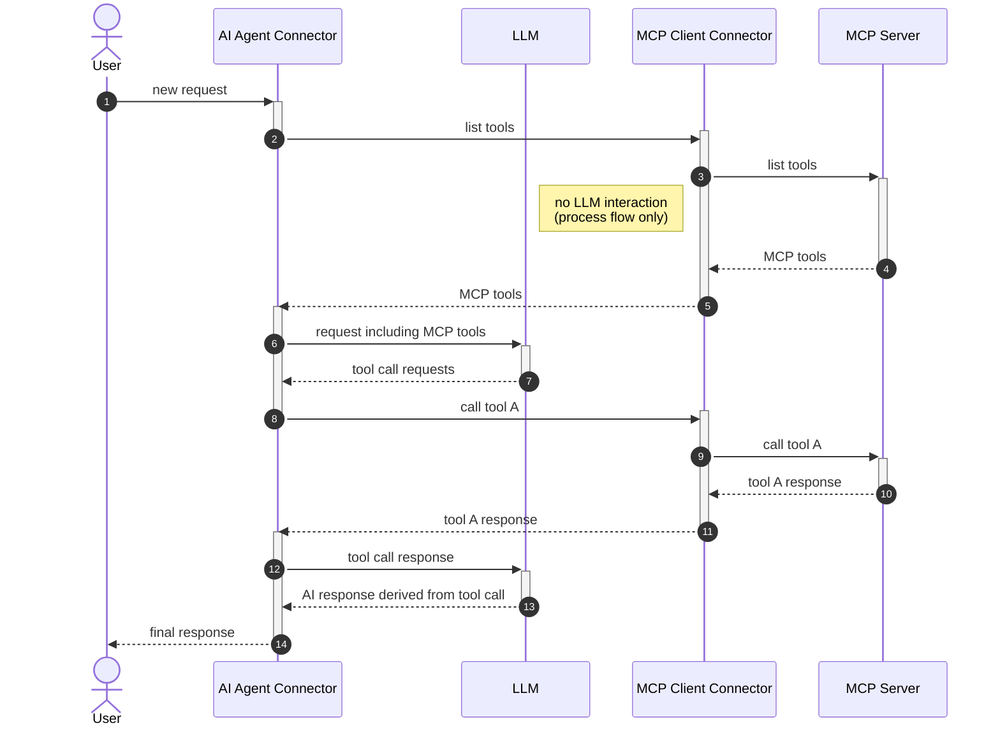

Learn how AI agents use gateway tool definitions to automatically discover and invoke MCP client tools, enabling distributed, advanced BPMN workflows.

## About

AI agents can detect and use tools provided by MCP clients via activities within an ad-hoc sub-process. This is made possible by so-called _gateway tool definitions_, which provide access to a list of tools instead of a single tool definition.

Tool discovery and calling are performed within the ad-hoc sub-process, rather than directly in the AI agent. This enables:

- Running the AI agent and individual MCP clients in different deployments. For example, a custom MCP client interacting with a local filesystem could be connected to a Camunda 8 SaaS instance.
- More advanced modeling use cases involving other BPMN elements. For example, user tasks can be used to combine MCP clients with an approval flow for individual tool calls. See [Human in the loop](./human-in-the-loop.md) for more details.

The following sequence diagram illustrates the process of tool discovery and calling with MCP clients. Each actor in the diagram can potentially run in a different deployment, making the architecture truly distributed:



## Tool discovery

To mark an activity tool as a gateway tool definition, the agent expects an [extension property](../../../modeler/element-templates/defining-templates.md#zeebeproperty) named `io.camunda.agenticai.gateway.type` with the value `mcpClient`. This is automatically applied by the provided [MCP connectors](./mcp-client-connector.md#mcp-connectors), but it also allows for more advanced use cases, such as tool calling with human-in-the-loop interaction, when added to other activities, like an intermediate event.

When the AI agent connector [resolves its available tools](../../../connectors/out-of-the-box-connectors/agentic-ai-aiagent-tool-definitions.md#tool-resolution), it also resolves gateway tool definitions. If required by the gateway tool type, it initiates a tool discovery feedback loop through the ad-hoc sub-process.

The implementation of tool discovery depends on the gateway tool type. For MCP clients (gateway type `mcpClient`), it triggers the [`tools/list`](https://modelcontextprotocol.io/specification/2025-06-18/server/tools#listing-tools) method on each MCP Client connector configured within the ad-hoc sub-process. It is the responsibility of the MCP client implementation to fetch tool definitions from the connected MCP server and return them to the AI agent as part of this discovery call.

## Tool definitions

Because the AI agent must present unique tool names to the LLM while also being able to map tool calls to specific activities in the ad-hoc sub-process, it applies a naming convention to uniquely identify MCP tool names:

```
MCP_<activityId>___<toolName>>
```

For example, the `get_current_time` tool provided by
a [time MCP server](https://github.com/modelcontextprotocol/servers/tree/main/src/time) would resolve to the
following tool definition when accessed through an MCP Client activity with the ID `Time`:

```json
{
  "name": "MCP_Time___get_current_time",
  "description": "Get current time in a specific timezones",
  "inputSchema": {
    "properties": {
      "timezone": {
        "type": "string",
        "description": "IANA timezone name (e.g., 'America/New_York', 'Europe/London'). Use 'UTC' as local timezone if no timezone provided by the user."
      }
    },
    "required": ["timezone"],
    "type": "object"
  }
}
```

When handling LLM tool call requests, the MCP Client integration of the AI agent connector transparently maps the unique tool names back to the matching activity. The tool name and arguments are then passed to the MCP Client connector for the actual tool call.
