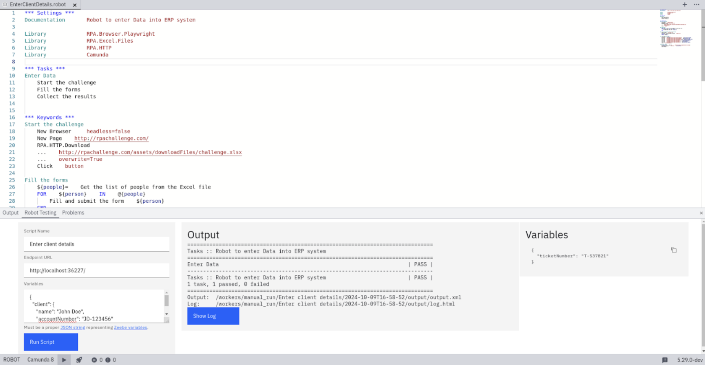
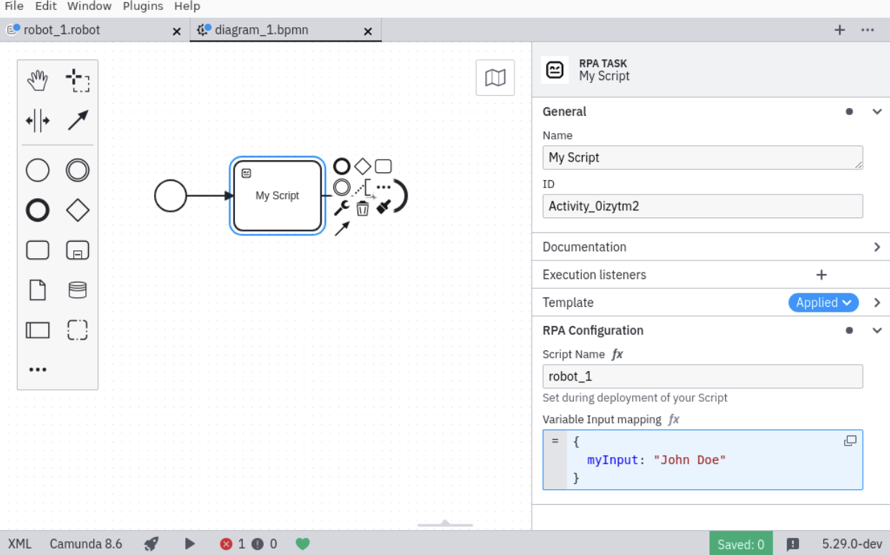

Camunda enables orchestration of simple **robotic process automation (RPA)** tasks within Camunda 8 based on the [RPA Framework](https://rpaframework.org/). The RPA integration consists of two primary components: RPA runtime and the [Camunda Desktop Modeler](/components/modeler/about-modeler.md) plugin.

## RPA runtime

You can use the RPA runtime to run your RPA scripts for both local testing or from your Camunda SaaS [cluster](/guides/create-cluster.md).

- **For a full development setup**: Visit the [Camunda Prototype RPA Worker GitHub repository](https://github.com/camunda/rpa-runtime).
- **For a Windows setup without Python**: Take the following steps:

1. Download the [RPA runner repository](https://github.com/camunda/rpa-runtime/archive/refs/heads/main.zip) from GitHub.
2. Unzip the file and navigate to the `rpa-runtime-main` repository folder.
3. Execute `setup.ps1` using PowerShell. If permission issues arise, alter your Execution Policy with the command `Set-ExecutionPolicy RemoteSigned`.
4. Enter your credentials into the `.env` file. See [how to create credentials](/components/console/manage-clusters/manage-api-clients.md#create-a-client).
5. Start the RPA worker locally by running `start.ps1` in PowerShell. To stop the worker, close the PowerShell terminal.

### Directories

The RPA runtime manages files locally, with directories structured as follows:

- `/rpaFiles`: Contains the deployed scripts, with filenames matching the names used in your process.
- `/workers/{scriptName}/{jobId}/`: Stores logs and runtime data for your workers, where the job ID corresponds to the Zeebe job ID when executing tasks from Camunda.

## Camunda Desktop Modeler plugin

:::note
Desktop Modeler version 5.29.0 or higher is required for this plugin. Until its release on November 8th 2024, use the [nightly build](https://downloads.camunda.cloud/release/camunda-modeler/nightly/).
:::

### Installation

For more information on plugin installation, visit the [plugin installation guide](/components/modeler/desktop-modeler/plugins/plugins.md).

To install the RPA plugin, take the following steps:

1. Download the latest version of the [RPA plugin](http://github.com/camunda/camunda-modeler-rpa-plugin/zipball/latest/) from GitHub.
2. Extract the folder to `resources/plugins` within your Desktop Modeler installation directory.
3. Ensure the path is structured correctly: `/resources/plugins/<plugin-name>/index.js`.
4. Launch or restart Desktop Modeler.

You can now open and edit `.robot` files in Desktop Modeler.

### Robot development

To create or edit a `.robot` file, use the welcome page or file dialog in Modeler.

The editor allows for script development, with all RPA Framework libraries listed in the [RPA Framework documentation](https://rpaframework.org/#libraries). Camunda also offers a [Camunda library extension](/components/early-access/experimental/rpa/camunda-rpa-framework-library.md) to integrate with Camunda and return variables from your RPA scripts, for example.

Currently, only a single `.robot` file is supported, and adding custom Python files or libraries is not possible.

### Testing

To test your script, select the **Play** icon in the bottom left corner of Desktop Modeler to access the **Robot Testing** tab.

You can now run the script with the expected input from the process on your local RPA runtime. Once the script completes, select **Show log** to see a more detailed view of the run.

Refer to the [Camunda library documentation](/components/early-access/experimental/rpa/camunda-rpa-framework-library.md) for information on returning variables from your RPA script to your process.

### Deployment

Once your script is finalized and tested, take the following steps:

1. Select the **Deploy** icon next to the **Run** icon in the footer of Desktop Modeler to deploy this to the RPA runner.
2. Ensure the script name used during deployment matches the name referenced within your BPMN.

### Using Robot scripts in a process

To integrate the script within your process, take the following steps:

1. In a Camunda 8 Desktop Modeler diagram, create a task if you have not already done so, and change the task to an RPA task by selecting the wrench-shaped change type context menu icon.
2. Use the properties panel to configure the script name and input mappings. The script name should correspond with the deployed script name. For input mappings, specify the required script inputs or set the mapping to null to use process variables directly.

:::note
Have questions, a bug report, or an idea for improvement? Visit the [open issue tracker](https://github.com/camunda/rpa-runtime/issues/new/choose) on GitHub.
:::
