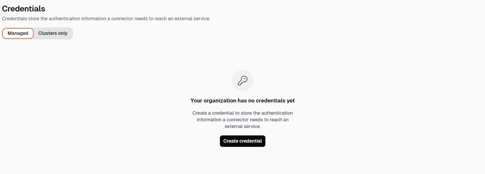
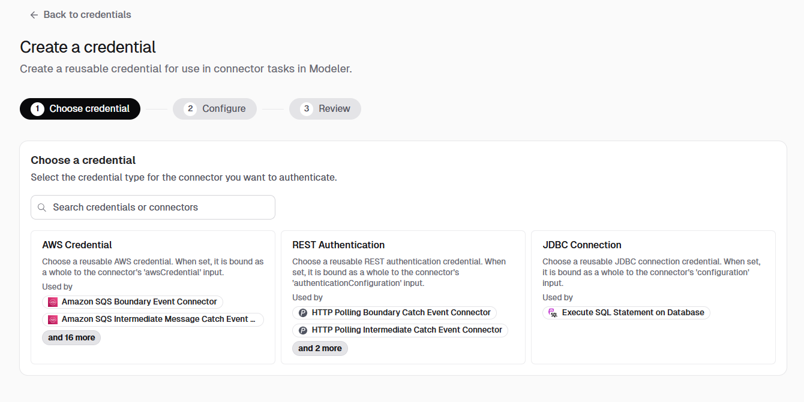
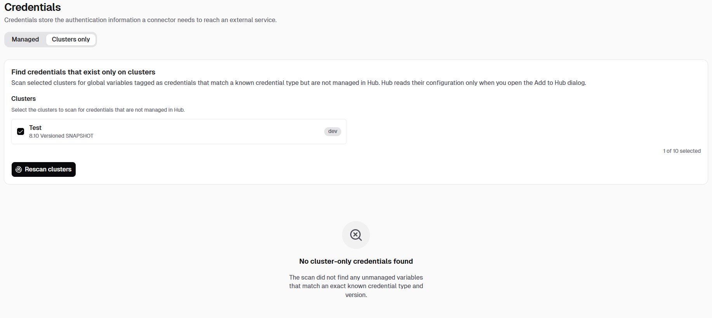

A credential is reusable configuration for a job worker, connector, or other element template, so you don't repeat the same authentication and connection settings on every task.

## About credentials

- A credential lets you define and manage reusable configuration for job workers, connectors, and other element templates, instead of entering the same settings every time one asks for them.
- Credentials are generally usable infrastructure, available in any Camunda 8 distribution, including standalone ones that run without Hub. Camunda Hub adds an organization-wide, federated view and central management across your clusters, which is what the rest of this page covers.
- A credential type is defined alongside an element template, through an embedded [configuration template](/components/modeler/element-templates/template-metadata.md#embedding-configurations-configurationtemplates). If you build custom connectors or job workers and want to define your own credential type, see [Create a credential template](/components/connectors/custom-built-connectors/credential-templates.md).
- A credential is stored as a cluster variable, which makes it available by name to any job worker or connector that references it.

A credential is selected as a whole: an element template never renders or edits a credential's fields. It writes a reference to the chosen credential into the diagram, and the engine resolves that reference at runtime, passing the credential's values, including any secrets, to the job worker or connector.

Learn more:

- [Using credentials](/components/connectors/use-connectors/index.md#using-credentials): how a connector task uses a credential.
- [Configuration input type](/components/modeler/element-templates/template-properties.md#configuration-input-type): how an element template declares the `Configuration` property that renders the credential picker.
- [Configure credentials in the modeling interface](./modeling-interface.md): how to choose, create, edit, or upgrade a credential from the properties panel.

## Terminology

| Term            | Meaning                                                                                                                                                                                                                                                   |
| --------------- | --------------------------------------------------------------------------------------------------------------------------------------------------------------------------------------------------------------------------------------------------------- |
| Credential      | The reusable object you create and then select on an element template field, such as a connector task or a job worker's configuration.                                                                                                                    |
| Credential type | The shape of a credential, such as **AWS Credential**, **REST Authentication**, or **JDBC Connection**. A credential type defines which fields a credential of that type has.                                                                             |
| Configuration   | The element template property type that renders the credential picker. A credential is a configuration whose kind is `CREDENTIAL`. See [Configuration input type](/components/modeler/element-templates/template-properties.md#configuration-input-type). |

## Credentials and connector secrets

Credentials and [connector secrets](/components/hub/organization/manage-clusters/manage-secrets.md) work together rather than replacing each other:

|         | Connector secret                             | Credential                                                      |
| ------- | -------------------------------------------- | --------------------------------------------------------------- |
| Stores  | A single sensitive value, such as an API key | A complete, typed set of authentication and connection settings |
| Scope   | One cluster                                  | One or more clusters, managed from your organization            |
| Used by | Any connector field that supports secrets    | A connector's credential field                                  |

A credential's sensitive fields reference secrets, so the secret is still where the sensitive value lives. Create the secret first, then reference it from the credential.

To reference a secret from a credential field, use `camunda.secrets.` followed by the secret key. For example, reference a secret with the key `AWS_SECRET_KEY` as follows:

```
camunda.secrets.AWS_SECRET_KEY
```

:::note
Credential fields use `camunda.secrets.MY_API_KEY`, without braces. This is not the same as the `{{secrets.MY_API_KEY}}` syntax you use in a [connector field](/components/connectors/use-connectors/index.md#using-secrets). Use `camunda.secrets.` inside a credential, and `{{secrets.}}` in connector fields that support secrets.
:::

## Credential types

Camunda provides a credential type for each family of connectors that supports credentials. The following types are available:

| Credential type     | Bound to the connector's input | Example connectors                                                              |
| ------------------- | ------------------------------ | ------------------------------------------------------------------------------- |
| AWS Credential      | `awsCredential`                | Amazon SQS, Amazon S3, Amazon Bedrock, and other Amazon Web Services connectors |
| REST Authentication | `authenticationConfiguration`  | HTTP Polling, HTTP REST, and GraphQL connectors                                 |
| JDBC Connection     | `configuration`                | Execute SQL Statement on Database                                               |

More connectors gain credential support over time, so this list grows. Each credential type card in the **Create a credential** wizard lists the connectors that currently use that type under **Used by**.

## Manage credentials in Hub

Camunda Hub provides a **Credentials** page for your organization. It has two tabs:

- **Managed**: credentials that Hub creates and manages. Use this tab to create, edit, and delete credentials.
- **Clusters only**: credentials that exist on a cluster but are not managed in Hub, typically because they were created from Desktop Modeler or directly through the cluster API.

### Managed credentials

Before you create your first credential, the **Managed** tab shows an empty state with a **Create credential** button.



Once credentials exist, this tab lists them with their name, credential type, state, and when they were last modified.

### Create a credential

To create a credential, select **Create credential**, and complete the three steps of the wizard.

1. **Choose credential**: select the credential type for the connector you want to authenticate. Each card describes the credential type and lists the connectors that use it. Use the search field to search by credential type or by connector name.

   

2. **Configure**: name the credential, choose which clusters it applies to, and fill in the fields for the credential type you selected.

   Camunda suggests an ID for the credential based on the name you enter. You can change the ID while you are creating the credential, but not afterwards. For a sensitive field, enter a reference to an existing secret, such as `camunda.secrets.AWS_SECRET_KEY`, rather than the value itself.

   If you select more than one cluster, keep **Use same credentials for all clusters** enabled to apply one set of values everywhere, or disable it to configure each cluster separately.

3. **Review**: check the summary, then select **Create** to save the credential and deploy it to the clusters you selected.

You can also save the credential as a draft at any step. A draft is saved in Hub but is not deployed to any cluster.

:::note
You cannot create a secret while creating a credential. Add the secret to the cluster first in [Connector secrets](/components/hub/organization/manage-clusters/manage-secrets.md), then reference it here. A credential's ID also cannot be changed after you create it, so to rename a credential, delete it and create a new one.
:::

### Credential states

The **Managed** tab shows a state for each credential. Hub checks the state in the background after the list loads, so a state can take a moment to appear. Refresh the list to check again.

| State        | Meaning                                                                                                                               |
| ------------ | ------------------------------------------------------------------------------------------------------------------------------------- |
| Active       | The credential is deployed to every cluster you selected, and every secret it references exists on those clusters.                    |
| Warning      | The credential is deployed to at least one cluster, but it is missing from another cluster, or a secret it references does not exist. |
| Not deployed | The credential is not present on any cluster. Drafts always have this state.                                                          |

A credential in the **Warning** state is still deployed. Processes that use it can fail at runtime if the missing secret or cluster is the one they rely on.

### Edit a credential

Select a credential from the **Managed** tab to open it, then edit its values. The credential's ID is shown but cannot be changed. Saving your changes redeploys the credential to its clusters.

### Delete a credential

Deleting a credential removes it from Hub and from every cluster it is deployed to. Hub asks you to confirm, and lists the clusters that are affected.

:::warning
Editing or deleting a credential takes effect immediately for every process that references it. Running process instances can fail if the credential no longer works or no longer exists.
:::

### Clusters only credentials

A credential created outside Hub, such as one created in Desktop Modeler or directly through the cluster API, exists on its cluster but is not tracked in Hub. The **Clusters only** tab finds these credentials so you can bring them under Hub management.

1. Under **Clusters**, select the clusters you want to scan. You can select up to 10 clusters.
2. Select **Scan clusters**. Hub scans each selected cluster for global variables that are tagged as credentials and that match a known credential type.
3. Select **Add to Hub** on a result to manage that credential in Hub. Hub reads the credential's configuration only when you open the **Add to Hub** dialog.

Select **Rescan clusters** to run the scan again, for example after a credential is created outside Hub.



If the scan returns no results, no cluster you selected has a credential-tagged variable that matches a known credential type and version. Clusters that are paused, or that run a Camunda version without credential support, are marked as such and cannot be scanned.

## Permissions

Anyone with read access to your organization in Hub can see the **Credentials** page and the credentials it lists, including their configuration.

Creating, editing, and deleting a credential requires the same permission as deploying a diagram to a cluster. There is no separate credential permission.

## Known limitations

:::note
In this release:

- You cannot create a secret from a credential. Create secrets in [Connector secrets](/components/hub/organization/manage-clusters/manage-secrets.md) first.
- Hub does not show which processes use a given credential, so check the impact yourself before you edit or delete one.
- Credentials are visible to everyone with read access to your organization. You cannot restrict a credential to a project or a subset of users.
- A credential's ID cannot be changed after creation.
- Credentials are edited in place, with no history of previous values.

:::

## Next steps

- [Configure credentials in the modeling interface](./modeling-interface.md)
- [Connector secrets](/components/hub/organization/manage-clusters/manage-secrets.md)
