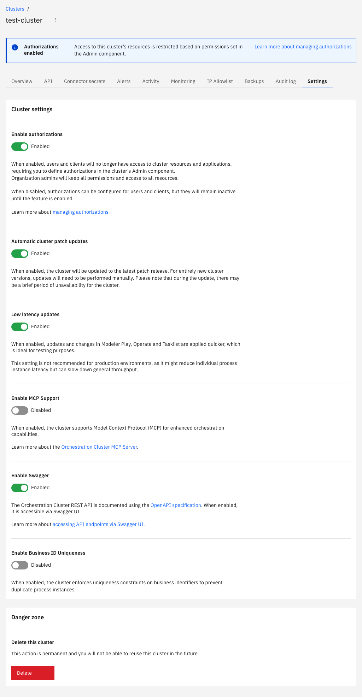

Manage your cluster settings using authorizations, automatic cluster updates, and user task restrictions, or permanently delete the cluster.

## Manage cluster settings

To manage your cluster settings:

1. Navigate to **Camunda Hub**, and select the **Clusters** tab.
2. Select the cluster you want to manage, and select the **Settings** tab.
3. Enable/disable cluster settings as required, or delete the cluster.

## Authorizations

You can enable authorizations on a per-cluster basis to control the level of access users and clients have over Orchestration Cluster resources.

- Enable this setting to use [authorizations](/components/concepts/access-control/authorizations.md) in the cluster.
- Disable this setting if you do not want to use authorizations in the cluster. You can still configure authorizations in the Orchestration Cluster Admin, but they are only applied to the cluster when you enable this setting.

:::tip
Learn more about [resource-based authorizations](/components/concepts/access-control/authorizations.md).
:::

## Multi-tenancy

You can enable multi-tenancy checks on a per-cluster basis to enforce tenant-level authorization for Orchestration Cluster resources.

:::note
This setting applies to Camunda 8 SaaS. In Self-Managed, multi-tenancy checks are not configured through this UI — set them using [configuration properties](/self-managed/components/orchestration-cluster/core-settings/configuration/properties.md#multi-tenancy) at startup.
:::

- Enable this setting to enforce tenant-level authorization checks. Users, groups, and roles not assigned to a tenant lose access to any resources scoped to that tenant.
- Disable this setting to allow tenants to be created and principals assigned without enforcing checks. All data maps to the `<default>` tenant.

This setting is disabled by default. Only organization admins can change it, and it is available for clusters running generation 8.8 and later. The setting is reversible: disabling it restores the implicit `<default>`-tenant behavior.

For details on creating tenants and managing assignments, see [tenant management](/components/admin/tenant.md).

:::warning
Before you enable multi-tenancy checks, assign all users, groups, and roles that need access to their tenants and to the `<default>` tenant. Once checks are enforced, any principal not assigned to a tenant loses access to the resources scoped to that tenant.
:::

## Data filters

<!-- TODO: Confirm with Console team (camunda-cloud-management-apps#8885) which exact docs anchor the Console UI tooltip links to. Update the #data-filters anchor below if different. -->

<!-- TODO: Confirm whether data filters are available on trial plans or restricted to paid plans (Q6 - tied to Optimize re-enable on trial)? -->

You can configure data filters on a per-cluster basis to control which process definitions and variables the Optimize exporter processes.

:::note
This setting applies to Camunda 8 SaaS. On Self-Managed, configure export filters using [Helm values or configuration properties](/self-managed/components/optimize/configuration/optimize-export-filtering.md).
:::

Enable the **Enable data filters** toggle to activate filtering. When enabled, the Optimize exporter only processes data matching the configured filters.

Enter one pattern per line, or separate values with spaces, in any of the four fields:

- **Include process definitions**: process definitions to include, matched by exact `bpmnProcessId`. Leave empty to include all process definitions.
- **Exclude process definitions**: process definitions to exclude, matched by exact `bpmnProcessId`. Exclusion takes precedence over inclusion.
- **Include variable names**: variable names to include, matched by prefix. For example, entering `business_` includes all variables whose names start with `business_`. Leave empty to include all variables.
- **Exclude variable names**: variable names to exclude, matched by prefix. Exclusion takes precedence over inclusion.

:::note
New SaaS clusters include a default `business_` variable include filter, which limits Optimize to variables whose names start with `business_`. Existing clusters show data filters disabled with a one-click opt-in — no automatic migration occurs. On Self-Managed, no default filter is applied; configure filters manually using [Helm values or configuration properties](/self-managed/components/optimize/configuration/optimize-export-filtering.md).
:::

:::warning
Filtered records are permanently excluded from Optimize. Optimize cannot import data that was never exported, and dropped records cannot be recovered even if you change the filters later. For details, see [Optimize export filtering](/self-managed/components/optimize/configuration/optimize-export-filtering.md).
:::

Clicking **Save filters** restarts the cluster. Your cluster is briefly unavailable while it restarts.

For sizing guidance on variable filtering and its impact on Optimize, see [impact of Optimize](/components/best-practices/architecture/sizing-your-environment.md#impact-of-optimize).

## Automatic cluster updates

You can set the cluster to automatically update to newer versions of Camunda 8 when they are released.

- Enable this setting to automatically update the cluster when a new patch release is available. During an update, the cluster may be unavailable for a short time. You can still manually update the cluster.
- Disable this setting if you do not want the cluster to automatically update. You must manually update the cluster.

:::tip
For more information on updating clusters, see [update your cluster](/components/hub/organization/manage-clusters/manage-cluster.md#update-a-cluster).
:::

## Enforce user task restrictions

Starting with Camunda 8.10, this cluster setting is no longer available because user task access restrictions were removed together with Tasklist V1.

:::note
Use [authorization-based access control](../../../concepts/access-control/authorizations.md) and [user task authorization](/components/tasklist/user-task-authorization.md) to control task visibility and operations in current Tasklist deployments.
:::

## Delete this cluster

You can _permanently_ delete the selected cluster. See [delete your cluster](/components/hub/organization/manage-clusters/manage-cluster.md#delete-a-cluster).

:::caution
Deleting a cluster is permanent. You cannot reuse a cluster after it has been deleted.
:::
