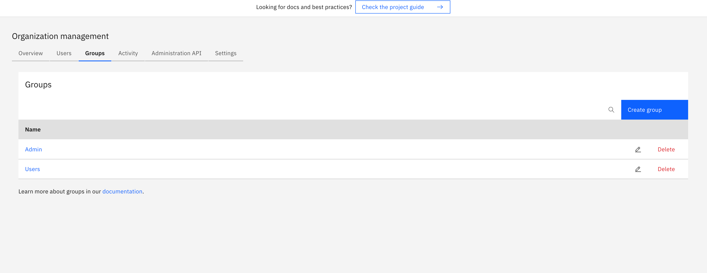
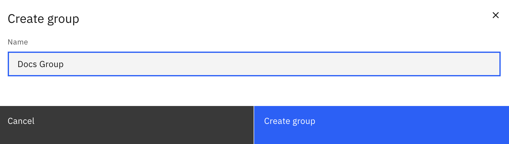
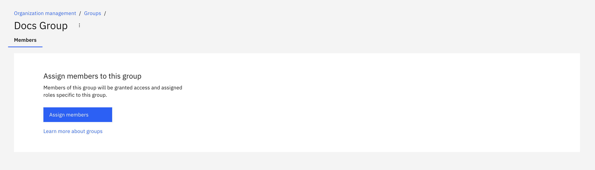
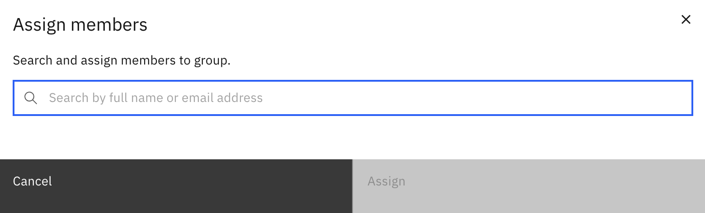

Organize users into groups within your organization.

## Creating a group

To create a group, navigate to the **Organization** section of Camunda Hub and click on the **Groups** tab.

Click **Create a group** and enter the name of the group.

## Adding users to a group

To add users to a group, navigate to the **Organization** section of Camunda Hub and click **Users > Assign members**.

Select the user you want to add to a group and click **Assign**.

## User task access restrictions

:::info
User task access restrictions were removed in Camunda 8.10 together with Tasklist V1. Use [user task authorization](/components/tasklist/user-task-authorization.md) and [authorization-based access control](/components/concepts/access-control/authorizations.md) for current task visibility rules.
:::
