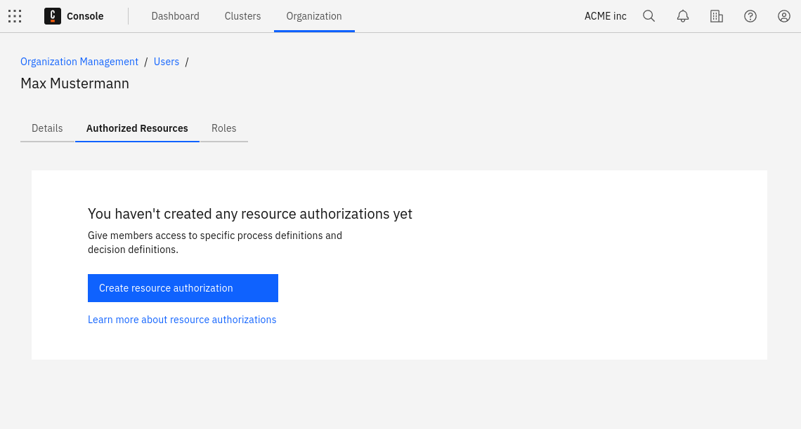
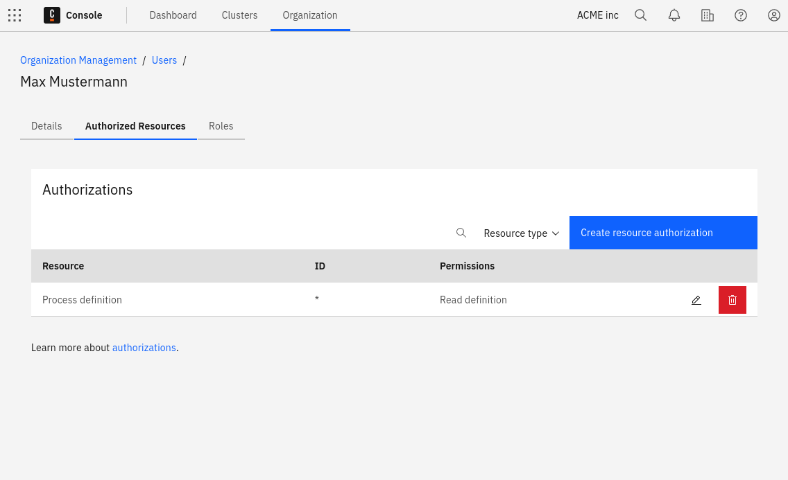

When a user signs up for Camunda 8 as the first user from their organization, company, or group, they become the owner of the Camunda organization. This organization owns Modeler files and Zeebe clusters. The owner and any admins they assign can control access to these resources through managing their organization.

## Users

An owner has all rights in an organization and can manage all settings accordingly. An organization cannot have more than one owner.

To change the owner of the organization, utilize the user administration. The current owner selects another member of the organization, and selects **Assign as owner** from the menu. In the dialog that appears, select which new roles are to be assigned to the current owner.

### Roles and permissions

In addition to the owner, the **Admin** role is available as a second role with comprehensive rights.

The admin role has full access to the platform, process resources, and clusters, but cannot manage other admins.

The following roles are additionally available, providing dedicated rights for specific elements in Camunda 8:

- **Modeler**: Access to Web Modeler for creating and collaborating on projects, except permissions to deploy and run processes. Read-only access to Camunda Hub.
- **Analyst**: Includes Modeler permissions and has full access to Optimize to build process dashboards and reports.

Starting with version 8.8, user access to clusters is managed independently. To control what a user can access, define their authorizations in the cluster's Admin. Learn more [here](/components/admin/authorization.md).

If cluster authorizations are disabled, the user will have full access to the cluster and its components.

Users can be assigned multiple roles. For example, a user can have both **Modeler** and **Analyst** roles, giving them access to Web Modeler and Optimize.

Users are invited to a Camunda 8 organization via their email address, which must be accepted by the user. The user remains in the `Pending` state until the invitation is accepted.

People who do not yet have a Camunda 8 account can also be invited to an organization. To access the organization, the invited individual must first create a Camunda 8 account by following the instructions in the invitation email.

## Resource-based authorizations

Resource authorizations control a user's access to specific resources. To create, update, or delete a user's resource authorizations, select the user's row in the users table.

As of 8.8, authorizations for Orchestration Cluster applications (Zeebe, Operate, and Tasklist) are managed as part of the Orchestration Cluster and configured in [Admin](/self-managed/components/orchestration-cluster/admin/overview.md).

### Creation

To initiate the creation flow, click **Create resource authorization**.

### Updating and deleting

To update an existing authorization, click on the **pencil icon** of the relevant row. To delete an existing authorization, click the **trash can** icon.

## User task access restrictions

:::note
User task access restrictions were removed in Camunda 8.10 together with Tasklist V1.

Use [authorization-based access control](../../../concepts/access-control/authorizations.md) and [user task authorization](/components/tasklist/user-task-authorization.md) to control user access to tasks in the current version.
:::

## Limitations

Depending on the plan to be used, the number of users that can be part of an organization varies.

## Restrictions

In Enterprise plans, the hostname section of the email address for invites can be restricted to meet your internal security policies. [Contact Camunda support](https://camunda.com/services/support/) to get this configured according to your needs.
