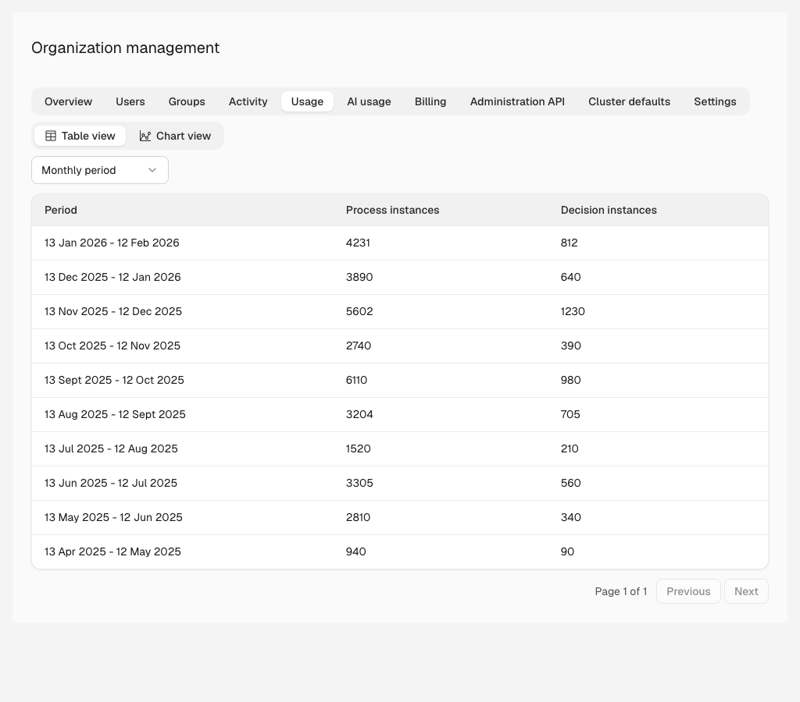
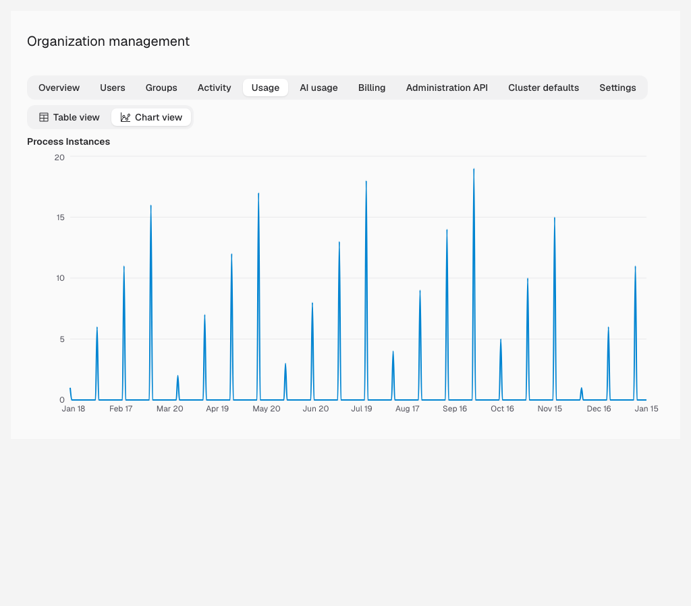

Monitor our workflow usage.

## About usage history

Three key metrics play a role in paid plans:

- Started process instances
- Decision instances
- Task users.

Camunda Hub provides a usage view for these metrics across the organization.

:::note
The usage history is visible only to owners and admins for Trial, Enterprise, and Starter organizations.
:::

## View usage

To view usage history in Camunda Hub:

1. In the left navigation under **Console**, click **Organization**.
1. Open the **Usage** tab.

The section is split into two areas:

- **Table view**: Data from production clusters is displayed aggregated on a monthly basis.

  

- **Chart view**: Data from production and development clusters is displayed in charts and allows a closer look into usage patterns and spikes by customizing the date ranges.

  
