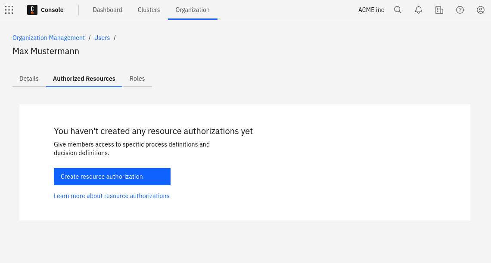
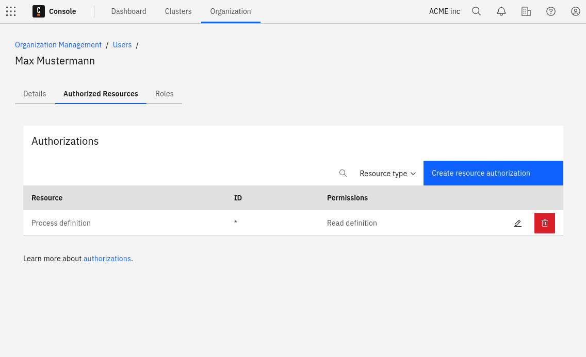

When a user signs up for Camunda 8 as the first user from their organization, company, or group, they become the Organization Owner of the Camunda organization. This organization owns Camunda Hub workspaces, projects, and clusters. The Organization Owner and any Organization Admins they assign can control access to these resources by managing their organization.

## Users

The Organization Owner has all rights in an organization and can manage all settings accordingly. An organization cannot have more than one Organization Owner.

To change the Organization Owner, use the user administration. The current owner selects another user of the organization and clicks **Assign as owner** from the menu. In the dialog that appears, select the role to assign to the current owner after the transfer.

### Roles and permissions

Every user holds one organization-level role. Organization Owner, Organization Admin, Analyst, and Member form a ladder, where each role includes everything the role below it can do. **DevOps** is a specialized role for infrastructure management that sits outside this ladder.

| Role               | Organization | Workspaces and projects | Clusters  | Catalog   | Optimize |
| :----------------- | :----------- | :---------------------- | :-------- | :-------- | :------- |
| Organization Owner | Full access  | Manage                  | Manage    | Manage    | Yes      |
| Organization Admin | Manage       | Manage                  | Manage    | Manage    | Yes      |
| Analyst            | Read-only    | Create and collaborate  | Read-only | Manage    | Yes      |
| Member             | Read-only    | Create and collaborate  | Read-only | Read-only | No       |
| DevOps             | None         | Create and collaborate  | Manage    | Read-only | No       |

- **Organization Owner**: All rights in the organization, including settings, billing, and ownership transfer. Reserved for a single user per organization; transferred rather than assigned or removed like other roles.
- **Organization Admin**: Manages the organization, its members, and its workspaces, with full access to every workspace and project by default — no separate mode needs to be enabled.
- **Analyst**: Includes everything a Member can do, plus full access to Optimize to build process dashboards and reports. Access to specific dashboards and reports within Optimize is governed separately by [Optimize collection roles](/components/optimize/userguide/user-permissions.md).
- **Member**: Full access to create and collaborate on workspaces and projects, plus read-only visibility into the organization and its clusters.
- **DevOps**: A specialized role for infrastructure management, not people management. Grants cluster create and update, cluster clients, connector secrets, IP allowlisting, secure connectivity, encryption, and the connector-management view, plus Member-level modeling. Cannot manage or view organization members, billing, or organization settings.

Catalog access has two levels: **Read-only** (browse and use catalog items) for Member and DevOps, and **Manage** (also see usage statistics and adoption data) for Analyst, Organization Admin, and Organization Owner.

Starting with version 8.8, user access to clusters' Operate, Tasklist, and Zeebe applications is managed independently of the organization role. To control what a user can access there, define their authorizations in the cluster's [Admin](/components/admin/authorization.md).

If cluster authorizations are disabled, the user will have full access to the cluster and its components.

#### Other roles

Beyond the roles above, an organization may show a few additional roles depending on its history:

- **Developer** _(deprecated)_: No longer offered for new assignment. Existing holders keep their current permissions unchanged; they are not automatically moved to another role.
- **Task user** and **Visitor** _(legacy)_: Available only for organizations with at least one cluster on version 8.7 or older, alongside a user's organization-level role. They govern access to the older cluster apps and disappear once no such clusters remain.
- **Support agent** _(internal)_: Used only by the Camunda support team. Not assignable by customers.

Users are invited to a Camunda 8 organization via their email address, which must be accepted by the user. The user remains in the `Pending` state until the invitation is accepted.

People who do not yet have a Camunda 8 account can also be invited to an organization. To access the organization, the invited individual must first create a Camunda 8 account by following the instructions in the invitation email.

## Resource-based authorizations

Resource authorizations control a user's access to specific resources. To create, update, or delete a user's resource authorizations, select the user's row in the users table.

As of 8.8, authorizations for Orchestration Cluster applications (Zeebe, Operate, and Tasklist) are managed as part of the Orchestration Cluster and configured in [Admin](/self-managed/components/orchestration-cluster/admin/overview.md).

### Creation

To initiate the creation flow, click **Create resource authorization**.

### Updating and deleting

To update an existing authorization, click on the **pencil icon** of the relevant row. To delete an existing authorization, click the **trash can** icon.

## User task access restrictions

:::note
User task access restrictions were removed in Camunda 8.10 together with Tasklist V1.

Use [authorization-based access control](../../../concepts/access-control/authorizations.md) and [user task authorization](/components/tasklist/user-task-authorization.md) to control user access to tasks in the current version.
:::

## Limitations

Depending on the plan to be used, the number of users that can be part of an organization varies.

## Restrictions

In Enterprise plans, the hostname section of the email address for invites can be restricted to meet your internal security policies. [Contact Camunda support](https://camunda.com/services/support/) to get this configured according to your needs.
