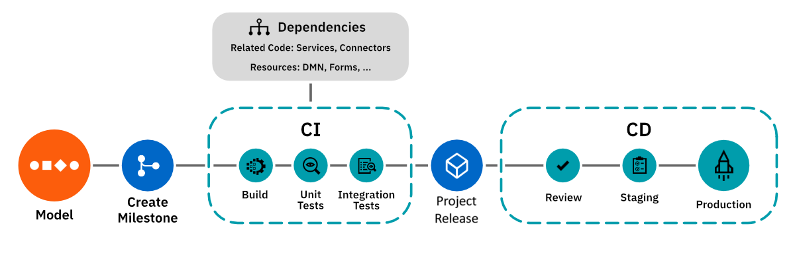

import Tabs from "@theme/Tabs";
import TabItem from "@theme/TabItem";

<span class="badge badge--intermediate">Intermediate</span>
<span class="badge badge--medium">Time estimate: 1 hour</span>

Empower DevOps with Camunda Hub and integrate into CI/CD pipelines to streamline deployments of projects.

## About

[Camunda Hub](/components/modeler/about-modeler.md) serves as a powerful tool for the development and deployment of processes and projects. While Camunda Hub simplifies one-click deployment for development, professional teams often rely on continuous integration and continuous deployment (CI/CD) pipelines for automated production deployments. The [Camunda Hub API](/apis-tools/hub-api-sm/overview.md) facilitates integration of Camunda Hub into these pipelines, aligning with team practices and organizational process governance.

- For low-risk processes, develop and progress project releases through the stages of the standard [project development lifecycle](/components/hub/workspace/manage-projects/manage-projects.md#project-development-lifecycle). [Version comparison](/components/hub/workspace/modeler/modeling/versions.md#compare-versions) (Visual and XML diffing), built in [review](/components/hub/workspace/manage-projects/project-versioning.md#request-a-review), and [Git Sync](/components/hub/workspace/manage-projects/git-sync.md) provide a powerful combination for collaboration between team members using both Camunda Hub and Desktop Modeler.
- For business-critical and higher-risk processes that require strict governance and/or quality requirements, you can integrate Camunda Hub into your CI/CD pipelines.

Continuous integration and deployment are pivotal for rapid and reliable software development, testing, and delivery. These practices automate the building, testing, and deployment processes, leading to shorter development cycles, enhanced collaboration, and higher-quality releases.

Integrating Camunda Hub into your CI/CD pipelines can significantly enhance project development and deployment workflows. By automating project deployment, changes can be promptly and accurately reflected in the production environment. This agility empowers teams to swiftly respond to evolving business needs, fostering a flexible and adaptable process orchestration approach.

## Prerequisites

Each pipeline is unique. The Camunda Hub API offers flexibility to tailor integrations according to your pipelines. To get started, there are a few prerequisites based on your setup:

- A platform to host a version control system (VCS) such as GitHub or GitLab.
- An existing pipeline or a plan to set one up using tools like [CircleCI](https://circleci.com/) or [Jenkins](https://www.jenkins.io/), cloud platforms such as [Azure DevOps Pipelines](https://azure.microsoft.com/de-de/products/devops), or built-in solutions of VCS platforms like [GitHub Actions](https://github.com/features/actions) or [GitLab's DevSecOps Lifecycle](https://about.gitlab.com/stages-devops-lifecycle/).
- Familiarize yourself with the [Camunda Hub API](/apis-tools/hub-api-sm/overview.md).
- Understand how [clusters](/components/concepts/clusters.md) work in Camunda 8.
- Ensure you’ve [created a Camunda 8 account](/components/hub/organization/manage-organization-settings/manage-plan/create-account.md), or installed [Camunda 8 Self-Managed](/self-managed/about-self-managed.md).

## Setup

:::tip CI/CD pipeline process blueprint

The Camunda Marketplace offers a customizable [process blueprint for CI/CD pipelines](https://marketplace.camunda.com/en-US/apps/439170/cicd-pipeline) to streamline the setup process described below.
This blueprint provides a ready-to-use proof of concept for a CI/CD pipeline for Camunda Hub, enabling you to synchronize Camunda Hub files to GitLab and deploy them across different environments.

:::

While a pipeline for project integration and deployment resembles general software CI/CD pipelines, key distinctions exist. Consider the following:

- Camunda Hub uses [versions](/components/hub/workspace/modeler/modeling/versions.md) to indicate specific process states, such as readiness for developer handover, review, or deployment.
- A project comprises diverse resources, such as processes, subprocesses, forms, DMN decision models, connectors, job workers, and orchestrated services. Some projects bundle these resources, while others focus on a single process for deployment.
- Process reviews differ from code reviews, occurring on visual diagrams rather than XML.



### Obtain API clients and tokens

Before getting started, obtain API clients and tokens for integrating Camunda Hub and accessing the process engine via API:

- [Obtain an API token for Camunda Hub](/apis-tools/hub-api-sm/authentication.md)
- [Obtain an API client for Zeebe](/components/hub/organization/manage-clusters/manage-api-clients.md#create-a-client)

### Disable manual deployments from Camunda Hub

To enforce pipeline-driven deployments to your environments, consider disabling manual deployments.

<Tabs groupId="disableDeployments" defaultValue="sm" values={[{label: 'Self-Managed', value: 'sm', }, {label: 'SaaS', value: 'saas', },]} >
<TabItem value="sm">

Disable manual deployments for any member by configuring environment variables `ZEEBE_BPMN_DEPLOYMENT_ENABLED` and `ZEEBE_DMN_DEPLOYMENT_ENABLED` as documented [here](/self-managed/components/hub/configuration/properties.md#general).

</TabItem>
<TabItem value="saas">

Users without **Organization Owner** or **Organization Admin** roles in Camunda Hub can deploy only on `dev`, `test`, or `stage` clusters. To restrict their deployment permissions, remove the now-deprecated **Developer** role from users in Camunda Hub.

:::info
Only users with **Organization Owner** or **Organization Admin** roles can deploy from Camunda Hub to `prod` clusters.
:::

Read more in the [user roles documentation](/components/hub/organization/manage-users/manage-users.md).

</TabItem>
</Tabs>

### Triggering CI/CD

You need triggers to initiate the pipeline for files or projects. Choose between manual pipeline start or automatic background triggers based on events. Common approaches include:

- Initiating the pipeline manually from your CI/CD tool/platform by uploading the file intended for deployment.
- Starting the CI pipeline by creating a pull/merge request in the version control system.
- Triggering pipelines by listening to versions with certain characteristics.

#### Sync files with version control

Synchronize files between Camunda Hub and version control systems (VCS) and vice versa. Manage both files and projects by using a complete set of CRUD (create, read, update, delete) operations provided by the Camunda Hub API. By syncing files from Camunda Hub to your VCS, you benefit from full file ownership and avoid duplicated data housekeeping.

For automatic file synchronization, consider maintaining a secondary system of record for mapping Camunda Hub projects to VCS repositories. This system also monitors the project-to-repository mapping and updates timestamps.

#### Example: Poll latest file edits

To listen to file changes in Camunda Hub, you currently need to implement a polling approach that compares the update dates with the last sync dates recorded.

[Search for project files](/apis-tools/hub-api-sm/specifications/search-files.api.mdx) that have been updated since the last sync:

```json title="POST /api/v2/files/search"
{
  "filter": {
    "projectKey": "56a98f55-7c53-4e7b-83b7-c58856ee39e4",
    "updated": {
      "$gt": "2026-08-30T09:22:15.665653Z"
    }
  },
  "page": {
    "from": 0,
    "limit": 50
  }
}
```

:::note
All responses for `search` endpoints are paginated. Make sure you obtain all relevant pages.
:::

[Get the content for each file](/apis-tools/hub-api-sm/specifications/get-file.api.mdx):

```shell
GET /api/v2/files/{fileKey}
```

With this file data, you can create a pull request and sync the file contents with your repository.

Real-time synchronization isn't always what you need. Consider Camunda Hub as a local repository, and update your remote repository only after files are committed and pushed. This aligns with the concept of [versions](/components/hub/workspace/modeler/modeling/versions.md).

#### Example: Poll new file versions

A version reflects a state of a file in Camunda Hub with a certain level of qualification, such as being ready for deployment. You can use this property to trigger deployments when a certain version is created. You can poll the Camunda Hub API to know when a project file has a new version.

[Search for all project files](/apis-tools/hub-api-sm/specifications/search-files.api.mdx):

```json title="POST /api/v2/files/search"
{
  "filter": {
    "projectKey": "56a98f55-7c53-4e7b-83b7-c58856ee39e4"
  },
  "page": {
    "from": 0,
    "limit": 50
  }
}
```

This returns a list of files. You'll use the `fileKey` property to search for versions.

[Get the file versions](/apis-tools/hub-api-sm/specifications/search-versions.api.mdx) for all project files. Filter for files whose versions are newer than the last sync date:

```json title="/api/v2/versions/search"
{
  "filter": {
    "fileKey": {
      "$in": [
        "2afd9a1e-5ea8-43e3-b45b-6fb96b384a14",
        "2386e244-b2c0-4feb-8b68-4429c0cdf0c5"
      ]
    },
    "created": {
      "$gt": "2026-08-31T11:07:45.924036Z"
    }
  },
  "page": {
    "from": 0,
    "limit": 50
  }
}
```

[Get the content for each version](/apis-tools/hub-api-sm/specifications/get-version.api.mdx):

```shell
GET /api/v2/versions/{versionKey}
```

With this version data, you can create a pull request and sync the file contents with your repository.

## Pipeline stages

The following examples illustrate setting up **build**, **test**, **review**, and **publish** stages within a pipeline.

### Build stage

While there is no distinct concept for a build package in Camunda 8, artifact structuring depends on your overall software architecture. The build stage should primarily focus on acquiring dependencies and deploying them to a preview environment.

#### Set up preview environments

Offering an automatically testable and review-ready process preview mandates a dedicated preview cluster. Numerous options exist, varying with software development lifecycle design, preferences, and Camunda 8 deployment type (SaaS, Self-Managed, or hybrid). This guide proposes a setup with lightweight local Self-Managed preview clusters (or embedded engines) and full-fledged staging and production clusters (Self-Managed or SaaS).

##### Using fully-featured clusters

For local preview environments, you can deploy a comprehensive [Zeebe](https://github.com/camunda/camunda) cluster including Operate and Tasklist. Options include using docker-compose or Kubernetes via Helm. All necessary endpoints and UIs are available for thorough process/application testing. Opt for a cluster version aligned with your production cluster to ensure process compatibility.

##### Using embedded Zeebe engines

If you don't need to spawn all apps such as Operate or Tasklist, you can use the lightweight [embedded Zeebe engine](https://github.com/camunda-community-hub/eze), which is a community-maintained project, to set up a cost-effective solution with an in-memory database. Together with the [Zeebe Hazelcast exporter](https://github.com/camunda-community-hub/zeebe-hazelcast-exporter) (community-maintained as well), you can consume data generated from your process for reporting or testing.

In the build stage, deploy your process or project to a cluster or embedded engine. Post-pipeline completion, such as deployment to staging or production, preview environments can be discarded.

:::tip
For GitLab users, consider using [GitLab Review Apps](https://docs.gitlab.com/ee/ci/review_apps/) to provide preview environments.
:::

Deploy resources using the [Orchestration Cluster REST API](/apis-tools/orchestration-cluster-api-rest/orchestration-cluster-api-rest-overview.md) in this pipeline step, compatible with both SaaS and Self-Managed clusters. Alternately, utilize the [Java](/apis-tools/java-client/getting-started.md) client library or any [community-built alternatives](/apis-tools/community-clients/index.md).

:::info Feature branches and Camunda Hub installations
To maintain a single source of truth, avoid multiple Camunda Hub instances for different feature branches. Instead, maintain a single Camunda Hub installation for all environments, utilizing versions to signify versioning and pipeline stages. Feature branches can be managed by cloning and merging files or projects, ensuring synchronization using VCS.
:::

#### Automate deployment of linked resources/dependencies

Pipeline-driven deployment can be executed for a single file or an entire project. A separate system of record, maintained outside Camunda Hub, can handle finer-grained dependency management. Fetch the full project for a file using the `GET /api/v2/files/{fileKey}` endpoint to acquire the project's `projectKey`. Subsequently, use the `POST /api/v2/files/search` endpoint with the following payload to retrieve all project files:

```json title="POST /api/v2/files/search"
{
  "filter": {
    "projectKey": "56a98f55-7c53-4e7b-83b7-c58856ee39e4"
  },
  "page": {
    "from": 0,
    "limit": 50
  }
}
```

:::info
All responses for `search` endpoints are paginated. Make sure you obtain all relevant pages.
:::

To retrieve the actual file `content`, iterate over the response and fetch it via `GET /api/v2/files/{fileKey}`. Parse the XML of the diagram for the `zeebe:taskDefinition` tag to retrieve job worker types. Utilizing a job worker registry mapping, deploy these workers along with the process if required.

If you are running connectors in your process, you need to deploy the runtimes as well. Parse the process XML for `zeebe:taskDefinition` bindings to identify the necessary runtimes (in addition to job workers). To learn how to deploy connector runtimes, read more [here](/self-managed/components/connectors/overview.md) for Self-Managed, or [here](/components/connectors/custom-built-connectors/connector-sdk.md#runtime-environments) for SaaS.

Deploy resources in this pipeline step using the [Orchestration Cluster REST API](/apis-tools/orchestration-cluster-api-rest/orchestration-cluster-api-rest-overview.md), compatible with both SaaS and Self-Managed clusters. Alternatively, utilize the Java client library or any community-built alternatives.

#### Add environment variables via secrets

If you are running connectors, you need to provide environment variables, such as service endpoints and API keys, for your preview environment. You can manage these via secrets. Read the [Connectors configuration documentation](/self-managed/components/connectors/connectors-configuration.md) to learn how to set these up in SaaS or Self-Managed.

### Test stage

Keep strict quality standards for your processes with automatic testing and reporting.

#### Lint your diagrams

Add a step to your pipeline for automatic process verification using the [bpmnlint](https://github.com/bpmn-io/bpmnlint) and [dmnlint](https://github.com/bpmn-io/dmnlint) libraries. Maintained by the bpmn-io team at Camunda, these open source libraries provide a default set of verification rules, as well as the option to add custom rules. They provide reporting capabilities to report back when the verification fails. These are the same libraries Camunda Hub uses to verify diagrams during modeling.

You could even report the wrong diagram patterns together with examples to resolve it using [this extension](https://github.com/bpmn-io/bpmnlint-generate-docs-images).

#### Unit and integration tests

For unit tests, select a test framework suitable for your environment. If working with Java, the [camunda-process-test](/apis-tools/testing/getting-started.md) library is an excellent option. Alternatively, employ the [Java client](/apis-tools/java-client/getting-started.md) with JUnit for testing your BPMN and DMN diagrams in dev or preview environments. Similar testing can be performed using [community-built clients](/apis-tools/community-clients/index.md).

### Review stage

During reviews, you can:

1. Use the Camunda Hub API to [add workspace members](/apis-tools/hub-api-sm/specifications/add-member.api.mdx).
2. [Create a link to a visual diff for reviews](#create-a-link-to-a-visual-diff-for-reviews)
3. Automatically paste them into your GitHub or GitLab pull or merge requests.

This provides you the freedom to let reviews happen where you want them.

After review, use the [`DELETE /api/v2/workspaces/{workspaceKey}/members/{email}` endpoint](/apis-tools/hub-api-sm/specifications/remove-member.api.mdx) to remove members from the workspace.

#### Create a link to a visual diff for reviews

Use versions to indicate a state for review. Use the `POST /api/v2/versions` endpoint to create a new version, and provide a description to reflect the state of this version using the `name` property. The current content of the file is copied over on version creation.

While it is possible to do a diff of your diagrams by comparing the XML in your VCS, this is often not very convenient, and lacks insight into process flow changes. This approach is also less effective when involving business stakeholders in the review.

Instead, you can generate visual diff links for versions:

1. Get the file and version keys from the [search](/apis-tools/hub-api-sm/specifications/search-versions.api.mdx) or [get](/apis-tools/hub-api-sm/specifications/get-version.api.mdx) version API endpoints.
2. Insert the keys into one of the following URL patterns:

| Resource type    | Template URL                                                                     |
| :--------------- | :------------------------------------------------------------------------------- |
| BPMN             | `{baseURL}/diagrams/{fileKey}/versions/{versionKey1}...{versionKey2}`            |
| Element template | `{baseURL}/connector-templates/{fileKey}/versions/{versionKey1}...{versionKey2}` |
| Form             | `{baseURL}/forms/{fileKey}/versions/{versionKey1}...{versionKey2}`               |
| RPA              | `{baseURL}/rpa-scripts/{fileKey}/versions/{versionKey1}...{versionKey2}`         |

#### Review a running project

If deployed in a review environment, processes can be shared with peers for interactive review. For comprehensive review, full clusters inclusive of Operate and Tasklist can be used for process execution. This closely simulates the final experience. To integrate the preview environment with custom applications, leverage the Operate and Tasklist APIs and deploy them within the review environment.

In case you use an embedded Zeebe engine, or want to provide a lightweight, focused review experience, you can use [Zeebe Simple Monitor](https://github.com/camunda-community-hub/zeebe-simple-monitor), which is a community-maintained Web App similar to the [Test mode](/components/hub/workspace/modeler/validation/test-your-process.md) in Camunda Hub. Deploying Zeebe SimpleMonitor allows for thorough process testing and review.

### Publish stage

Push approved changes to staging or production by deploying them to the respective clusters. You can use the [Orchestration Cluster REST API](/apis-tools/orchestration-cluster-api-rest/orchestration-cluster-api-rest-overview.md) to deploy via your pipeline, which works both for a SaaS or Self-Managed cluster.

#### Define authorizations

For clusters with [authorizations](/components/concepts/access-control/authorizations.md) enabled, use the Orchestration Cluster REST API to assign the necessary authorizations through the pipeline. This step ensures appropriate accessibility for process/application stakeholders or updating existing authorizations.

#### Monitoring and error handling

As with any CI/CD integration, it's crucial to set up monitoring and error handling mechanisms. These can include:

- Monitoring the CI/CD pipeline execution for errors and failures.
- Using Operate to catch incidents and send alerts to the pipeline in the test stage.
- Sending notifications or alerts in case of deployment issues in both the build and publish stages.
- Implementing rollback mechanisms in case a faulty BPMN diagram gets deployed.

## FAQ

#### Can I do blue-green deployments on Camunda 8?

Blue-green deployments are possible with Camunda 8 with limitations. While switching clusters is quick for new process instances, audit logs and existing process instances remain tied to the previous cluster. Consider exporting audit logs from Elasticsearch or OpenSearch to your own streams if needed. If you don't have to migrate running process instances, keeping them running on the previous cluster alongside new instances on the new cluster is also an option.

#### Can I implement blue-green deployments with Camunda 8 SaaS?

While blue-green deployments are more straightforward with Self-Managed setups, you can implement similar deployment strategies with Camunda 8 SaaS. Keep in mind the limitations and differences between clusters when planning your deployment approach.

#### How can I prevent manual deployments from Camunda Hub?

To enforce CI/CD pipelines and restrict manual deployments, you can disable manual deployments. For Self-Managed setups, set environment variables `ZEEBE_BPMN_DEPLOYMENT_ENABLED` and `ZEEBE_DMN_DEPLOYMENT_ENABLED`. In Camunda 8 SaaS, manage deployment permissions via [user roles](/components/hub/organization/manage-users/manage-users.md).

#### How can I sync files between Camunda Hub and version control?

Use the Camunda Hub API's CRUD operations to sync files between Camunda Hub and your version control system. Consider maintaining a second system of record to map Camunda Hub projects to VCS repositories and track sync/update dates.

#### How do I listen to version creation in Camunda Hub?

Currently, you need to poll for version creations using the `POST /api/v2/versions/search` endpoint of the Camunda Hub API. Compare the `created` date of versions with your last sync date to identify newly created versions.

#### What is the purpose of the build stage in my pipeline?

The build stage focuses on preparing dependencies and deploying them to a preview environment. This environment provides a preview of your process that can be tested and reviewed by team members.

#### Can I lint my process diagrams for verification?

Yes, you can use the `bpmnlint` and `dmnlint` libraries to automatically verify your process diagrams against predefined rules. These libraries provide reporting capabilities to identify and fix issues during the build stage.

#### How can I perform unit and integration tests on my processes?

You can use [Camunda Process Test](/apis-tools/testing/getting-started.md) for Java-based unit and integration tests, or community-built clients for other programming languages. These libraries allow you to execute your BPMN and DMN diagrams with assertions in your development or preview environments.

#### How do I provide environment variables to connectors in preview environments?

You can manage environment variables for connectors using secrets. This can be set up in both Camunda 8 SaaS and Self-Managed. Refer to the [Connectors configuration documentation](/components/connectors/introduction.md) for details.

#### How can I monitor and handle errors in my CI/CD pipeline?

Implement monitoring mechanisms in your CI/CD pipeline to catch errors and failures during the deployment process. Additionally, consider implementing rollback mechanisms in case a faulty BPMN diagram is deployed.

## Additional resources and next steps

- [Camunda 8 overview](https://bit.ly/3TjNEm7)
- [Camunda Hub API documentation](/apis-tools/hub-api-sm/overview.md)
