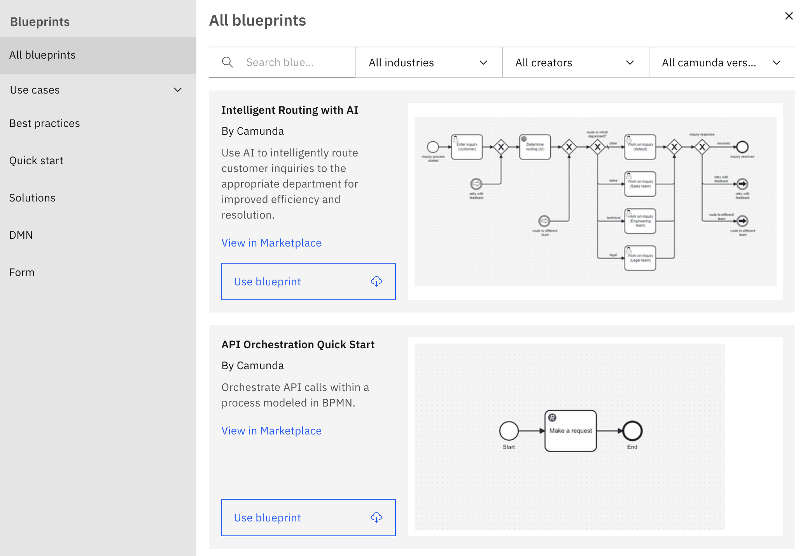
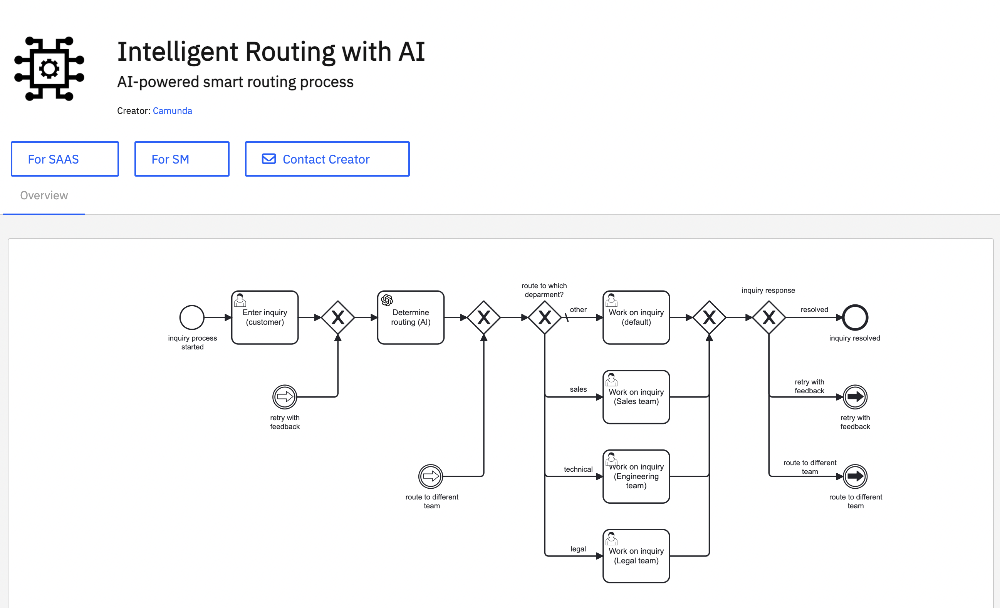

Design and implement your first diagram using Web Modeler, a component of Camunda. Web Modeler also allows you to create BPMN diagrams, DMN diagrams, and forms.

To launch Web Modeler, follow the steps below:

1. After [creating an account and logging in](/components/hub/organization/manage-organization-settings/manage-plan/create-account.md) to Camunda, you are automatically taken to Camunda Hub.
2. In the left navigation, click **Workspaces**, and open a workspace. If you're not invited to a workspace, ask an administrator to [invite](../../organization/manage-workspaces/manage-workspace-members.md) you.
3. In your workspace, click **New project** to create a new project and store diagrams. You can [rename the project](../manage-projects/manage-project.md) at any time.
4. Name your diagram.
5. Select **Browse blueprints** to open the blueprints dialog and browse blueprints for various use cases as a starting point for your first diagram.
   
6. While browsing blueprints, open the details of a specific blueprint by selecting **More details**. This opens a new tab in [Camunda Marketplace](/components/hub/workspace/modeler/modeling/camunda-marketplace.md). Here, have a closer look at the diagram, and open it in SaaS or Self-Managed.
   
7. Open a blueprint by selecting **Use blueprint**, which downloads the blueprint into the project and opens it in the diagram screen. Alternatively, click **Create new > BPMN diagram** to create a blank BPMN diagram.
