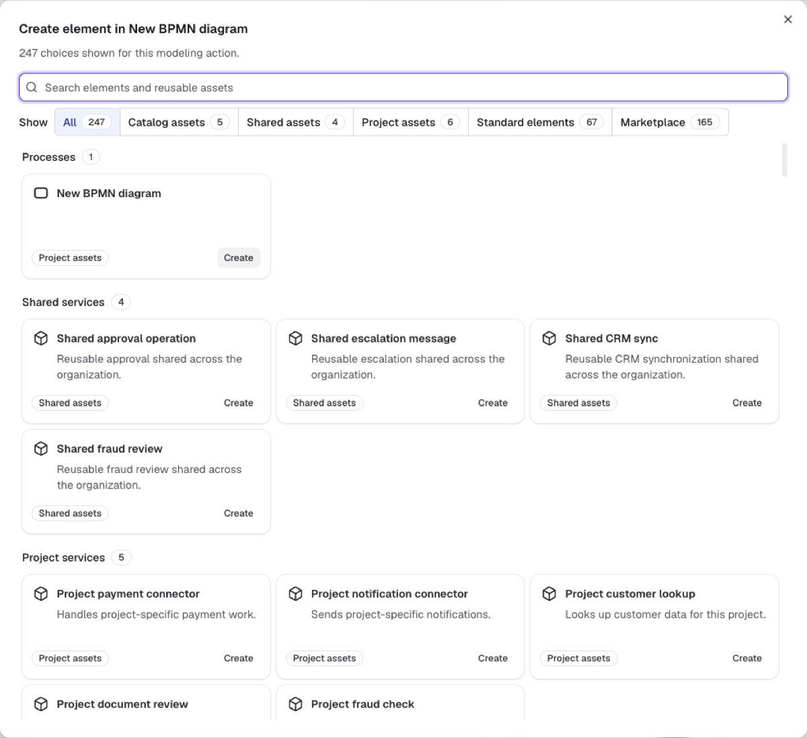
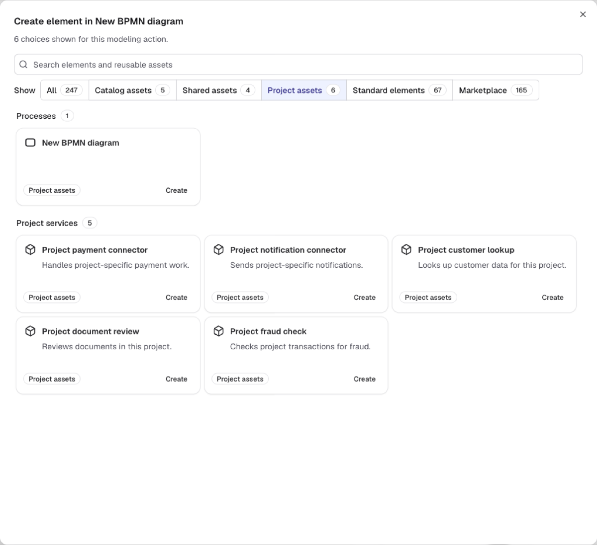
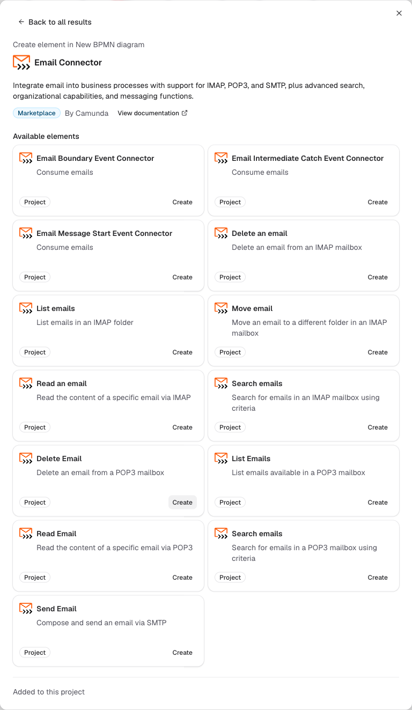

With **Browse all**, you can find and use the resources available for the current modeling action in one place.

## Open Browse all

**Browse all** opens the complete set of choices for the create, append, or change-element action you started.

1. Open an editable BPMN diagram in Camunda Hub.
2. Open one of the following modeling menus:
   - **Create element** from the palette.
   - **Append element** from an element's context pad.
   - **Change element** from an element's context pad.
3. Select **Browse all** at the top of the menu.

The dialog title identifies the action and target. Each card uses the corresponding **Create**, **Append**, or **Change** action.

**Browse all** appears when the contextual menu offers a broad set of choices. If it isn't offered, use the choices in the compact menu. The compact menu can also provide a direct Marketplace action.

## Search and filter resources

The search field and **Show** control narrow the cards available for the current modeling action.

- Search matches resource names, descriptions, groups, and connector operations. A matching operation appears directly in the results.
- The summary, **Show** choices, and section badges report how many cards are currently visible. Counts update with your search and source selection.
- Browse all orders results automatically and doesn't include a manual sort control. Reusable asset groups appear before standard BPMN elements, and Marketplace appears last. Choices you can use appear before unavailable choices in each section.
- Marketplace name matches appear before description matches. Connectors with the same search relevance are ordered by name.

The **Show** control contains **All** and the sources available in your environment:

| Source                | Contents                                                                                                                                                                                    | Availability                                                                                                                                                                          |
| --------------------- | ------------------------------------------------------------------------------------------------------------------------------------------------------------------------------------------- | ------------------------------------------------------------------------------------------------------------------------------------------------------------------------------------- |
| **Catalog assets**    | Governed assets published through the [Camunda catalog](/components/hub/organization/manage-catalog/getting-started.md).                                                                    | Appears when the catalog is enabled and matching assets are available.                                                                                                                |
| **Shared assets**     | Element templates published directly to your organization's shared resources. This source is separate from the catalog.                                                                     | Appears when matching shared templates are available.                                                                                                                                 |
| **Project assets**    | Templates and connectors published or added to the current project, plus linked project resources such as forms, called processes, decisions, and robotic process automation (RPA) scripts. | Appears when matching project resources are available.                                                                                                                                |
| **Built-in**          | Camunda's built-in connectors.                                                                                                                                                              | Appears when built-in connectors are available. This source isn't available in Self-Managed.                                                                                          |
| **Standard elements** | The untemplated BPMN vocabulary valid for the current action, including tasks, gateways, events, and other native modeling choices.                                                         | Appears when matching standard BPMN elements are available.                                                                                                                           |
| **Marketplace**       | Connectors from Camunda Marketplace.                                                                                                                                                        | Appears when Marketplace supports the current action. A Self-Managed administrator can [disable Marketplace](/self-managed/components/hub/configuration/properties.md#feature-flags). |

A source with no matches is hidden. If a search reduces the active source to zero matches, the source remains selected with a count of zero so your filter doesn't change unexpectedly.

## Use a resource

Each result card identifies the resource, its source, and the action you can take.

- Select **Create**, **Append**, or **Change** to use a resource directly.
- Select **View options** when a connector or category contains operations, then choose the operation you need.
- An unavailable card explains why it can't be used for the current element and doesn't offer an action.

## Browse Marketplace connectors

Marketplace is the final section and contains the complete collection that matches the current search and modeling context.

Browsing, filtering, searching, or scrolling Marketplace cards doesn't check which connectors are already in your project. Select **View details** on a connector to check only that connector and review its project availability.

For create and append actions, Marketplace results aren't filtered by BPMN type. For a supported change-element action, results are filtered by the selected element's BPMN type only. Configuration requirements and runtime compatibility can still vary.

A self-hosted connector card opens **View setup instructions** instead of connector details. Follow the linked setup guide to make the connector available in your environment.

If Marketplace can't load after automatically retrying a temporary problem, your local choices remain available and you can select **Try again**. If a refresh fails after Marketplace has loaded, the previously loaded cards remain visible while you retry.

## Check Marketplace project availability

The Marketplace connector details show which connector elements are already available in the current project.

| Status                                     | Meaning and next action                                                                                                                                                      |
| ------------------------------------------ | ---------------------------------------------------------------------------------------------------------------------------------------------------------------------------- |
| **Not added to this project**              | None of the connector's elements are in the project. Review **Included elements**, then select **Add to project**.                                                           |
| **N of M elements added to this project**  | Some elements are already available. You can use those elements immediately or select **Add remaining elements**.                                                            |
| **Added to this project**                  | The connector's applicable elements appear under **Available elements** with direct **Create**, **Append**, or **Change** actions.                                           |
| **Not available for this modeling action** | The connector is in the project, but none of its elements apply to the action you started. The details identify compatible element types when that information is available. |

Adding a connector can open an import review when files need your attention, for example because of a conflict or target-version compatibility warning. After a successful add, the details refresh and show the newly available elements.

The Marketplace serves the latest connector template version. Review [connector template version compatibility](./camunda-marketplace.md#connector-template-versions) if the latest version doesn't support your target Camunda version.

## Use the element-template selector

The element-template selector remains a separate template-only path.

To apply a template through the properties panel, select the element and go to **Details > Properties > Template > Select**. In the **Choose element template** dialog, you can select a published template or use the blue shop icon to open Marketplace.

For complete steps, see [using templates in Camunda Hub](../element-templates/using-templates.md#applying-templates).
