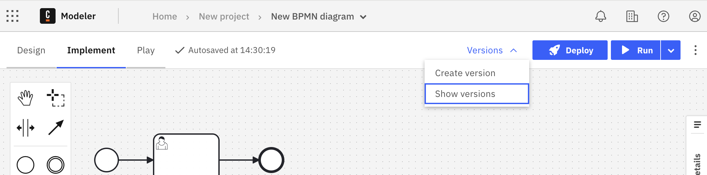
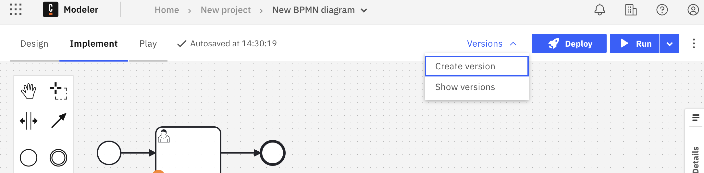
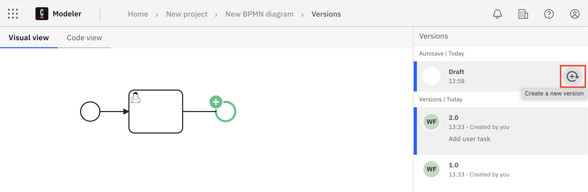
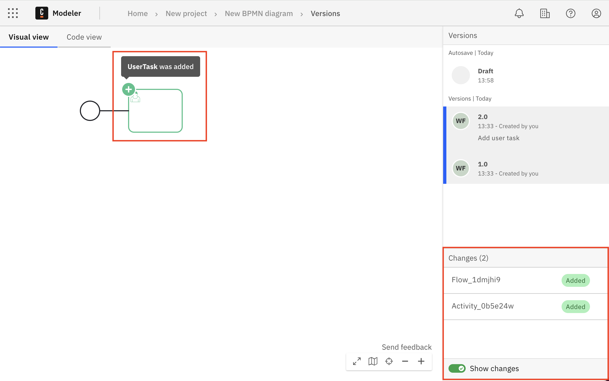
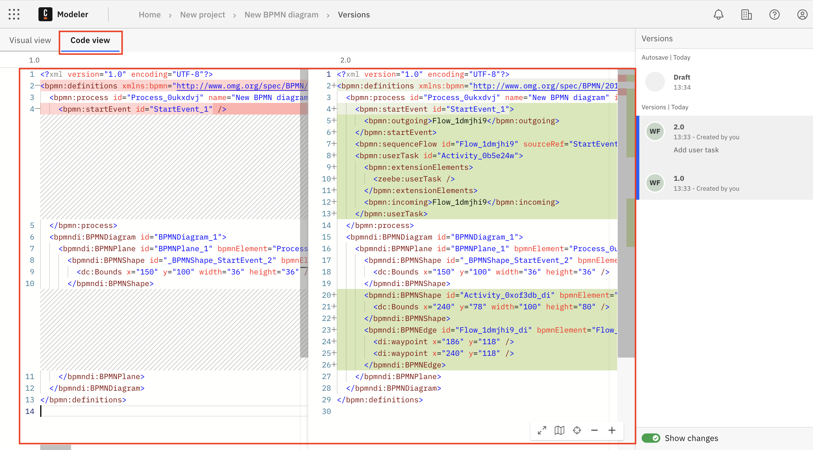
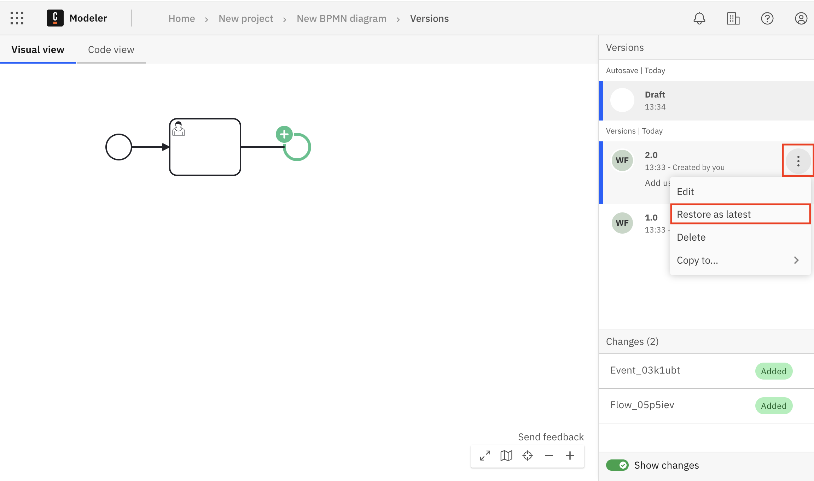
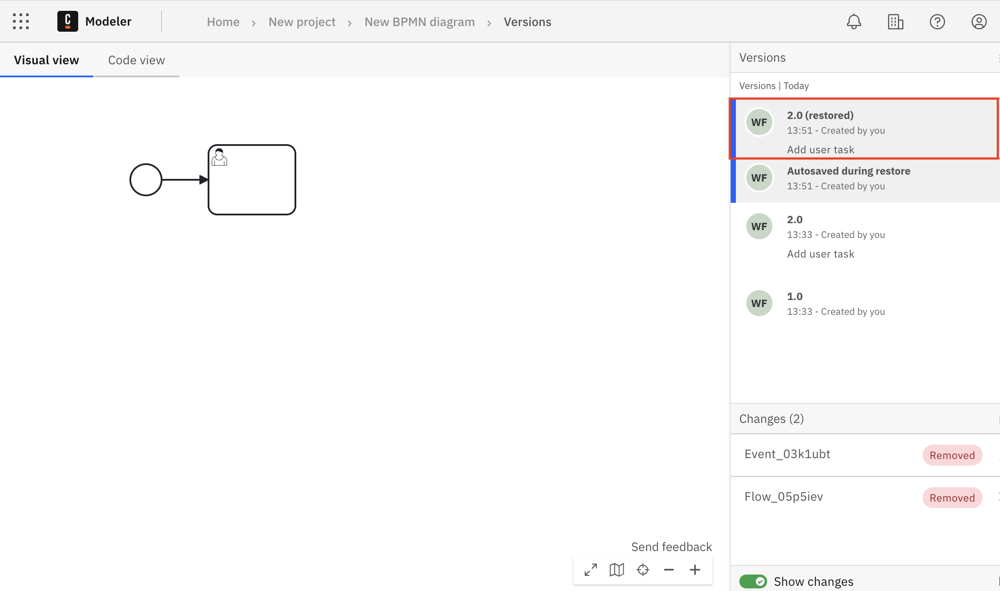

Camunda 8 only

:::note
With 8.7, "milestone" has been renamed to "version". To learn more about this change, see [the related release note](/reference/announcements-release-notes/870/870-release-notes.md#web-modeler-milestones-renamed-to-versions).
:::

Every BPMN diagram, DMN diagram, form, RPA script, README file, and test file keeps a version history, a single timeline of the autosaves and named versions created as you work. You can open that history to view an earlier state of the file, compare any two entries, restore an entry, or copy one to another project.

A version is a Web Modeler snapshot of a file, not a deployed process definition version. See [version (file)](/reference/glossary.md#version-file).

## Files with a version history

The version history page is the same for every file type that uses it:

| File type           | Version history URL          |
| ------------------- | ---------------------------- |
| BPMN or DMN diagram | `/diagrams/<id>/versions`    |
| Form                | `/forms/<id>/versions`       |
| RPA script          | `/rpa-scripts/<id>/versions` |
| README file         | `/readmes/<id>/versions`     |
| Test file           | `/tests/<id>/versions`       |

Element templates and connector templates do not use this page or timeline. They use numbered template versions that you publish to your project or organization. Restoring an element template version publishes its content as a new numbered version; there's no autosave step, since the previous published version remains available in the versions list. See [versioning element templates](/components/hub/workspace/modeler/element-templates/manage-element-templates.md#versioning-element-templates).

:::note
Links that use the older `/milestones/<slug>` path redirect to the equivalent `/versions/<slug>` path, so existing bookmarks and shared links keep working.
:::

## Open the version history of a file

You can open the version history in the following ways:

- From the file editor, select **Versions > Show versions**.

  

- From a deep link to a single entry, such as a **See version** link from Copilot. The link opens the history with that entry selected.

## Create a version

You can create a new version either from your file or from the version history.

- From your file, select **Versions > Create version**.

  

- From the version history, hover over the draft in the **Versions** panel and select **Create a new version**.

  

## Read the version timeline

The timeline lists every entry for the file, newest first. Autosaves and named versions appear in the same list.

Each entry shows the following information:

| Element           | Description                                                                                                                                                            |
| ----------------- | ---------------------------------------------------------------------------------------------------------------------------------------------------------------------- |
| Name              | The name of the version, or the autosave label.                                                                                                                        |
| Description       | The optional description entered when the version was created or edited.                                                                                               |
| Date and time     | The exact time the entry was captured.                                                                                                                                 |
| Created by        | The author of the entry.                                                                                                                                               |
| **Current state** | Shown at the top of the timeline as a draft when the file has unsaved changes.                                                                                         |
| **In a snapshot** | Shown when the entry is captured in a [project snapshot](/components/hub/workspace/manage-projects/project-versioning.md). You cannot delete an entry with this badge. |

Select an entry to view it in the viewer next to the timeline.

## Compare versions

You can compare any two entries in the timeline, including entries that are not next to each other in the history.

The version history page has two tabs:

- **Versions**: the timeline of every entry for the file.
- **Compare versions**: the comparison of two entries you select.

To compare two entries:

1. Open the version history for your file.
1. Select the **Compare versions** tab.
1. Select the first entry you want to compare.
1. Select the second entry you want to compare.

The comparison shows the older entry against the newer one, ordered by time regardless of the order you selected them. The selected pair is written to the URL as `/<file-type>/<id>/versions/<olderEntryId>...<newerEntryId>`, so you can share or bookmark a specific comparison.

### Compare versions in visual view

To view BPMN diagram changes visually, select the **Visual view** tab.

- Differences between the versions are highlighted visually on the diagram. For example, if an element was added, this change is highlighted in green with a plus symbol. Hover over a change to view more details.
- Only differences that affect the execution of the BPMN process are highlighted.
- The sidebar **Changes** list shows the details of each change, including the type and identifier. Select a change to highlight it.

:::note

DMN comparisons are available in the **Code view** only. The **Visual view** tab is disabled with the hint "Visual view is not supported for DMN comparisons".

:::

### Compare versions in code view

To view BPMN and DMN diagram changes as code in an XML diff layout, select the **Code view** tab.

- The XML for the older entry is shown on the left, with the newer entry shown on the right.
- Differences between the versions are highlighted in the XML. For example, if an element was added, this change is highlighted in green.

## Version actions

To act on an entry, hover over it in the timeline and select the three vertical dots to open the actions menu.

| Action              | Description                                                                                              |
| ------------------- | -------------------------------------------------------------------------------------------------------- |
| **Restore**         | Reverts the file to the content of this entry. Disabled when the entry already matches the current file. |
| **Edit**            | Updates the name and description of the entry.                                                           |
| **Copy to project** | Creates a new file from this entry in a project and folder you choose.                                   |
| **Delete**          | Permanently deletes the entry. Disabled for an entry with the **In a snapshot** badge.                   |

## Restore a version

You can restore a version to revert to an earlier state of your file.

1. In the timeline, hover over the version you want to restore.
1. Select the three vertical dots to open the actions menu.
1. Select **Restore**.

The file content changes to the content of the restored version, and the timeline is refreshed with up to two new entries:

- A safety autosave that captures the state of the file before the restore. This entry is only added if that state differs from the most recent saved entry.
- The restored entry, with `(restored)` appended to its name. This entry is selected in the viewer after the restore completes.

**Restore** is disabled when the content of the entry already matches the current file. The tooltip reads "This version matches the current file, so there is nothing to restore."

## Copy a version to another project

You can create a new file by copying a specific entry.

1. In the timeline, hover over the entry you want to copy.
1. Select the three vertical dots to open the actions menu.
1. Select **Copy to project**.
1. Choose a project or folder and select **Copy here** to create the new file in the chosen folder.

## Update a version

You can update a version name and description at any time.

1. In the timeline, hover over the version you want to rename.
1. Select the three vertical dots to open the actions menu.
1. Select **Edit** and enter a new name, description, or both.

## Delete a version

You can _permanently_ delete a version.

1. In the timeline, hover over the version you want to delete.
1. Select the three vertical dots to open the actions menu.
1. Select **Delete**.
1. You are prompted to confirm the deletion.
   - Select **Delete version** to permanently delete the version.
   - Select **Cancel** to cancel the deletion and return to the timeline.

An entry captured in a project snapshot cannot be deleted. **Delete** is disabled for these entries, and the tooltip reads "Captured in a snapshot, so it can't be deleted."

:::caution

Deleting a version is permanent. You cannot access a deleted version, and it is removed from the version history.

:::
