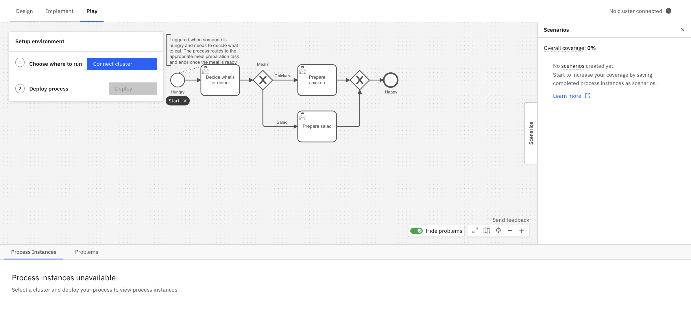
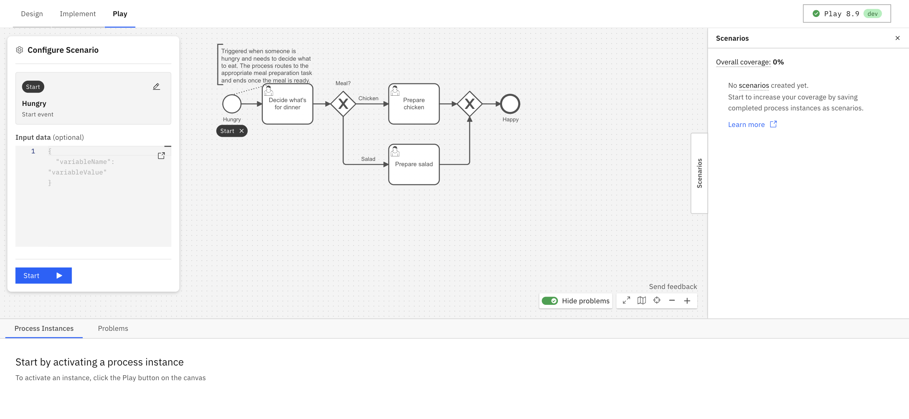
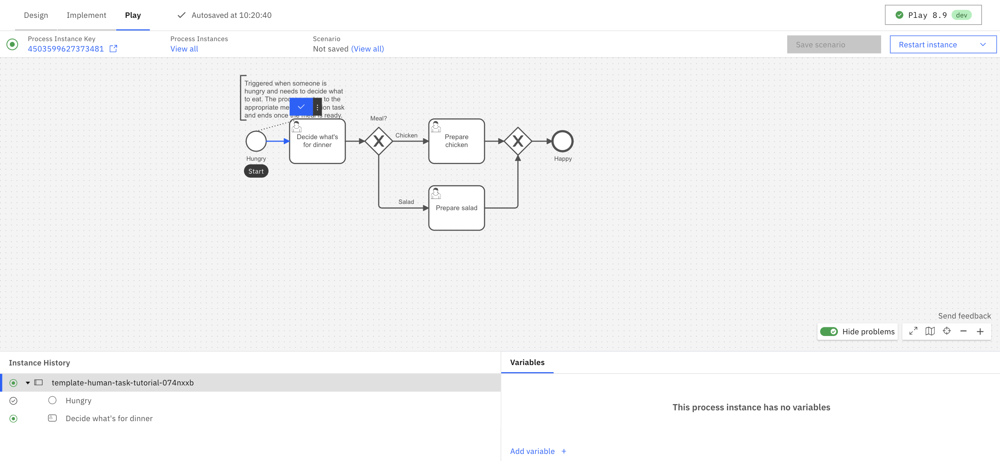
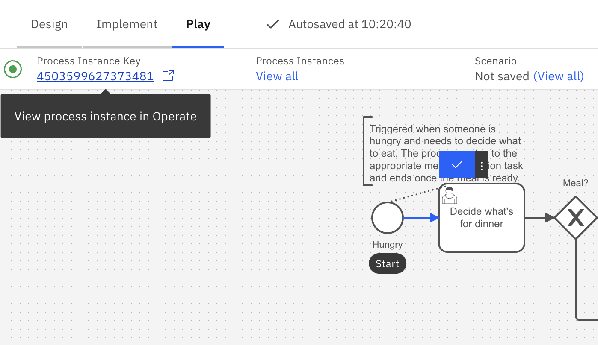
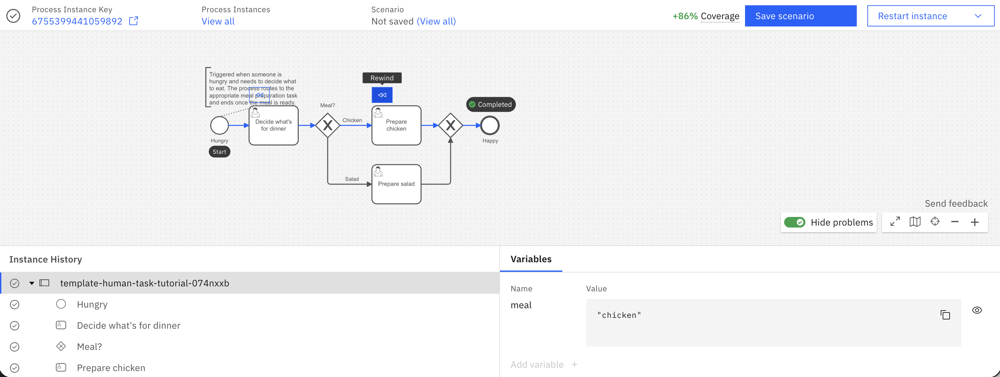
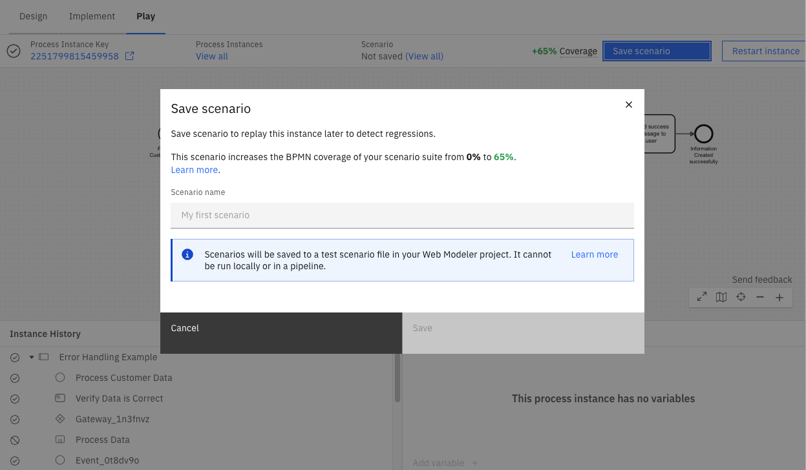
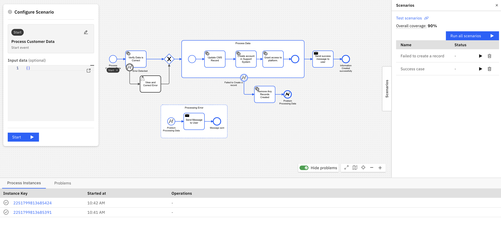
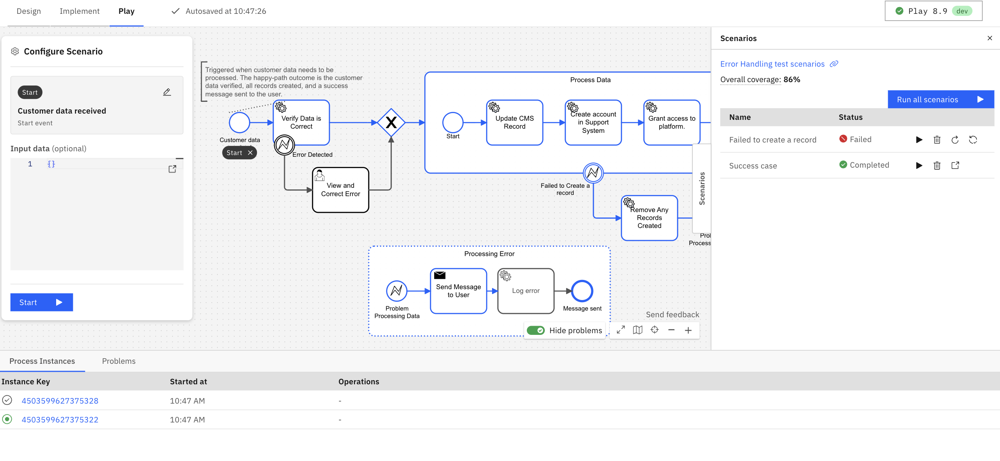
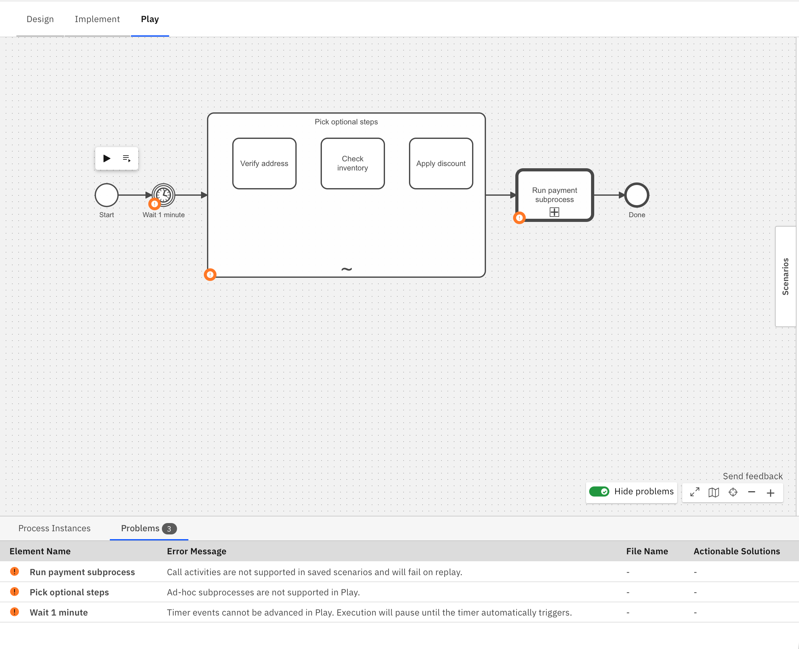
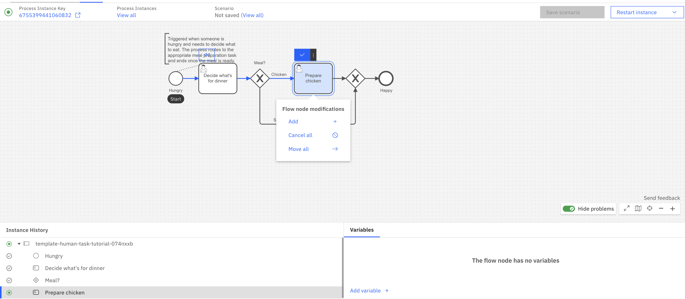

Camunda 8 only

Play is a Zeebe-powered playground environment within Web Modeler for validating a process at any stage of development. Developers can debug their process logic, testers can manually test the process, and process owners can demo to stakeholders - all within Play.

## Opening Play

To use Play, open a BPMN diagram and click the **Play** tab. Read the [limitations and availability section](#limitations-and-availability) if this section is missing.

To play a process, you must first configure a cluster. A **setup environment** overlay prompts you to select a cluster and deploy your process. In SaaS, you can select any cluster configured for the project (development, test, stage, or production). In Self-Managed, you select from the clusters defined in your Web Modeler [configuration](/self-managed/components/hub/configuration/properties.md#clusters); the Camunda 8 Helm and Docker Compose distributions provide one cluster configured by default.

Click **Deploy** in the overlay to deploy. The current version of the active process and all its dependencies, like called processes or DMN files, are deployed to the selected cluster.

The selected cluster name is shown in the Play action bar. Click it to switch clusters without leaving Play; the newly selected cluster becomes the deployment and execution target.

In SaaS, Play uses connector secrets from your selected cluster. connector secrets are not currently supported in Self-Managed.

## Authorizations

If [authorizations](/components/admin/authorization.md) are enabled on the cluster where you will run Play, the following permissions are required for each action:

| Resource Type       | Permission                                       | Allowed action                                                                                                  |
| ------------------- | ------------------------------------------------ | --------------------------------------------------------------------------------------------------------------- |
| Resource            | CREATE                                           | Deploy a process                                                                                                |
| Process definition  | CREATE_PROCESS_INSTANCE                          | Start a process instance                                                                                        |
| Process definition  | READ_PROCESS_INSTANCE                            | View process instance(s)                                                                                        |
| Process definition  | READ_USER_TASK                                   | Get information about a user task                                                                               |
| Process definition  | UPDATE_USER_TASK                                 | Complete a user task                                                                                            |
| Process definition  | UPDATE_PROCESS_INSTANCE                          | Complete a service task, Throw error from a service task, Apply modifications, Set variables, Resolve incidents |
| Decision definition | READ_DECISION_DEFINITION, READ_DECISION_INSTANCE | View decision instance in Operate (SaaS only)                                                                   |
| Message             | CREATE                                           | Publish a message                                                                                               |

### Limitations {#authorizations-limitations}

- Fine-grained authorizations are not supported. If the **Resource ID** is not \* when defining authorizations, the user will not have access to any resources.

## Get started with Play

When you open Play, the [setup environment overlay](#opening-play) prompts you to configure a cluster and deploy. Once deployed, the process definition view shows deployment problems, active process instances, scenarios, and a **Configure Scenario** overlay.

Click a **start event** to configure how the process should start in the **Configure Scenario** panel. The panel shows different options depending on the type of the selected start event:

- **None start event**: A JSON editor pre-filled with example data from the BPMN definition. Click **Start** to begin the process with the current variables, or **Start with Form** if the start event has a linked form.
- **Message start event**: A **Message name** field pre-filled from the BPMN definition. Click the icon next to the field to open a **Configure Message** modal where you can set the correlation key, TTL, and message ID. **Start** is disabled when the message name is empty.
- **Signal start event**: A **Signal name** dropdown pre-filled with the signal from the BPMN definition.

**Start** is also disabled when the variables field contains invalid JSON.

To prefill example data, define it in the **Example data** section of the start event in **Implement** mode. See [data handling](/components/modeler/data-handling.md) for details.

## Define a test segment

By default, execution starts from the process start event and runs to natural completion. To focus on a specific part of your process, define a segment with a custom start and end boundary in the **Configure Scenario** panel.

### Start boundary

The start boundary defaults to the process start event. To change it:

1. In the **Configure Scenario** panel, click the start row.
2. Search for an element by name, or click an activatable element directly on the canvas. The selected element is highlighted with a **Start** label on the diagram.

Elements before the start boundary are not activated and do not appear in the instance history.

The same element type restrictions apply as for [**Add token** modifications](#modifications-limitations). Clicking a non-activatable element in picking mode has no effect.

**Publish message** and **Broadcast signal** elements don't support segment boundaries. If you select either as the start boundary, you can't select an end boundary, and the process runs until it reaches the end node naturally reached from that selected start event.

### End boundary

The end boundary defaults to the first end event. To change it:

1. In the **Configure Scenario** panel, click the end row.
2. Search for an element by name, or click an activatable element directly on the canvas. The selected element is highlighted with an **End** label on the diagram.

When an end boundary is set, the process instance terminates after that element completes. Elements after it are not activated and do not appear in the instance history.

### Canvas click cycle

Once both boundaries are set, canvas clicks cycle automatically: the first click sets a new start boundary and clears the end; the second click sets the new end boundary. To update only one boundary at a time, click its row in the panel — the next canvas click updates only that boundary.

:::note
Play will only consider the first executable process ID in the BPMN file.
:::

## Play a process

Click the **play** action icon next to a task or event to play the process.

If you defined a test segment with an end boundary, the instance terminates automatically after the end element completes — elements after it are not activated and do not appear in the instance history.

The **Instance History** panel tracks the path taken throughout the diagram.

The **Variables** panel tracks the data collected. Global variables are shown by default. To view local variables, select the corresponding task or event. Variables can be edited or added here, and Play supports JSON format to represent complex data.

Play executes all logic of the process and its linked files, such as FEEL, forms, DMN tables, and outbound connectors.

Actions in Play can be initiated through Operate, Tasklist, or external APIs. For example, you can complete a user task via Tasklist, finish a service task using an external job worker, or cancel/modify your instance through Operate, with all changes reflected in Play.

In SaaS, view your process instance in Operate by selecting the **Process Instance Key** in the header.

You have a few options to mock an external system:

- In **Implement** mode, hard-code an example payload in the task or event's **Example data** section in the properties panel on the right side of the screen.
- When completing a task or event, use the secondary action to complete it with variables.
- When filling forms or setting variables from Play, you can also save the variables to the BPMN file as example data to reuse them in future sessions.
- Use service task placeholders instead of connectors

Play automatically uses example data from the BPMN file for many events and task types.
If you want to use different data, you can override the example data by opening the secondary action menu on an element.
The new data set will take precedent over the example data from the BPMN file for future Play sessions.

Incidents are raised in Play just like in Operate. Use the variables and incident messages to debug the process instance.

## Replay a process

To replay a process, rewind to an earlier element by clicking on the **Rewind** button on a previously completed element.

:::note
You can also return to the definition view by clicking **View all** on the top banner, or start a new process instance by clicking on the **Restart process** button on the start event.
:::

### Rewind a process

After completing part of your process, you can **rewind** to a previous element to test a different scenario. Play will start a new instance and replay your actions up to, but not including, the selected previous task.

Play's rewind operation currently does not support the following elements:

- Call activities
- Timer events

#### Additional limitations

- If you completed an unsupported element before rewinding, you will rewind farther than expected.
- Play rewinds to an element, not to an element instance. For example, if you wanted to rewind your process to a sequential multi-instance service task which ran five times, it will rewind your process to the first instance of that service task.
- Play rewinds processes by initiating a new instance and executing each element. However, if any element behaves differently from the previous execution, such as a connector returning a different result, the rewind may fail.

## Scenarios {#scenarios}

Use scenarios to quickly rerun processes while tracking test coverage.

For example, you can validate your process by creating and rerunning scenarios for different paths to check the process works as expected after any diagram changes are made. Scenarios allow you to replay and confirm that a process completes correctly with the predefined actions and variables.

:::note
Although scenarios are valuable for rapid validation during development, Camunda [best practices](/components/best-practices/development/testing-process-definitions.md) recommend using specialized test libraries in your CI/CD pipeline for comprehensive testing.
:::

Scenarios are stored in [test scenario files](test-scenario-files.md). You can view and edit these files directly in Web Modeler or in your Git repository using Git sync.

Play will use the test scenario file [linked to the first executable process ID](test-scenario-files.md#link-a-process-processid) of the BPMN diagram.

If multiple test scenario files are linked to the same process ID, Play will use:

- The test scenario file with the earliest name alphabetically
- If multiple test scenario files have the same name, the one that was most recently updated

### Save scenario

To save a scenario:

1. Execute a path in your process.
1. Click **Save scenario** in the process instance header.
1. A new [test scenario file](test-scenario-files.md) will be saved in the same Web Modeler folder as the process.

:::tip
To view your saved scenarios in Play, click **View all** beneath the Scenarios column in the process instance header.
:::

### Scenario coverage

Scenario coverage is calculated as the percentage of flow nodes in your process that are covered, including all elements, events, and gateways. For example, the coverage is 80% if eight out of ten flow nodes are covered.

- On the process definition page, covered paths are highlighted in blue. Click on individual scenarios to view their specific coverage.
- Once a process instance is completed, the process instance header shows how much your process scenario coverage would increase if the path was saved as a scenario.

:::warning
Scenario coverage will not display as expected if you edit or remove the "metadata" field in the [test scenario file](test-scenario-files.md).
:::

### Run scenario

You can run scenarios on the process definition page by clicking either the **Run all scenarios** button or the **Run scenario** button with the play icon for each individual scenario.

- Scenario execution results are marked with either a **Completed** or **Failed** status.
- You must manually update a failed scenario by clicking **manually complete and update the scenario** button, especially if diagram changes are made that require further user input (such as when a new flow node is added to a previously saved scenario path).

### Limitations {#scenarios-limitations}

Play displays a warning badge on diagram elements with known limitations. Use the **Show problems**/**Hide problems** toggle in the diagram controls to show or hide these badges.

- Call activities are not supported. Scenarios containing call activities cannot be executed successfully.
- Ad-hoc sub-processes are not supported. Scenarios containing ad-hoc sub-processes cannot be executed successfully.
- Timer events can't be manually triggered. When a scenario reaches a timer event, execution pauses until the timer fires automatically. To skip a timer, use [process instance modification](#modify-a-process-instance) to move the token to the next element.
- Scenario paths that include process modifications are not supported.
- Similarly to process instances, scenarios do not run in isolation. For example, if two scenario paths are defined for a process and both contain the same message event or signal event, running these scenarios simultaneously might lead to unintended consequences. Publishing a scenario or broadcasting a signal could inadvertently impact the other scenario, resulting in the failure of both.
- Play scenarios are compatible with the [CPT JSON instruction format](/apis-tools/testing/json-test-cases.md), but the following [instructions](/apis-tools/testing/json-test-cases.md#reference-instructions) are not supported and will be skipped during execution:
  - `ASSERT_DECISION`
  - `ASSERT_ELEMENT_INSTANCE`
  - `ASSERT_ELEMENT_INSTANCES`
  - `ASSERT_PROCESS_INSTANCE`
  - `ASSERT_PROCESS_INSTANCE_MESSAGE_SUBSCRIPTION`
  - `ASSERT_USER_TASK`
  - `ASSERT_VARIABLES`
  - `COMPLETE_JOB_AD_HOC_SUB_PROCESS`
  - `COMPLETE_JOB_USER_TASK_LISTENER`
  - `CORRELATE_MESSAGE`
  - `EVALUATE_CONDITIONAL_START_EVENT`
  - `EVALUATE_DECISION`
  - `INCREASE_TIME`
  - `MOCK_CHILD_PROCESS`
  - `MOCK_DMN_DECISION`
  - `MOCK_JOB_WORKER_COMPLETE_JOB`
  - `MOCK_JOB_WORKER_THROW_BPMN_ERROR`
  - `SET_TIME`

## Modify a process instance

There are two main reasons to modify a process instance in Play:

1. **Skip elements**: If your process is stuck, you can continue testing by skipping over elements. For instance, rather than waiting for a 24-hour timer event to elapse or resolving an incident, you can manually advance the active token from the timer event to the next flow node.
2. **Faster prototyping**: Rather than completing the entire process, you can skip over unnecessary sections of a large diagram to debug the changes you made.

There are three ways to modify your process instance:

- **Add token**: Select the flow node where you'd like to initiate a new token and select **Add** from the modification dropdown.
- **Cancel tokens**: Select the flow node where you'd like to cancel active tokens and select **Cancel** from the modification dropdown.
- **Move tokens**: Select the flow node from which you'd like to move active tokens and select **Move** from the modification dropdown. Then, select a target flow node to relocate the tokens.

:::note
Unlike in [Operate](/components/operate/userguide/process-instance-modification.md), these changes are applied immediately. If you need to change variables while modifying a process, use the **Variables** panel to set them separately. Alternatively, for advanced use cases you can modify the process instance from Operate.
:::

### Limitations {#modifications-limitations}

Rewinding a process instance that has modifications applied to is currently not supported. Additionally, some elements do not support specific modifications:

- **Add token**/**Move tokens to** modifications are not possible for the following element types:
  - Start events
  - Boundary events
  - Events attached to event-based gateways
- **Move tokens from** modification is not possible for a subprocess itself.
- **Add token** modifications are not currently supported for elements with multiple running scopes. However, **Move tokens** modifications are supported for elements inside multi-instance subprocesses. The move operation terminates the specific element instance and activates the target element in the same instance of the multi-instance subprocess.

## Rapid iteration

To make changes, switch back to **Implement** mode. When returning to Play, your process needs to be redeployed. Play only shows process instances from the process’s most recent version, so you may not see your previous instances.

Play saves your inputs when completing user task forms. It auto-fills your last response if you open the same form later in the session. You can click **Reset** to reset the form to its defaults.

## Details

Depending on the BPMN element, there may be a different action:

- **User tasks** with an embedded form are displayed on click. However, you cannot track assignment logic.
- **Call activities** can be navigated into and performed.
- **Manual tasks**, **undefined tasks**, **script tasks**, **business rule tasks**, **gateways**, **outbound connectors** and other BPMN elements that control the process’s path are automatically completed based on their configuration.
- **Service tasks**, **inbound connectors**, message-related tasks, or events are simulated on click or triggered from an external client. However, Play attempts message correlation based on the process context but cannot infer keys from FEEL expressions. Therefore, these keys must be manually entered by publishing a message using secondary actions.
- Many action icons have secondary actions. For example, **user tasks** can be completed with variables rather than a form, and **service tasks** can trigger an error event.

## Operate vs. Play

[Operate](/components/operate/operate-introduction.md) is designed to monitor many production process instances and intervene only as necessary, while Play is designed to drive a single process instance through the process and mock external systems.

Both offer monitoring of a single process instance, its variables and path, incidents, and actions to modify or repair a process instance. Operate offers bulk actions and guardrails against breaking production processes, while Play offers a streamlined UX to run through scenarios quickly.

## Limitations and availability

This section explains why you might not see the **Play** tab, and any additional limitations.

For more information about terms, refer to our [licensing and terms page](https://legal.camunda.com/licensing-and-other-legal-terms#c8-saas-trial-edition-and-free-tier-edition-terms).

**Version compatibility:** Although Play is compatible with cluster versions 8.5.1 and above, Camunda fully supports and recommends using versions 8.6.0 or higher.

### Camunda 8 SaaS

In Camunda 8 SaaS, Play is available to all Web Modeler users with commenter, editor, or admin permissions within a project.
Additionally, within their organization, users need to have a [role](/components/hub/organization/manage-members/manage-users.md#roles-and-permissions) which has deployment privileges. [If authorizations are enabled on the cluster, users need to have specific permissions instead.](#authorizations)

### Camunda 8 Self-Managed

In Self-Managed, Play is controlled by the `PLAY_ENABLED` [configuration property](/self-managed/components/hub/configuration/properties.md#feature-flags) in Web Modeler. This is `true` by default for the Docker and Kubernetes distributions.

Prior to the 8.6 release, Play can be accessed by installing the 8.6.0-alpha [Helm charts](https://github.com/camunda/camunda-platform-helm/blob/camunda-platform-10.4.0/charts/camunda-platform-alpha), or running the 8.6.0-alpha [Docker Compose](https://github.com/camunda/camunda-distributions/tree/main/docker-compose) configuration.

### Features

- [Decision table rule](/components/modeler/dmn/decision-table-rule.md) evaluations are not viewable from Play. However, they can be inferred from the output variable, or can be viewed from Operate.
- Currently, Play supports displaying up to 100 flow node instances in the instance history panel, 100 variables in the variables panel, and 100 process instances on the process definition page. To access all related data, you can use Operate.
- While you can still interact with your process instance in Play (for example, completing jobs or publishing messages), you may be unable to resolve incidents if they occur beyond the 100th flow node instance, as Play does not track them. In this case, incident resolution can be managed in Operate.
- User tasks with a job worker implementation are deprecated and no longer supported in Play from cluster versions 8.8 and above. Please consider migrating to [Camunda user tasks](/components/modeler/bpmn/user-tasks/user-tasks.md#camunda-user-tasks).

## Use Play with Camunda Self-Managed

After selecting the **Play** tab in Self-Managed, the Play view opens directly. The cluster setup and deployment flow is the same as in SaaS, see [opening Play](#opening-play).

### Limitations {#self-managed-limitations}

- The environment variables `CAMUNDA_CUSTOM_CERT_CHAIN_PATH`, `CAMUNDA_CUSTOM_PRIVATE_KEY_PATH`, `CAMUNDA_CUSTOM_ROOT_CERT_PATH`, and `CAMUNDA_CUSTOM_ROOT_CERT_STRING` can be set in Docker or Helm chart setups. However, these configurations have not been tested with Play's behavior, and therefore are not supported when used with Play.
- Play cannot check the presence of connector secrets in Self-Managed setups.
  If a secret is missing, Play will show an incident at runtime.
  Learn more about [configuring connector secrets](/self-managed/components/connectors/connectors-configuration.md#secrets).

## Play Usage and Billing Considerations

The use of Play may result in additional charges depending on your organization's plan and the type of cluster you are using. To avoid extra costs, follow these guidelines based on your plan:

- **Enterprise Plans:** Use a [development cluster](/components/concepts/clusters.md#development-clusters-in-the-enterprise-plan) to avoid costs. Alternatively, ensure your organization is designated as a development organization. For further assistance, [contact Camunda support](https://camunda.com/services/support/).
- **Professional Plans:** Use a [development cluster](/components/concepts/clusters.md#development-clusters-in-the-starter-plan) to avoid costs. For Professional Plans, you may need to purchase a development cluster.
- **Trial Plans:** You can use any cluster.
