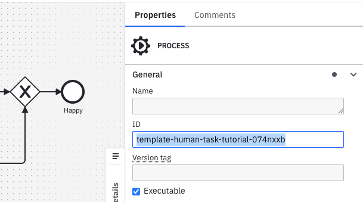

<span class="badge badge--cloud">Camunda 8 only</span>

Test scenario files let you define shareable, low-code tests for your BPMN processes.

They are stored in JSON format and follow the [Camunda Process Test (CPT) JSON schema](https://camunda.com/json-schema/cpt-test-cases/8.9/schema.json), so you can use the same files in Play and in an automated CPT test suite. You can create, edit, and manage them directly in Web Modeler. You can also download these files or synchronize them with your Git repository using Git Sync.

## Create a test scenario file

You can create a new test scenario file by [saving a scenario in Play](play-your-process.md#save-scenario).

You can also manage scenarios and update failing scenarios from Play.

## Manual editing

### Test case structure

Test scenario files follow the [CPT JSON test cases schema](/apis-tools/testing/json-test-cases.md). Play adds two optional fields to that schema, `processId` and `metadata`, to link the file to a BPMN process and track scenario coverage.

```json
{
  "$schema": "https://camunda.com/json-schema/cpt-test-cases/8.9/schema.json",
  "processId": "order-fulfillment-process",
  "testCases": [
    {
      "name": "Happy path order processing",
      "description": "Customer places an order that is processed successfully.",
      "instructions": [
        // Array of instruction objects
      ],
      "metadata": {
        // Optional - for use in Play only
        "processInstanceId": 12345,
        "coveredFlowNodes": [
          { "flowNodeId": "startEvent", "elementType": "START_EVENT" },
          { "flowNodeId": "processOrder", "elementType": "SERVICE_TASK" }
        ],
        "coveredSequenceFlows": ["flow1", "flow2"]
      }
    },
    {
      "name": "Error handling scenario",
      "instructions": [
        // Array of instruction objects for error case
      ]
    }
  ]
}
```

**Top-level fields**

| Field       | Required | Description                                                                                              |
| ----------- | -------- | -------------------------------------------------------------------------------------------------------- |
| `processId` | Yes      | Play-specific field. The ID of the BPMN process definition the test cases run against. Required by Play. |
| `testCases` | Yes      | An array of test case objects.                                                                           |

**Test case fields**

| Field          | Required | Description                                                                                                |
| -------------- | -------- | ---------------------------------------------------------------------------------------------------------- |
| `name`         | Yes      | A descriptive name for the test case scenario.                                                             |
| `description`  | No       | A human-readable description of the test case.                                                             |
| `instructions` | Yes      | An array of instruction objects that define the test steps.                                                |
| `metadata`     | No       | Used by Play to show coverage and process instance details. Camunda does not recommend editing this field. |

### Link a process (`processId`)

To display the file's scenarios in Play, you must first link the file to a process.

Add a `processId` field with the process ID of the BPMN process you want to test:

```json
{
  "processId": "Process_1"
}
```

You can find the BPMN process ID in the properties panel, or in the first `<bpmn:process id=` field of the XML.



The `processId` should stay within the supported identifier-length limits of the target environment and must not contain whitespace.

:::note
`processId` is a Play-specific extension to the CPT schema. It is preserved when running the file with CPT, but only Play uses it to link the file to a process.

Play runs only the first executable process within the BPMN diagram. Make sure the process ID you link is the first executable process.
:::

:::caution
If the BPMN diagram's process ID changes, or if another process ID is added earlier in the BPMN file, the file's scenarios won't appear in the process's Play scenarios tab.
:::

### Unlink a process

To unlink the file from a process, remove the `processId` field or set it to `null`.

:::caution
Unlinking a file means its scenarios will not be shown in the Play scenarios tab for that process.

To fix this, re-link the file by restoring the `processId` field.
:::

## Instructions

Each instruction has a `type` property that identifies the action or assertion, plus additional properties depending on the type. Resources such as process instances, elements, user tasks, jobs, and messages are referenced through **selectors**.

The sections below show the instructions most commonly used in Play scenarios. For the complete list of instructions, selectors, and the full schema reference, see [JSON test cases](/apis-tools/testing/json-test-cases.md).

### Create process instance

Creates a new process instance from a process definition.

```json
{
  "type": "CREATE_PROCESS_INSTANCE",
  "processDefinitionSelector": {
    "processDefinitionId": "order-process"
  },
  "variables": {
    "orderId": "ORD-001",
    "priority": "high"
  }
}
```

To start a process via a message start event, use [`PUBLISH_MESSAGE`](#publish-message). To start a process via a signal start event, use [`BROADCAST_SIGNAL`](#broadcast-signal).

### Complete job

Completes a service task job during process execution.

```json
{
  "type": "COMPLETE_JOB",
  "jobSelector": {
    "elementId": "processPayment"
  },
  "variables": {
    "paymentResult": "success",
    "transactionId": "TXN-123"
  }
}
```

### Broadcast signal

Broadcasts a signal that can be caught by signal start events, signal intermediate catch events, or signal boundary events.

```json
{
  "type": "BROADCAST_SIGNAL",
  "signalName": "ApprovalReceived",
  "variables": {
    "approved": true,
    "approver": "manager@company.com"
  }
}
```

### Complete user task

Completes a user task with optional form data or variables.

```json
{
  "type": "COMPLETE_USER_TASK",
  "userTaskSelector": {
    "elementId": "reviewOrder"
  },
  "variables": {
    "reviewComment": "Order looks good",
    "approved": true
  }
}
```

### Publish message

Publishes a message that can be caught by message start events, message intermediate catch events, or message boundary events.

```json
{
  "type": "PUBLISH_MESSAGE",
  "name": "PaymentConfirmed",
  "correlationKey": "order-12345",
  "variables": {
    "paymentAmount": 99.99,
    "paymentMethod": "credit_card"
  },
  "timeToLive": 300000,
  "messageId": "payment-msg-001"
}
```

### Throw BPMN error from job

Simulates a job failure by throwing a BPMN error during service task execution.

```json
{
  "type": "THROW_BPMN_ERROR_FROM_JOB",
  "jobSelector": {
    "elementId": "processPayment"
  },
  "errorCode": "PAYMENT_FAILED",
  "errorMessage": "Insufficient funds in customer account"
}
```

### Update variables

Updates process variables during test execution.

```json
{
  "type": "UPDATE_VARIABLES",
  "processInstanceSelector": {
    "processDefinitionId": "order-process"
  },
  "variables": {
    "customerId": "12345",
    "amount": 100.5
  }
}
```

### Resolve incident

Resolves an incident that was created due to a job failure or another process issue.

```json
{
  "type": "RESOLVE_INCIDENT",
  "incidentSelector": {
    "elementId": "processPayment"
  }
}
```

## Usage tips

- Always use meaningful selector values, such as `elementId` or `processDefinitionId`, that match your BPMN diagram.
- Give test cases descriptive names to clearly indicate the scenario being tested.
- Include error scenarios along with happy path tests.
- Use optional `variables` fields to test different data conditions.
- Ensure correlation keys uniquely identify process instances when publishing messages.
- Specify `timeToLive` values in milliseconds (for example, `60000` for one minute, `300000` for five minutes).
