Camunda 8 only

Test mode is a Zeebe-powered testing environment within Web Modeler for validating a process at any stage of development. Select any environment configured for your project — development, test, stage, or production — and choose which version to test against. You can view, run, and modify test cases without deploying; deployment is only needed when there are changes made to the diagram. Developers can debug their process logic, testers can manually test the process, and process owners can demo to stakeholders — all within Test mode.

## Opening the Test tab

To use Test mode, open a BPMN diagram and click the **Test** tab. Read the [limitations and availability section](#limitations-and-availability) if this tab is missing.

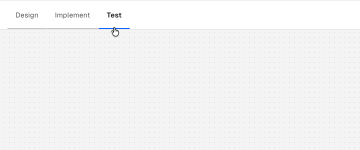

Select any environment configured for your project as your test target. In SaaS, you can select any cluster configured for the project (development, test, stage, or production). In Self-Managed, you select from the clusters defined in your Web Modeler [configuration](/self-managed/components/hub/configuration/properties.md#clusters); the Camunda 8 Helm and Docker Compose distributions provide one cluster configured by default.

:::caution
Test mode executes real process logic against the selected cluster, including connectors, messages, and other external actions. If you target a production cluster, this can affect live data and external systems.
:::

Opening the **Test** tab no longer deploys your process automatically. Click **Deploy** to deploy the current version of the active process and all its dependencies, like called processes or DMN files, to the selected cluster. Once deployed, you can run or create test cases.

The selected cluster name is shown in the Test action bar. Click it to switch clusters without leaving Test mode; the newly selected cluster becomes the deployment and execution target.

In SaaS, Test mode uses connector secrets from your selected cluster. Connector secrets are not currently supported in Self-Managed.

## Authorizations

If [authorizations](/components/admin/authorization.md) are enabled on the cluster where you will run a test, the following permissions are required for each action:

| Resource Type       | Permission                                       | Allowed action                                                                                                  |
| ------------------- | ------------------------------------------------ | --------------------------------------------------------------------------------------------------------------- |
| Resource            | CREATE                                           | Deploy a process                                                                                                |
| Process definition  | CREATE_PROCESS_INSTANCE                          | Start a process instance                                                                                        |
| Process definition  | READ_PROCESS_INSTANCE                            | View process instance(s)                                                                                        |
| Process definition  | READ_USER_TASK                                   | Get information about a user task                                                                               |
| Process definition  | UPDATE_USER_TASK                                 | Complete a user task                                                                                            |
| Process definition  | UPDATE_PROCESS_INSTANCE                          | Complete a service task, Throw error from a service task, Apply modifications, Set variables, Resolve incidents |
| Decision definition | READ_DECISION_DEFINITION, READ_DECISION_INSTANCE | View decision instance in Operate (SaaS only)                                                                   |
| Message             | CREATE                                           | Publish a message                                                                                               |

### Limitations {#authorizations-limitations}

- Fine-grained authorizations are not supported. If the **Resource ID** is not \* when defining authorizations, the user will not have access to any resources.

## Get started with Test mode

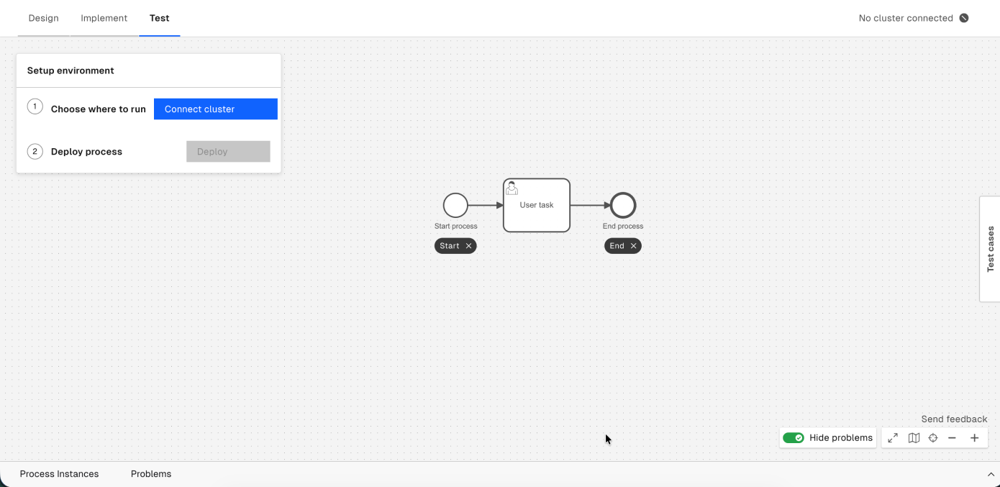

When you open the **Test** tab for the first time in a process a **Setup environment** overlay prompts you to select a cluster and deploy your process. Once deployed you can **Configure a test case**.

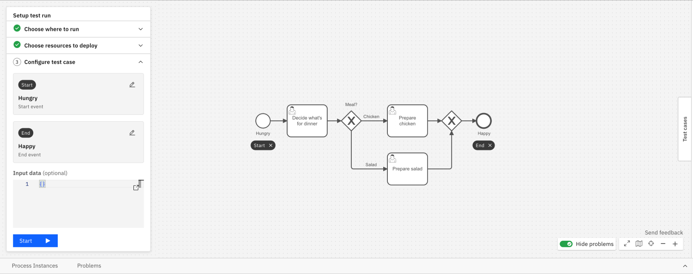

In the **Configure test case** panel, select the start and end elements that define the segment of the process you want to test. Click the selected start event to configure how the process should start — the panel shows various options depending on its Start event type:

- **None start event**: A JSON editor pre-filled with example data from the BPMN definition. Click **Start** to begin the process with the current variables, or **Start with Form** if the start event has a linked form.
- **Message start event**: A **Message name** field pre-filled from the BPMN definition. Click the icon next to the field to open a **Configure Message** modal where you can set the correlation key, TTL, and message ID. The **Start** button is disabled when the message name is empty.
- **Signal start event**: A **Signal name** dropdown pre-filled with the signal from the BPMN definition.

**Start** is also disabled when the variables field contains invalid JSON.

To prefill example data, define it in the **Example data** section of the start event in **Implement** mode. See [data handling](/components/modeler/data-handling.md) for details.

## Define a test segment

By default, execution starts from the process start event and runs to natural completion. To focus on a specific part of your process, define a segment with a custom start and end boundary in the **Configure test case** panel.

### Start boundary

The start boundary defaults to the process start event. To change it:

1. In the **Configure test case** panel, click the start row.
2. Search for an element by name, or click an activatable element directly on the canvas. The selected element is highlighted with a **Start** label on the diagram.

Elements before the start boundary are not activated and do not appear in the instance history.

The same element type restrictions apply as for [**Add token** modifications](#modifications-limitations). Clicking a non-activatable element in picking mode has no effect.

**Publish message** and **Broadcast signal** elements don't support segment boundaries. If you select either as the start boundary, you can't select an end boundary, and the process runs until it reaches the end node naturally reached from that selected start event.

### End boundary

The end boundary defaults to the first end event. To change it:

1. In the **Configure test case** panel, click the end row.
2. Search for an element by name, or click an activatable element directly on the canvas. The selected element is highlighted with an **End** label on the diagram.

When an end boundary is set, the process instance terminates after that element completes. Elements after it are not activated and do not appear in the instance history.

### Canvas click interaction

Once both boundaries are set, clicking the canvas resets the start boundary and clears the end boundary. To change only one boundary, click its row in the panel first, then click the new element on the canvas.

:::note
Test mode will only consider the first executable process ID in the BPMN file.
:::

## Run a test case

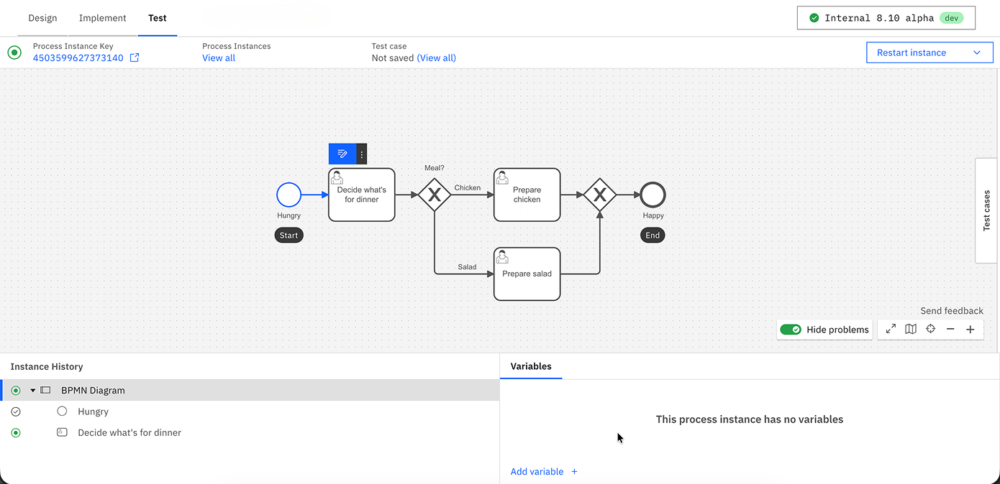

Click the **Start test** button to start the test.

If you defined a test segment with an end boundary, the instance terminates automatically after the end element completes — elements after it are not activated and do not appear in the instance history.

The **Instance History** panel tracks the path taken throughout the diagram.

The **Variables** panel tracks the data collected. Global variables are shown by default. To view local variables, select the corresponding task or event. Variables can be edited or added here, and Test mode supports JSON format to represent complex data.

Test mode executes all logic of the process and its linked files, such as FEEL, forms, DMN tables, and outbound connectors.

Actions in Test mode can be initiated through Operate, Tasklist, or external APIs. For example, you can complete a user task via Tasklist, finish a service task using an external job worker, or cancel/modify your instance through Operate, with all changes reflected in Test mode.

In SaaS, view your process instance in Operate by selecting the **Process Instance Key** in the header.

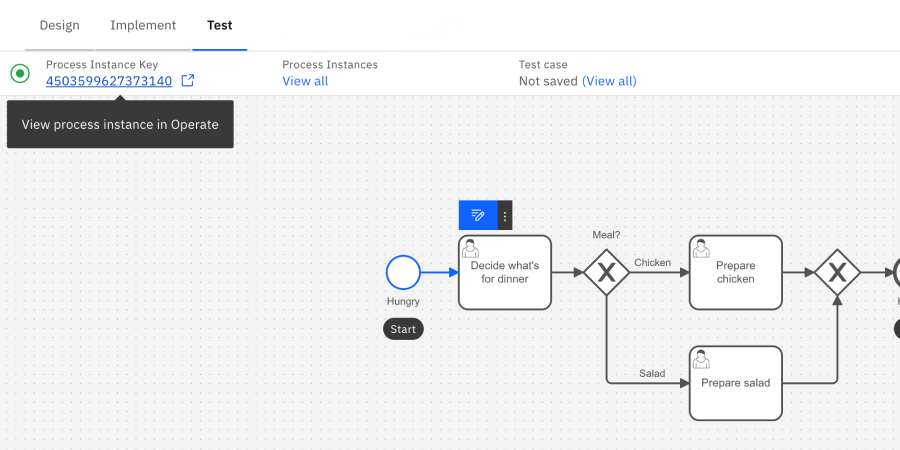

You have a few options to mock an external system:

- In **Implement** mode, hard-code an example payload in the task or event's **Example data** section in the properties panel on the right side of the screen.
- When completing a task or event, use the secondary action to complete it with variables.
- When filling forms or setting variables from Test mode, you can also save the variables to the BPMN file as example data to reuse them in future sessions.
- Use service task placeholders instead of connectors

Test mode automatically uses example data from the BPMN file for many events and task types.
If you want to use different data, you can override the example data by opening the secondary action menu on an element.
The new data set will take precedent over the example data from the BPMN file for future Test mode sessions.

Incidents are raised in Test mode just like in Operate. Use the variables and incident messages to debug the process instance.

## Re-test a process

To re-test a process, rewind to an earlier element by clicking on the **Rewind** button on a previously completed element.

:::note
You can also return to the definition view by clicking **View all** on the top banner, or start a new process instance by clicking on the **Restart process** button on the start event.
:::

### Rewind a process

After completing part of your process, you can **rewind** to a previous element to test a different path. Test mode will start a new instance and retest your actions up to, but not including, the selected previous task.

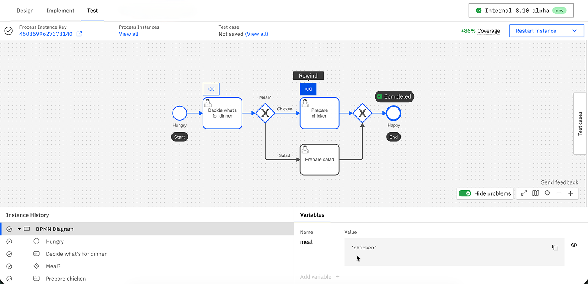

Test mode's rewind operation currently does not support the following elements:

- Call activities
- Timer events

#### Additional limitations

- If you completed an unsupported element before rewinding, you will rewind farther than expected.
- Test mode rewinds to an element, not to an element instance. For example, if you wanted to rewind your process to a sequential multi-instance service task which ran five times, it will rewind your process to the first instance of that service task.
- Test mode rewinds processes by initiating a new instance and executing each element. However, if any element behaves differently from the previous execution, such as a connector returning a different result, the rewind may fail.

## Test cases {#test-cases}

Use test cases to quickly rerun processes while tracking test coverage.

For example, you can validate your process by creating and rerunning test cases for different paths to check the process works as expected after any diagram changes are made. Test cases allow you to retest and confirm that a process completes correctly with the predefined actions and variables.

:::note
Although test cases are valuable for rapid validation during development, Camunda [best practices](/components/best-practices/development/testing-process-definitions.md) recommend using specialized test libraries in your CI/CD pipeline for comprehensive testing.
:::

Test cases are stored in [test files](test-files.md). You can view and edit these files directly in Web Modeler or in your Git repository using Git sync.

Test mode will use the test file [linked to the first executable process ID](test-files.md#link-a-process-processid) of the BPMN diagram.

If multiple test files are linked to the same process ID, Test mode uses the one with the earliest name alphabetically. If more than one shares that name, Test mode uses the one most recently updated.

### Save a test case

To save a test case:

1. Execute a path in your process.
1. In the **Test cases** panel enter the following details:

   | Field                      | Description                                                                                           |
   | -------------------------- | ----------------------------------------------------------------------------------------------------- |
   | **Name**                   | A name for the test case.                                                                             |
   | **Description** (optional) | A description of what the test case validates, for example, "Customer order completes after payment." |

1. Review the **Steps** the test case will re-run, such as **Start instance**. (Optional) Click **Add assertion** to add an assertion to a step. See [Add assertions](#assertions).
1. Click **Save test case**.
1. A new [test file](test-files.md) will be saved in the same Web Modeler folder as the process.

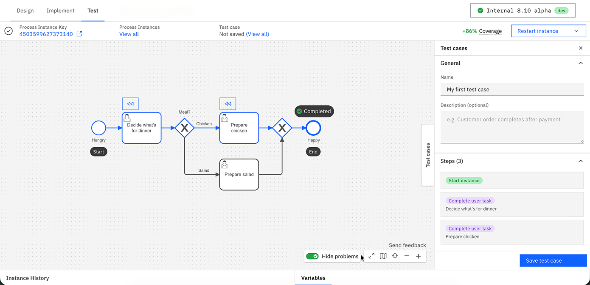

### Add assertions {#assertions}

A test case that only executes its instructions can still pass even if it produces incorrect output or follows the wrong path. Use assertions to verify what actually happened, not just whether the test case finished.

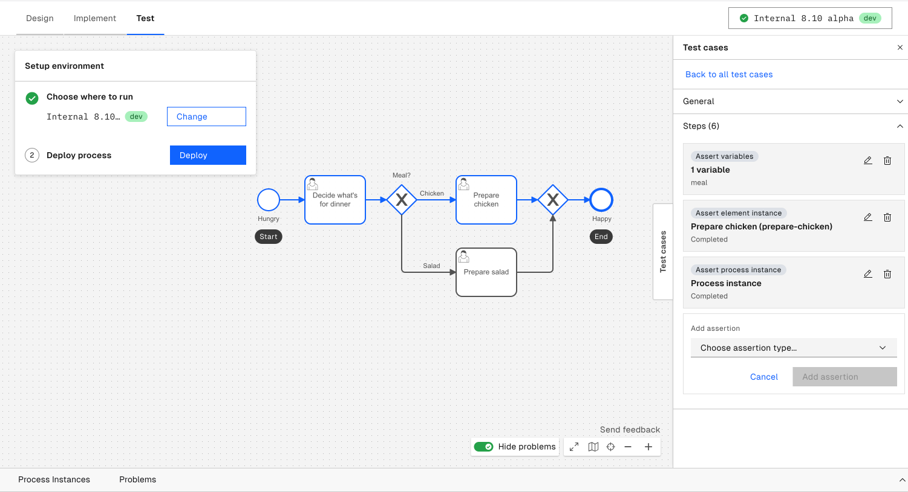

#### Variable assertions

Check that a process or local variable has an expected value.

1. Click **Add assertion** > **Variable**.
2. Select a variable name from the dropdown list, populated from the variables observed in the most recent test run.
3. Enter the expected value for that variable.

#### Element assertions

Check that a specific element reached an expected state.

1. Click **Add assertion** > **Element**.
2. Select the element on the canvas, or search for it by name in the list.
3. Choose the expected state from the dropdown list (for example, completed, active, or terminated).

#### Process instance assertions

Check the overall state of the process instance.

1. Click **Add assertion** > **Process instance**.
2. Choose the process instance state from the dropdown list (for example, created, active, completed, or terminated).

#### Update or remove an assertion

Open a saved test case's detail view in the side panel, then edit or delete any existing assertion the same way you added it. After you save a test case for the first time, assertion changes save automatically—no extra save step is needed.

:::note
Test mode's variable, path, and process instance assertions use the same instructions as [test files](test-files.md#instructions): `ASSERT_VARIABLES`, `ASSERT_ELEMENT_INSTANCE`, and `ASSERT_PROCESS_INSTANCE`. See the [full instruction reference](/apis-tools/testing/json-test-cases.md#reference-instructions) for the underlying schema.
:::

### Edit a test case

Open a test case's detail view in the side panel to edit its name, description, and instructions inline.

#### Review test coverage

Test coverage is calculated as the percentage of flow nodes in your process that are covered, including all elements, events, and gateways. For example, the coverage is 80% if eight out of ten flow nodes are covered.

- On the process definition page, covered paths are highlighted in blue. Click on individual test cases to view their specific coverage.
- Once a process instance is completed, the process instance header shows how much your process test coverage would increase if the path was saved as a test case.

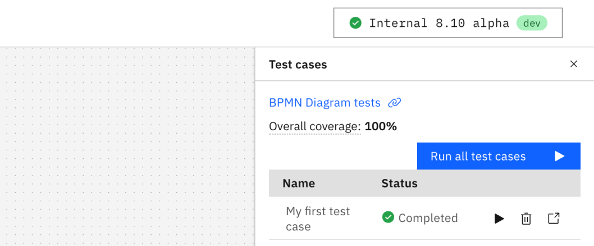

:::warning
Test coverage will not display as expected if you edit or remove the "metadata" field in the [test file](test-files.md).
:::

#### Run a test case

You can run test from the **Test cases** panel by clicking **Run all test cases** button or the **Run test case** button for each individual test case.

- Test case execution results are marked with either a **Completed** or **Failed** status.
- If a test case fails, click **Repair** against each step to update it, especially if diagram changes require further user input (such as when a new flow node is added to a previously saved test case path). See [Repair a test case](#repair-a-test-case).

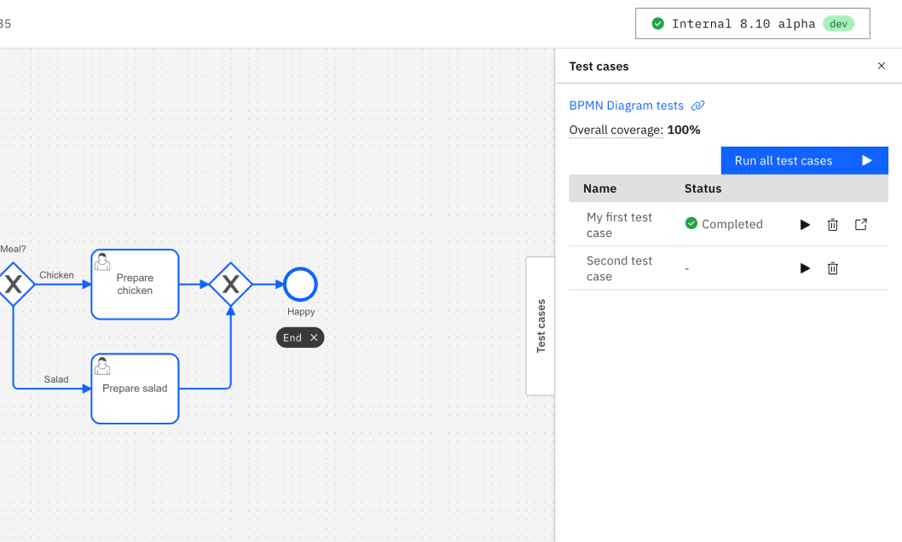

#### Review test results

A test case passes only when every step, including its assertions, succeeds, not just when the process completes without an incident.

- The overall test case status is either **Passed** or **Failed**.
- When a test case fails, Test mode highlights the failed step and shows the underlying failure message verbatim (for example, an expected-versus-actual value mismatch for a variable assertion).

### Repair a test case {#repair-a-test-case}

When a BPMN change removes or renames an element that an instruction or assertion refers to, the test case can break. It may fail unexpectedly or pass silently because Test mode skips the broken step.

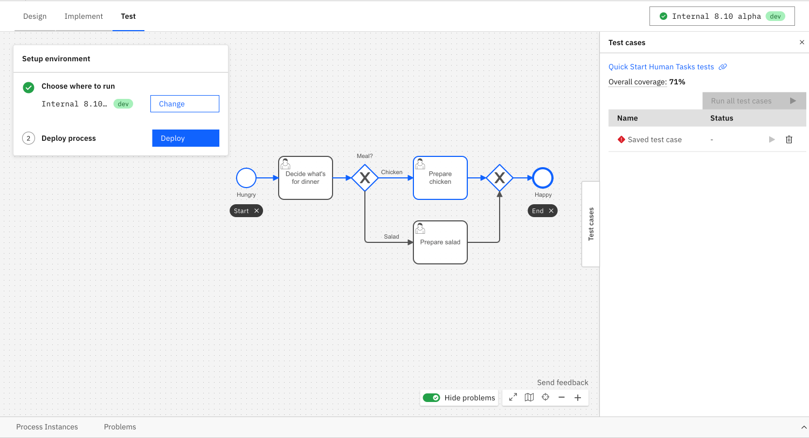

- Test mode flags broken test cases with an indicator in the test case list. A callout in the test case detail view explains what's broken.

- Use the graphical repair view to fix most breakages without editing JSON: remap an instruction or assertion to a different element, select a new expected value, edit a step in place, or delete it.

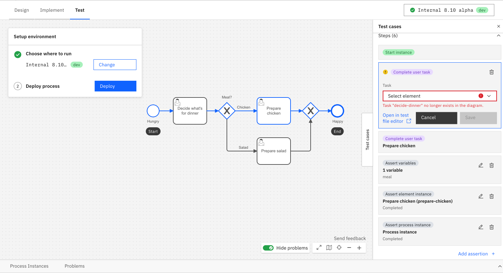

- For changes the graphical repair view doesn't cover, open the [test file](test-files.md) in Web Modeler's file editor and edit the JSON directly. Then, return to Test mode and rerun the test case.

### Limitations {#test-cases-limitations}

Test mode displays a warning badge on diagram elements with known limitations. Use the **Show problems**/**Hide problems** toggle near the canvas controls to show or hide these badges.

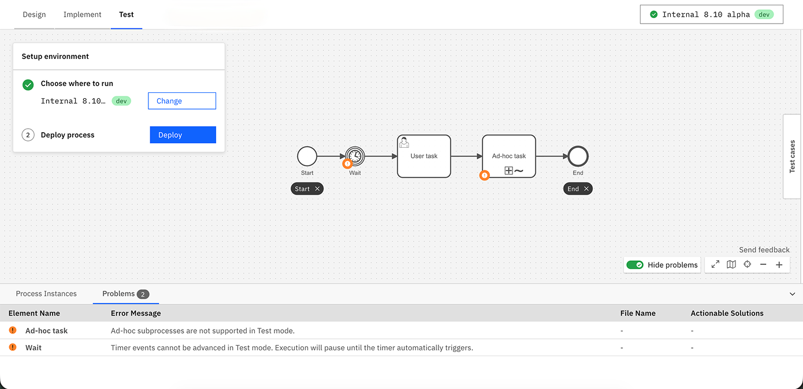

- Call activities are not supported. Test cases containing call activities cannot be executed successfully.
- Ad-hoc sub-processes are not supported. Test cases containing ad-hoc sub-processes cannot be executed successfully.
- Timer events can't be manually triggered. When a test case reaches a timer event, execution pauses until the timer fires automatically. To skip a timer, use [process instance modification](#modify-a-process-instance) to move the token to the next element.
- Test case paths that include process modifications are not supported.
- Similarly to process instances, test cases do not run in isolation. For example, if two test case paths are defined for a process and both contain the same message event or signal event, running these test cases simultaneously might lead to unintended consequences. Publishing a message or broadcasting a signal could inadvertently impact the other test case, resulting in the failure of both.
- Test mode test cases are compatible with the [CPT JSON instruction format](/apis-tools/testing/json-test-cases.md), but the following [instructions](/apis-tools/testing/json-test-cases.md#reference-instructions) are not supported and will be skipped during execution:
  - `ASSERT_PROCESS_INSTANCE_MESSAGE_SUBSCRIPTION`
  - `COMPLETE_JOB_USER_TASK_LISTENER`
  - `CORRELATE_MESSAGE`
  - `EVALUATE_CONDITIONAL_START_EVENT`
  - `EVALUATE_DECISION`
  - `INCREASE_TIME`
  - `MOCK_CHILD_PROCESS`
  - `MOCK_DMN_DECISION`
  - `MOCK_JOB_WORKER_COMPLETE_JOB`
  - `MOCK_JOB_WORKER_THROW_BPMN_ERROR`
  - `SET_TIME`

## Modify a process instance

There are two main reasons to modify a process instance in Test mode:

1. **Skip elements**: If your process is stuck, you can continue testing by skipping over elements. For instance, rather than waiting for a 24-hour timer event to elapse or resolving an incident, you can manually advance the active token from the timer event to the next flow node.
2. **Faster prototyping**: Rather than completing the entire process, you can skip over unnecessary sections of a large diagram to debug the changes you made.

There are three ways to modify your process instance:

- **Add token**: Select the flow node where you'd like to initiate a new token and select **Add** from the modification dropdown.
- **Cancel tokens**: Select the flow node where you'd like to cancel active tokens and select **Cancel** from the modification dropdown.
- **Move tokens**: Select the flow node from which you'd like to move active tokens and select **Move** from the modification dropdown. Then, select a target flow node to relocate the tokens.

:::note
Unlike in [Operate](/components/operate/userguide/process-instance-modification.md), these changes are applied immediately. If you need to change variables while modifying a process, use the **Variables** panel to set them separately. Alternatively, for advanced use cases you can modify the process instance from Operate.
:::

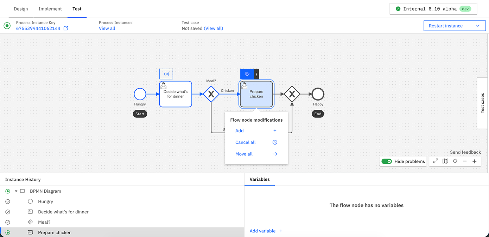

### Limitations {#modifications-limitations}

Rewinding a process instance that has modifications applied to is currently not supported. Additionally, some elements do not support specific modifications:

- **Add token**/**Move tokens to** modifications are not possible for the following element types:
  - Start events
  - Boundary events
  - Events attached to event-based gateways
- **Move tokens from** modification is not possible for a subprocess itself.
- **Add token** modifications are not currently supported for elements with multiple running scopes. However, **Move tokens** modifications are supported for elements inside multi-instance subprocesses. The move operation terminates the specific element instance and activates the target element in the same instance of the multi-instance subprocess.

## Rapid iteration

To make changes, switch back to **Implement** mode. When returning to Test mode, your process needs to be redeployed. Test mode only shows process instances from the process’s most recent version, so you may not see your previous instances.

Test mode saves your inputs when completing user task forms. It auto-fills your last response if you open the same form later in the session. You can click **Reset** to reset the form to its defaults.

## Details

Depending on the BPMN element, there may be a different action:

- **User tasks** with an embedded form are displayed on click. However, you cannot track assignment logic.
- **Call activities** can be navigated into and performed.
- **Manual tasks**, **undefined tasks**, **script tasks**, **business rule tasks**, **gateways**, **outbound connectors** and other BPMN elements that control the process's path are automatically completed based on their configuration.
- **Service tasks**, **inbound connectors**, message-related tasks, or events are simulated on click or triggered from an external client. However, Test mode attempts message correlation based on the process context but cannot infer keys from FEEL expressions. Therefore, these keys must be manually entered by publishing a message using secondary actions.
- Many action icons have secondary actions. For example, **user tasks** can be completed with variables rather than a form, and **service tasks** can trigger an error event.

## Operate vs. Test mode

[Operate](/components/operate/operate-introduction.md) is designed to monitor many production process instances and intervene only as necessary, while Test mode is designed to drive a single process instance through the process and mock external systems.

Both offer monitoring of a single process instance, its variables and path, incidents, and actions to modify or repair a process instance. Operate offers bulk actions and guardrails against breaking production processes, while Test mode offers a streamlined UX to run through test cases quickly.

## Limitations and availability

This section explains why you might not see the **Test** tab, and any additional limitations.

For more information about terms, refer to our [licensing and terms page](https://legal.camunda.com/licensing-and-other-legal-terms#c8-saas-trial-edition-and-free-tier-edition-terms).

**Version compatibility:** Test mode is compatible with cluster versions starting from 8.10 and higher.

### Camunda 8 SaaS

In Camunda 8 SaaS, Test mode is available to all Web Modeler users with commenter, editor, or admin permissions within a project.
Additionally, within their organization, users need to have a [role](/components/hub/organization/manage-users/manage-users.md#roles-and-permissions) which has deployment privileges. [If authorizations are enabled on the cluster, users need to have specific permissions instead.](#authorizations)

### Camunda 8 Self-Managed

<!-- NEEDS VERIFICATION -->

In Self-Managed, Test mode is controlled by the `camunda.modeler.feature.test-mode-enabled` [configuration property](/self-managed/components/hub/configuration/properties.md#feature-flags) in Web Modeler. This is `true` by default for the Docker and Kubernetes distributions.

Prior to the 8.10 release, Test mode can be accessed by installing the 8.10.0-alpha [Helm charts](https://github.com/camunda/camunda-platform-helm/blob/camunda-platform-10.4.0/charts/camunda-platform-alpha), or running the 8.10.0-alpha [Docker Compose](https://github.com/camunda/camunda-distributions/tree/main/docker-compose) configuration.

### Features

- [Decision table rule](/components/modeler/dmn/decision-table-rule.md) evaluations are not viewable from Test mode. However, they can be inferred from the output variable, or can be viewed from Operate.
- Currently, Test mode supports displaying up to 100 flow node instances in the instance history panel, 100 variables in the variables panel, and 100 process instances on the process definition page. To access all related data, you can use Operate.
- While you can still interact with your process instance in Test mode (for example, completing jobs or publishing messages), you may be unable to resolve incidents if they occur beyond the 100th flow node instance, as Test mode does not track them. In this case, incident resolution can be managed in Operate.
- User tasks with a job worker implementation are deprecated and no longer supported in Test mode from cluster versions 8.8 and above. Please consider migrating to [Camunda user tasks](/components/modeler/bpmn/user-tasks/user-tasks.md#camunda-user-tasks).

## Use Test mode with Camunda Self-Managed

After selecting the **Test** tab in Self-Managed, the Test view opens directly. The cluster setup and deployment flow is the same as in SaaS, see [opening the Test tab](#opening-the-test-tab).

### Limitations {#self-managed-limitations}

- The environment variables `CAMUNDA_CUSTOM_CERT_CHAIN_PATH`, `CAMUNDA_CUSTOM_PRIVATE_KEY_PATH`, `CAMUNDA_CUSTOM_ROOT_CERT_PATH`, and `CAMUNDA_CUSTOM_ROOT_CERT_STRING` can be set in Docker or Helm chart setups. However, these configurations have not been tested with Test mode's behavior, and therefore are not supported when used with Test mode.
- Test mode cannot check the presence of connector secrets in Self-Managed setups.
  If a secret is missing, Test mode will show an incident at runtime.
  Learn more about [configuring connector secrets](/self-managed/components/connectors/connectors-configuration.md#secrets).

## Test usage and billing considerations

The use of Test mode may result in additional charges depending on your organization's [plan](/components/hub/organization/manage-organization-settings/manage-plan/available-plans.md) and the type of cluster you are using. To avoid extra costs, follow these guidelines based on your plan:

- **Enterprise plan:** Use a [Basic cluster](/components/concepts/clusters.md#cluster-type) for non-production testing to avoid costs. For further assistance, [contact Camunda support](https://camunda.com/services/support/).
- **Free trial plan:** You can use any cluster. See [Free Trial clusters](/components/concepts/clusters.md#free-trial-clusters).
