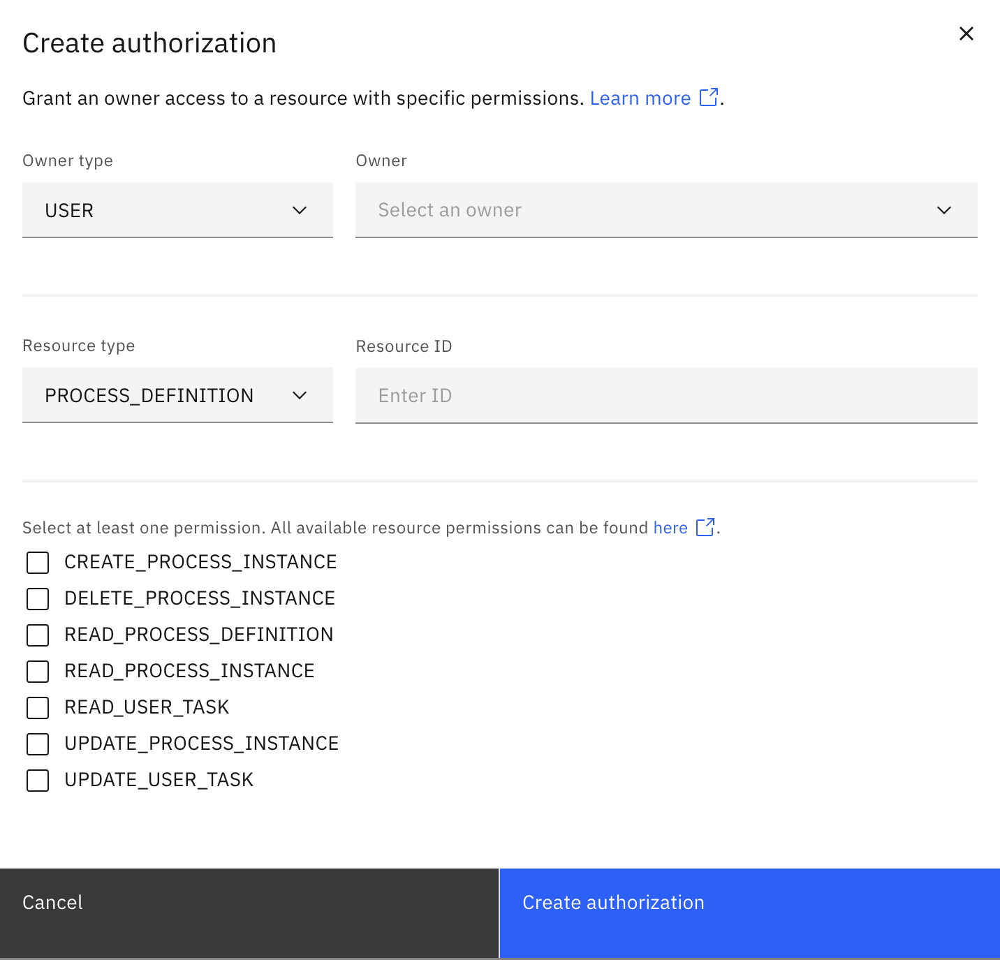

Authorizations are managed through permissions that can be assigned to [users](user.md), groups, roles, and mappings.

## Authorization overview

Camunda 8 Self-Managed [Orchestration clusters](/self-managed/reference-architecture/reference-architecture.md#orchestration-cluster) use resource-based authorization control, which grants permissions to entities (like users) to perform specific actions on specified resources. For example, permissions can be set for actions such as reading, updating, creating, or deleting resources, such as process instances.

A user is not granted authorizations by default, and must be explicitly granted permission to access applications or perform actions on resources. Authorizations can be enabled or disabled in Self-Managed deployments via [configuration settings](/self-managed/identity/configuration/identity-configuration-overview.md).

## Authorization concepts

### Permissions

Permissions are the building blocks of authorizations. They define the actions that can be performed on resources. Permissions are granted to entities (like users) to perform specific actions on specified resources.

Permissions are defined by a combination of a resource type, resource ID, and action. For example, a permission might grant a user the ability to read (the action) a specific process instance (the resource type).

### Resources

Resources are the objects on which actions can be performed. Resources can be entities like process instances, tasks, or users. Resources are identified by a resource ID and type.

### Owners

Owners are the entities to which permissions are granted. Owners can be [users](user.md), groups, roles, or mappings. Owners are identified by an owner ID and type.

## Create an authorization

To create a new authorization:

1. Log in to Identity in your cluster, and click on the **Authorizations** tab.
2. Select the resource type on the left side of the screen, and click **Create authorization**.
3. Provide the following information for your authorization:
   - **Owner type:** The entity (user, group, role, or mapping) to which you want to assign permissions.
   - **Owner ID:** The ID of the owner to which you want to assign permissions.
   - **Resource type:** A dropdown pre-populated with the selected resource type.
   - **Resource ID**: The ID of the resource to which the owner's permissions apply.
4. Select the permissions this authorization will grant.
5. Click on the **Create authorization** button to finish.

The authorization is then created, and the user, group, role, or mapping is granted the permission to perform the action on the specified resource.

## Delete an authorization

To delete an authorization:

1. Log in to Identity in your cluster, and click on the **Authorizations** tab.
2. Select the resource type of the authorization you want to delete.
3. Click on the **Delete** button next to the authorization you want to delete.
4. Confirm the deletion by clicking **Delete** button in the confirmation dialog.

The authorization is deleted, and the user, group, role, or mapping no longer has permission to perform the action on the specified resource.
