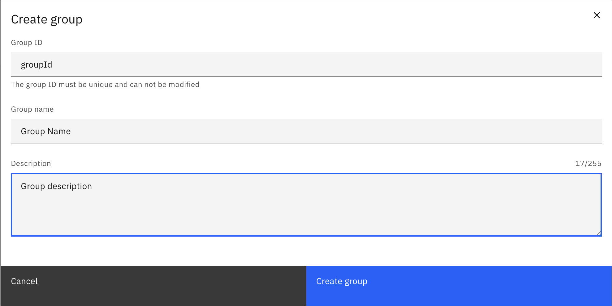

Group management is the process of creating, updating, and deleting groups in your Orchestration cluster. A group is usually an organizational unit that consists of multiple [users](user.md). A group can be provided with [authorizations](authorization.md), either directly or by assigning [roles](role.md) to it.

### Create a group

To create a group:

1. Log in to Identity in your cluster, and click on the **Groups** tab.
2. Click on the **Create group** button, and provide the following group details:
   - **Group ID**: The unique identifier for the group.
   - **Name**: The name of the group.
   - **Description**: A description of the group.
3. Click on the **Create group** button to finish.

The group is created, and can now be assigned to roles or users.

### Update a group

To update a group:

1. Log in to Identity in your cluster, and click on the **Groups** tab.
2. Click on the **pencil icon** next to the group you want to update.
3. Update the group details:
   - **Name**: The name of the group.
   - **Description**: A description of the group.
4. Click on the **Save** button to finish.

The group details are updated.

### Delete a group

1. Log in to Identity in your cluster, and click on the **Groups** tab.
2. Click on the **Delete** button next to the group you want to delete.
3. Confirm the deletion by clicking on the **Delete** button in the confirmation dialog.

The group is deleted, and can no longer be assigned to roles or users. Users and roles that were assigned to the group will not be affected, but they will no longer be part of the group. The authorizations that were granted to the group will also be removed.

### Assign authorizations to a group

See the [authorization](./authorization.md) section to learn how to create authorizations for groups.

### Assign users to a group

To assign users to a group:

1. Log in to Identity in your cluster, and click on the **Groups** tab.
2. Click on the group you want to assign.
3. Click on the **Users** tab.
4. Click on the **Assign user** button.
5. Type the username of the user you want to assign to the group, and click on the **Assign user** button.

:::note
For Self-Managed deployments with Basic Authentication, users have to be searched.
:::

The user is assigned to the group, and can now access applications and perform actions based on permissions that are granted to the group.

### Remove users from a group

To remove users from a group:

1. Log in to Identity in your cluster, and click on the **Groups** tab.
2. Click on the group you want to remove users from.
3. Click on the **Users** tab.
4. Click on the **Remove** button next to the user you want to remove from the group.
5. Confirm the removal by clicking on the **Remove** button in the confirmation dialog.

The user is removed from the group, and can no longer access applications or perform actions based on permissions that are granted to the group.

### Assign roles to a group

To assign roles to a group:

1. Log in to Identity in your cluster, and click on the **Groups** tab.
2. Click on the group you want to assign roles to.
3. Click on the **Roles** tab.
4. Click on the **Assign role** button.
5. Search the ID of the role you want to assign to the group, and click on the **Assign role** button.

The role is assigned to the group, and users in the group can now access applications and perform actions based on permissions that are granted to the role.

### Remove roles from a group

To remove roles from a group:

1. Log in to Identity in your cluster, and click on the **Groups** tab.
2. Click on the group you want to remove roles from.
3. Click on the **Roles** tab.
4. Click on the **Remove** button next to the role you want to remove from the group.
5. Confirm the removal by clicking on the **Remove** button in the confirmation dialog.

The role is removed from the group, and users in the group can no longer access applications or perform actions based on permissions that are granted to the role.

### Assign mapping to a group

:::note
This feature is only available in Self-Managed deployments with OIDC.
:::

To assign mapping to a group:

1. Log in to Identity in your cluster, and click on the **Groups** tab.
2. Click on the group you want to assign mappings to.
3. Click on the **Mappings** tab.
4. Click on the **Assign mapping** button.
5. Search the ID of the mapping you want to assign to the group, and click on the **Assign mapping** button.

The mapping is assigned to the group

### Remove mappings from a group

:::note
This feature is only available in Self-Managed deployments with OIDC.
:::

To remove a mapping from a group:

1. Log in to Identity in your cluster, and click on the **Groups** tab.
2. Click on the group you want to remove mappings from.
3. Click on the **Mappings** tab.
4. Click on the **Remove** button next to the mapping you want to remove from the group.
5. Confirm the removal by clicking on the **Remove** button in the confirmation dialog.

The mapping is removed from the group

### Assign client to a group

:::note
This feature is only available in SaaS or in Self-Managed deployments with OIDC.
:::

To assign a client to a group:

1. Log in to Identity in your cluster, and click on the **Groups** tab.
2. Click on the group you want to assign a client to.
3. Click on the **Clients** tab.
4. Click on the **Assign client** button.
5. Type the ID of the client you want to assign to the group, and click on the **Assign client** button.

The client is assigned to the group, and can now access applications and perform actions based on permissions that are granted to the group.

### Remove client from a group

:::note
This feature is only available in SaaS or in Self-Managed deployments with OIDC.
:::

To remove a client from a group:

1. Log in to Identity in your cluster, and click on the **Groups** tab.
2. Click on the group you want to remove a client from.
3. Click on the **Clients** tab.
4. Click on the **Remove** button next to the client you want to remove from the group.
5. Confirm the removal by clicking on the **Remove** button in the confirmation dialog.

The client is removed from the group, and can no longer access applications or perform actions based on permissions that are granted to the group.
