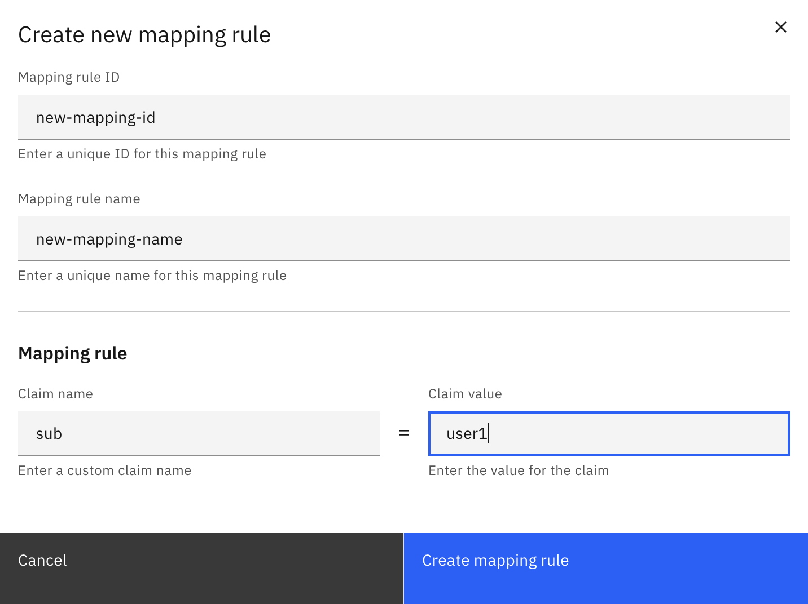
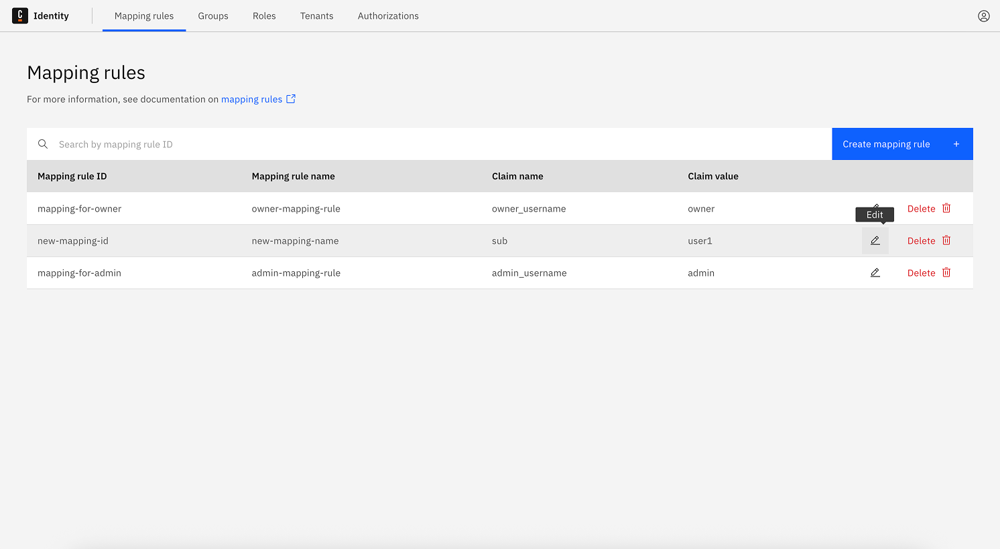
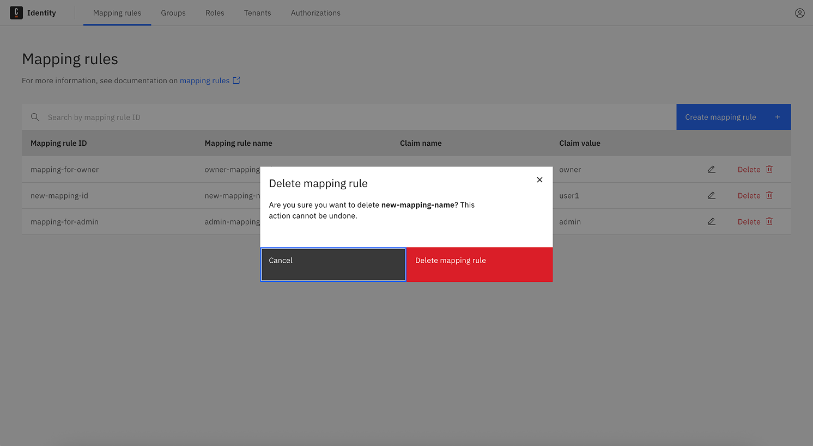

import Tabs from "@theme/Tabs";
import TabItem from "@theme/TabItem";

Self-Managed only

Mapping rules provide flexible access to Orchestration Cluster resources based on claims in a user's or client's OIDC access token. To learn more, see the [mapping rules concept page](../concepts/access-control/mapping-rules.md).

## Create a mapping rule

To create a mapping rules:

1. Log in to Identity in your cluster, and click on the **Mapping Rules** tab.
2. Click on the **Create a mapping rule** button, and provide the following details:
   - **Mapping Rule ID**: A unique identifier for the mapping rule.
   - **Mapping Rule name**: A user-friendly name.
   - **Claim name**: The name of a claim in the OIDC access token or a [JSONPath expression](https://www.rfc-editor.org/rfc/rfc9535) that points to a claim in the access token
   - **Claim value**: The expected value of the claim so that the mapping rule matches an access token.
3. Click on the **Create mapping rule** button.

The role is created and you can now assign it to groups, roles, or tenants, or create authorizations for it.

## Update a mapping rule

To update a mapping rule:

1. Log in to Identity in your cluster, and click on the **Mapping rules** tab.
2. Click on the **pencil icon** next to the mapping rule you want to update.
3. Update the mapping rule details as desired.
4. Click on the **Save** button.

The mapping rule details are updated.

## Delete a mapping rule

To delete a mapping rule:

1. Log in to Identity in your cluster, and click on the **Mapping Rules** tab.
2. Click on the **Delete** button next to the mapping rule you want to delete.
3. Confirm the deletion by clicking on the **Delete** button in the confirmation dialog.

The mapping rule is deleted.

## Assign authorizations to a role

See the [authorization](./authorization.md) section to learn how to create authorizations for mapping rules.
