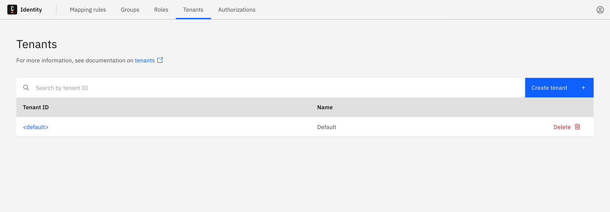
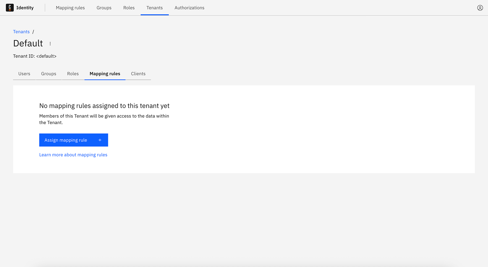
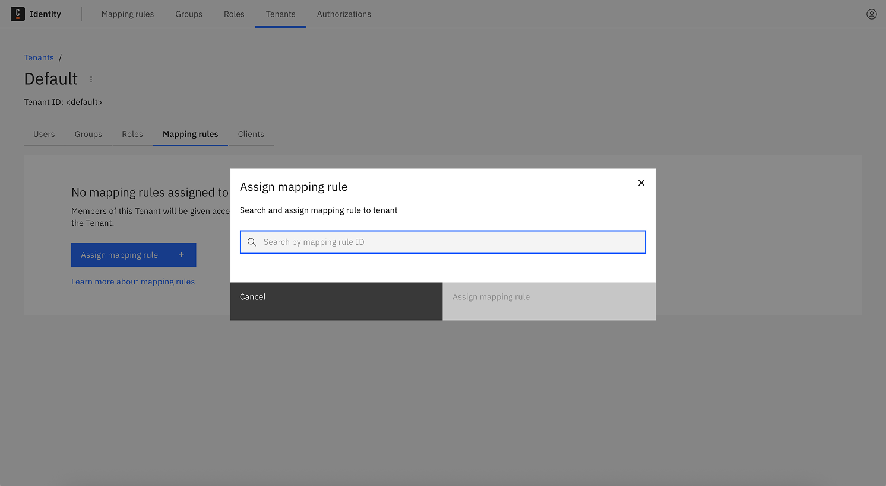
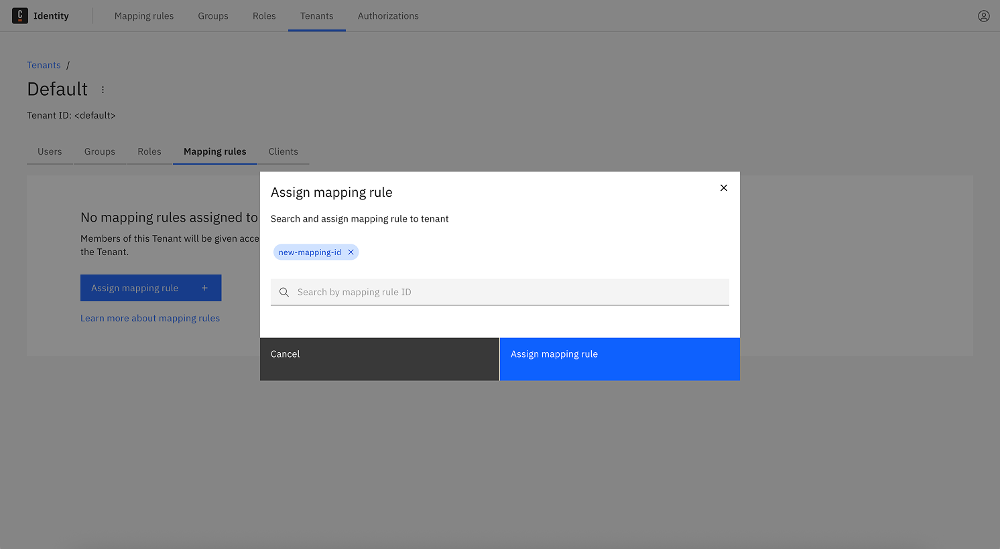
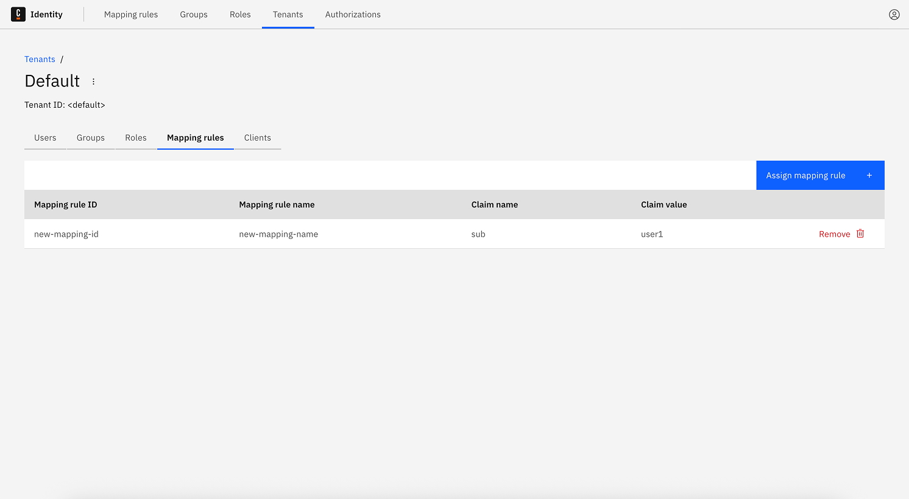

import Tabs from "@theme/Tabs";
import TabItem from "@theme/TabItem";

Mapping rules grant access to a tenant based on access token claim values. This guide details how to assign, update, or remove these rules.

:::tip
To learn more about mapping rules and tenants, see the [mapping rules documentation](manage-mapping-rules.md) and [tenant management documentation](/self-managed/components/orchestration-cluster/identity/manage-tenants.md).
:::

1. Log in to the Identity UI and go to the **Tenants** tab.

2. Click on the desired Tenant ID (e.g., `<default>`).
3. Open the **Mapping Rules** tab.

<Tabs groupId="tenantMappingRuleAssignment" defaultValue="add" queryString values={[{label: 'Add', value: 'add'}, {label: 'Update', value: 'update'}, {label: 'Delete', value: 'delete'}]}>

<TabItem value="add">

### Add a mapping rule to a tenant

1. Click **Assign mapping rule**.

2. In the modal, search by **Mapping Rule ID**.

3. Select the desired mapping rule.

4. Click **Assign mapping rule** to complete.

</TabItem>

<TabItem value="update">

### Update a tenant mapping rule

1. In the **Mapping rules** tab, locate the mapping rule to change.
2. Click the **Remove** button to delete the old mapping rule.
3. Re-assign the updated mapping rule using the steps in the **Add** tab.

:::note
Currently, tenant mapping rules must be updated by removing and re-adding them with the desired values.
:::

</TabItem>

<TabItem value="delete">

### Delete a mapping rule from a tenant

1. In the **Mapping rules** tab for the selected tenant, locate the assigned mapping rule.
2. Click the **Remove** button.

</TabItem>

</Tabs>
