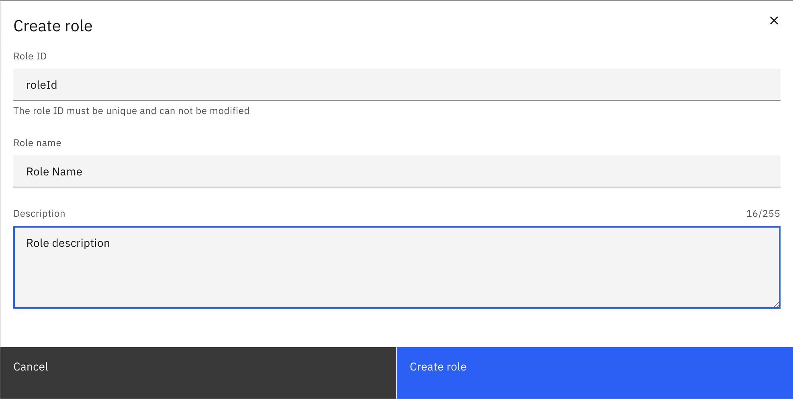

Role management is the process of creating, updating, and deleting roles in your Orchestration cluster. A role is a collection of [authorizations](authorization.md) that provides users with the system and data access that they need to fulfill a certain responsibility. A role can be assigned to users directly or through a [group](group.md) that they are a member of.

### Create a role

To create a role:

1. Log in to Identity in your cluster, and click on the **Roles** tab.
2. Click on the **Create role** button, and provide the following role details:
   - **Role ID**: The unique identifier for the role.
   - **Name**: The name of the role.
   - **Description**: A description of the role.
3. Click on the **Create role** button to finish.

The role is created, and can now be assigned to users.

### Update a role

To update a role:

1. Log in to Identity in your cluster, and click on the **Roles** tab.
2. Click on the **pencil icon** next to the role you want to update.
3. Update the role details:
   - **Name**: The name of the role.
   - **Description**: A description of the role.
4. Click on the **Save** button to finish.

The role details are updated.

### Delete a role

To delete a role:

1. Log in to Identity in your cluster, and click on the **Roles** tab.
2. Click on the **Delete** button next to the role you want to delete.
3. Confirm the deletion by clicking on the **Delete** button in the confirmation dialog.

The role is deleted, and can no longer be assigned to users. Users that were assigned to the role will not be affected, but they will no longer be part of the role. The authorizations that were granted to the role will also be removed.

### Assign authorizations to a role

See the [authorization](./authorization.md) section to learn how to create authorizations for roles.

### Assign users to a role

To assign users to a role:

1. Log in to Identity in your cluster, and click on the **Roles** tab.
2. Click on the role you want to assign.
3. Click on the **Users** tab.
4. Click on the **Assign user** button.
5. Type the username of the user you want to assign to the role, and click on the **Assign user** button.

:::note
For Self-Managed deployments with Basic Authentication, users have to be searched.
:::

The user is assigned to the role, and can now access applications and perform actions based on permissions that are granted to the role.

### Remove users from a role

To remove users from a role:

1. Log in to Identity in your cluster, and click on the **Roles** tab.
2. Click on the role you want to remove users from.
3. Click on the **Users** tab.
4. Click on the **Remove** button next to the user you want to remove from the role.
5. Confirm the removal by clicking on the **Remove** button in the confirmation dialog.

The user is removed from the role, and can no longer access applications or perform actions based on permissions that are granted to the role.

### Assign mapping to a role

:::note
This feature is only available in Self-Managed deployments with OIDC.
:::

To assign mapping to a role:

1. Log in to Identity in your cluster, and click on the **Roles** tab.
2. Click on the role you want to assign mappings to.
3. Click on the **Mappings** tab.
4. Click on the **Assign mapping** button.
5. Search the ID of the mapping you want to assign to the role, and click on the **Assign mapping** button.

The mapping is assigned to the role

### Remove mappings from a role

:::note
This feature is only available in Self-Managed deployments with OIDC.
:::

To remove a mapping from a role:

1. Log in to Identity in your cluster, and click on the **Roles** tab.
2. Click on the role you want to remove mappings from.
3. Click on the **Mappings** tab.
4. Click on the **Remove** button next to the mapping you want to remove from the role.
5. Confirm the removal by clicking on the **Remove** button in the confirmation dialog.

The mapping is removed from the role

### Assign client to a role

:::note
This feature is only available in SaaS or in Self-Managed deployments with OIDC.
:::

To assign a client to a role:

1. Log in to Identity in your cluster, and click on the **Roles** tab.
2. Click on the role you want to assign a client to.
3. Click on the **Clients** tab.
4. Click on the **Assign client** button.
5. Type the ID of the client you want to assign to the role, and click on the **Assign client** button.

The client is assigned to the role, and can now access applications and perform actions based on permissions that are granted to the role.

### Remove client from a role

:::note
This feature is only available in SaaS or in Self-Managed deployments with OIDC.
:::

To remove a client from a role:

1. Log in to Identity in your cluster, and click on the **Roles** tab.
2. Click on the role you want to remove a client from.
3. Click on the **Clients** tab.
4. Click on the **Remove** button next to the client you want to remove from the role.
5. Confirm the removal by clicking on the **Remove** button in the confirmation dialog.

The client is removed from the role, and can no longer access applications or perform actions based on permissions that are granted to the role.
