:::info
Multi-tenancy is only supported in Camunda 8 Self-Managed. It is not available in Camunda 8 SaaS.
:::

A **tenant** is a logical boundary for data within a Camunda 8 installation.  
This enables multiple teams, departments, or clients to share a single environment while keeping data isolated.

:::tip
To learn more about tenants, see the [multi-tenancy concepts](../concepts/multi-tenancy.md).
:::

Tenants in the Orchestration Cluster are managed directly in [Identity](identity-introduction.md).  
By default:

- **Tenancy** is enabled.
- **Tenancy checks** are disabled, and all data maps to the `<default>` tenant.

This allows administrators to set up tenants and assignments before enforcing tenancy checks.

To enable multi-tenancy checks, see [Self-Managed configuration properties](/self-managed/components/orchestration-cluster/core-settings/configuration/properties.md#multi-tenancy).

## Create a tenant

:::note
The `<default>` tenant is automatically created when Identity starts.
:::

1. Log in to Identity and open the **Tenants** tab.

   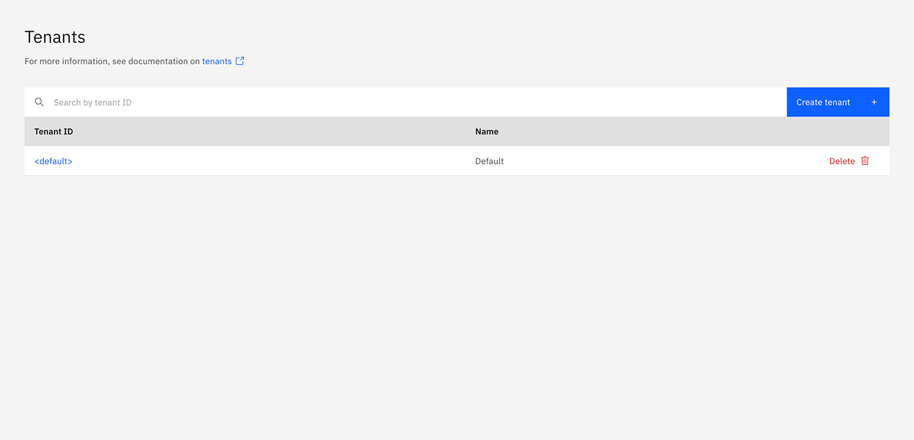

2. Click **Create tenant**. In the modal, provide the tenant **ID**, **name**, and optional **description**. Then click **Create tenant**.

   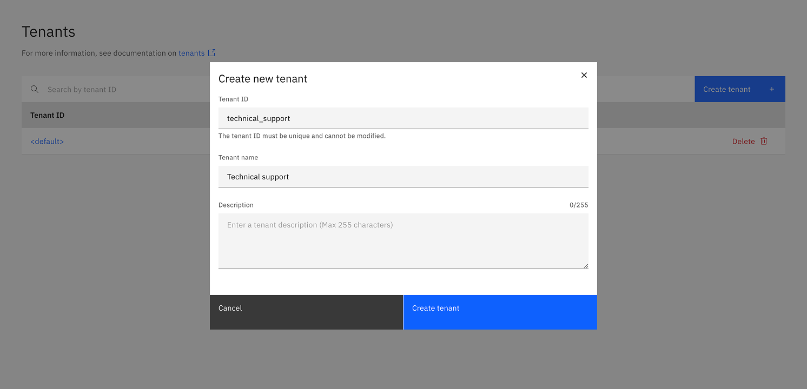

3. The tenant appears in the list. If not, refresh the page.

   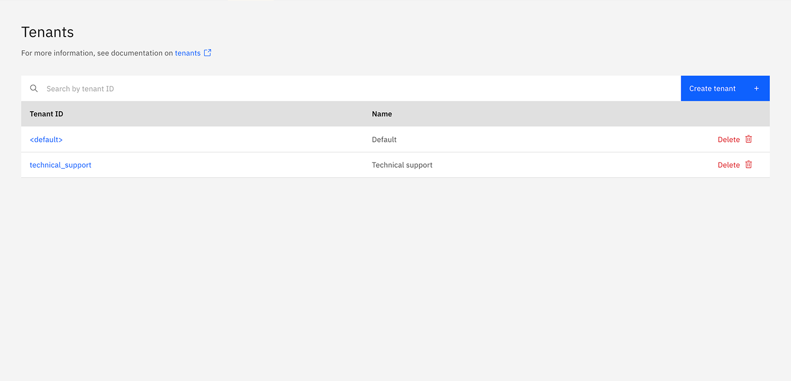

4. Click the tenant to open details and manage assignments.

   

## Update and delete a tenant

Tenants cannot be updated after creation. To change a tenant's details, you must delete it and create a new one with the corrected information.

To delete a tenant, click on the Delete option in the list of tenant, and confirm the action.

:::note
The `<default>` tenant is a system entity and cannot be deleted.
:::

## Tenant assignments

You can assign the following entities to a tenant:

- [Users](user.md)
- [Groups](group.md)
- [Roles](role.md)
- [Mapping rules](./mapping-rules/manage-mapping-rules.md)
- [Clients](client.md)

Assignments are managed in the tenant details page using the relevant tab.

### Assign users

1. Open the **Users** tab.
2. Click **Assign user**. In the modal, enter the username and confirm.

   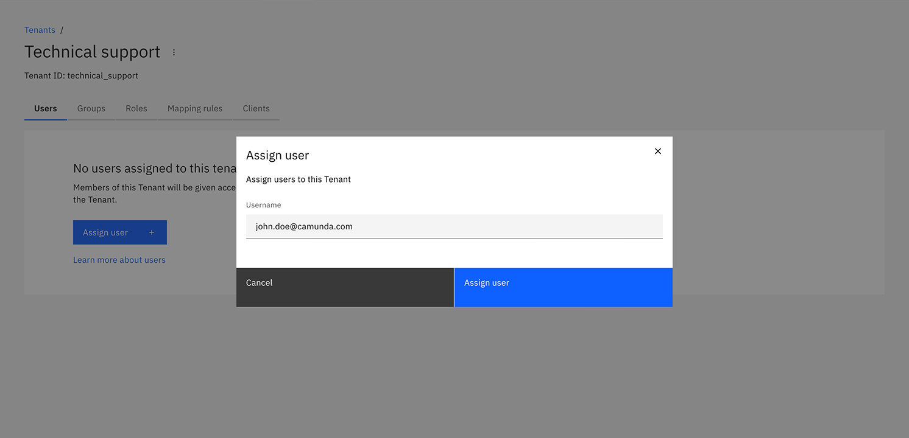

3. The user appears in the list after assignment. Refresh the page if needed.

   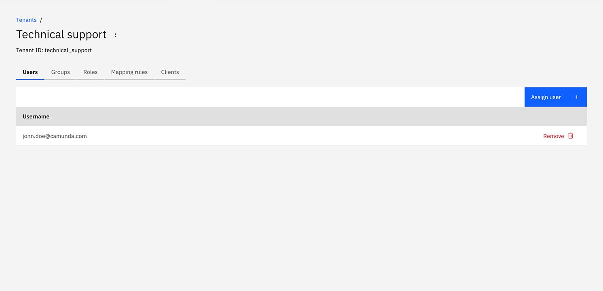

### Assign groups

1. Open the **Groups** tab.
2. Click **Assign group**. Search for a group ID and confirm.

   

3. The group appears in the list after assignment. Refresh the page if needed.

   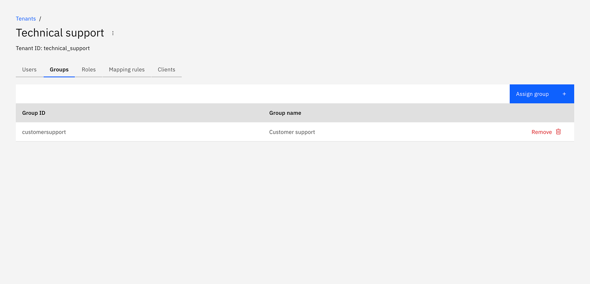

### Assign roles

1. Open the **Roles** tab.
2. Click **Assign role**. Search for a role ID and confirm.

   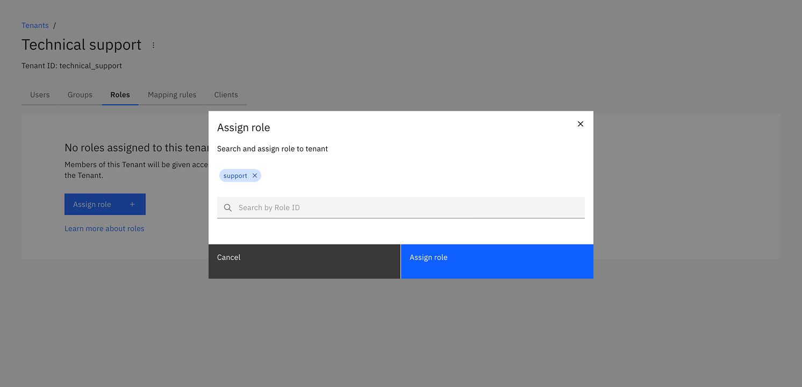

3. The role appears in the list after assignment. Refresh the page if needed.

   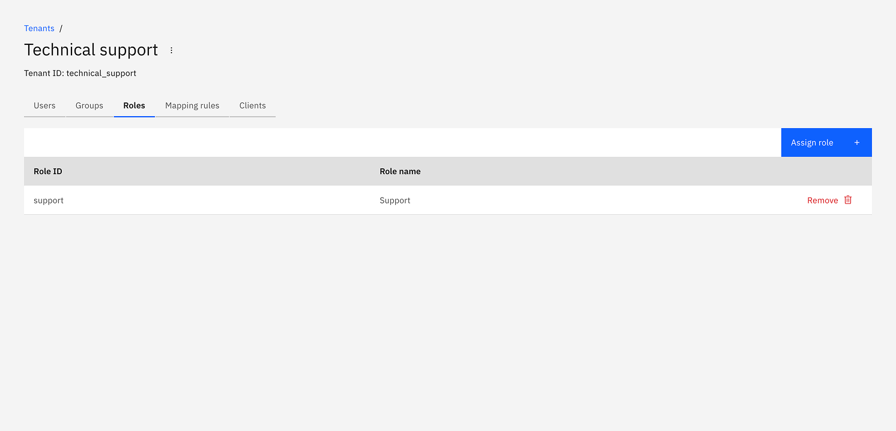

### Assign mapping rules

:::note
Assignment of [mapping rules](../concepts/access-control/mapping-rules.md) is only available for [OIDC authentication on Self-Managed](../concepts/access-control/connect-to-identity-provider.md#self-managed).
:::

1. Open the **Mapping rules** tab.
2. Click **Assign mapping rule**. Search for a mapping rule ID and confirm.

   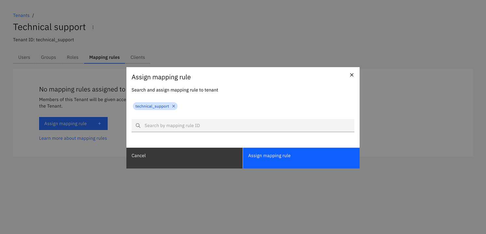

3. The mapping rule appears in the list after assignment. Refresh the page if needed.

   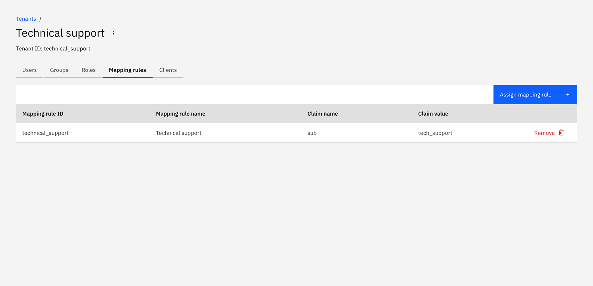

### Assign clients

1. Open the **Clients** tab.
2. Click **Assign client**. Enter the client ID and confirm.

   

3. The client appears in the list after assignment. Refresh the page if needed.

   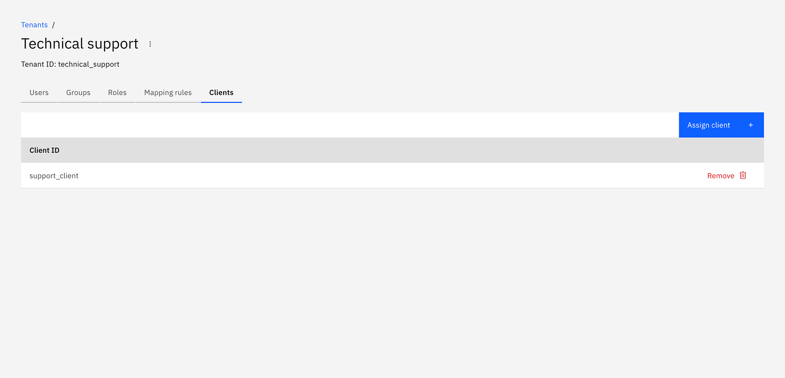
